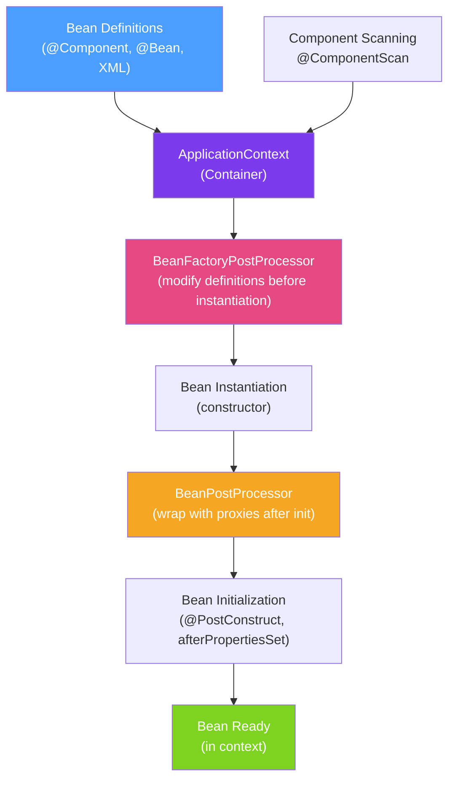

# 🌱 Spring IoC Container

> [!abstract] TL;DR
> The Spring IoC (Inversion of Control) container is the `ApplicationContext` — a factory that creates, wires, and manages the lifecycle of beans (Spring-managed objects). Instead of your code instantiating and connecting dependencies (`new UserService(new UserRepository())`), the container reads bean definitions and does all of that for you. This inversion is the core of the Spring framework.

## Intuition — analogy FIRST
Imagine a professional moving company. Without Spring, you'd move yourself: drive to IKEA, pick up a table, carry it upstairs, assemble it, figure out where wires go. With the Spring IoC container, you give the moving company a blueprint ("I need a table in my office connected to this power outlet"). They source the table, move it, wire it up, and tell you when it's ready. You just use the table. The **container** is the moving company; **beans** are the furniture; **dependency injection** is the wiring.

---

## How It Works



## Key Concepts / Details

### BeanFactory vs ApplicationContext

| Feature | `BeanFactory` | `ApplicationContext` |
|---------|--------------|---------------------|
| Purpose | Basic DI container | Full-featured container |
| Lazy bean loading | Yes (on first getBean) | Eager (at startup) by default |
| Event system | No | Yes (ApplicationEvent) |
| i18n support | No | Yes (MessageSource) |
| AOP support | Basic | Full |
| Auto BeanPostProcessor | No | Yes |
| Use case | Embedded environments, tests | All production applications |

In practice, you **always** use `ApplicationContext`. `BeanFactory` is a historical artifact.

### Bean Definition Styles

**Style 1: @Component stereotype annotations** (most common)
```java
@Component          // generic component
@Service            // service layer (same as @Component, semantic meaning)
@Repository         // data access layer; also enables persistence exception translation
@Controller         // Spring MVC controller
@RestController     // @Controller + @ResponseBody
```

**Style 2: @Bean factory methods in @Configuration**
```java
@Configuration
public class AppConfig {

    @Bean                          // method name = bean name ("dataSource")
    public DataSource dataSource() {
        HikariDataSource ds = new HikariDataSource();
        ds.setJdbcUrl("jdbc:postgresql://localhost:5432/mydb");
        return ds;
    }

    @Bean
    @Profile("test")               // only active in 'test' profile
    public DataSource testDataSource() {
        return new EmbeddedDatabaseBuilder()
            .setType(EmbeddedDatabaseType.H2).build();
    }
}
```

**Style 3: XML** (legacy, avoid in new projects)
```xml
<bean id="userService" class="com.example.UserServiceImpl">
    <constructor-arg ref="userRepository"/>
</bean>
```

### Component Scanning

```java
@SpringBootApplication  // includes @ComponentScan on the declaring class's package
public class Application {
    public static void main(String[] args) {
        SpringApplication.run(Application.class, args);
    }
}

// Explicit scan if needed
@Configuration
@ComponentScan(basePackages = {"com.example.services", "com.example.repositories"})
public class AppConfig {}
```

Component scanning recursively finds all classes annotated with `@Component` and its stereotypes in the specified packages.

### ApplicationContext Implementations

```java
// Spring Boot (most common — auto-configured)
ConfigurableApplicationContext ctx = SpringApplication.run(Application.class, args);

// Standalone with Java config
ApplicationContext ctx = new AnnotationConfigApplicationContext(AppConfig.class);

// Standalone with XML (legacy)
ApplicationContext ctx = new ClassPathXmlApplicationContext("applicationContext.xml");

// Web application
// → Created automatically by Spring MVC's ContextLoaderListener / DispatcherServlet
```

### Retrieving Beans Programmatically

```java
// Usually you don't do this — prefer injection. But sometimes useful:
@Component
public class MyRunner implements ApplicationRunner {
    @Autowired
    private ApplicationContext context;

    @Override
    public void run(ApplicationArguments args) {
        UserService service = context.getBean(UserService.class);   // by type
        UserService namedSvc = context.getBean("userService", UserService.class); // by name
        boolean exists = context.containsBean("userService");
        String[] allUserBeans = context.getBeanNamesForType(UserService.class);
    }
}
```

### @Configuration and CGLIB Proxy

`@Configuration` classes are proxied by CGLIB. This means `@Bean` methods called multiple times return the **same** singleton bean:

```java
@Configuration
public class AppConfig {
    @Bean
    public ServiceA serviceA() {
        return new ServiceA(serviceB()); // calling serviceB() here...
    }

    @Bean
    public ServiceB serviceB() {
        return new ServiceB(); // ...returns the SAME serviceB instance (CGLIB intercepts)
    }
}
// Without CGLIB: serviceA() would create a NEW ServiceB, not the Spring-managed one.

// @Configuration(proxyBeanMethods = false): skip CGLIB; faster startup, but @Bean methods
// called directly create new instances. Use when @Bean methods don't call each other.
```

---

## Real-World Notes

- **Bean names default to class name camelCase**: `UserServiceImpl` → `userServiceImpl`. Override with `@Component("myCustomName")` or `@Bean(name="myBean")`.
- **`@SpringBootApplication` is the entry point**: it combines `@Configuration`, `@EnableAutoConfiguration`, and `@ComponentScan`. The scan starts from the package of the declaring class — keep it in the root package.
- **Lazy initialization**: use `@Lazy` on a bean or `spring.main.lazy-initialization=true` to defer bean creation until first use — improves startup time at the cost of first-request latency.
- **Spring context is thread-safe**: the container and its singleton beans are designed for concurrent access. You must ensure your own bean state is thread-safe.

---

## Common Pitfalls

- **Circular dependency**: Bean A requires B, B requires A — Spring throws `BeanCurrentlyInCreationException`. Fix by using setter injection or `@Lazy` on one dependency, or — better — redesign to remove the cycle.
- **Missing `@ComponentScan` scope**: if your service package isn't in the scan path, the bean won't be found and `@Autowired` will fail with `NoSuchBeanDefinitionException`.
- **Calling `new MyService()`**: bypasses the container — the created object is NOT a Spring bean, so `@Autowired` inside it won't work, AOP won't apply, etc.
- **`@Configuration` vs `@Component` for `@Bean` methods**: `@Component` classes with `@Bean` methods don't get CGLIB proxying — `@Bean` methods called directly create new instances each time.

---

## Related Concepts

- [[Dependency_Injection]] — How the container wires beans together
- [[Spring_Bean_Lifecycle]] — What happens after a bean is created
- [[Spring_AOP]] — BeanPostProcessor wraps beans in proxies for AOP
- [[Spring_Boot_Auto_Configuration]] — How Spring Boot auto-configures beans via the container

---

## Review Questions

1. What is the difference between `BeanFactory` and `ApplicationContext`?
2. Why does `@Configuration` use CGLIB proxying and what happens without it?
3. If you annotate a class with `@Component` but it's in a package not covered by `@ComponentScan`, what error do you get?
4. What is the difference between `@Component`, `@Service`, `@Repository`, and `@Controller`?
5. When would you use `@Bean` in a `@Configuration` class instead of `@Component`?

---

## Sources

- Spring Framework Documentation: IoC Container — https://docs.spring.io/spring-framework/docs/current/reference/html/core.html
- Spring Boot Documentation: Application Context
- Craig Walls, *Spring in Action* (6th ed.), Chapter 1

#java #spring #spring-core #ioc #applicationcontext #beans #component-scanning
