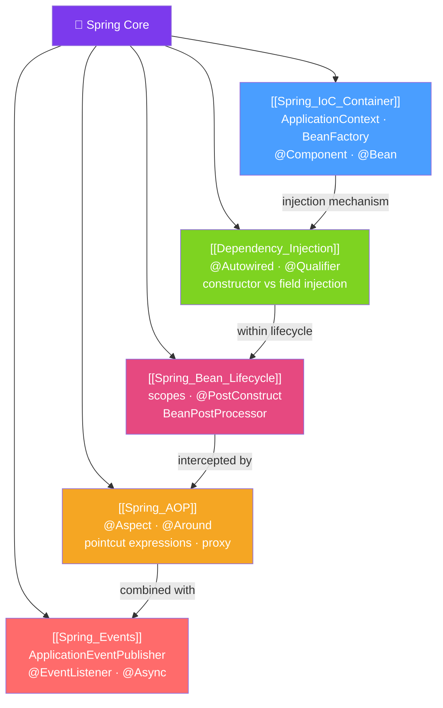

# 🌱 Spring Core — Map of Content

> [!abstract] What This Section Covers
> Spring Core is the foundation of the entire Spring ecosystem. At its heart is the IoC (Inversion of Control) container — the ApplicationContext — which manages object creation, wiring, and lifecycle. This section covers the container itself, dependency injection styles and resolution rules, the bean lifecycle with scopes and callbacks, Aspect-Oriented Programming for cross-cutting concerns, and the Spring event system for decoupled communication.

## Concept Map

## Learning Path
1. [[Spring_IoC_Container]] — What the ApplicationContext is, how beans are defined, and the container's role.
2. [[Dependency_Injection]] — How Spring wires beans together: by type, by name, constructor vs field injection.
3. [[Spring_Bean_Lifecycle]] — Bean scopes (singleton/prototype/request), lifecycle callbacks, and BeanPostProcessor.
4. [[Spring_AOP]] — Cross-cutting concerns with aspects, advice types, and pointcut expressions.
5. [[Spring_Events]] — Application events for decoupled communication between components.

## All Notes at a Glance
| Note | Difficulty | What You'll Learn |
|------|------------|-------------------|
| [[Spring_IoC_Container]] | Beginner | ApplicationContext, BeanFactory, component scanning, bean definition styles |
| [[Dependency_Injection]] | Beginner | @Autowired, @Qualifier, @Primary, constructor vs field injection, CGLIB |
| [[Spring_Bean_Lifecycle]] | Intermediate | Scopes, @PostConstruct/@PreDestroy, BeanPostProcessor, scoped proxies |
| [[Spring_AOP]] | Intermediate | Aspects, @Around/@Before/@After, pointcuts, self-invocation pitfall |
| [[Spring_Events]] | Intermediate | ApplicationEventPublisher, @EventListener, @Async, @TransactionalEventListener |

## Key Questions This Section Answers
- What is the difference between BeanFactory and ApplicationContext?
- Why is constructor injection preferred over field injection?
- What happens if two beans of the same type exist — how does @Autowired resolve it?
- What is the difference between singleton scope and prototype scope?
- How does Spring AOP use proxies and what is the self-invocation pitfall?
- What is a @TransactionalEventListener and when would you use it?

## Related Sections
- [[_MOC_Java_Master|↑ Java Master MOC]]
- [[_MOC_Spring_Boot|→ Spring Boot]] — Auto-configuration builds on the IoC container
- [[_MOC_Spring_MVC_REST|→ Spring MVC REST]] — @RestController is a Spring-managed bean
- [[_MOC_Spring_Data|→ Spring Data]] — Repositories are Spring-managed beans with AOP transactions

#MOC #java #spring #spring-core
