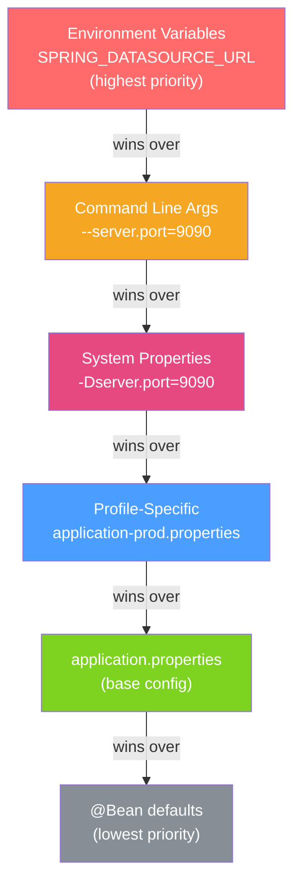

# ⚙️ Application Properties

> [!abstract] TL;DR
> Spring Boot's externalized configuration lets you define settings outside your code, making apps behave differently across environments without recompilation. `application.properties` / `application.yml` are the primary sources; `@ConfigurationProperties` provides type-safe binding with validation; Spring profiles (`application-{profile}.properties`) enable environment-specific overrides; and a 17-level priority order determines which value wins when the same property appears in multiple sources.

## Intuition — analogy FIRST
Think of configuration as a recipe that can be customized per cook (environment). The base recipe (`application.properties`) says "use 2 tablespoons of salt." But the competition version (`application-production.properties`) might say "use 1 tablespoon" (more conservative), and the tasting version (`application-test.properties`) might say "use 0 tablespoons" (for consistency). The cook who steps in last with a preference wins — that's the priority order. `@ConfigurationProperties` is like a typed recipe card — instead of free-form notes, it has specific labeled slots with validation.

---

## How It Works



## Key Concepts / Details

### Properties vs YAML

```yaml
# application.yml (YAML — hierarchical, readable)
server:
  port: 8080
  servlet:
    context-path: /api

spring:
  datasource:
    url: jdbc:postgresql://localhost:5432/mydb
    username: ${DB_USER:admin}    # environment variable with default
    password: ${DB_PASS}          # required environment variable
  jpa:
    hibernate:
      ddl-auto: validate
    show-sql: false

app:
  feature-flags:
    new-checkout: true
  max-retries: 3
```

```properties
# application.properties (flat key=value)
server.port=8080
server.servlet.context-path=/api
spring.datasource.url=jdbc:postgresql://localhost:5432/mydb
spring.datasource.username=${DB_USER:admin}
```

Both formats are equivalent. YAML is preferred for complex hierarchical configs; `.properties` is simpler for flat configs.

### @Value — Individual Property Injection

```java
@Component
public class AppSettings {
    @Value("${server.port}")                        // required; startup fails if missing
    private int serverPort;

    @Value("${app.max-retries:3}")                  // with default value 3
    private int maxRetries;

    @Value("${app.name:${spring.application.name}}") // nested fallback
    private String appName;

    @Value("${app.allowed-origins}")                // list from comma-separated string
    private List<String> allowedOrigins;

    @Value("#{systemProperties['java.home']}")      // SpEL expression
    private String javaHome;

    @Value("#{T(java.lang.Math).random() * 100}")   // SpEL computation
    private double randomValue;
}
```

### @ConfigurationProperties — Type-Safe Binding

```java
// Binds all properties with prefix "app" to this class
@ConfigurationProperties(prefix = "app")
@Validated                       // enables Bean Validation on properties
public class AppProperties {
    @NotBlank
    private String name;

    @Min(1) @Max(100)
    private int maxRetries = 3;  // default value

    private boolean featureEnabled;
    private List<String> allowedOrigins = new ArrayList<>();
    private Database database = new Database();
    private Map<String, String> metadata = new HashMap<>();

    // Nested configuration class
    public static class Database {
        private String url;
        private int connectionTimeout = 5000;
        // getters/setters...
    }
    // getters/setters for all fields...
}

// Register it (pick one approach):
@SpringBootApplication
@EnableConfigurationProperties(AppProperties.class)  // explicit registration
public class Application { }

// OR add @Component to AppProperties itself (simpler in Spring Boot 2.2+):
@ConfigurationProperties(prefix = "app")
@Component
public class AppProperties { ... }

// Inject and use:
@Service
public class UserService {
    private final AppProperties props;

    public UserService(AppProperties props) {
        this.props = props;
    }

    public int getMaxRetries() { return props.getMaxRetries(); }
}
```

### Profiles — Environment-Specific Config

```yaml
# application.yml (base, loaded always)
app:
  name: MyApp
  debug: false

---
# application-dev.yml (only active when spring.profiles.active=dev)
spring:
  config:
    activate:
      on-profile: dev
app:
  debug: true
spring:
  datasource:
    url: jdbc:h2:mem:testdb

---
# application-prod.yml
spring:
  config:
    activate:
      on-profile: prod
spring:
  datasource:
    url: jdbc:postgresql://prod-db:5432/mydb
```

**Activating profiles:**
```bash
# application.properties
spring.profiles.active=dev

# Command line (overrides properties)
java -jar app.jar --spring.profiles.active=prod

# Environment variable
SPRING_PROFILES_ACTIVE=prod java -jar app.jar

# Programmatic (before context starts)
SpringApplication app = new SpringApplication(Application.class);
app.setAdditionalProfiles("dev", "metrics");
app.run(args);
```

**Profile-specific beans:**
```java
@Bean
@Profile("dev")
public DataSource devDataSource() { return new EmbeddedDatabaseBuilder()..build(); }

@Bean
@Profile("prod")
public DataSource prodDataSource() { return hikariDataSource(); }

@Bean
@Profile("!test")  // all profiles EXCEPT test
public EmailService realEmailService() { /* ... */ }
```

### Property Priority Order (17 Levels, Highest First)

1. Spring TestContext framework properties
2. Command line arguments (`--key=value`)
3. `SpringApplication.setDefaultProperties()`
4. `@TestPropertySource` (in tests)
5. OS environment variables
6. Java System properties (`-Dkey=value`)
7. JNDI attributes
8. `ServletContext`/`ServletConfig` init parameters
9. `RandomValuePropertySource` (random.*)
10. Application properties outside JAR (`./config/`)
11. Application properties packaged in JAR (`classpath:config/`)
12. Application properties in JAR root
13. Profile-specific properties outside JAR
14. Profile-specific properties in JAR
15. `@PropertySource` annotations
16. Default properties

**Key practical rules**:
- Environment variables (`DB_PASSWORD`) override `application.properties`
- Profile-specific files override base `application.properties`
- Command line args override everything

---

## Real-World Notes

- **Never put secrets in `application.properties`**: use environment variables or a secrets manager (Vault, AWS Secrets Manager). Properties files are committed to source control — passwords must not be.
- **Property binding relaxation**: Spring Boot binds `app.max-retries`, `APP_MAX_RETRIES`, `app.maxRetries`, and `app.max_retries` to the same `maxRetries` field — relaxed binding.
- **IDE autocompletion**: add `spring-boot-configuration-processor` as an `optional` compile dependency to generate metadata for your `@ConfigurationProperties` classes — enables IDE autocompletion.
- **`spring.config.import`**: import additional config sources: `spring.config.import=optional:configserver:http://config-server`, `file:extra-config.properties`, `vault://`.

---

## Common Pitfalls

- **`@Value` in `@Configuration` classes before properties are loaded**: if `@Value` is used in a `@Bean` method and the property source isn't set up yet, it fails. Use `@ConfigurationProperties` for more reliable binding.
- **YAML list syntax**: `server.allowed-origins: item1, item2` doesn't work in YAML. Use the proper list syntax:
  ```yaml
  server:
    allowed-origins:
      - item1
      - item2
  ```
- **Case sensitivity in environment variables**: `spring.datasource.url` → env var is `SPRING_DATASOURCE_URL` (uppercase, dots→underscores). Lowercase env vars may not be recognized.
- **Profile activation in `application.yml` multi-doc**: the `---` separator must be on its own line; the profile activation must use `spring.config.activate.on-profile`.

---

## Related Concepts

- [[Spring_Boot_Auto_Configuration]] — Auto-configurations read properties to decide what to create
- [[Spring_Boot_Actuator]] — `/actuator/env` shows all resolved property values
- [[Spring_Boot_Testing]] — `@TestPropertySource` and `@SpringBootTest(properties=...)` for test configuration

---

## Review Questions

1. What is the difference between `@Value` and `@ConfigurationProperties`?
2. How does Spring resolve a property when it appears in both `application.properties` and an environment variable?
3. How do you activate a Spring profile in a production Docker container?
4. What is relaxed binding in property names?
5. Where should database passwords be stored, and why not in `application.properties`?

---

## Sources

- Spring Boot Documentation: Externalized Configuration
- Spring Boot Documentation: Profiles
- Baeldung: Spring Boot @ConfigurationProperties

#java #spring #spring-boot #configuration-properties #profiles #application-properties #yaml
