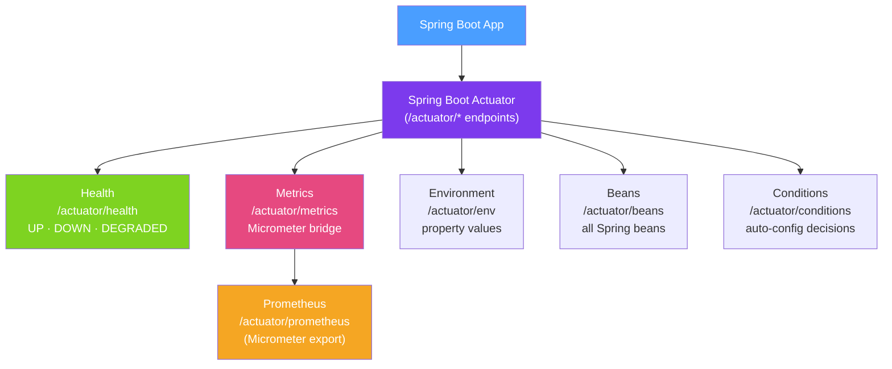

# 📊 Spring Boot Actuator

> [!abstract] TL;DR
> Spring Boot Actuator adds production-ready management endpoints to your application — health checks, metrics, environment inspection, bean listing, and more. It integrates with Micrometer for vendor-neutral metrics that export to Prometheus, Datadog, CloudWatch, and others. `@HealthIndicator` and `@MeterRegistry` let you add custom operational metrics.

## Intuition — analogy FIRST
Actuator is like the dashboard and diagnostic port of a car. Without it, you'd have to pop the hood and manually check every component. With it, you get a standardized OBD-II port (the `/actuator` endpoint) that any diagnostic tool can plug into to read engine health, fuel level, fault codes, and performance data. The `/actuator/health` endpoint is the idiot light — "is the engine OK?" — while `/actuator/metrics` is the full data stream for your performance engineer.

---

## How It Works



## Key Concepts / Details

### Setup and Endpoint Exposure

```xml
<dependency>
    <groupId>org.springframework.boot</groupId>
    <artifactId>spring-boot-starter-actuator</artifactId>
</dependency>
```

```yaml
# application.yml
management:
  endpoints:
    web:
      exposure:
        include: "health,info,metrics,prometheus,loggers,env,conditions"
        # include: "*"  # expose ALL endpoints (dangerous in production without auth!)
  endpoint:
    health:
      show-details: always  # show full health details (not just UP/DOWN)
      show-components: always
  server:
    port: 8081  # separate port for management (security best practice)
```

### Key Actuator Endpoints

| Endpoint | HTTP | Description |
|---------|------|-------------|
| `/actuator/health` | GET | Aggregate health status (UP/DOWN) |
| `/actuator/info` | GET | Application info (version, git commit) |
| `/actuator/metrics` | GET | List all metric names |
| `/actuator/metrics/{name}` | GET | Specific metric value |
| `/actuator/prometheus` | GET | Prometheus exposition format (needs micrometer-registry-prometheus) |
| `/actuator/env` | GET | Environment properties (sensitive!) |
| `/actuator/beans` | GET | All beans in context |
| `/actuator/conditions` | GET | Auto-configuration conditions |
| `/actuator/loggers` | GET/POST | View and change log levels at runtime |
| `/actuator/threaddump` | GET | JVM thread dump |
| `/actuator/heapdump` | GET | JVM heap dump (sensitive!) |
| `/actuator/flyway` | GET | Flyway migration status |
| `/actuator/shutdown` | POST | Graceful shutdown (disabled by default) |

### Health Endpoint and Custom Health Indicators

```java
// Custom health indicator
@Component
public class ExternalApiHealthIndicator implements HealthIndicator {

    private final ExternalApiClient apiClient;

    public ExternalApiHealthIndicator(ExternalApiClient apiClient) {
        this.apiClient = apiClient;
    }

    @Override
    public Health health() {
        try {
            long latencyMs = apiClient.ping();
            if (latencyMs < 500) {
                return Health.up()
                    .withDetail("latencyMs", latencyMs)
                    .withDetail("status", "responsive")
                    .build();
            } else {
                return Health.degraded()  // custom status
                    .withDetail("latencyMs", latencyMs)
                    .withDetail("status", "slow")
                    .build();
            }
        } catch (Exception e) {
            return Health.down()
                .withDetail("error", e.getMessage())
                .build();
        }
    }
}

// Composite health: automatically aggregated from all HealthIndicators
// GET /actuator/health response:
// {
//   "status": "UP",
//   "components": {
//     "db": { "status": "UP", "details": { "database": "PostgreSQL" } },
//     "externalApi": { "status": "UP", "details": { "latencyMs": 45 } },
//     "diskSpace": { "status": "UP" }
//   }
// }
```

### Micrometer Metrics

Micrometer is the vendor-neutral metrics facade for Java — like SLF4J but for metrics.

```java
@Service
public class OrderService {
    private final Counter ordersPlaced;
    private final Timer orderProcessingTime;
    private final Gauge activeOrders;

    public OrderService(MeterRegistry registry, OrderRepository orderRepo) {
        // Counter: monotonically increasing count
        this.ordersPlaced = Counter.builder("orders.placed")
            .tag("type", "checkout")
            .description("Total orders placed")
            .register(registry);

        // Timer: tracks time and count
        this.orderProcessingTime = Timer.builder("orders.processing.time")
            .description("Time to process an order")
            .register(registry);

        // Gauge: current value (snapshot)
        this.activeOrders = Gauge.builder("orders.active", orderRepo, repo -> repo.countByStatus("ACTIVE"))
            .description("Currently active orders")
            .register(registry);
    }

    public Order placeOrder(PlaceOrderRequest request) {
        return orderProcessingTime.record(() -> {
            Order order = processOrder(request);
            ordersPlaced.increment();
            return order;
        });
    }
}

// @Timed annotation (simpler approach)
@Service
public class UserService {
    @Timed(value = "user.service.time", description = "Time for user operations")
    public User findUser(String id) { /* ... */ }
}
```

### Prometheus Integration

```xml
<dependency>
    <groupId>io.micrometer</groupId>
    <artifactId>micrometer-registry-prometheus</artifactId>
</dependency>
```

```yaml
management:
  endpoints:
    web:
      exposure:
        include: prometheus
  metrics:
    tags:
      application: ${spring.application.name}  # add app name tag to all metrics
      environment: ${spring.profiles.active:dev}
```

Prometheus scrape config:
```yaml
# prometheus.yml
scrape_configs:
  - job_name: 'spring-boot'
    metrics_path: '/actuator/prometheus'
    static_configs:
      - targets: ['app:8080']
```

### Securing Actuator Endpoints

```java
@Configuration
public class SecurityConfig {
    @Bean
    public SecurityFilterChain actuatorSecurity(HttpSecurity http) throws Exception {
        return http
            .securityMatcher("/actuator/**")
            .authorizeHttpRequests(auth -> auth
                .requestMatchers("/actuator/health", "/actuator/info").permitAll()
                .requestMatchers("/actuator/**").hasRole("ADMIN")
            )
            .httpBasic(Customizer.withDefaults())
            .build();
    }
}
```

### Graceful Shutdown

```yaml
server:
  shutdown: graceful           # wait for in-flight requests
spring:
  lifecycle:
    timeout-per-shutdown-phase: 30s  # max time to wait for graceful completion
```

With graceful shutdown:
1. Kubernetes sends `SIGTERM`
2. Spring stops accepting new requests (readiness probe fails)
3. In-flight requests complete (up to 30 seconds)
4. `@PreDestroy` callbacks run
5. JVM exits

---

## Real-World Notes

- **Separate management port**: expose Actuator on a different port (`management.server.port=8081`) and restrict it to your internal network — prevents external exposure of sensitive endpoints.
- **`/actuator/heapdump` is production-dangerous**: it downloads the entire JVM heap. Protect it with authentication and use only when explicitly needed for debugging.
- **Kubernetes probes → Actuator**: configure `livenessProbe` → `/actuator/health/liveness` and `readinessProbe` → `/actuator/health/readiness`. Spring Boot auto-configures these sub-groups with meaningful checks.
- **Log level changes at runtime**: `POST /actuator/loggers/com.example.service` with `{"configuredLevel": "DEBUG"}` changes the log level without restarting — invaluable for production debugging.

---

## Common Pitfalls

- **Exposing all endpoints publicly**: `management.endpoints.web.exposure.include=*` with no security exposes `env`, `heapdump`, `shutdown` — serious security risk.
- **Missing `show-details: always`**: without this, `/actuator/health` only shows `{"status": "UP"}` — not helpful for diagnosing which component is failing.
- **Health indicator throwing uncaught exception**: any uncaught exception in `HealthIndicator.health()` causes the health check to fail with status DOWN. Always catch exceptions and return an appropriate `Health` instance.

---

## Related Concepts

- [[Application_Properties]] — Configure Actuator via `management.*` properties
- [[Spring_Security_Architecture]] — Secure Actuator endpoints with Spring Security
- [[Java_Profiling]] — Actuator's `/threaddump` and `/heapdump` complement external profilers

---

## Review Questions

1. How do you expose only specific Actuator endpoints and keep others hidden?
2. Write a custom `HealthIndicator` that checks if an external service is reachable.
3. What is the difference between a Counter, Timer, and Gauge in Micrometer?
4. How do you configure Kubernetes liveness and readiness probes using Actuator?
5. Why should the Actuator management port be different from the application port?

---

## Sources

- Spring Boot Documentation: Actuator — https://docs.spring.io/spring-boot/docs/current/reference/html/actuator.html
- Micrometer Documentation: https://micrometer.io/docs
- Baeldung: Spring Boot Actuator

#java #spring #spring-boot #actuator #micrometer #health #metrics #prometheus
