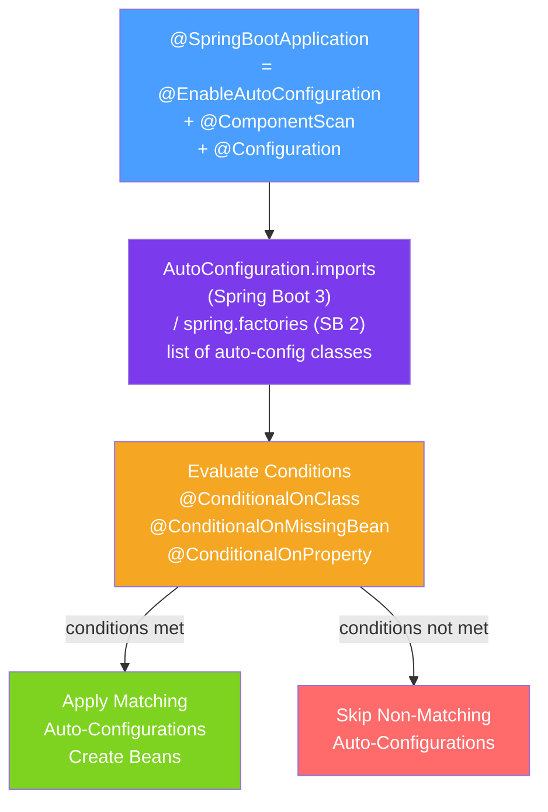

# ⚙️ Spring Boot Auto Configuration

> [!abstract] TL;DR
> Spring Boot's auto-configuration examines your classpath, existing beans, and properties to automatically register sensible default beans. It is powered by `@EnableAutoConfiguration`, which reads from `AutoConfiguration.imports` (Spring Boot 3) or `spring.factories` (Spring Boot 2), and conditional annotations that ensure each auto-configuration class only activates when appropriate.

## Intuition — analogy FIRST
Auto-configuration is like a smart hotel room. When you arrive (your classpath has `spring-boot-starter-web`), the hotel automatically sets up WiFi, turns on lights, and puts towels in the bathroom — without you asking for each thing. If you bring your own pillow (`@Bean DataSource`), the hotel doesn't add theirs (`@ConditionalOnMissingBean`). If you don't need the minibar (`not on test profile`), it stays locked (`@ConditionalOnProperty`). You can always override the hotel defaults — they're just sensible starting points, not mandates.

---

## How It Works



## Key Concepts / Details

### @SpringBootApplication Unpacked

```java
@SpringBootApplication
// is equivalent to:
@Configuration
@EnableAutoConfiguration  // triggers auto-configuration scanning
@ComponentScan(basePackageClasses = Application.class)  // scans from this package
public class Application {
    public static void main(String[] args) {
        SpringApplication.run(Application.class, args);
    }
}
```

### Auto-Configuration Registry

**Spring Boot 3** uses `META-INF/spring/org.springframework.boot.autoconfigure.AutoConfiguration.imports`:
```
com.example.FooAutoConfiguration
org.springframework.boot.autoconfigure.web.servlet.WebMvcAutoConfiguration
org.springframework.boot.autoconfigure.data.jpa.JpaRepositoriesAutoConfiguration
```

**Spring Boot 2** used `META-INF/spring.factories`:
```properties
org.springframework.boot.autoconfigure.EnableAutoConfiguration=\
  com.example.FooAutoConfiguration,\
  com.example.BarAutoConfiguration
```

### Conditional Annotations

```java
@AutoConfiguration  // Spring Boot 3 marker (vs @Configuration)
@ConditionalOnClass(DataSource.class) // only if DataSource is on classpath
@ConditionalOnWebApplication(type = ConditionalOnWebApplication.Type.SERVLET)
public class DataSourceAutoConfiguration {

    @Bean
    @ConditionalOnMissingBean(DataSource.class) // only if NO DataSource bean exists yet
    public DataSource defaultDataSource(DataSourceProperties props) {
        return DataSourceBuilder.create()
            .url(props.getUrl())
            .username(props.getUsername())
            .password(props.getPassword())
            .build();
    }
}
```

| Annotation | Condition |
|-----------|----------|
| `@ConditionalOnClass(Foo.class)` | `Foo` is on the classpath |
| `@ConditionalOnMissingClass(...)` | Class is NOT on classpath |
| `@ConditionalOnBean(Foo.class)` | A bean of type `Foo` exists |
| `@ConditionalOnMissingBean(Foo.class)` | NO bean of type `Foo` exists yet |
| `@ConditionalOnProperty("feature.enabled")` | Property exists (and optionally equals a value) |
| `@ConditionalOnWebApplication` | Running in a web application context |
| `@ConditionalOnExpression("#{...}")` | SpEL expression evaluates to true |
| `@ConditionalOnResource("classpath:schema.sql")` | Resource exists |
| `@ConditionalOnJava(JavaVersion.TWENTY_ONE)` | Running on specified Java version |

### Auto-Configuration Ordering

```java
@AutoConfiguration
@AutoConfigureAfter(DataSourceAutoConfiguration.class)  // wait for DataSource bean
@AutoConfigureBefore(TransactionAutoConfiguration.class) // run before transaction setup
@AutoConfigureOrder(Ordered.LOWEST_PRECEDENCE)          // ordering within same phase
public class JpaAutoConfiguration { /* ... */ }
```

### Viewing What Was Applied

```bash
# Run with --debug to see auto-configuration report
java -jar app.jar --debug

# Or enable in application.properties:
debug=true

# Output shows three sections:
# Positive matches: applied (conditions met)
# Negative matches: not applied (why not)
# Unconditional classes: always applied
```

Or at runtime via Actuator:
```
GET /actuator/conditions
```

### Writing a Custom Auto-Configuration

```java
// Step 1: Write the auto-configuration class
@AutoConfiguration
@ConditionalOnClass(EmailSender.class)
@ConditionalOnMissingBean(EmailSender.class)
@EnableConfigurationProperties(EmailProperties.class)
public class EmailAutoConfiguration {

    @Bean
    public EmailSender emailSender(EmailProperties properties) {
        return new SmtpEmailSender(properties.getHost(), properties.getPort());
    }
}

// Step 2: Define configuration properties
@ConfigurationProperties(prefix = "email")
public class EmailProperties {
    private String host = "localhost";
    private int port = 587;
    // getters/setters
}

// Step 3: Register in META-INF/spring/org.springframework.boot.autoconfigure.AutoConfiguration.imports
// com.example.email.EmailAutoConfiguration

// Step 4: Override in user's application.properties:
// email.host=smtp.gmail.com
// email.port=465
```

### Excluding Auto-Configurations

```java
// Exclude specific auto-configuration
@SpringBootApplication(exclude = {DataSourceAutoConfiguration.class})
public class Application { /*...*/ }

// Or via properties:
// spring.autoconfigure.exclude=org.springframework.boot.autoconfigure.jdbc.DataSourceAutoConfiguration
```

---

## Real-World Notes

- **Auto-configuration is NOT magic**: it is a well-defined, inspectable mechanism. When something unexpected happens, use `--debug` or `/actuator/conditions` to see exactly which conditions matched and why.
- **User beans always win**: auto-configured beans only appear when no user-defined bean of that type exists (`@ConditionalOnMissingBean`). Your explicit `@Bean` declaration always takes precedence.
- **Starter vs Auto-Config separation**: a starter is just a POM that pulls in the auto-configuration JAR as a dependency. The auto-configuration logic lives in a separate autoconfigure module.
- **Spring Boot 3 changes**: Spring Boot 3 moved from `spring.factories` to `AutoConfiguration.imports` (separate file for auto-configuration) to improve startup performance by avoiding scanning the entire `spring.factories` file.

---

## Common Pitfalls

- **Excluding from wrong location**: `@SpringBootApplication(exclude=...)` must reference a class that IS on the classpath. Excluding a class not on the classpath causes an error. Use property-based exclusion instead.
- **`@ConditionalOnMissingBean` too broad**: `@ConditionalOnMissingBean` without type specification checks for ANY bean of the auto-config bean's type — may unintentionally suppress your bean.
- **Auto-configuration in wrong package**: your custom auto-configuration class must NOT be in the main application's scan path — it should be in a separate module. Otherwise `@ComponentScan` picks it up and it's treated as a regular `@Configuration`, not auto-configuration.

---

## Related Concepts

- [[Spring_IoC_Container]] — Auto-configuration adds beans to the ApplicationContext
- [[Spring_Boot_Starters]] — Starters bring auto-configuration classes onto the classpath
- [[Application_Properties]] — `@EnableConfigurationProperties` binds properties to auto-config beans

---

## Review Questions

1. What is the file that Spring Boot 3 reads to discover auto-configuration classes?
2. What does `@ConditionalOnMissingBean(DataSource.class)` do?
3. How do you see which auto-configurations were applied and which were skipped?
4. Describe the steps to write a custom auto-configuration for a library.
5. What is the difference between `@AutoConfigureAfter` and `@AutoConfigureOrder`?

---

## Sources

- Spring Boot Documentation: Creating Your Own Auto-configuration
- Spring Boot Documentation: Condition Annotations
- Baeldung: Custom Spring Boot Starter — https://www.baeldung.com/spring-boot-custom-starter

#java #spring #spring-boot #auto-configuration #conditional #starter
