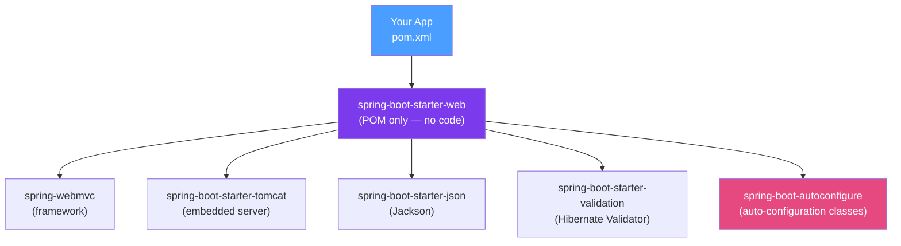

# 📦 Spring Boot Starters

> [!abstract] TL;DR
> Spring Boot starters are curated dependency sets that bring in everything needed for a particular feature area — libraries, auto-configuration, and default settings. They eliminate the "dependency archaeology" of figuring out which 8 JARs are needed for JPA. Custom starters let you package reusable company-wide infrastructure as a single `my-company-starter` dependency.

## Intuition — analogy FIRST
A starter is like a "starter kit" from an electronics store. Instead of buying a soldering iron, then wire, then resistors, then a circuit board separately, you buy the "Arduino Starter Kit" and get everything you need in one box, pre-curated to work together. `spring-boot-starter-web` is that kit: it includes Tomcat (server), Spring MVC (framework), Jackson (JSON), validation libraries — all in compatible versions. You add one dependency and everything works together.

---

## How It Works



## Key Concepts / Details

### Common Built-In Starters

| Starter | What It Brings In |
|---------|------------------|
| `spring-boot-starter-web` | Tomcat, Spring MVC, Jackson, validation |
| `spring-boot-starter-data-jpa` | Hibernate, Spring Data JPA, HikariCP |
| `spring-boot-starter-security` | Spring Security |
| `spring-boot-starter-test` | JUnit 5, Mockito, AssertJ, MockMvc, Testcontainers |
| `spring-boot-starter-actuator` | Micrometer, health endpoints |
| `spring-boot-starter-data-redis` | Spring Data Redis, Lettuce client |
| `spring-boot-starter-amqp` | Spring AMQP, RabbitMQ client |
| `spring-boot-starter-kafka` | Spring Kafka, Kafka client |
| `spring-boot-starter-mail` | JavaMail |
| `spring-boot-starter-webflux` | Netty, Spring WebFlux, Project Reactor |
| `spring-boot-starter-oauth2-resource-server` | Spring Security OAuth2 JWT validation |

### spring-boot-starter-parent — Version Management

```xml
<!-- Parent POM: manages all dependency versions AND plugin configuration -->
<parent>
    <groupId>org.springframework.boot</groupId>
    <artifactId>spring-boot-starter-parent</artifactId>
    <version>3.3.0</version>
</parent>

<!-- You only specify groupId:artifactId — version is inherited -->
<dependencies>
    <dependency>
        <groupId>org.springframework.boot</groupId>
        <artifactId>spring-boot-starter-web</artifactId>
        <!-- NO version needed! Managed by parent -->
    </dependency>
    <dependency>
        <groupId>org.springframework.boot</groupId>
        <artifactId>spring-boot-starter-test</artifactId>
        <scope>test</scope>
    </dependency>
</dependencies>

<!-- Override a managed version if needed -->
<properties>
    <jackson.version>2.16.0</jackson.version>
</properties>
```

### spring-boot-dependencies BOM (Without Parent)

If you can't use `spring-boot-starter-parent` (e.g., your company has its own parent POM):

```xml
<dependencyManagement>
    <dependencies>
        <dependency>
            <groupId>org.springframework.boot</groupId>
            <artifactId>spring-boot-dependencies</artifactId>
            <version>3.3.0</version>
            <type>pom</type>
            <scope>import</scope>
        </dependency>
    </dependencies>
</dependencyManagement>
```

### Excluding a Transitive Dependency

```xml
<!-- Use Jetty instead of Tomcat -->
<dependency>
    <groupId>org.springframework.boot</groupId>
    <artifactId>spring-boot-starter-web</artifactId>
    <exclusions>
        <exclusion>
            <groupId>org.springframework.boot</groupId>
            <artifactId>spring-boot-starter-tomcat</artifactId>
        </exclusion>
    </exclusions>
</dependency>
<dependency>
    <groupId>org.springframework.boot</groupId>
    <artifactId>spring-boot-starter-jetty</artifactId>
</dependency>
```

### Writing a Custom Starter

The convention is two modules:
1. `my-feature-spring-boot-autoconfigure` — contains the auto-configuration code
2. `my-feature-spring-boot-starter` — POM that depends on #1 and the required libraries

```
my-company-notification-starter/
├── my-company-notification-autoconfigure/     # auto-configuration module
│   ├── src/main/java/
│   │   └── com/mycompany/notification/
│   │       ├── NotificationAutoConfiguration.java
│   │       └── NotificationProperties.java
│   └── src/main/resources/
│       └── META-INF/spring/
│           └── org.springframework.boot.autoconfigure.AutoConfiguration.imports
└── my-company-notification-starter/           # starter POM
    └── pom.xml                                # depends on autoconfigure + notification libraries
```

**Auto-configuration class:**
```java
@AutoConfiguration
@ConditionalOnClass(NotificationService.class)
@EnableConfigurationProperties(NotificationProperties.class)
public class NotificationAutoConfiguration {

    @Bean
    @ConditionalOnMissingBean
    public NotificationService notificationService(NotificationProperties props) {
        return new SlackNotificationService(props.getWebhookUrl());
    }
}
```

**Configuration properties:**
```java
@ConfigurationProperties(prefix = "notification")
@Validated
public class NotificationProperties {
    @NotBlank
    private String webhookUrl;
    private boolean enabled = true;
    // getters/setters
}
```

**`AutoConfiguration.imports` file:**
```
com.mycompany.notification.NotificationAutoConfiguration
```

**Starter POM:**
```xml
<project>
    <groupId>com.mycompany</groupId>
    <artifactId>my-company-notification-starter</artifactId>
    <dependencies>
        <dependency>
            <groupId>com.mycompany</groupId>
            <artifactId>my-company-notification-autoconfigure</artifactId>
        </dependency>
        <dependency>
            <groupId>com.slack.api</groupId>
            <artifactId>slack-api-client</artifactId>
        </dependency>
    </dependencies>
</project>
```

**Usage in applications:**
```xml
<dependency>
    <groupId>com.mycompany</groupId>
    <artifactId>my-company-notification-starter</artifactId>
    <version>1.0.0</version>
</dependency>
```
```properties
notification.webhook-url=https://hooks.slack.com/services/xxx
notification.enabled=true
```

---

## Real-World Notes

- **Do NOT put your auto-configuration in the starter POM itself**: always use the two-module pattern. The autoconfigure module should be a pure library (no `@ComponentScan`); the starter POM just declares dependencies.
- **Naming convention**: third-party starters should be named `acme-spring-boot-starter`, NOT `spring-boot-starter-acme`. The `spring-boot-starter-*` namespace is reserved for official Spring Boot starters.
- **Test support**: add `@ImportAutoConfiguration(MyAutoConfiguration.class)` in your test slices to selectively apply your auto-configuration without loading the full context.
- **Configuration property metadata**: add `spring-boot-configuration-processor` to generate `spring-configuration-metadata.json` — this enables IDE autocompletion for your custom properties.

---

## Common Pitfalls

- **Auto-configuration in the same scan path as the application**: if the autoconfigure module is in a package that gets component-scanned, beans are created both by scanning AND auto-configuration — doubling them up.
- **Missing `@ConditionalOnMissingBean`**: without this, your auto-configured bean replaces the user's custom bean instead of backing off.
- **Classpath pollution in starter**: be conservative about what you add to the starter POM. Each dependency is added to every project using the starter.

---

## Related Concepts

- [[Spring_Boot_Auto_Configuration]] — The mechanism that starters enable
- [[Application_Properties]] — Configure starter behavior via properties
- [[Maven_Fundamentals]] — POM structure, dependency management, BOM import

---

## Review Questions

1. What is the difference between `spring-boot-starter-parent` and `spring-boot-dependencies`?
2. Why are custom starters split into two modules (autoconfigure + starter)?
3. How do you replace Tomcat with Jetty in a Spring Boot web application?
4. What file do you create to register your auto-configuration class in Spring Boot 3?
5. Why should third-party starters not use the `spring-boot-starter-*` naming convention?

---

## Sources

- Spring Boot Documentation: Creating a Custom Starter
- Spring Boot Source: `spring-boot-starters` module
- Baeldung: Custom Spring Boot Starter

#java #spring #spring-boot #starters #auto-configuration #bom #parent-pom
