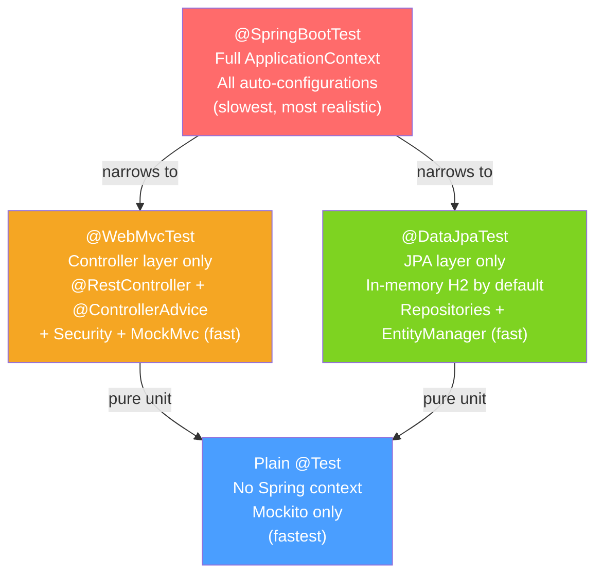

# 🧪 Spring Boot Testing

> [!abstract] TL;DR
> Spring Boot provides a testing toolkit that lets you test each layer in isolation using "test slices" — `@WebMvcTest` for the web layer only, `@DataJpaTest` for the persistence layer only — or the full application with `@SpringBootTest`. `MockMvc` tests HTTP without starting a real server; `@MockBean` replaces Spring beans with Mockito mocks; Testcontainers starts real Docker containers for integration tests.

## Intuition — analogy FIRST
Testing layers is like testing a car. You don't need to drive 100 miles to verify the horn works. `@WebMvcTest` is like testing only the dashboard (controllers) with a simulator — no engine running. `@DataJpaTest` is like testing only the engine (persistence) on a test bench — no body, no wheels. `@SpringBootTest` is a full road test with everything assembled. `MockMvc` is a driving simulator — you push buttons and verify responses without starting the real engine. Testcontainers is a real engine on a test bench — actual PostgreSQL, actual Kafka, not simulators.

---

## How It Works



## Key Concepts / Details

### @SpringBootTest — Full Context

```java
@SpringBootTest(webEnvironment = SpringBootTest.WebEnvironment.RANDOM_PORT)
class ApplicationIntegrationTest {

    @LocalServerPort
    private int port; // actual random port used

    @Autowired
    private TestRestTemplate restTemplate; // auto-configured for integration tests

    @Test
    void createUserAndRetrieve() {
        // POST to create
        ResponseEntity<UserResponse> created = restTemplate.postForEntity(
            "/api/users",
            new CreateUserRequest("test@example.com", "password123"),
            UserResponse.class
        );
        assertThat(created.getStatusCode()).isEqualTo(HttpStatus.CREATED);

        // GET to verify
        String id = created.getBody().id();
        ResponseEntity<UserResponse> retrieved = restTemplate.getForEntity(
            "/api/users/" + id, UserResponse.class
        );
        assertThat(retrieved.getBody().email()).isEqualTo("test@example.com");
    }
}
```

### @WebMvcTest — Controller Layer Only

```java
@WebMvcTest(UserController.class)  // loads only UserController and related web beans
class UserControllerTest {

    @Autowired
    private MockMvc mockMvc; // test HTTP without running a server

    @MockBean  // replaces UserService bean in context with a Mockito mock
    private UserService userService;

    @Autowired
    private ObjectMapper objectMapper; // for JSON serialization

    @Test
    void getUser_returnsUser() throws Exception {
        // Arrange
        User user = new User("1", "alice@example.com", "Alice");
        when(userService.findById("1")).thenReturn(Optional.of(user));

        // Act + Assert
        mockMvc.perform(get("/api/users/1")
                .accept(MediaType.APPLICATION_JSON))
            .andExpect(status().isOk())
            .andExpect(jsonPath("$.email").value("alice@example.com"))
            .andExpect(jsonPath("$.name").value("Alice"));
    }

    @Test
    void createUser_validatesInput() throws Exception {
        String invalidRequest = """
            {"email": "not-an-email", "password": "123"}
            """; // short password, invalid email

        mockMvc.perform(post("/api/users")
                .contentType(MediaType.APPLICATION_JSON)
                .content(invalidRequest))
            .andExpect(status().isBadRequest())
            .andExpect(jsonPath("$.violations").isArray());
    }

    @Test
    void createUser_success() throws Exception {
        CreateUserRequest request = new CreateUserRequest("bob@example.com", "securepass");
        User saved = new User("2", "bob@example.com", "Bob");
        when(userService.create(any())).thenReturn(saved);

        mockMvc.perform(post("/api/users")
                .contentType(MediaType.APPLICATION_JSON)
                .content(objectMapper.writeValueAsString(request)))
            .andExpect(status().isCreated())
            .andExpect(header().string("Location", containsString("/api/users/2")));
    }
}
```

### @DataJpaTest — Persistence Layer Only

```java
@DataJpaTest  // configures JPA, starts in-memory H2 by default, @Transactional per test
class UserRepositoryTest {

    @Autowired
    private UserRepository userRepository;

    @Autowired
    private TestEntityManager entityManager; // for setup without going through the repository

    @Test
    void findByEmail_returnsUser() {
        // Arrange: persist directly via EntityManager
        entityManager.persist(new User(null, "alice@example.com", "Alice"));
        entityManager.flush(); // flush to DB
        entityManager.clear(); // clear first-level cache

        // Act
        Optional<User> found = userRepository.findByEmail("alice@example.com");

        // Assert
        assertThat(found).isPresent();
        assertThat(found.get().getName()).isEqualTo("Alice");
    }

    @Test
    void findByEmail_notFound() {
        Optional<User> found = userRepository.findByEmail("nobody@example.com");
        assertThat(found).isEmpty();
    }
}

// Use real database with Testcontainers:
@DataJpaTest
@AutoConfigureTestDatabase(replace = AutoConfigureTestDatabase.Replace.NONE) // don't use H2
@Testcontainers
class UserRepositoryTestWithPostgres {

    @Container
    static PostgreSQLContainer<?> postgres = new PostgreSQLContainer<>("postgres:16");

    @DynamicPropertySource
    static void configureProperties(DynamicPropertyRegistry registry) {
        registry.add("spring.datasource.url", postgres::getJdbcUrl);
        registry.add("spring.datasource.username", postgres::getUsername);
        registry.add("spring.datasource.password", postgres::getPassword);
    }

    @Autowired
    private UserRepository userRepository;

    @Test
    void nativeQuery_worksWithPostgres() { /* ... */ }
}
```

### @MockBean vs @Mock

| | `@Mock` (Mockito) | `@MockBean` (Spring) |
|--|--|--|
| Context | No Spring context | Spring ApplicationContext |
| Scope | Test class only | Replaces bean in context |
| Works with | Unit tests | @SpringBootTest, @WebMvcTest |
| Auto-injection | No (use @InjectMocks) | Yes (Spring wires it) |
| Spring cache | Not cleared | Context may be cached |

```java
// Unit test: no Spring, fast
class UserServiceTest {
    @Mock
    private UserRepository userRepository;

    @InjectMocks
    private UserService userService; // Mockito creates and injects mocks

    @Test
    void findUser_notFound_throwsException() {
        when(userRepository.findById("1")).thenReturn(Optional.empty());
        assertThrows(NotFoundException.class, () -> userService.findById("1"));
    }
}
```

### Testcontainers

```java
@SpringBootTest
@Testcontainers
class OrderServiceIntegrationTest {

    @Container  // shared across all tests in this class
    static PostgreSQLContainer<?> postgres = new PostgreSQLContainer<>("postgres:16")
        .withDatabaseName("testdb")
        .withUsername("test")
        .withPassword("test");

    @Container
    static GenericContainer<?> redis = new GenericContainer<>("redis:7")
        .withExposedPorts(6379);

    @DynamicPropertySource
    static void configure(DynamicPropertyRegistry registry) {
        registry.add("spring.datasource.url", postgres::getJdbcUrl);
        registry.add("spring.datasource.username", postgres::getUsername);
        registry.add("spring.datasource.password", postgres::getPassword);
        registry.add("spring.data.redis.host", redis::getHost);
        registry.add("spring.data.redis.port", () -> redis.getMappedPort(6379));
    }

    @Autowired
    private OrderService orderService;

    @Test
    void placeOrder_persistsAndCaches() { /* real PostgreSQL and Redis */ }
}
```

### Test Property Sources

```java
// Override properties for specific test
@SpringBootTest
@TestPropertySource(properties = {
    "app.max-retries=1",
    "spring.jpa.show-sql=true"
})
class QuickRetryTest { /* ... */ }

// Load from a test-specific file
@TestPropertySource(locations = "classpath:test-application.properties")
class TestWithCustomProps { /* ... */ }

// Override via annotation:
@SpringBootTest(properties = {"server.port=0", "app.feature.enabled=true"})
class FeatureTest { /* ... */ }
```

---

## Real-World Notes

- **Spring context caching**: Spring caches the `ApplicationContext` between tests with the same configuration — tests sharing the same context setup load faster. Adding `@MockBean` or `@TestPropertySource` creates a different context and may bust the cache.
- **`@Transactional` on test methods**: data changes are automatically rolled back after each test — no cleanup needed. But if you test methods annotated `@Transactional(propagation = REQUIRES_NEW)`, the test transaction and the method transaction are different.
- **Testcontainers startup overhead**: `@Container` with `static` fields share containers across the test class; without `static`, a new container starts per test method (slow). Use `static` for most cases.
- **Test slices vs full context**: slices are faster but test in isolation. Full context tests are slower but catch integration issues. Use slices for unit-level verification, full context for smoke tests.

---

## Common Pitfalls

- **`@MockBean` busting context cache**: every unique combination of `@MockBean` annotations creates a new Spring context. If many test classes use different sets of `@MockBean`, you pay the startup cost for each combination.
- **Not clearing database state**: when NOT using `@Transactional` on test methods (e.g., testing with `RANDOM_PORT`), test data persists between tests. Use `@BeforeEach` cleanup or `@Sql` annotations.
- **H2 compatibility**: H2 in-memory database may behave differently from PostgreSQL (e.g., different case sensitivity, missing functions). Always run at least some tests against the real database with Testcontainers.

---

## Related Concepts

- [[Spring_Boot_Auto_Configuration]] — Test slices use `@ImportAutoConfiguration` to selectively apply auto-configs
- [[Spring_MVC_Architecture]] — `@WebMvcTest` tests the DispatcherServlet layer
- [[Spring_Data_JPA]] — `@DataJpaTest` tests the JPA repository layer

---

## Review Questions

1. What is the difference between `@WebMvcTest` and `@SpringBootTest`?
2. Why would you use `@MockBean` instead of `@Mock` in a Spring Boot test?
3. How does `@Transactional` on a `@DataJpaTest` test method affect database state?
4. What is `@DynamicPropertySource` and when is it needed with Testcontainers?
5. How does Spring Boot cache application contexts between tests and what breaks the cache?

---

## Sources

- Spring Boot Documentation: Testing
- Testcontainers Documentation: https://testcontainers.com
- Baeldung: Spring Boot Test — https://www.baeldung.com/spring-boot-testing

#java #spring #spring-boot #testing #mockmvc #webmvctest #datajpatest #testcontainers #mockbean
