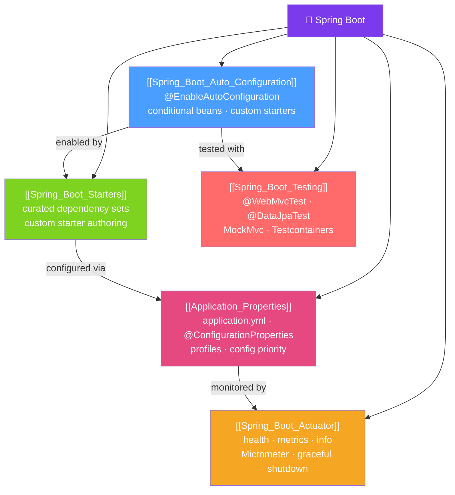

# 🚀 Spring Boot — Map of Content

> [!abstract] What This Section Covers
> Spring Boot is the opinionated, convention-over-configuration layer built on top of Spring Framework. It eliminates boilerplate setup through auto-configuration, starter dependency bundles, externalized configuration with profiles, production-ready Actuator endpoints, and a comprehensive testing toolkit. Understanding Spring Boot deeply means understanding how auto-configuration works, not just how to use it.

## Concept Map

## Learning Path
1. [[Spring_Boot_Auto_Configuration]] — Understand how `@EnableAutoConfiguration` and conditional annotations work.
2. [[Spring_Boot_Starters]] — Learn what starters are and how to write a custom one.
3. [[Application_Properties]] — Configure your app with properties files, profiles, and `@ConfigurationProperties`.
4. [[Spring_Boot_Actuator]] — Add production-ready monitoring: health, metrics, and custom indicators.
5. [[Spring_Boot_Testing]] — Test at the right layer: `@WebMvcTest`, `@DataJpaTest`, and Testcontainers.

## All Notes at a Glance
| Note | Difficulty | What You'll Learn |
|------|------------|-------------------|
| [[Spring_Boot_Auto_Configuration]] | Intermediate | @EnableAutoConfiguration, conditional annotations, AutoConfiguration.imports, writing custom auto-config |
| [[Spring_Boot_Starters]] | Intermediate | Starter POM structure, spring-boot-starter-parent, custom starter two-module pattern |
| [[Application_Properties]] | Beginner | .properties vs .yml, @Value, @ConfigurationProperties, profiles, 17-level priority |
| [[Spring_Boot_Actuator]] | Intermediate | Health indicators, Micrometer metrics, securing endpoints, graceful shutdown |
| [[Spring_Boot_Testing]] | Intermediate | Test slices, MockMvc, @MockBean vs @Mock, Testcontainers, @DynamicPropertySource |

## Key Questions This Section Answers
- How does Spring Boot decide which beans to auto-configure?
- What does `@ConditionalOnMissingBean` do and when would you use it?
- How do you override a property only for the test profile?
- How do you write a custom health indicator?
- When should you use `@WebMvcTest` vs `@SpringBootTest`?

## Related Sections
- [[_MOC_Java_Master|↑ Java Master MOC]]
- [[_MOC_Spring_Core|← Spring Core]] — Spring Boot builds on IoC container
- [[_MOC_Spring_MVC_REST|→ Spring MVC REST]] — Boot auto-configures DispatcherServlet
- [[_MOC_Spring_Data|→ Spring Data]] — Boot auto-configures JPA, datasource

#MOC #java #spring #spring-boot
