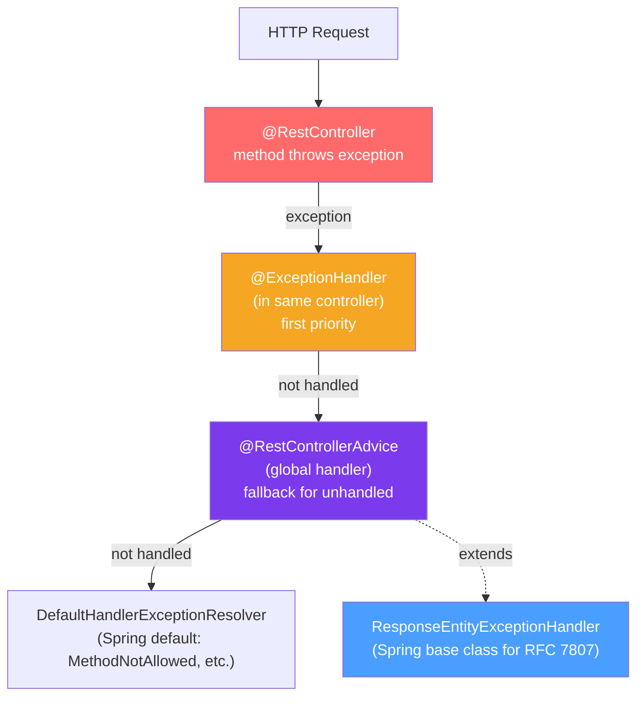

# 🚨 Exception Handling

> [!abstract] TL;DR
> Spring MVC's exception handling has two levels: per-controller `@ExceptionHandler` (local scope) and `@RestControllerAdvice` (global scope). Spring Boot 3 / Spring 6 introduced `ProblemDetail` (RFC 7807) as a standardized error response format. Validation errors from `@Valid` throw `MethodArgumentNotValidException` → 400. Security exceptions produce 401/403 before reaching controllers.

## Intuition — analogy FIRST
Exception handling is like a hospital triage system. When something goes wrong (exception thrown), it flows up the chain of responsibility. First, the treating doctor (controller-level `@ExceptionHandler`) tries to handle it — if it's within their specialty, they manage it. If not, it goes to the hospital administrator (`@RestControllerAdvice`) who has policies for all error types. RFC 7807 (ProblemDetail) is the standardized triage form format — every hospital uses the same form structure, so paramedics (API clients) always know what information to expect.

---

## How It Works



## Key Concepts / Details

### @ExceptionHandler — Per-Controller

```java
@RestController
@RequestMapping("/users")
public class UserController {
    private final UserService userService;

    @GetMapping("/{id}")
    public UserResponse getUser(@PathVariable String id) {
        return userService.findById(id) // throws UserNotFoundException if not found
            .orElseThrow(() -> new UserNotFoundException("User not found: " + id));
    }

    // Handles UserNotFoundException only for THIS controller
    @ExceptionHandler(UserNotFoundException.class)
    public ResponseEntity<String> handleNotFound(UserNotFoundException ex) {
        return ResponseEntity.status(HttpStatus.NOT_FOUND).body(ex.getMessage());
    }
}
```

### @RestControllerAdvice — Global Handler (Preferred)

```java
@RestControllerAdvice // @ControllerAdvice + @ResponseBody; applies to ALL controllers
public class GlobalExceptionHandler extends ResponseEntityExceptionHandler {

    // Handle custom domain exceptions
    @ExceptionHandler(UserNotFoundException.class)
    public ProblemDetail handleUserNotFound(UserNotFoundException ex, HttpServletRequest request) {
        ProblemDetail pd = ProblemDetail.forStatusAndDetail(HttpStatus.NOT_FOUND, ex.getMessage());
        pd.setTitle("User Not Found");
        pd.setType(URI.create("https://api.example.com/errors/user-not-found"));
        pd.setProperty("userId", ex.getUserId()); // custom extension field
        return pd;
    }

    @ExceptionHandler(BusinessException.class)
    public ProblemDetail handleBusinessException(BusinessException ex) {
        ProblemDetail pd = ProblemDetail.forStatusAndDetail(HttpStatus.UNPROCESSABLE_ENTITY, ex.getMessage());
        pd.setTitle("Business Rule Violation");
        pd.setProperty("code", ex.getErrorCode());
        return pd;
    }

    // Handle validation errors from @Valid on @RequestBody
    @Override  // override from ResponseEntityExceptionHandler
    protected ResponseEntity<Object> handleMethodArgumentNotValid(
            MethodArgumentNotValidException ex, HttpHeaders headers,
            HttpStatusCode status, WebRequest request) {

        ProblemDetail pd = ProblemDetail.forStatusAndDetail(
            HttpStatus.BAD_REQUEST, "Request validation failed");
        pd.setTitle("Validation Error");

        List<Map<String, String>> violations = ex.getBindingResult().getFieldErrors().stream()
            .map(error -> Map.of(
                "field", error.getField(),
                "message", Objects.requireNonNullElse(error.getDefaultMessage(), "Invalid value"),
                "rejectedValue", String.valueOf(error.getRejectedValue())
            ))
            .collect(Collectors.toList());

        pd.setProperty("violations", violations);
        return ResponseEntity.badRequest().body(pd);
    }

    // Catch-all for unexpected exceptions
    @ExceptionHandler(Exception.class)
    public ProblemDetail handleGenericException(Exception ex, HttpServletRequest request) {
        log.error("Unexpected exception on {} {}", request.getMethod(), request.getRequestURI(), ex);
        ProblemDetail pd = ProblemDetail.forStatusAndDetail(
            HttpStatus.INTERNAL_SERVER_ERROR, "An unexpected error occurred");
        pd.setTitle("Internal Server Error");
        pd.setProperty("requestId", request.getHeader("X-Request-ID"));
        return pd;
    }
}
```

### ProblemDetail — RFC 7807 Standard

RFC 7807 defines a standard JSON structure for API errors:

```json
{
    "type": "https://api.example.com/errors/user-not-found",
    "title": "User Not Found",
    "status": 404,
    "detail": "User with ID abc-123 does not exist",
    "instance": "/api/users/abc-123",
    "userId": "abc-123",
    "timestamp": "2026-07-26T10:00:00Z"
}
```

| Field | Required | Description |
|-------|----------|-------------|
| `type` | No | URI identifying error type |
| `title` | No | Human-readable summary |
| `status` | No (implicit) | HTTP status code |
| `detail` | No | Human-readable explanation |
| `instance` | No | URI identifying this specific occurrence |
| Any extension | No | Additional custom fields |

```java
// Creating ProblemDetail in Spring 6+
ProblemDetail pd = ProblemDetail.forStatus(HttpStatus.NOT_FOUND);
pd.setTitle("User Not Found");
pd.setDetail("User with ID " + id + " was not found");
pd.setType(URI.create("https://api.example.com/errors/not-found"));
pd.setProperty("userId", id); // custom extension field
```

### Custom Exception Classes

```java
// Base exception with HTTP status
public abstract class ApiException extends RuntimeException {
    private final HttpStatus httpStatus;

    protected ApiException(String message, HttpStatus httpStatus) {
        super(message);
        this.httpStatus = httpStatus;
    }

    public HttpStatus getHttpStatus() { return httpStatus; }
}

// Domain-specific exceptions
public class UserNotFoundException extends ApiException {
    private final String userId;

    public UserNotFoundException(String userId) {
        super("User not found: " + userId, HttpStatus.NOT_FOUND);
        this.userId = userId;
    }

    public String getUserId() { return userId; }
}

public class DuplicateEmailException extends ApiException {
    public DuplicateEmailException(String email) {
        super("Email already registered: " + email, HttpStatus.CONFLICT);
    }
}

// Using @ResponseStatus on exception (simpler, less flexible)
@ResponseStatus(HttpStatus.NOT_FOUND)
public class ResourceNotFoundException extends RuntimeException {
    public ResourceNotFoundException(String message) { super(message); }
}
```

### Error Handler for Different Error Types

```java
@RestControllerAdvice
public class GlobalExceptionHandler extends ResponseEntityExceptionHandler {

    // 400 — Request validation
    // Thrown by @Valid on @RequestBody
    @Override
    protected ResponseEntity<Object> handleMethodArgumentNotValid(
            MethodArgumentNotValidException ex, /*...*/) { /* ... */ }

    // 400 — Type mismatch (@PathVariable type conversion failed)
    @Override
    protected ResponseEntity<Object> handleTypeMismatch(
            TypeMismatchException ex, /*...*/) { /* ... */ }

    // 400 — Missing parameter
    @Override
    protected ResponseEntity<Object> handleMissingServletRequestParameter(
            MissingServletRequestParameterException ex, /*...*/) { /* ... */ }

    // 405 — Wrong HTTP method
    @Override
    protected ResponseEntity<Object> handleHttpRequestMethodNotSupported(
            HttpRequestMethodNotSupportedException ex, /*...*/) { /* ... */ }

    // 415 — Unsupported media type
    @Override
    protected ResponseEntity<Object> handleHttpMediaTypeNotSupported(
            HttpMediaTypeNotSupportedException ex, /*...*/) { /* ... */ }

    // Custom exception → ProblemDetail
    @ExceptionHandler(ApiException.class)
    public ProblemDetail handleApiException(ApiException ex) {
        return ProblemDetail.forStatusAndDetail(ex.getHttpStatus(), ex.getMessage());
    }
}
```

---

## Real-World Notes

- **`ResponseEntityExceptionHandler`**: extend this base class to override Spring MVC's default exception handling (MethodNotAllowed, MissingParam, etc.) while adding your own handlers.
- **Never expose stack traces in production**: the catch-all `Exception.class` handler should log the full exception but return only a generic error message to the client.
- **Validation on `@PathVariable` and `@RequestParam`**: add `@Validated` at class level and use JSR-303 constraints directly on parameters: `@PathVariable @Positive Long id`. Violations throw `ConstraintViolationException` (different from `MethodArgumentNotValidException`).
- **Spring Security exceptions**: `AccessDeniedException` (403) and `AuthenticationException` (401) are handled by Spring Security's `ExceptionTranslationFilter` **before** reaching your `@ControllerAdvice`. Override `AuthenticationEntryPoint` and `AccessDeniedHandler` for custom security error responses.

---

## Common Pitfalls

- **Handling checked exceptions in @ExceptionHandler**: Spring MVC `@ExceptionHandler` can handle both checked and unchecked exceptions. But service methods should prefer RuntimeExceptions to keep controller code clean.
- **@ControllerAdvice vs @RestControllerAdvice**: use `@RestControllerAdvice` for REST APIs — it adds `@ResponseBody` so your exception handler return value is serialized to JSON. `@ControllerAdvice` without `@ResponseBody` tries to render a view.
- **Multiple handlers for same exception**: if two `@ExceptionHandler` methods handle the same exception, Spring picks the most specific one in the same class, but throws `IllegalStateException` if both are in different `@ControllerAdvice` classes. Use `@Order` to prioritize.

---

## Related Concepts

- [[REST_Controllers]] — Controllers that throw exceptions for handlers to catch
- [[Request_Mapping]] — Validation errors from @Valid @RequestBody
- [[Spring_Security_Architecture]] — Security exceptions handled before reaching ControllerAdvice

---

## Review Questions

1. What is the difference between `@ExceptionHandler` in a controller vs `@RestControllerAdvice`?
2. What is RFC 7807 ProblemDetail and what fields does it include?
3. How do you handle `MethodArgumentNotValidException` to return a list of validation errors?
4. Why can't `@RestControllerAdvice` handle Spring Security's `AccessDeniedException`?
5. What is the difference between `@ResponseStatus` on an exception class and `@ExceptionHandler`?

---

## Sources

- Spring Framework Documentation: Exception Handling
- RFC 7807: Problem Details for HTTP APIs — https://www.rfc-editor.org/rfc/rfc7807
- Baeldung: Error Handling for REST with Spring

#java #spring #spring-mvc #exception-handling #controlleradvice #problemdetail #rfc7807 #validation
