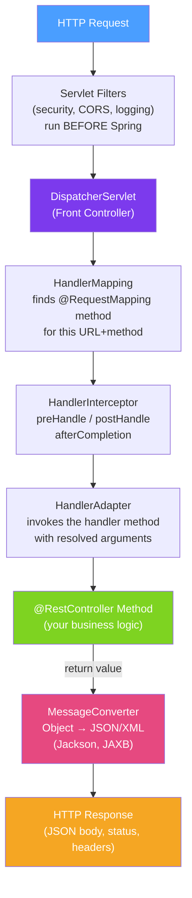

# 🏛️ Spring MVC Architecture

> [!abstract] TL;DR
> Spring MVC is built on a single `DispatcherServlet` that acts as the Front Controller. Every HTTP request flows through it, which delegates to `HandlerMapping` (find the method), `HandlerAdapter` (invoke it), `MessageConverter` (serialize the response), and optionally `ViewResolver` (for server-side rendering). Filters run before the Servlet; Interceptors run inside Spring MVC's handler pipeline.

## Intuition — analogy FIRST
The DispatcherServlet is like a hotel concierge. Every guest (request) arrives at the front desk (DispatcherServlet). The concierge checks the hotel directory (HandlerMapping) to find which room staff (controller method) handles this request. The concierge then uses the right communication protocol (HandlerAdapter) to notify that staff member. The staff member handles the request and returns a response (return value). The concierge packages it (MessageConverter: Java object → JSON) and sends it to the guest. If there's a problem at any stage, the concierge calls the complaint manager (ExceptionResolver).

---

## How It Works



## Key Concepts / Details

### DispatcherServlet — The Front Controller

```java
// Spring Boot auto-configures DispatcherServlet at "/"
// Manual configuration (pre-Boot):
@Bean
public DispatcherServlet dispatcherServlet() {
    return new DispatcherServlet();
}

@Bean
public ServletRegistrationBean<DispatcherServlet> servletRegistration(DispatcherServlet ds) {
    return new ServletRegistrationBean<>(ds, "/*");
}

// Context path (changes the base URL for the whole application)
// application.properties:
// server.servlet.context-path=/api/v1
```

### HandlerMapping — Finding the Right Method

Spring uses `RequestMappingHandlerMapping` (most common) which reads `@RequestMapping` annotations:

```java
@RestController
@RequestMapping("/users")  // class-level: prefix for all methods
public class UserController {

    @GetMapping("/{id}")    // GET /users/{id}
    public UserResponse getUser(@PathVariable String id) { /*...*/ }

    @PostMapping           // POST /users
    public ResponseEntity<UserResponse> createUser(@RequestBody CreateUserRequest req) { /*...*/ }

    @PutMapping("/{id}")   // PUT /users/{id}
    public UserResponse updateUser(@PathVariable String id, @RequestBody UpdateUserRequest req) { /*...*/ }

    @DeleteMapping("/{id}") // DELETE /users/{id}
    public ResponseEntity<Void> deleteUser(@PathVariable String id) { /*...*/ }
}
```

### HandlerInterceptor — Request Lifecycle Hooks

```java
@Component
public class RequestLoggingInterceptor implements HandlerInterceptor {

    @Override
    public boolean preHandle(HttpServletRequest req, HttpServletResponse res, Object handler) {
        req.setAttribute("startTime", System.currentTimeMillis());
        log.info("Request: {} {}", req.getMethod(), req.getRequestURI());
        return true; // true = continue; false = abort processing
    }

    @Override
    public void postHandle(HttpServletRequest req, HttpServletResponse res, Object handler,
                           ModelAndView mv) {
        // Called after handler method, before view rendering
        // Not called if exception thrown
    }

    @Override
    public void afterCompletion(HttpServletRequest req, HttpServletResponse res, Object handler,
                                Exception ex) {
        long duration = System.currentTimeMillis() - (Long)req.getAttribute("startTime");
        log.info("Completed {} {} in {}ms with status {}", req.getMethod(),
                 req.getRequestURI(), duration, res.getStatus());
    }
}

@Configuration
public class WebMvcConfig implements WebMvcConfigurer {
    @Autowired RequestLoggingInterceptor loggingInterceptor;

    @Override
    public void addInterceptors(InterceptorRegistry registry) {
        registry.addInterceptor(loggingInterceptor)
            .addPathPatterns("/api/**")
            .excludePathPatterns("/api/health");
    }
}
```

### Filters vs Interceptors

| | Servlet Filter | HandlerInterceptor |
|--|--|--|
| Level | Servlet container (before Spring) | Spring MVC (inside DispatcherServlet) |
| Access to | Raw request/response | Spring `HandlerMethod`, `ModelAndView` |
| Usage | Auth, CORS, request wrapping | Logging, metrics, locale |
| Registration | FilterRegistrationBean / @WebFilter | WebMvcConfigurer.addInterceptors |
| Exception handling | Must handle manually | ExceptionResolver handles |

### Message Converters — Java ↔ HTTP

```java
// Spring Boot auto-configures Jackson for JSON
// Custom configuration:
@Configuration
public class JacksonConfig {
    @Bean
    public Jackson2ObjectMapperBuilderCustomizer jsonCustomizer() {
        return builder -> builder
            .featuresToDisable(SerializationFeature.WRITE_DATES_AS_TIMESTAMPS)
            .featuresToEnable(DeserializationFeature.FAIL_ON_UNKNOWN_PROPERTIES)
            .modules(new JavaTimeModule());
    }
}

// Content negotiation: client sends Accept header
// Accept: application/json → Jackson JSON
// Accept: application/xml → JAXB XML (if spring-boot-starter-xml on classpath)
```

### Configuring Spring MVC

```java
@Configuration
public class WebMvcConfig implements WebMvcConfigurer {

    @Override
    public void addCorsMappings(CorsRegistry registry) {
        registry.addMapping("/api/**")
            .allowedOrigins("https://example.com", "https://www.example.com")
            .allowedMethods("GET", "POST", "PUT", "DELETE")
            .allowedHeaders("*")
            .allowCredentials(true)
            .maxAge(3600);
    }

    @Override
    public void addResourceHandlers(ResourceHandlerRegistry registry) {
        registry.addResourceHandler("/static/**")
            .addResourceLocations("classpath:/static/");
    }

    @Override
    public void configureMessageConverters(List<HttpMessageConverter<?>> converters) {
        // Customize or replace default message converters
    }

    @Override
    public void addFormatters(FormatterRegistry registry) {
        registry.addConverter(new StringToUUIDConverter());
    }
}
```

---

## Real-World Notes

- **Spring Security Filters come before DispatcherServlet**: security filters (authentication, CSRF) run in the Servlet filter chain, before the request reaches Spring MVC. This is intentional — security must not depend on Spring MVC being available.
- **`@ResponseBody` vs `ResponseEntity`**: `@ResponseBody` (included in `@RestController`) serializes the return value. `ResponseEntity<T>` gives full control over status code, headers, and body — use it when you need non-200 status or custom headers.
- **Async handling**: `@RestController` methods can return `Callable<T>` or `DeferredResult<T>` to process the request in a different thread while freeing the Tomcat thread for other requests — a middle ground before full WebFlux.

---

## Common Pitfalls

- **Interceptor vs Filter ordering**: multiple filters run in order of their `@Order` or filter registration; multiple interceptors run in registration order for `preHandle` and reverse order for `postHandle`/`afterCompletion`.
- **Missing CORS configuration**: CORS failures are often confusing — add `@CrossOrigin` on the controller or configure globally with `WebMvcConfigurer.addCorsMappings`.
- **Case sensitivity in path variables**: `/users/Alice` and `/users/alice` are different paths. Lowercase-normalize path variables if needed.

---

## Related Concepts

- [[REST_Controllers]] — Controller methods that the DispatcherServlet routes to
- [[Exception_Handling]] — ExceptionResolver / @ControllerAdvice for error handling
- [[Spring_Security_Architecture]] — Security filters run before DispatcherServlet

---

## Review Questions

1. Describe the request processing flow from HTTP request to JSON response in Spring MVC.
2. What is the difference between a Servlet Filter and a `HandlerInterceptor`?
3. What does `MessageConverter` do and which converter handles JSON by default?
4. How do you configure CORS in Spring MVC?
5. What does `preHandle` returning `false` do in a `HandlerInterceptor`?

---

## Sources

- Spring Framework Documentation: Web on Servlet Stack
- Spring Framework Documentation: DispatcherServlet
- Baeldung: Spring MVC

#java #spring #spring-mvc #dispatcherservlet #handlermapping #interceptor #filter #messagecoverter
