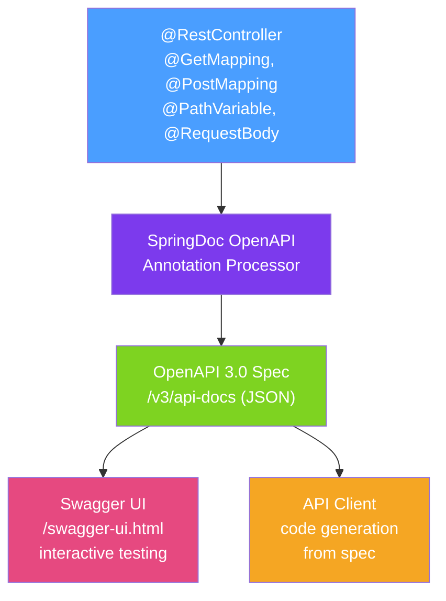

# 📖 Spring REST Documentation

> [!abstract] TL;DR
> SpringDoc OpenAPI generates OpenAPI 3.0 documentation from Spring MVC annotations automatically, serving interactive Swagger UI at `/swagger-ui.html`. Annotations like `@Operation`, `@Parameter`, and `@Schema` enrich the auto-generated docs. API versioning — URL-based (`/v1/users`), header-based, or content-type-based — is a design decision with significant long-term consequences.

## Intuition — analogy FIRST
API documentation is like a restaurant menu. A bad restaurant makes you ask the waiter about every dish (undocumented API — constant back-and-forth with the API team). A good restaurant has a clear menu with descriptions, photos, and allergen information (OpenAPI spec + Swagger UI — clients can self-serve). A great restaurant also tells you how the menu has evolved and which dishes are seasonal (API versioning — communicates changes clearly). SpringDoc is the menu printer that reads your kitchen's existing recipe cards (Spring annotations) and automatically generates the beautiful menu.

---

## How It Works



## Key Concepts / Details

### SpringDoc Setup

```xml
<dependency>
    <groupId>org.springdoc</groupId>
    <artifactId>springdoc-openapi-starter-webmvc-ui</artifactId>
    <version>2.5.0</version>
</dependency>
```

```yaml
# application.yml
springdoc:
  swagger-ui:
    path: /swagger-ui.html          # customize Swagger UI path
    operationsSorter: method        # sort by HTTP method
    tagsSorter: alpha               # sort tags alphabetically
    display-request-duration: true
  api-docs:
    path: /v3/api-docs              # OpenAPI spec JSON path
  show-actuator: false              # exclude actuator endpoints from docs
  default-consumes-media-type: application/json
  default-produces-media-type: application/json
```

### Global API Configuration

```java
@Configuration
public class OpenApiConfig {
    @Bean
    public OpenAPI apiInfo() {
        return new OpenAPI()
            .info(new Info()
                .title("User Management API")
                .description("REST API for managing users and their data")
                .version("v2.1.0")
                .contact(new Contact()
                    .name("API Team")
                    .email("api-team@example.com")
                    .url("https://docs.example.com")))
            .externalDocs(new ExternalDocumentation()
                .description("Full API documentation")
                .url("https://docs.example.com/api"))
            .addSecurityItem(new SecurityRequirement().addList("bearerAuth"))
            .components(new Components()
                .addSecuritySchemes("bearerAuth",
                    new SecurityScheme()
                        .type(SecurityScheme.Type.HTTP)
                        .scheme("bearer")
                        .bearerFormat("JWT")
                        .description("JWT Authorization header")));
    }
}
```

### Annotating Controllers

```java
@RestController
@RequestMapping("/api/v1/users")
@Tag(name = "Users", description = "Operations for managing users")  // groups endpoints
public class UserController {

    @Operation(
        summary = "Get user by ID",
        description = "Returns a single user. Throws 404 if not found.",
        security = @SecurityRequirement(name = "bearerAuth")
    )
    @ApiResponses({
        @ApiResponse(responseCode = "200", description = "User found",
            content = @Content(schema = @Schema(implementation = UserResponse.class))),
        @ApiResponse(responseCode = "404", description = "User not found",
            content = @Content(schema = @Schema(implementation = ProblemDetail.class))),
        @ApiResponse(responseCode = "401", description = "Unauthorized")
    })
    @GetMapping("/{id}")
    public UserResponse getUser(
            @Parameter(description = "User ID", required = true, example = "usr-123")
            @PathVariable String id) {
        return userService.findById(id).orElseThrow(() -> new UserNotFoundException(id));
    }

    @PostMapping
    @ResponseStatus(HttpStatus.CREATED)
    @Operation(summary = "Create user", description = "Creates a new user account")
    public UserResponse createUser(
            @io.swagger.v3.oas.annotations.parameters.RequestBody(
                description = "User creation data",
                required = true,
                content = @Content(schema = @Schema(implementation = CreateUserRequest.class))
            )
            @Valid @RequestBody CreateUserRequest request) {
        return userService.create(request);
    }
}

// DTO annotations
@Schema(description = "User response model")
public record UserResponse(
    @Schema(description = "User unique identifier", example = "usr-abc123")
    String id,

    @Schema(description = "User email address", example = "alice@example.com")
    String email,

    @Schema(description = "Account creation timestamp")
    LocalDateTime createdAt
) {}
```

### Grouping Endpoints

```java
@Configuration
public class OpenApiGroups {

    @Bean
    public GroupedOpenApi publicApi() {
        return GroupedOpenApi.builder()
            .group("public-api")
            .pathsToMatch("/api/v1/**")
            .pathsToExclude("/api/v1/admin/**")
            .build();
    }

    @Bean
    public GroupedOpenApi adminApi() {
        return GroupedOpenApi.builder()
            .group("admin-api")
            .pathsToMatch("/api/v1/admin/**")
            .addOpenApiCustomizer(openApi -> openApi
                .info(new Info().title("Admin API").version("v1")))
            .build();
    }
}
```

### API Versioning Strategies

| Strategy | Example | Pros | Cons |
|---------|---------|------|------|
| **URL versioning** | `/api/v1/users` | Simple, visible, cacheable | Pollutes URL namespace |
| **Header versioning** | `Accept-Version: v1` | Clean URLs | Less visible, harder to test in browser |
| **Content-Type versioning** | `application/vnd.company.v1+json` | Standard HTTP semantics | Complex to implement |
| **Query param** | `/users?version=1` | Simple | Non-standard |

**URL versioning (most common):**
```java
@RestController
@RequestMapping("/api/v1/users")  // version in URL
public class UserControllerV1 { /* ... */ }

@RestController
@RequestMapping("/api/v2/users")  // breaking change → new version
public class UserControllerV2 { /* ... */ }
```

**Header versioning:**
```java
@GetMapping(value = "/users/{id}",
    headers = "API-Version=1")  // header selects version
public UserResponseV1 getUserV1(@PathVariable String id) { /* ... */ }

@GetMapping(value = "/users/{id}",
    headers = "API-Version=2")
public UserResponseV2 getUserV2(@PathVariable String id) { /* ... */ }
```

### Client Code Generation

The OpenAPI spec (`/v3/api-docs`) can generate client SDKs:

```bash
# Generate Java client from OpenAPI spec
openapi-generator generate \
  -i http://localhost:8080/v3/api-docs \
  -g java \
  -o ./generated-client \
  --library okhttp-gson

# Generate TypeScript/Axios client
openapi-generator generate \
  -i http://localhost:8080/v3/api-docs \
  -g typescript-axios \
  -o ./frontend/src/api
```

---

## Real-World Notes

- **URL versioning is the pragmatic choice**: despite being "less pure" from a REST perspective, URL versioning is browser-friendly, easily cacheable, and immediately visible in logs and monitoring tools.
- **Semantic versioning for APIs**: major version (`v1 → v2`) for breaking changes; minor version communicated via changelogs for backward-compatible changes.
- **Deprecation strategy**: keep deprecated API versions running for at least one major release cycle; communicate deprecation via `Deprecation` header and response `Link` header to migration guides.
- **Contract-first vs code-first**: SpringDoc is code-first (annotations drive the spec). Contract-first (write OpenAPI spec first, generate stubs) is better for API-first design but requires more tooling.

---

## Common Pitfalls

- **Missing `@Schema` on complex types**: SpringDoc infers simple types well but needs `@Schema` hints for discriminator fields in polymorphic types or custom serialization.
- **Exposing internal details**: auto-generated docs may expose internal field names or structures. Review and annotate carefully to present a clean public API contract.
- **Swagger UI security**: don't expose Swagger UI in production without authentication. Configure `springdoc.swagger-ui.enabled=false` in production profiles.

---

## Related Concepts

- [[REST_Controllers]] — Controllers that SpringDoc reads to generate the spec
- [[Request_Mapping]] — All mapping annotations that appear in the generated spec
- [[Exception_Handling]] — Document error responses with @ApiResponse

---

## Review Questions

1. What is the difference between the OpenAPI spec and Swagger UI?
2. How do you document a JWT-secured endpoint in SpringDoc?
3. Compare URL versioning vs header versioning — when would you choose each?
4. How do you group endpoints into separate API documents in SpringDoc?
5. What does `@Schema(implementation = ...)` do in SpringDoc annotations?

---

## Sources

- SpringDoc OpenAPI Documentation: https://springdoc.org
- OpenAPI 3.0 Specification: https://swagger.io/specification/
- API Versioning Guide: https://martinfowler.com/articles/richardsonMaturityModel.html

#java #spring #spring-mvc #openapi #swagger #springdoc #api-versioning #documentation
