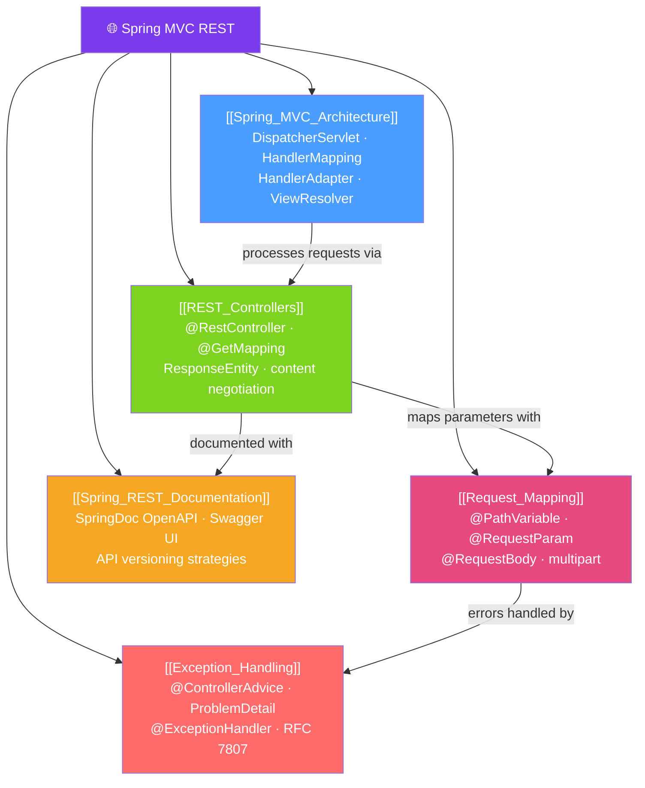

# 🌐 Spring MVC REST — Map of Content

> [!abstract] What This Section Covers
> Spring MVC is the web framework that sits atop the Servlet API, translating HTTP requests into Java method invocations and Java return values back into HTTP responses. This section covers the DispatcherServlet architecture, building REST APIs with controllers and mappings, handling all forms of request data, designing robust exception handling, and documenting APIs with OpenAPI/Swagger.

## Concept Map

## Learning Path
1. [[Spring_MVC_Architecture]] — Understand the DispatcherServlet flow before writing controllers.
2. [[REST_Controllers]] — Build REST APIs with `@RestController`, HTTP method mappings, and `ResponseEntity`.
3. [[Request_Mapping]] — Extract path variables, query params, headers, request body, and file uploads.
4. [[Exception_Handling]] — Handle errors globally with `@ControllerAdvice` and RFC 7807 `ProblemDetail`.
5. [[Spring_REST_Documentation]] — Document APIs with SpringDoc OpenAPI and manage API versioning.

## All Notes at a Glance
| Note | Difficulty | What You'll Learn |
|------|------------|-------------------|
| [[Spring_MVC_Architecture]] | Intermediate | DispatcherServlet pipeline, HandlerMapping, message converters, filters vs interceptors |
| [[REST_Controllers]] | Beginner | @RestController, HTTP method annotations, ResponseEntity, Richardson Maturity Model |
| [[Request_Mapping]] | Intermediate | @PathVariable, @RequestParam, @RequestBody, @RequestHeader, multipart uploads |
| [[Exception_Handling]] | Intermediate | @ControllerAdvice, @ExceptionHandler, ProblemDetail (RFC 7807), validation errors |
| [[Spring_REST_Documentation]] | Intermediate | SpringDoc OpenAPI, Swagger UI, @Operation/@Schema, API versioning strategies |

## Key Questions This Section Answers
- What is the DispatcherServlet and how does it route requests?
- What is the difference between `@Controller` and `@RestController`?
- How do you handle validation errors uniformly across all controllers?
- What is ProblemDetail (RFC 7807) and why is it preferred over custom error responses?
- How do you version a REST API?

## Related Sections
- [[_MOC_Java_Master|↑ Java Master MOC]]
- [[_MOC_Spring_Core|← Spring Core]] — Controllers are Spring beans managed by IoC
- [[_MOC_Spring_Security|→ Spring Security]] — Secure REST APIs with filter chain
- [[_MOC_Spring_Data|→ Spring Data]] — Repositories serve data to controllers via services

#MOC #java #spring #spring-mvc #rest
