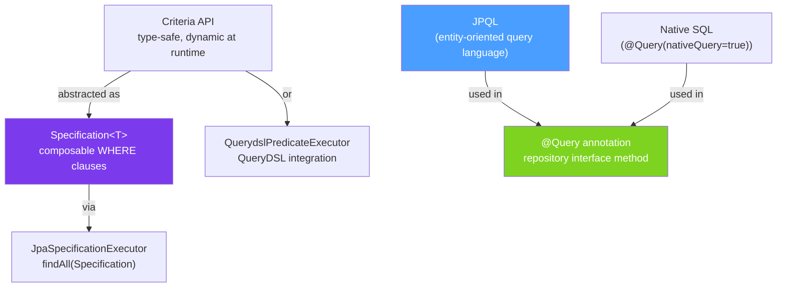

# 🔍 JPQL and Criteria API

> [!abstract] TL;DR
> **JPQL** (Jakarta Persistence Query Language) lets you write SQL-like queries against entity class names/fields — not table/column names. `@Query` embeds JPQL (or native SQL) directly in repository interfaces. **JOIN FETCH** is the primary fix for the N+1 query problem. The **Criteria API** (and Spring Data's `Specification`) builds type-safe dynamic queries at runtime. Use `@Modifying + @Query` for bulk updates/deletes.

## Intuition — analogy FIRST
SQL talks to the database in its language (table names, column names). JPQL talks to JPA in Java's language (class names, field names). "Give me all `User` objects where `user.status == ACTIVE`" instead of "SELECT * FROM users WHERE status = 'ACTIVE'". Hibernate translates JPQL to the right SQL dialect for you. JOIN FETCH is like saying "and while you're at it, bring their full order history in one trip" — preventing the N+1 problem where you'd otherwise make 1 query for users and N queries for each user's orders.

---

## How It Works



## Key Concepts / Details

### @Query — JPQL Queries

```java
public interface UserRepository extends JpaRepository<User, Long> {

    // JPQL — uses entity/field names (not table/column names)
    @Query("SELECT u FROM User u WHERE u.email = :email AND u.status = :status")
    Optional<User> findByEmailAndStatus(
        @Param("email") String email,
        @Param("status") UserStatus status);

    // JPQL — return subset of fields as DTO
    @Query("SELECT new com.example.dto.UserSummary(u.id, u.name, u.email) " +
           "FROM User u WHERE u.status = :status")
    List<UserSummary> findSummariesByStatus(@Param("status") UserStatus status);

    // Native SQL — for DB-specific features or complex joins
    @Query(value = "SELECT * FROM users WHERE email ILIKE :pattern LIMIT :limit",
           nativeQuery = true)
    List<User> searchByEmailNative(@Param("pattern") String pattern,
                                   @Param("limit") int limit);

    // Named positional params with ?1, ?2 (older style, prefer @Param)
    @Query("SELECT u FROM User u WHERE u.name = ?1 AND u.role = ?2")
    List<User> findByNameAndRole(String name, Role role);
}
```

### JOIN FETCH — The N+1 Fix

```java
// THE PROBLEM — N+1 queries:
// List<Order> orders = orderRepo.findAll();  // 1 query: SELECT * FROM orders
// for (Order o : orders) {
//     o.getCustomer().getName();             // N queries: SELECT * FROM customers WHERE id=?
// }
// → 1 + N database round trips for N orders. Kills performance.

public interface OrderRepository extends JpaRepository<Order, Long> {

    // FIX: JOIN FETCH loads associations in a single query
    @Query("SELECT o FROM Order o " +
           "JOIN FETCH o.customer " +          // load customer with order in one SQL JOIN
           "WHERE o.status = :status")
    List<Order> findWithCustomerByStatus(@Param("status") OrderStatus status);

    // Multiple JOIN FETCH (careful — produces cartesian product!)
    // For multiple collections, use separate queries or @BatchSize
    @Query("SELECT DISTINCT o FROM Order o " +
           "JOIN FETCH o.customer c " +
           "JOIN FETCH o.orderLines " +        // DISTINCT avoids duplicate orders
           "WHERE c.id = :customerId")
    List<Order> findFullOrdersByCustomer(@Param("customerId") Long customerId);

    // Pagination + JOIN FETCH — use @EntityGraph instead (JOIN FETCH breaks pagination)
    @EntityGraph(attributePaths = {"customer", "orderLines"})
    Page<Order> findByStatus(OrderStatus status, Pageable pageable);
}
```

### @Modifying — Bulk Updates and Deletes

```java
public interface UserRepository extends JpaRepository<User, Long> {

    // Bulk update — much faster than loading entities and calling save()
    @Modifying
    @Query("UPDATE User u SET u.status = :newStatus " +
           "WHERE u.status = :oldStatus AND u.createdAt < :cutoff")
    @Transactional
    int bulkUpdateStatus(@Param("newStatus") UserStatus newStatus,
                         @Param("oldStatus") UserStatus oldStatus,
                         @Param("cutoff") LocalDateTime cutoff);

    // Bulk delete
    @Modifying
    @Query("DELETE FROM User u WHERE u.status = :status AND u.lastLoginAt < :cutoff")
    @Transactional
    int bulkDeleteInactiveUsers(@Param("status") UserStatus status,
                                @Param("cutoff") LocalDateTime cutoff);

    // Clear persistence context after bulk op to avoid stale cache
    @Modifying(clearAutomatically = true, flushAutomatically = true)
    @Query("UPDATE User u SET u.status = 'ACTIVE' WHERE u.id IN :ids")
    @Transactional
    int activateUsers(@Param("ids") List<Long> ids);
}
```

### Specification API — Dynamic Queries

```java
// 1. Enable by extending JpaSpecificationExecutor
public interface UserRepository extends JpaRepository<User, Long>,
                                         JpaSpecificationExecutor<User> {}

// 2. Create reusable Specification predicates
public class UserSpecifications {

    public static Specification<User> hasStatus(UserStatus status) {
        return (root, query, cb) -> status == null ? null :
            cb.equal(root.get("status"), status);
    }

    public static Specification<User> nameLike(String name) {
        return (root, query, cb) -> name == null ? null :
            cb.like(cb.lower(root.get("name")), "%" + name.toLowerCase() + "%");
    }

    public static Specification<User> createdAfter(LocalDateTime date) {
        return (root, query, cb) -> date == null ? null :
            cb.greaterThan(root.get("createdAt"), date);
    }

    public static Specification<User> hasRole(Role role) {
        return (root, query, cb) -> role == null ? null :
            cb.equal(root.get("role"), role);
    }
}

// 3. Compose dynamically at runtime
@Service
public class UserSearchService {
    private final UserRepository userRepo;

    public Page<User> searchUsers(UserSearchFilter filter, Pageable pageable) {
        Specification<User> spec = Specification
            .where(UserSpecifications.hasStatus(filter.status()))
            .and(UserSpecifications.nameLike(filter.name()))
            .and(UserSpecifications.createdAfter(filter.createdAfter()))
            .and(UserSpecifications.hasRole(filter.role()));
        // null predicates from each Spec are automatically ignored
        return userRepo.findAll(spec, pageable);
    }
}
```

### Projections and Interface Projections

```java
// Interface projection — Spring generates a proxy
public interface OrderSummary {
    Long getId();
    String getStatus();
    BigDecimal getTotalAmount();

    // SpEL-based computed projection
    @Value("#{target.firstName + ' ' + target.lastName}")
    String getCustomerFullName();
}

public interface OrderRepository extends JpaRepository<Order, Long> {
    // Spring generates SELECT id, status, total_amount FROM orders WHERE ...
    List<OrderSummary> findByCustomerId(Long customerId);
}

// DTO class projection — via constructor expression in JPQL
public record OrderStats(String status, Long count, BigDecimal totalRevenue) {}

public interface OrderRepository extends JpaRepository<Order, Long> {
    @Query("SELECT new com.example.dto.OrderStats(o.status, COUNT(o), SUM(o.totalAmount)) " +
           "FROM Order o GROUP BY o.status")
    List<OrderStats> getOrderStats();
}
```

### @EntityGraph — Declarative Fetch Overrides

```java
@Entity
@NamedEntityGraph(
    name = "Order.withCustomerAndLines",
    attributeNodes = {
        @NamedAttributeNode("customer"),
        @NamedAttributeNode(value = "orderLines", subgraph = "line-products")
    },
    subgraphs = @NamedSubgraph(
        name = "line-products",
        attributeNodes = @NamedAttributeNode("product")
    )
)
public class Order { /* ... */ }

public interface OrderRepository extends JpaRepository<Order, Long> {
    // Use named graph
    @EntityGraph("Order.withCustomerAndLines")
    Optional<Order> findDetailedById(Long id);

    // Inline attribute paths (no need for @NamedEntityGraph)
    @EntityGraph(attributePaths = {"customer", "orderLines"})
    Page<Order> findByStatus(OrderStatus status, Pageable pageable);
}
```

---

## Real-World Notes

- **JOIN FETCH breaks pagination**: if you use `LIMIT/OFFSET` pagination with `JOIN FETCH` on a collection, Hibernate fetches ALL rows and applies pagination in memory — printing a warning: "HHH90003004: firstResult/maxResults specified with collection fetch; applying in memory". Fix: use `@EntityGraph` with `findAll(Pageable)` or do two queries (IDs first, then entities by ID).
- **`clearAutomatically = true` on `@Modifying`**: after a bulk update, the Hibernate first-level cache is stale. `clearAutomatically` evicts it so subsequent reads reflect the bulk change.
- **Specification null handling**: returning `null` from a `Specification` lambda is treated as "no restriction" — this is the idiomatic way to make filters optional.
- **JPQL vs native**: native queries bypass HQL parsing and use raw SQL. They're faster to write for complex queries but lose portability (dialect-specific syntax) and don't benefit from entity lifecycle events.

---

## Common Pitfalls

- **Forgetting `@Transactional` on `@Modifying`**: bulk operations run outside transactions throw `TransactionRequiredException`. Always add `@Transactional` to the repository method or calling service method.
- **Cartesian product with multiple JOIN FETCHes**: `JOIN FETCH orders JOIN FETCH items` creates a Cartesian product (M×N rows). Use `DISTINCT` + `Hibernate.distinctResultTransformer` or separate queries.
- **Native query pagination**: `@Query(nativeQuery = true)` with `Pageable` requires a separate `countQuery` parameter: `@Query(value="...", countQuery="SELECT COUNT(*) FROM ...", nativeQuery=true)`.
- **N+1 in Specification queries**: building a Specification doesn't automatically fetch associations. Add `JOIN FETCH` in a custom query or `@EntityGraph` for eager loading within specifications.

---

## Related Concepts

- [[Repository_Pattern]] — Where @Query annotations live in repository interfaces
- [[Spring_Data_JPA]] — Entity relationships that cause N+1
- [[Database_Performance_Java]] — Connection pools, query plan analysis

---

## Review Questions

1. What is the difference between JPQL and native SQL in `@Query`? When would you use each?
2. How does JOIN FETCH solve the N+1 problem? Why does it break pagination?
3. What does `@Modifying(clearAutomatically = true)` do and when is it needed?
4. How do you build a dynamic query with multiple optional filters using `Specification`?
5. What is the difference between an interface projection and a DTO class projection?

---

## Sources

- Spring Data JPA Reference: https://docs.spring.io/spring-data/jpa/docs/current/reference/html/
- Vlad Mihalcea, *High-Performance Java Persistence* — N+1 and fetching strategies
- Hibernate ORM Documentation: https://hibernate.org/orm/documentation/

#java #spring #spring-data #jpql #criteria-api #specification #join-fetch #n-plus-one #query #modifying
