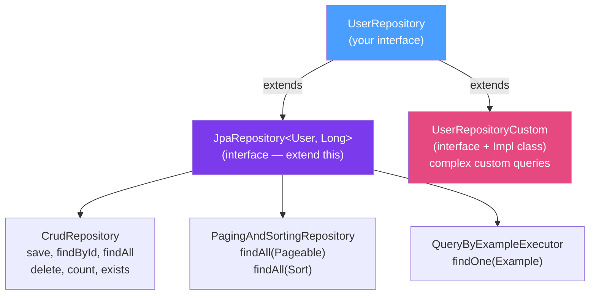

# 📦 Repository Pattern in Spring Data

> [!abstract] TL;DR
> Spring Data's repository abstraction eliminates CRUD boilerplate — extend `JpaRepository<T, ID>` and get 20+ methods for free. **Derived queries** generate SQL from method names (`findByEmailAndStatus`). For pagination: `findAll(Pageable)` returns a `Page<T>`. Always annotate write methods in a service with `@Transactional`. For custom implementations, use the `Impl` suffix convention.

## Intuition — analogy FIRST
JpaRepository is like a database concierge. You describe what you want in plain English (`findByLastNameAndCity`) and the concierge runs the SQL, maps results to Java objects, and returns them to you — all without you writing a single line of SQL. For unusual requests not covered by standard service, you can add custom operations: the concierge has a "custom requests" sub-team (`UserRepositoryCustom`) who handle the edge cases.

---

## How It Works



## Key Concepts / Details

### Basic Repository

```java
// Extend JpaRepository — get all CRUD + pagination for free
public interface UserRepository extends JpaRepository<User, Long> {
    // That's all — Spring Data provides: save, findById, findAll,
    // findAll(Sort), findAll(Pageable), count, delete, deleteById, existsById, etc.
}

// Using the repository
@Service
@Transactional(readOnly = true)  // readOnly optimizes Hibernate flush mode
public class UserService {
    private final UserRepository userRepo;

    public User findById(Long id) {
        return userRepo.findById(id)
            .orElseThrow(() -> new UserNotFoundException(id));
    }

    @Transactional  // write operation needs full transaction
    public User save(User user) {
        return userRepo.save(user);      // INSERT or UPDATE based on ID presence
    }

    public long count() { return userRepo.count(); }

    public boolean exists(Long id) { return userRepo.existsById(id); }

    @Transactional
    public void delete(Long id) { userRepo.deleteById(id); }
}
```

### Derived Queries — SQL from Method Names

```java
public interface UserRepository extends JpaRepository<User, Long> {

    // findBy<Property> — exact match
    Optional<User> findByEmail(String email);

    // Multiple conditions
    List<User> findByFirstNameAndLastName(String firstName, String lastName);

    // Or condition
    List<User> findByStatusOrRole(UserStatus status, Role role);

    // Comparison operators
    List<User> findByAgeGreaterThan(int age);
    List<User> findByAgeBetween(int min, int max);
    List<User> findByCreatedAtAfter(LocalDateTime date);

    // Null checks
    List<User> findByDeletedAtIsNull();
    List<User> findByPhoneNumberIsNotNull();

    // Collection membership
    List<User> findByStatusIn(List<UserStatus> statuses);
    List<User> findByIdNotIn(List<Long> ids);

    // String matching
    List<User> findByNameContaining(String substring);      // LIKE %substring%
    List<User> findByNameStartingWith(String prefix);       // LIKE prefix%
    List<User> findByEmailIgnoreCase(String email);         // case-insensitive

    // Counting and existence
    long countByStatus(UserStatus status);
    boolean existsByEmail(String email);

    // Deletion
    @Transactional
    void deleteByStatus(UserStatus status);

    // With sorting
    List<User> findByStatusOrderByCreatedAtDesc(UserStatus status);

    // Top N
    List<User> findTop10ByOrderByCreatedAtDesc();           // 10 newest users
    Optional<User> findFirstByEmailOrderByCreatedAtDesc(String email);
}
```

### Pagination and Sorting

```java
public interface UserRepository extends JpaRepository<User, Long> {
    Page<User> findByStatus(UserStatus status, Pageable pageable);
    Slice<User> findByRole(Role role, Pageable pageable);  // no total count query
}

@Service
public class UserService {
    public Page<User> listUsers(int page, int size, String sortBy) {
        Pageable pageable = PageRequest.of(
            page,                               // 0-indexed page number
            size,                               // page size
            Sort.by(Sort.Direction.ASC, sortBy) // sort field and direction
        );
        return userRepo.findAll(pageable);
    }

    public Page<User> listActiveUsers(Pageable pageable) {
        return userRepo.findByStatus(UserStatus.ACTIVE, pageable);
    }
}

// Page<T> provides:
// page.getContent()         — List<T> for current page
// page.getTotalElements()   — total count across all pages
// page.getTotalPages()      — total page count
// page.isFirst() / isLast()
// page.hasNext() / hasPrevious()
// page.getNumber()          — current page number
// page.getSize()            — page size

// Slice<T> (lighter):
// No COUNT query — better for "infinite scroll" UX
// slice.hasNext()           — there are more results
// slice.getContent()        — current page items
```

### Custom Repository Implementation

```java
// 1. Define the custom methods interface
public interface UserRepositoryCustom {
    List<User> findUsersWithComplexFilter(UserFilter filter);
    int bulkUpdateStatus(List<Long> ids, UserStatus status);
}

// 2. Implement with EntityManager (Impl suffix is mandatory by default)
@Repository
public class UserRepositoryCustomImpl implements UserRepositoryCustom {
    private final EntityManager em;

    @Override
    public List<User> findUsersWithComplexFilter(UserFilter filter) {
        CriteriaBuilder cb = em.getCriteriaBuilder();
        CriteriaQuery<User> cq = cb.createQuery(User.class);
        Root<User> root = cq.from(User.class);

        List<Predicate> predicates = new ArrayList<>();
        if (filter.name() != null) predicates.add(cb.like(root.get("name"), "%" + filter.name() + "%"));
        if (filter.status() != null) predicates.add(cb.equal(root.get("status"), filter.status()));
        if (filter.minAge() != null) predicates.add(cb.ge(root.get("age"), filter.minAge()));

        cq.where(predicates.toArray(new Predicate[0]));
        return em.createQuery(cq).getResultList();
    }

    @Override
    @Transactional
    public int bulkUpdateStatus(List<Long> ids, UserStatus status) {
        return em.createQuery("UPDATE User u SET u.status = :status WHERE u.id IN :ids")
            .setParameter("status", status)
            .setParameter("ids", ids)
            .executeUpdate();
    }
}

// 3. Combine in the main repository — Spring auto-discovers and merges
public interface UserRepository extends JpaRepository<User, Long>, UserRepositoryCustom {
    // derived queries here...
}
```

### Projections — Fetch Only What You Need

```java
// Interface projection — SQL only fetches specified columns
public interface UserSummary {
    Long getId();
    String getEmail();
    String getName();
    // Hibernate generates: SELECT id, email, name FROM users (not SELECT *)
}

public interface UserRepository extends JpaRepository<User, Long> {
    List<UserSummary> findByStatus(UserStatus status); // returns projections, not full entities
    Optional<UserSummary> findProjectedById(Long id);
}

// DTO projection with @Query
public record UserDto(Long id, String email) {}

public interface UserRepository extends JpaRepository<User, Long> {
    @Query("SELECT new com.example.UserDto(u.id, u.email) FROM User u WHERE u.status = :status")
    List<UserDto> findUserDtosByStatus(UserStatus status);
}
```

---

## Real-World Notes

- **`@Transactional(readOnly = true)` at service class level**: annotating the service class with `readOnly = true` and overriding individual write methods with `@Transactional` is the standard pattern. Read-only skips Hibernate's dirty checking, improving performance.
- **Avoid `findAll()` without pagination**: for large tables, `userRepo.findAll()` loads every row into memory. Always use pagination or a streaming approach.
- **`save()` behavior**: `save(entity)` calls `persist()` for new entities (no ID) and `merge()` for existing ones (has ID). Merge detaches the entity from the persistence context — use the returned value, not the original parameter.
- **Repository interface, not class**: Spring Data generates the implementation at startup time as a proxy. Your interface is never instantiated directly.

---

## Common Pitfalls

- **Missing `@Transactional` on write operations**: calling `save()` or `delete()` from non-transactional code works for simple cases but fails for related entity operations. Always have `@Transactional` on the service method.
- **Derived query typos**: `findByUserName` vs `findByUsername` — if your entity field is `username`, typos silently generate wrong SQL. Spring validates derived queries at startup if you enable query validation.
- **N+1 from derived queries**: `findByStatus(ACTIVE)` for 1000 users with `LAZY` `@ManyToOne` still triggers N+1 when you access associations. Use `@Query("... JOIN FETCH ...")` or projections.
- **`Page` vs `Slice`**: if you don't need the total count (e.g., "load more" UI pattern), use `Slice` to skip the COUNT query — it's significantly faster on large tables.

---

## Related Concepts

- [[Spring_Data_JPA]] — Entity mapping that repositories query
- [[JPQL_and_Criteria_API]] — Advanced queries for when derived queries fall short
- [[Spring_AOP]] — @Transactional works via Spring AOP proxy

---

## Review Questions

1. What is the difference between `CrudRepository`, `JpaRepository`, and `PagingAndSortingRepository`?
2. How does Spring Data generate SQL from method names like `findByEmailAndStatusIn`?
3. What is the difference between `Page<T>` and `Slice<T>`? When would you use each?
4. How do you add custom repository methods while keeping Spring Data's generated methods?
5. What is a projection and why would you use it over returning full entities?

---

## Sources

- Spring Data JPA Reference Documentation: https://docs.spring.io/spring-data/jpa/docs/current/reference/html/
- Vlad Mihalcea, *High-Performance Java Persistence* — Repository chapter

#java #spring #spring-data #repository #jparepository #derived-query #pagination #projection
