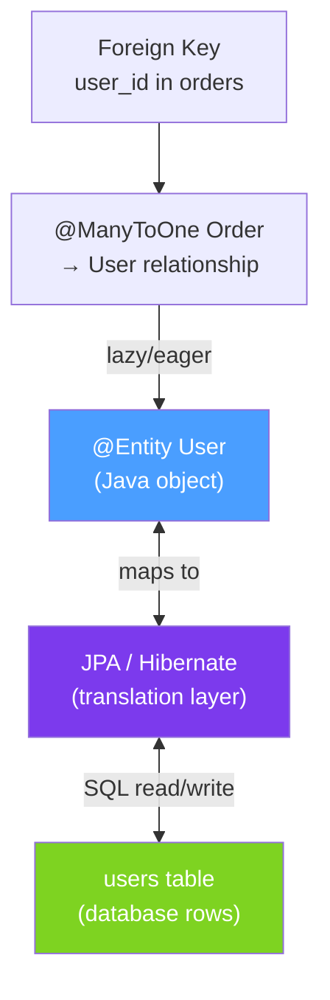

# 🗃️ Spring Data JPA

> [!abstract] TL;DR
> JPA (Jakarta Persistence API) is the standard ORM specification for Java; Hibernate is the most common implementation. Entities are Java classes annotated with `@Entity` that map to database tables. Relationships (`@OneToMany`, `@ManyToOne`, `@ManyToMany`, `@OneToOne`) map database foreign keys. **Always use LAZY fetching for collections** to avoid loading entire object graphs on every query.

## Intuition — analogy FIRST
JPA is like a personal assistant who translates between your world (Java objects) and the database's world (rows and columns). You say "give me the User object for ID 42" and the assistant runs the SQL, maps the result set to a `User` instance, and hands it to you. Relationships are like contact cards — a User card might have a reference to their Company card. `EAGER` fetching means "include the full Company card every time you give me a User." `LAZY` fetching means "just note that they have a Company and get the details later only if I specifically ask."

---

## How It Works



## Key Concepts / Details

### Basic Entity Mapping

```java
@Entity                              // marks this class as a JPA entity
@Table(name = "users",               // maps to 'users' table (default: class name)
    indexes = @Index(columnList = "email", unique = true))
public class User {

    @Id                              // primary key
    @GeneratedValue(strategy = GenerationType.IDENTITY)  // auto-increment
    private Long id;

    @Column(name = "email_address",  // column name override
            nullable = false,
            unique = true,
            length = 255)
    private String email;

    @Column(nullable = false)
    private String name;

    @CreationTimestamp               // Hibernate: set on INSERT
    private LocalDateTime createdAt;

    @UpdateTimestamp                 // Hibernate: update on every UPDATE
    private LocalDateTime updatedAt;

    @Enumerated(EnumType.STRING)     // store enum as string (not ordinal!)
    private UserStatus status;

    @Version                        // optimistic locking: auto-increment on update
    private Long version;
}

// ID Generation Strategies
@GeneratedValue(strategy = GenerationType.IDENTITY)   // DB auto-increment (MySQL/PostgreSQL SERIAL)
@GeneratedValue(strategy = GenerationType.SEQUENCE,   // DB sequence
    generator = "user_seq")
@SequenceGenerator(name = "user_seq", sequenceName = "user_sequence", allocationSize = 50)
@GeneratedValue(strategy = GenerationType.UUID)       // JPA 3.1+: auto UUID
```

### Relationship Mappings

```java
// @ManyToOne — many orders belong to one customer (owning side: has the FK column)
@Entity
public class Order {
    @Id @GeneratedValue(strategy = GenerationType.IDENTITY)
    private Long id;

    @ManyToOne(fetch = FetchType.LAZY)        // ALWAYS lazy for @ManyToOne in collections
    @JoinColumn(name = "customer_id")         // FK column in orders table
    private Customer customer;

    @OneToMany(mappedBy = "order", cascade = CascadeType.ALL, orphanRemoval = true)
    private List<OrderLine> orderLines = new ArrayList<>();
}

// @OneToMany — one customer has many orders (inverse/non-owning side)
@Entity
public class Customer {
    @Id @GeneratedValue(strategy = GenerationType.IDENTITY)
    private Long id;

    @OneToMany(mappedBy = "customer",         // 'customer' = field in Order class
               fetch = FetchType.LAZY,        // ALWAYS lazy for collections
               cascade = CascadeType.ALL)
    private List<Order> orders = new ArrayList<>();

    // Helper method for bidirectional consistency
    public void addOrder(Order order) {
        orders.add(order);
        order.setCustomer(this);              // both sides must be set
    }
}

// @ManyToMany — products and categories (junction table)
@Entity
public class Product {
    @ManyToMany
    @JoinTable(
        name = "product_categories",
        joinColumns = @JoinColumn(name = "product_id"),
        inverseJoinColumns = @JoinColumn(name = "category_id")
    )
    private Set<Category> categories = new HashSet<>();
}

// @OneToOne with shared PK
@Entity
public class UserProfile {
    @Id
    private Long id;

    @OneToOne
    @MapsId                           // shares PK with User
    @JoinColumn(name = "user_id")
    private User user;
}
```

### Fetch Types — CRITICAL

```java
// DEFAULT fetch types:
// @ManyToOne → EAGER (loaded immediately — often too eager)
// @OneToOne  → EAGER (loaded immediately)
// @OneToMany → LAZY (loaded on access)
// @ManyToMany → LAZY (loaded on access)

// BEST PRACTICE: always use LAZY explicitly
@ManyToOne(fetch = FetchType.LAZY)    // override EAGER default for @ManyToOne
@OneToOne(fetch = FetchType.LAZY)     // override EAGER default for @OneToOne
@OneToMany(fetch = FetchType.LAZY)    // already default, explicit for clarity

// EAGER fetching consequences:
// User user = userRepo.findById(1); // → 1 SQL for user, 1 for orders, 1 for addresses...
// Can cause N+1, unexpected data loading, slow queries
```

### Embeddable Objects — Value Objects

```java
@Embeddable
public class Address {
    @Column(name = "street_line1")
    private String streetLine1;
    private String city;
    private String postalCode;
    private String country;
}

@Entity
public class User {
    @Embedded
    @AttributeOverrides({
        @AttributeOverride(name = "streetLine1", column = @Column(name = "home_street"))
    })
    private Address homeAddress;

    @Embedded
    @AttributeOverrides({
        @AttributeOverride(name = "streetLine1", column = @Column(name = "work_street"))
    })
    private Address workAddress;
}
```

### Inheritance Strategies

```java
// 1. SINGLE_TABLE (default): all subclasses in one table with discriminator column
@Entity
@Inheritance(strategy = InheritanceType.SINGLE_TABLE)
@DiscriminatorColumn(name = "payment_type", discriminatorType = DiscriminatorType.STRING)
public abstract class Payment {
    @Id @GeneratedValue private Long id;
    private BigDecimal amount;
}

@Entity
@DiscriminatorValue("CREDIT_CARD")
public class CreditCardPayment extends Payment {
    private String cardNumber;  // nullable for cash/bank payments
}

// 2. JOINED: each class has its own table (normalized, slower queries)
@Entity
@Inheritance(strategy = InheritanceType.JOINED)
public abstract class Animal { @Id @GeneratedValue private Long id; }

@Entity
public class Dog extends Animal { private String breed; }

// 3. TABLE_PER_CLASS: each concrete class has full table (best for queries on subtype only)
```

---

## Real-World Notes

- **Always use `Set` not `List` for `@ManyToMany`**: Hibernate deletes and re-inserts all rows when a `List` is modified; a `Set` only deletes/inserts the changed elements.
- **`orphanRemoval = true`**: when you remove an `OrderLine` from `order.getOrderLines()`, it gets deleted from the database. Essential for parent-owned collections.
- **Bidirectional vs unidirectional**: unidirectional (only one side has the annotation) is simpler. Use bidirectional only when you frequently navigate in both directions.
- **`CascadeType.ALL`**: includes `REMOVE`. Be careful — `cascade = ALL` on a `@ManyToOne` means deleting the Order also tries to delete the Customer (usually wrong!). Only use ALL on parent-owns-children relationships.

---

## Common Pitfalls

- **LazyInitializationException**: accessing a LAZY collection outside of a transaction ("no Session"). Fix: join fetch in the query, use DTOs, or ensure the access is within a transaction.
- **`@ManyToOne` default EAGER**: Hibernate's default for `@ManyToOne` is EAGER — always override with LAZY. Otherwise, `findAll()` for 1000 orders also loads all 1000 customers.
- **Bidirectional without setting both sides**: `order.setCustomer(customer)` without `customer.getOrders().add(order)` leaves in-memory state inconsistent even if the DB is correct.
- **`@GeneratedValue(strategy = AUTO)` issues**: AUTO delegates to the database strategy which varies. Prefer IDENTITY for PostgreSQL/MySQL or SEQUENCE with a specified sequence.

---

## Related Concepts

- [[Repository_Pattern]] — JpaRepository interfaces for querying JPA entities
- [[JPQL_and_Criteria_API]] — Solving N+1, dynamic queries, projections
- [[Database_Performance_Java]] — Connection pooling, N+1 detection, second-level cache

---

## Review Questions

1. What are the four relationship annotations in JPA and which side owns the foreign key?
2. What is the default fetch type for `@OneToMany` and `@ManyToOne`? Which is problematic and why?
3. What does `orphanRemoval = true` do on a `@OneToMany` relationship?
4. What is the difference between SINGLE_TABLE, JOINED, and TABLE_PER_CLASS inheritance?
5. Why should you use `Set` instead of `List` for `@ManyToMany` collections?

---

## Sources

- Jakarta Persistence 3.1 Specification
- Vlad Mihalcea, *High-Performance Java Persistence* (2016)
- Hibernate Documentation: https://hibernate.org/orm/documentation/

#java #spring #spring-data #jpa #entity #hibernate #onetomany #manytoone #manytomany #fetch-type
