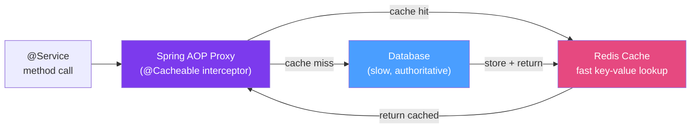

# 🔴 Spring Data Redis

> [!abstract] TL;DR
> Spring Data Redis provides `RedisTemplate` for low-level access and Spring's Cache Abstraction (`@Cacheable`, `@CachePut`, `@CacheEvict`) for declarative caching. Redis is not just a cache — it supports Pub/Sub messaging, distributed locks, rate limiting, session storage, and Sorted Sets for leaderboards. Use `StringRedisTemplate` for String keys/values; `RedisTemplate<String, Object>` with Jackson serializer for objects.

## Intuition — analogy FIRST
Redis is like a super-fast sticky notepad on your desk versus a filing cabinet (database). Looking up a user's profile in the database means walking to the filing cabinet, finding the right drawer, pulling the folder — slow. Checking the sticky note (Redis) is instant. The Cache Abstraction (`@Cacheable`) makes your application automatically check the notepad first: if the note exists, return it; if not, go to the filing cabinet and write a new note while you're at it. `@CacheEvict` is like throwing away a sticky note when the underlying data changes.

---

## How It Works



## Key Concepts / Details

### Setup and Configuration

```xml
<dependency>
    <groupId>org.springframework.boot</groupId>
    <artifactId>spring-boot-starter-data-redis</artifactId>
</dependency>
```

```yaml
# application.yml
spring:
  data:
    redis:
      host: localhost
      port: 6379
      password: secret          # if auth enabled
      timeout: 2000ms           # connection/read timeout
      lettuce:
        pool:
          max-active: 8         # max connections in pool
          max-idle: 4
          min-idle: 1
  cache:
    type: redis
    redis:
      time-to-live: 1h          # default TTL for all cache entries
      cache-null-values: false  # don't cache null results
```

```java
@Configuration
@EnableCaching
public class RedisConfig {

    @Bean
    public RedisTemplate<String, Object> redisTemplate(RedisConnectionFactory factory) {
        RedisTemplate<String, Object> template = new RedisTemplate<>();
        template.setConnectionFactory(factory);

        // Keys as strings
        template.setKeySerializer(new StringRedisSerializer());
        template.setHashKeySerializer(new StringRedisSerializer());

        // Values as JSON
        Jackson2JsonRedisSerializer<Object> jsonSerializer =
            new Jackson2JsonRedisSerializer<>(Object.class);
        ObjectMapper mapper = new ObjectMapper()
            .activateDefaultTyping(                       // store type info
                mapper.getPolymorphicTypeValidator(),
                ObjectMapper.DefaultTyping.NON_FINAL);
        jsonSerializer.setObjectMapper(mapper);
        template.setValueSerializer(jsonSerializer);
        template.setHashValueSerializer(jsonSerializer);

        return template;
    }

    // Custom TTL per cache
    @Bean
    public RedisCacheManagerBuilderCustomizer redisCacheManagerBuilderCustomizer() {
        return builder -> builder
            .withCacheConfiguration("users",
                RedisCacheConfiguration.defaultCacheConfig()
                    .entryTtl(Duration.ofMinutes(30)))
            .withCacheConfiguration("products",
                RedisCacheConfiguration.defaultCacheConfig()
                    .entryTtl(Duration.ofHours(2)));
    }
}
```

### Cache Abstraction — Declarative Caching

```java
@Service
public class UserService {

    // Cache the result; key is the method parameter by default
    @Cacheable(value = "users", key = "#id")
    public UserResponse getUserById(Long id) {
        // This executes ONLY on cache miss
        return userRepo.findById(id)
            .map(UserMapper::toResponse)
            .orElseThrow(() -> new UserNotFoundException(id));
    }

    // Custom SpEL key expression
    @Cacheable(value = "users", key = "#email.toLowerCase()")
    public Optional<UserResponse> getUserByEmail(String email) {
        return userRepo.findByEmail(email).map(UserMapper::toResponse);
    }

    // Conditional caching — only cache active users
    @Cacheable(value = "users", key = "#id", condition = "#result?.status == 'ACTIVE'")
    public UserResponse getActiveUser(Long id) { /* ... */ }

    // Always update the cache (used for write-through caching)
    @CachePut(value = "users", key = "#result.id")
    public UserResponse updateUser(Long id, UpdateUserRequest request) {
        User user = userRepo.findById(id).orElseThrow();
        user.setName(request.name());
        userRepo.save(user);
        return UserMapper.toResponse(user);
    }

    // Evict a specific entry when user is deleted
    @CacheEvict(value = "users", key = "#id")
    public void deleteUser(Long id) {
        userRepo.deleteById(id);
    }

    // Evict all entries in a cache
    @CacheEvict(value = "users", allEntries = true)
    public void invalidateAllUsers() { /* trigger rebuild */ }

    // Multiple cache operations on one method
    @Caching(
        evict = {
            @CacheEvict(value = "users", key = "#id"),
            @CacheEvict(value = "user-search", allEntries = true)
        }
    )
    public void onUserDeleted(Long id) { /* ... */ }
}
```

### RedisTemplate — Low-Level Operations

```java
@Service
public class RedisService {
    private final RedisTemplate<String, Object> redisTemplate;
    private final StringRedisTemplate stringRedisTemplate; // Strings only, faster

    // Basic string key-value
    public void setValue(String key, Object value, Duration ttl) {
        redisTemplate.opsForValue().set(key, value, ttl);
    }

    public Optional<Object> getValue(String key) {
        return Optional.ofNullable(redisTemplate.opsForValue().get(key));
    }

    // Atomic increment (counters, rate limiting)
    public Long increment(String counterKey) {
        return redisTemplate.opsForValue().increment(counterKey);
    }

    // Hash operations (store object fields as hash)
    public void saveUserHash(String userId, Map<String, String> fields) {
        redisTemplate.opsForHash().putAll("user:" + userId, fields);
        redisTemplate.expire("user:" + userId, Duration.ofHours(1));
    }

    public Map<Object, Object> getUserHash(String userId) {
        return redisTemplate.opsForHash().entries("user:" + userId);
    }

    // Sorted Set (leaderboard)
    public void addScore(String leaderboardKey, String member, double score) {
        redisTemplate.opsForZSet().add(leaderboardKey, member, score);
    }

    public Set<Object> getTopN(String leaderboardKey, int n) {
        return redisTemplate.opsForZSet()
            .reverseRange(leaderboardKey, 0, n - 1);  // highest scores first
    }

    // Pub/Sub
    public void publish(String channel, String message) {
        stringRedisTemplate.convertAndSend(channel, message);
    }

    // Distributed lock with SETNX (SET if Not eXists)
    public boolean tryLock(String lockKey, String lockValue, Duration ttl) {
        return Boolean.TRUE.equals(
            redisTemplate.opsForValue()
                .setIfAbsent(lockKey, lockValue, ttl));   // atomic SETNX with TTL
    }

    public void releaseLock(String lockKey, String lockValue) {
        // Use Lua script for atomic check-and-delete
        String luaScript = "if redis.call('get', KEYS[1]) == ARGV[1] then " +
                           "return redis.call('del', KEYS[1]) else return 0 end";
        redisTemplate.execute(
            new DefaultRedisScript<>(luaScript, Long.class),
            List.of(lockKey), lockValue);
    }
}
```

### Rate Limiting with Redis

```java
@Component
public class RateLimiter {
    private final StringRedisTemplate redis;

    public boolean isAllowed(String identifier, int maxRequests, Duration window) {
        String key = "rate:" + identifier;
        Long count = redis.opsForValue().increment(key);
        if (count == 1) redis.expire(key, window);  // set expiry on first request
        return count <= maxRequests;
    }
}
```

---

## Real-World Notes

- **Lettuce vs Jedis**: Spring Boot auto-configures Lettuce (netty-based, async, thread-safe). Jedis is synchronous and requires connection per thread. Stick with Lettuce for most cases.
- **Cache Stampede**: when a popular cache key expires, many threads simultaneously compute the same value and write it. Fix: use probabilistic early expiration or a distributed lock around the computation.
- **Serialization gotcha**: `RedisTemplate<String, Object>` with default `JdkSerializationRedisSerializer` stores binary data — unreadable in Redis CLI. Use `Jackson2JsonRedisSerializer` for human-readable JSON.
- **Session storage**: replace HTTP sessions with Redis: `spring-session-data-redis` + `@EnableRedisHttpSession`. Sessions survive app restarts and work across multiple instances.

---

## Common Pitfalls

- **Missing `@EnableCaching`**: `@Cacheable` silently does nothing without `@EnableCaching` on a `@Configuration` class. The method runs every time with no error.
- **`@CachePut` vs `@Cacheable`**: `@CachePut` always calls the method and updates the cache. `@Cacheable` skips the method on hit. Mixing them up causes stale cache or redundant DB calls.
- **Cache key collisions**: different methods with the same key expression in the same cache namespace will overwrite each other. Use distinctive key prefixes or separate cache names.
- **Caching `null`**: by default Spring caches `null` results. If a user is not found, subsequent calls return `null` from cache even after the user is created. Set `cache-null-values: false` or handle with `unless="#result == null"`.

---

## Related Concepts

- [[Caching_Strategies]] — Multi-level caching, cache-aside vs write-through patterns
- [[Spring_Boot_Auto_Configuration]] — How RedisAutoConfiguration is configured
- [[Repository_Pattern]] — Complement DB access with Redis caching layer

---

## Review Questions

1. What is the difference between `@Cacheable`, `@CachePut`, and `@CacheEvict`?
2. How does Spring's Cache Abstraction work under the hood (which Spring feature powers it)?
3. How do you implement a distributed lock using Redis?
4. Why is `Jackson2JsonRedisSerializer` preferred over `JdkSerializationRedisSerializer`?
5. What is a cache stampede and how do you prevent it?

---

## Sources

- Spring Data Redis Reference: https://docs.spring.io/spring-data/redis/docs/current/reference/html/
- Spring Cache Abstraction: https://docs.spring.io/spring-framework/docs/current/reference/html/integration.html#cache
- Redis Data Types: https://redis.io/docs/data-types/

#java #spring #spring-data #redis #cache #cacheable #cacheevict #redistemplate #distributed-lock #rate-limiting
