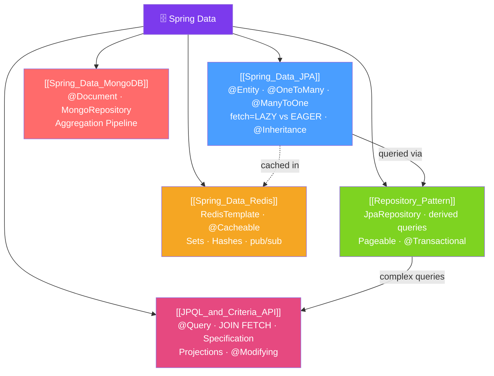

# 🗄️ Spring Data — Map of Content

> [!abstract] What This Section Covers
> Spring Data provides a consistent, abstracted data access layer across multiple persistence technologies. This section covers JPA entity mapping and Hibernate relationships, the Spring Data repository abstraction, JPQL queries and the Criteria API for dynamic queries, Spring Data Redis for caching and sessions, and Spring Data MongoDB for document storage.

## Concept Map

## Learning Path
1. [[Spring_Data_JPA]] — JPA entity mapping, relationships, inheritance, and Hibernate basics.
2. [[Repository_Pattern]] — Spring Data's magic: derived queries, pagination, sorting, custom implementations.
3. [[JPQL_and_Criteria_API]] — When derived queries aren't enough: @Query, JOIN FETCH, Specification API.
4. [[Spring_Data_Redis]] — Caching, sessions, and data structures with Spring Data Redis.
5. [[Spring_Data_MongoDB]] — Document database modeling with Spring Data MongoDB.

## All Notes at a Glance
| Note | Difficulty | What You'll Learn |
|------|------------|-------------------|
| [[Spring_Data_JPA]] | Intermediate | @Entity, relationships, lazy vs eager, inheritance strategies |
| [[Repository_Pattern]] | Beginner | JpaRepository, derived queries, Pageable, @Transactional |
| [[JPQL_and_Criteria_API]] | Advanced | @Query, JOIN FETCH (N+1 fix), Specification, projections |
| [[Spring_Data_Redis]] | Intermediate | RedisTemplate, @Cacheable, pub/sub, reactive Redis |
| [[Spring_Data_MongoDB]] | Intermediate | @Document, MongoRepository, aggregation pipeline |

## Key Questions This Section Answers
- What is the N+1 query problem and how do you fix it with JOIN FETCH?
- When should fetch type be LAZY vs EAGER?
- How do you write a dynamic query with multiple optional filters?
- What is the difference between `@Cacheable`, `@CachePut`, and `@CacheEvict`?
- How do you model relationships in MongoDB vs JPA?

## Related Sections
- [[_MOC_Java_Master|↑ Java Master MOC]]
- [[_MOC_Spring_Core|← Spring Core]] — @Transactional uses Spring AOP
- [[_MOC_Performance_Java|→ Performance]] — N+1, connection pools, HikariCP tuning
- [[_MOC_Spring_Security|→ Spring Security]] — Secure data access with method-level security

#MOC #java #spring #spring-data
