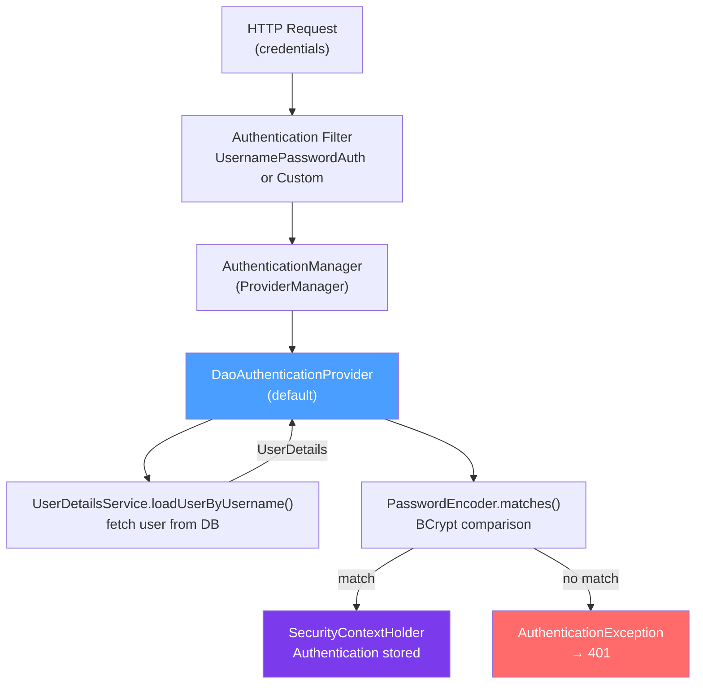

# 🔑 Authentication in Spring Security

> [!abstract] TL;DR
> Authentication = verifying who you are. Spring Security's `UserDetailsService` loads user data; `PasswordEncoder` (BCrypt recommended) hashes and verifies passwords; `AuthenticationProvider` performs the actual credential check. For stateless REST APIs, skip form login and implement a custom filter. **Never store plain text passwords** — always use `BCryptPasswordEncoder`.

## Intuition — analogy FIRST
Authentication is like a hotel check-in. The guest presents their ID and reservation confirmation (username + password). The front desk (UserDetailsService) looks up the reservation in the system. The ID verification machine (PasswordEncoder) checks the ID is genuine. If both match, the front desk hands over a room key (Authentication token stored in SecurityContext). From that point, every door the guest swipes recognizes them until checkout (session expiry or logout).

---

## How It Works



## Key Concepts / Details

### UserDetailsService — Load User from DB

```java
// Your UserDetails implementation (what Spring Security sees)
public class AppUserDetails implements UserDetails {
    private final User user;  // your domain User entity

    public AppUserDetails(User user) { this.user = user; }

    @Override
    public String getUsername() { return user.getEmail(); }  // username = email

    @Override
    public String getPassword() { return user.getPasswordHash(); }

    @Override
    public Collection<? extends GrantedAuthority> getAuthorities() {
        return user.getRoles().stream()
            .map(role -> new SimpleGrantedAuthority("ROLE_" + role.name()))
            .collect(Collectors.toList());
    }

    @Override public boolean isAccountNonExpired() { return true; }
    @Override public boolean isAccountNonLocked() { return !user.isLocked(); }
    @Override public boolean isCredentialsNonExpired() { return true; }
    @Override public boolean isEnabled() { return user.isActive(); }

    // Expose domain user for @AuthenticationPrincipal injection
    public User getUser() { return user; }
}

// UserDetailsService — fetches the UserDetails from storage
@Service
public class AppUserDetailsService implements UserDetailsService {
    private final UserRepository userRepo;

    @Override
    public UserDetails loadUserByUsername(String username) throws UsernameNotFoundException {
        return userRepo.findByEmail(username)
            .map(AppUserDetails::new)
            .orElseThrow(() -> new UsernameNotFoundException("User not found: " + username));
    }
}
```

### PasswordEncoder — Secure Password Hashing

```java
@Configuration
public class SecurityBeans {

    @Bean
    public PasswordEncoder passwordEncoder() {
        // BCrypt with cost factor 12 (higher = slower = more secure)
        // Default cost = 10; 12 gives ~300ms per hash
        return new BCryptPasswordEncoder(12);
    }
}

// In registration service
@Service
public class RegistrationService {
    private final PasswordEncoder passwordEncoder;
    private final UserRepository userRepo;

    public User register(RegistrationRequest req) {
        if (userRepo.existsByEmail(req.email())) {
            throw new EmailAlreadyExistsException(req.email());
        }
        User user = User.builder()
            .email(req.email())
            .passwordHash(passwordEncoder.encode(req.password()))  // hash, never store plain
            .role(Role.USER)
            .build();
        return userRepo.save(user);
    }
}

// Password comparison (done automatically by DaoAuthenticationProvider)
// passwordEncoder.matches(rawPassword, hashedPassword)  → true/false
```

### Form Login — Traditional Stateful Auth

```java
@Bean
public SecurityFilterChain formLoginChain(HttpSecurity http) throws Exception {
    http
        .formLogin(form -> form
            .loginPage("/login")               // custom login page (GET)
            .loginProcessingUrl("/login")      // form action (POST)
            .usernameParameter("email")        // form field names
            .passwordParameter("password")
            .defaultSuccessUrl("/dashboard", true)
            .failureUrl("/login?error=true")
            .permitAll())
        .logout(logout -> logout
            .logoutUrl("/logout")
            .logoutSuccessUrl("/login?logout=true")
            .invalidateHttpSession(true)
            .clearAuthentication(true)
            .deleteCookies("JSESSIONID"))
        .rememberMe(remember -> remember
            .tokenValiditySeconds(86400 * 14)  // 14 days
            .key("uniqueAndSecretKey"));

    return http.build();
}
```

### HTTP Basic — Simple API Authentication

```java
@Bean
public SecurityFilterChain basicAuthChain(HttpSecurity http) throws Exception {
    http
        .httpBasic(basic -> basic
            .realmName("My API")
            .authenticationEntryPoint(customEntryPoint))
        .authorizeHttpRequests(auth -> auth.anyRequest().authenticated());

    return http.build();
}
// Request: Authorization: Basic base64(username:password)
// Only secure over HTTPS — credentials sent on every request
```

### Custom AuthenticationProvider

```java
// For non-standard authentication (API key, OTP, LDAP, etc.)
@Component
public class TwoFactorAuthenticationProvider implements AuthenticationProvider {
    private final UserDetailsService userDetailsService;
    private final PasswordEncoder passwordEncoder;
    private final OtpService otpService;

    @Override
    public Authentication authenticate(Authentication auth) throws AuthenticationException {
        String username = auth.getName();
        String password = auth.getCredentials().toString();
        String otp = ((TwoFactorToken) auth).getOtp();

        UserDetails user = userDetailsService.loadUserByUsername(username);

        if (!passwordEncoder.matches(password, user.getPassword())) {
            throw new BadCredentialsException("Invalid password");
        }
        if (!otpService.validate(username, otp)) {
            throw new BadCredentialsException("Invalid OTP code");
        }

        return new UsernamePasswordAuthenticationToken(
            user, null, user.getAuthorities());
    }

    @Override
    public boolean supports(Class<?> authType) {
        return TwoFactorToken.class.isAssignableFrom(authType);
    }
}

// Register the provider
@Bean
public AuthenticationManager authManager(List<AuthenticationProvider> providers) {
    return new ProviderManager(providers);  // Spring finds @Component providers automatically
}
```

### Login REST Endpoint (Stateless)

```java
@RestController
@RequestMapping("/api/auth")
public class AuthController {
    private final AuthenticationManager authManager;
    private final JwtService jwtService;
    private final UserDetailsService userDetailsService;

    @PostMapping("/login")
    public ResponseEntity<TokenResponse> login(@Valid @RequestBody LoginRequest request) {
        // Triggers AuthenticationManager → DaoAuthenticationProvider → UserDetailsService
        Authentication auth = authManager.authenticate(
            new UsernamePasswordAuthenticationToken(request.email(), request.password()));

        UserDetails user = (UserDetails) auth.getPrincipal();
        String token = jwtService.generateToken(user);
        String refreshToken = jwtService.generateRefreshToken(user);

        return ResponseEntity.ok(new TokenResponse(token, refreshToken));
    }

    @PostMapping("/register")
    public ResponseEntity<Void> register(@Valid @RequestBody RegisterRequest request) {
        registrationService.register(request);
        return ResponseEntity.status(HttpStatus.CREATED).build();
    }
}

public record LoginRequest(
    @Email @NotBlank String email,
    @NotBlank @Size(min = 8) String password
) {}

public record TokenResponse(String accessToken, String refreshToken) {}
```

---

## Real-World Notes

- **BCrypt cost factor**: cost factor 12 takes ~300ms per hash on modern hardware — slow enough to thwart brute force, fast enough for legitimate login. Increase as hardware improves. Test with `StopWatch` at startup.
- **`UserDetails` vs `Authentication`**: `UserDetails` is what's loaded from storage. `Authentication` is what's stored in the `SecurityContext` — it wraps `UserDetails` as the principal and contains authorities.
- **Timing attacks**: `DaoAuthenticationProvider` always calls `passwordEncoder.matches()` even when the user is not found (using a dummy hash). This prevents timing-based user enumeration.
- **Multiple `UserDetailsService` beans**: if you have multiple, Spring gets confused. Use `@Primary` or configure one explicitly in `DaoAuthenticationProvider`.

---

## Common Pitfalls

- **Plain text passwords**: `userRepo.save(user.setPassword(password))` without encoding. Always encode: `passwordEncoder.encode(rawPassword)`.
- **Exposing passwords in `UserDetails`**: `getPassword()` returns the hash — it's used by Spring Security internally. Never serialize it to JSON (add `@JsonIgnore`).
- **`loadUserByUsername` throwing wrong exceptions**: must throw `UsernameNotFoundException` (which `DaoAuthenticationProvider` catches and converts to `BadCredentialsException` to prevent user enumeration). Throwing a generic `RuntimeException` bypasses this protection.
- **Missing transaction in `loadUserByUsername`**: accessing LAZY relationships (like roles) in `loadUserByUsername` without a transaction causes `LazyInitializationException`. Add `@Transactional` or use JOIN FETCH.

---

## Related Concepts

- [[Spring_Security_Architecture]] — Where authentication fits in the filter chain
- [[JWT_with_Spring]] — Stateless authentication using JWT tokens
- [[OAuth2_Spring]] — Delegating authentication to external identity providers

---

## Review Questions

1. What is the contract of `UserDetailsService.loadUserByUsername()`?
2. Why is BCrypt preferred over MD5/SHA for password hashing?
3. What is the difference between `UserDetails` and `Authentication` objects?
4. How does Spring Security prevent user enumeration attacks during authentication?
5. When would you implement a custom `AuthenticationProvider` instead of using `DaoAuthenticationProvider`?

---

## Sources

- Spring Security Reference: https://docs.spring.io/spring-security/reference/servlet/authentication/
- OWASP Password Storage Cheat Sheet: https://cheatsheetseries.owasp.org/cheatsheets/Password_Storage_Cheat_Sheet.html

#java #spring #spring-security #authentication #userdetailsservice #passwordencoder #bcrypt #form-login
