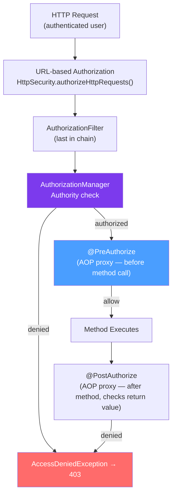

# 🛡️ Authorization in Spring Security

> [!abstract] TL;DR
> Authorization = what you're allowed to do. Spring Security has two authorization layers: **URL-based** (HttpSecurity rules in the filter chain — coarse-grained) and **method-level** (`@PreAuthorize`, `@PostAuthorize`, `@Secured` — fine-grained). `@EnableMethodSecurity` activates method security. `@PreAuthorize("hasRole('ADMIN')")` uses SpEL to evaluate roles and other conditions before the method runs. Authorities are prefixed: `ROLE_ADMIN` → `hasRole("ADMIN")`, `SCOPE_read` → `hasAuthority("SCOPE_read")`.

## Intuition — analogy FIRST
Think of authorization as two layers in a secure building. The first layer is the lobby security desk (URL-based authorization) — guards check which floor you're allowed to visit based on your badge type. The second layer is individual room locks (method-level security) — once on the right floor, specific rooms have additional lock checks. `hasRole('ADMIN')` is like a master key that opens admin rooms. `#id == authentication.name` is like a door that only opens to the person whose name is on it.

---

## How It Works



## Key Concepts / Details

### URL-Based Authorization

```java
@Bean
public SecurityFilterChain securityFilterChain(HttpSecurity http) throws Exception {
    http.authorizeHttpRequests(auth -> auth
        // Public endpoints — no auth required
        .requestMatchers("/", "/api/auth/**", "/api/products").permitAll()
        .requestMatchers(HttpMethod.GET, "/api/products/**").permitAll()

        // Role-based access
        .requestMatchers("/api/admin/**").hasRole("ADMIN")                  // needs ROLE_ADMIN
        .requestMatchers("/api/manager/**").hasAnyRole("ADMIN", "MANAGER")  // either role

        // Authority-based (more granular than roles)
        .requestMatchers("/api/reports/**").hasAuthority("REPORTS_READ")

        // HTTP method + path combination
        .requestMatchers(HttpMethod.DELETE, "/api/**").hasRole("ADMIN")
        .requestMatchers(HttpMethod.POST, "/api/**").hasAnyRole("ADMIN", "USER")

        // Catch-all — must be last
        .anyRequest().authenticated()
    );
    return http.build();
}
```

### Method Security — Fine-Grained Control

```java
// Enable method security (must add to a @Configuration class)
@EnableMethodSecurity  // activates @PreAuthorize, @PostAuthorize, @PreFilter, @PostFilter
// OR for legacy @Secured:
@EnableMethodSecurity(securedEnabled = true, jsr250Enabled = true)
public class SecurityConfig { /* ... */ }

// =================== @PreAuthorize ===================
@Service
public class OrderService {

    // Simple role check
    @PreAuthorize("hasRole('USER')")
    public List<Order> getMyOrders() { /* ... */ }

    // Only ADMIN or the order's owner can view
    @PreAuthorize("hasRole('ADMIN') or #userId == authentication.name")
    public List<Order> getOrdersByUser(String userId) { /* ... */ }

    // Check a property of the method argument
    @PreAuthorize("hasRole('ADMIN') or #order.customerId == authentication.name")
    public Order updateOrder(Long id, @P("order") UpdateOrderRequest order) { /* ... */ }

    // Custom SpEL: invoke a bean method
    @PreAuthorize("@orderPermissionService.canEdit(authentication, #orderId)")
    public void editOrder(Long orderId) { /* ... */ }

    // Compound expressions
    @PreAuthorize("isAuthenticated() and hasAnyRole('ADMIN','MANAGER') and !hasRole('SUSPENDED')")
    public ReportData generateReport() { /* ... */ }
}

// =================== @PostAuthorize ===================
// Checks after the method runs — use when you need to inspect the return value
@PostAuthorize("returnObject.customerId == authentication.name or hasRole('ADMIN')")
public Order getOrder(Long id) {
    // The method runs, then Spring checks if the caller can see the returned order
    return orderRepo.findById(id).orElseThrow();
}

// =================== @PreFilter / @PostFilter ===================
// Filter a collection of arguments or return values
@PostFilter("filterObject.customerId == authentication.name")
public List<Order> getAllOrders() {
    return orderRepo.findAll();  // Spring Security removes orders not belonging to caller
}

@PreFilter("filterObject.status != 'CANCELLED'")
public void processOrders(List<Order> orders) {
    // orders list is filtered before method executes
}
```

### @Secured — Simple Role Annotation

```java
// Simpler than @PreAuthorize but no SpEL support
@Secured("ROLE_ADMIN")
public void adminOnlyMethod() { /* ... */ }

@Secured({"ROLE_ADMIN", "ROLE_MANAGER"})
public void adminOrManagerMethod() { /* ... */ }
```

### Custom Permission Evaluator

```java
// For complex, domain-specific permissions: @PreAuthorize("hasPermission(#id, 'Order', 'EDIT')")
@Component
public class OrderPermissionEvaluator implements PermissionEvaluator {

    @Override
    public boolean hasPermission(Authentication auth, Object targetDomainObject, Object permission) {
        if (targetDomainObject instanceof Order order) {
            String action = permission.toString();
            return switch (action) {
                case "READ" -> order.getCustomerId().equals(auth.getName()) || hasRole(auth, "ADMIN");
                case "EDIT" -> order.getCustomerId().equals(auth.getName()) && order.isEditable();
                case "DELETE" -> hasRole(auth, "ADMIN");
                default -> false;
            };
        }
        return false;
    }

    @Override
    public boolean hasPermission(Authentication auth, Serializable targetId,
                                  String targetType, Object permission) {
        // When you only have the ID, load from repo and check
        if ("Order".equals(targetType)) {
            Order order = orderRepo.findById((Long) targetId).orElseThrow();
            return hasPermission(auth, order, permission);
        }
        return false;
    }

    private boolean hasRole(Authentication auth, String role) {
        return auth.getAuthorities().stream()
            .anyMatch(a -> a.getAuthority().equals("ROLE_" + role));
    }
}

// Register it
@Bean
public MethodSecurityExpressionHandler methodSecurityExpressionHandler(
        PermissionEvaluator permissionEvaluator) {
    DefaultMethodSecurityExpressionHandler handler = new DefaultMethodSecurityExpressionHandler();
    handler.setPermissionEvaluator(permissionEvaluator);
    return handler;
}

// Usage
@PreAuthorize("hasPermission(#orderId, 'Order', 'EDIT')")
public void editOrder(Long orderId, UpdateOrderRequest request) { /* ... */ }
```

### Roles vs Authorities

```java
// Roles are just authorities with "ROLE_" prefix
// hasRole("ADMIN") == hasAuthority("ROLE_ADMIN")

// Assign authorities at login
List<GrantedAuthority> authorities = List.of(
    new SimpleGrantedAuthority("ROLE_USER"),
    new SimpleGrantedAuthority("ORDER_READ"),
    new SimpleGrantedAuthority("ORDER_WRITE")
);

// URL rule with authority
.requestMatchers("/api/orders").hasAuthority("ORDER_READ")

// Method security with authority
@PreAuthorize("hasAuthority('ORDER_WRITE')")
public Order createOrder(CreateOrderRequest request) { /* ... */ }
```

---

## Real-World Notes

- **URL rules are coarse, method rules are fine**: use URL rules to protect broad endpoint groups; use `@PreAuthorize` for business logic access control (e.g., "user can only edit their own data").
- **`@PreAuthorize` vs `@PostAuthorize`**: `@PreAuthorize` is evaluated before the method — use for access control. `@PostAuthorize` is evaluated after — use when you need to check the return value (e.g., "user can only see records they own").
- **AOP proxy caveat for method security**: `@PreAuthorize` on `private` methods or methods called from the same bean (self-invocation) is silently ignored because Spring AOP proxies only intercept public external calls. Move the secured method to a separate bean.
- **Hierarchical roles**: configure `RoleHierarchy` so `ROLE_ADMIN` implies `ROLE_USER` and `ROLE_MANAGER`. Without it, `hasRole('USER')` returns `false` for an admin user.

---

## Common Pitfalls

- **`ROLE_` prefix confusion**: `hasRole("ADMIN")` checks for authority `ROLE_ADMIN`. `hasAuthority("ADMIN")` checks for authority `ADMIN` (no prefix). Mixing these up causes authorization failures.
- **Self-invocation bypasses method security**: calling `this.editOrder()` from within the same service does not go through the AOP proxy — `@PreAuthorize` is skipped. Always call secured methods from another bean.
- **Missing `@EnableMethodSecurity`**: `@PreAuthorize` silently does nothing without this annotation. Easy to miss — no error, just no security.
- **`@PostFilter` on large collections**: Spring Security iterates the returned collection and removes unauthorized elements in memory. For large result sets, implement server-side filtering in the query instead.

---

## Related Concepts

- [[Spring_Security_Architecture]] — The AuthorizationFilter in the filter chain
- [[Authentication_Spring]] — Roles/authorities come from the Authentication object
- [[Spring_AOP]] — Method security is implemented as an AOP aspect

---

## Review Questions

1. What is the difference between URL-based authorization and method-level security? When would you use each?
2. What does `@PreAuthorize("hasRole('ADMIN') or #id == authentication.name")` do?
3. What is the difference between `hasRole("ADMIN")` and `hasAuthority("ROLE_ADMIN")`?
4. Why does `@PreAuthorize` not work on private methods or self-invocations?
5. How do you implement custom permission logic for domain objects?

---

## Sources

- Spring Security Reference: https://docs.spring.io/spring-security/reference/servlet/authorization/
- Spring Security Method Security: https://docs.spring.io/spring-security/reference/servlet/authorization/method-security.html

#java #spring #spring-security #authorization #preauthorize #method-security #rbac #spel
