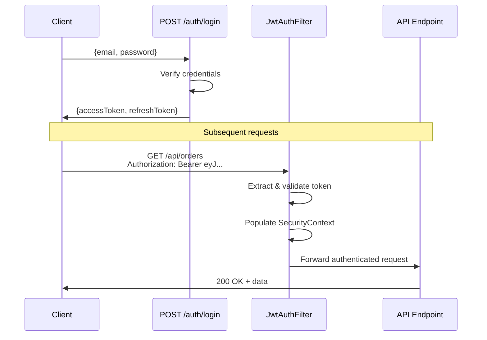

# 🎫 JWT with Spring Security

> [!abstract] TL;DR
> JWT (JSON Web Token) enables **stateless authentication**: the server issues a signed token on login; subsequent requests send `Authorization: Bearer <token>` and the server validates the signature without a database or session lookup. Implement a `OncePerRequestFilter` to extract and validate the token, then populate `SecurityContextHolder`. Use **RS256** (asymmetric) for tokens shared between services; **HS256** (symmetric) for tokens consumed by the same service only.

## Intuition — analogy FIRST
A JWT is like a tamper-proof concert wristband. When you buy a ticket (login), the ticket booth puts on a wristband that contains your name, the concert tier (roles), and a validity date — all stamped with the venue's seal (digital signature). At every door (API endpoint), the bouncer checks the wristband: is the seal genuine? Is it expired? They don't need to call the ticket booth (database) — the wristband is self-contained. If you could forge the seal, you'd break in — that's why the signing key must stay secret.

---

## How It Works



## Key Concepts / Details

### JWT Structure

```
eyJhbGciOiJIUzI1NiJ9 . eyJ1c2VybmFtZSI6ImFsaWNlIiwicm9sZXMiOlsiUk9MRV9VU0VSIl0sImV4cCI6MTc1NDA0NTEwMX0 . HMAC_SHA256_SIGNATURE
   ^-- Header (alg)       ^-- Payload (claims)                                                                       ^-- Signature
```

Header: `{"alg":"HS256","typ":"JWT"}`
Payload:
```json
{
  "sub": "user-123",          // subject (user ID)
  "email": "alice@example.com",
  "roles": ["ROLE_USER"],
  "iat": 1754041501,          // issued at (epoch seconds)
  "exp": 1754045101           // expiry (epoch seconds)
}
```

### JwtService — Generate and Validate Tokens

```java
@Service
public class JwtService {
    @Value("${app.jwt.secret}")
    private String secret;                    // min 256-bit (32-char) for HS256

    @Value("${app.jwt.expiration-ms}")
    private long expirationMs;               // e.g., 900000 (15 minutes)

    @Value("${app.jwt.refresh-expiration-ms}")
    private long refreshExpirationMs;        // e.g., 604800000 (7 days)

    private SecretKey getSigningKey() {
        return Keys.hmacShaKeyFor(secret.getBytes(StandardCharsets.UTF_8));
    }

    // Generate access token
    public String generateToken(UserDetails userDetails) {
        return generateToken(Map.of(), userDetails, expirationMs);
    }

    // Generate token with extra claims (e.g., roles, tenant)
    public String generateToken(Map<String, Object> extraClaims, UserDetails userDetails,
                                 long validityMs) {
        return Jwts.builder()
            .claims(extraClaims)
            .subject(userDetails.getUsername())
            .claim("roles", userDetails.getAuthorities().stream()
                .map(GrantedAuthority::getAuthority).toList())
            .issuedAt(new Date())
            .expiration(new Date(System.currentTimeMillis() + validityMs))
            .signWith(getSigningKey(), Jwts.SIG.HS256)
            .compact();
    }

    public String generateRefreshToken(UserDetails userDetails) {
        return generateToken(Map.of("type", "refresh"), userDetails, refreshExpirationMs);
    }

    // Parse and validate token, return Claims
    public Claims extractAllClaims(String token) {
        return Jwts.parser()
            .verifyWith(getSigningKey())
            .build()
            .parseSignedClaims(token)           // throws if expired or signature invalid
            .getPayload();
    }

    public String extractUsername(String token) {
        return extractAllClaims(token).getSubject();
    }

    public boolean isTokenValid(String token, UserDetails userDetails) {
        try {
            String username = extractUsername(token);
            return username.equals(userDetails.getUsername()) && !isTokenExpired(token);
        } catch (JwtException e) {
            return false;
        }
    }

    private boolean isTokenExpired(String token) {
        return extractAllClaims(token).getExpiration().before(new Date());
    }
}
```

### JwtAuthFilter — The Core Filter

```java
@Component
@RequiredArgsConstructor
public class JwtAuthFilter extends OncePerRequestFilter {
    private final JwtService jwtService;
    private final UserDetailsService userDetailsService;

    @Override
    protected void doFilterInternal(HttpServletRequest request,
                                     HttpServletResponse response,
                                     FilterChain filterChain) throws ServletException, IOException {

        final String authHeader = request.getHeader(HttpHeaders.AUTHORIZATION);

        // Skip if no Bearer token
        if (authHeader == null || !authHeader.startsWith("Bearer ")) {
            filterChain.doFilter(request, response);
            return;
        }

        final String jwt = authHeader.substring(7);  // strip "Bearer "

        try {
            final String username = jwtService.extractUsername(jwt);

            // Only set auth if not already set (idempotent)
            if (username != null && SecurityContextHolder.getContext().getAuthentication() == null) {
                UserDetails userDetails = userDetailsService.loadUserByUsername(username);

                if (jwtService.isTokenValid(jwt, userDetails)) {
                    UsernamePasswordAuthenticationToken authToken =
                        new UsernamePasswordAuthenticationToken(
                            userDetails, null, userDetails.getAuthorities());
                    authToken.setDetails(new WebAuthenticationDetailsSource().buildDetails(request));
                    SecurityContextHolder.getContext().setAuthentication(authToken);
                }
            }
        } catch (JwtException e) {
            // Invalid token — do NOT set authentication; the request continues unauthenticated
            // The AuthorizationFilter will then reject it with 401 if the endpoint requires auth
            log.warn("Invalid JWT token: {}", e.getMessage());
        }

        filterChain.doFilter(request, response);
    }
}
```

### Security Config for JWT

```java
@Bean
public SecurityFilterChain jwtSecurityChain(HttpSecurity http,
                                              JwtAuthFilter jwtAuthFilter) throws Exception {
    http
        .csrf(csrf -> csrf.disable())
        .sessionManagement(s -> s.sessionCreationPolicy(SessionCreationPolicy.STATELESS))
        .authorizeHttpRequests(auth -> auth
            .requestMatchers("/api/auth/**").permitAll()
            .anyRequest().authenticated())
        .addFilterBefore(jwtAuthFilter, UsernamePasswordAuthenticationFilter.class)
        .exceptionHandling(ex -> ex
            .authenticationEntryPoint((req, res, e) -> {
                res.setStatus(HttpStatus.UNAUTHORIZED.value());
                res.setContentType(MediaType.APPLICATION_JSON_VALUE);
                res.getWriter().write("{\"error\":\"Unauthorized\",\"message\":\"" + e.getMessage() + "\"}");
            }));

    return http.build();
}
```

### Token Refresh Endpoint

```java
@PostMapping("/refresh")
public ResponseEntity<TokenResponse> refreshToken(
        @RequestBody RefreshTokenRequest request) {

    String refreshToken = request.refreshToken();
    String username;

    try {
        username = jwtService.extractUsername(refreshToken);
        // Verify it's a refresh token, not an access token
        Claims claims = jwtService.extractAllClaims(refreshToken);
        if (!"refresh".equals(claims.get("type"))) {
            return ResponseEntity.status(HttpStatus.UNAUTHORIZED).build();
        }
    } catch (JwtException e) {
        return ResponseEntity.status(HttpStatus.UNAUTHORIZED).build();
    }

    UserDetails user = userDetailsService.loadUserByUsername(username);
    if (!jwtService.isTokenValid(refreshToken, user)) {
        return ResponseEntity.status(HttpStatus.UNAUTHORIZED).build();
    }

    String newAccessToken = jwtService.generateToken(user);
    return ResponseEntity.ok(new TokenResponse(newAccessToken, refreshToken));
}
```

### RS256 vs HS256

| Algorithm | Key Type | Use When |
|-----------|----------|----------|
| **HS256** | Single symmetric secret (HMAC-SHA256) | Same service issues and validates tokens |
| **RS256** | RSA keypair (sign with private, verify with public) | Different services need to verify tokens; public key shared |
| **ES256** | ECDSA keypair (smaller key, faster) | High-volume, security-sensitive systems |

```java
// RS256 — generate keypair once, store safely
KeyPair keyPair = Keys.keyPairFor(SignatureAlgorithm.RS256);
RSAPrivateKey privateKey = (RSAPrivateKey) keyPair.getPrivate();  // sign tokens
RSAPublicKey publicKey = (RSAPublicKey) keyPair.getPublic();      // verify tokens (shareable)

// Sign with private key
Jwts.builder()
    .subject(username)
    .signWith(privateKey)  // RS256 auto-detected
    .compact();

// Verify with public key (resource servers can do this without private key)
Jwts.parser()
    .verifyWith(publicKey)
    .build()
    .parseSignedClaims(token);
```

---

## Real-World Notes

- **Short-lived access tokens**: 15 minutes is the typical access token TTL. Long-lived tokens increase the window of misuse if stolen.
- **Token revocation**: JWTs are stateless — you can't invalidate a specific token before it expires. Workarounds: short TTL + refresh tokens, or maintain a token blacklist in Redis (defeats statelessness).
- **Storing tokens client-side**: in browser apps, store tokens in `httpOnly` cookies (not `localStorage`) to prevent XSS. `httpOnly` cookies are not accessible to JavaScript.
- **Never put sensitive data in JWT payload**: the payload is base64-encoded, not encrypted — anyone can decode it. `eyJ...` is not encryption. Use JWE (JSON Web Encryption) for sensitive claims.

---

## Common Pitfalls

- **Secret key too short**: HS256 requires at minimum a 256-bit (32-character) key. Short keys are cracked by brute force. Use a randomly generated key from a secrets manager.
- **Catching all exceptions**: swallowing `JwtException` without logging or returning 401 means expired/invalid tokens silently pass through unauthenticated. Let the `AuthorizationFilter` reject them.
- **Double-loading `UserDetails`**: calling `userDetailsService.loadUserByUsername()` on every request hits the database on every API call. Cache the user details or extract enough info from the JWT claims directly.
- **Missing `OncePerRequestFilter`**: filters extending `GenericFilterBean` can run multiple times in a forward chain. `OncePerRequestFilter` guarantees single execution per request.

---

## Related Concepts

- [[Spring_Security_Architecture]] — Where JwtAuthFilter plugs into the filter chain
- [[Authentication_Spring]] — JwtService replaces DaoAuthenticationProvider's credential check
- [[OAuth2_Spring]] — OAuth2 Resource Server provides built-in JWT validation

---

## Review Questions

1. What are the three parts of a JWT and what does each contain?
2. How does the `JwtAuthFilter` decide whether a request is authenticated?
3. Why can't you "revoke" a JWT token easily? What are the workarounds?
4. What is the difference between HS256 and RS256? When would you use RS256?
5. Why should JWT tokens be stored in `httpOnly` cookies rather than `localStorage`?

---

## Sources

- JJWT Library: https://github.com/jwtk/jjwt
- JWT.io (decode/debug JWTs): https://jwt.io
- RFC 7519 — JSON Web Token: https://www.rfc-editor.org/rfc/rfc7519

#java #spring #spring-security #jwt #stateless #bearer-token #hs256 #rs256 #authentication #jwtauthfilter
