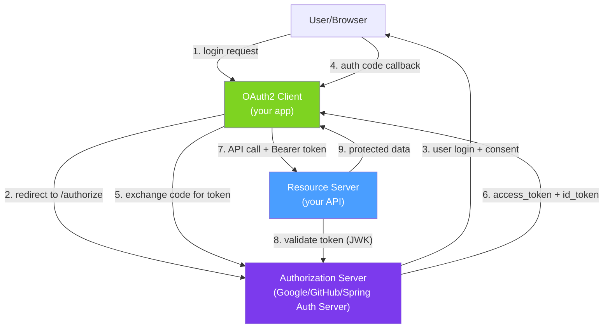

# 🌐 OAuth2 with Spring Security

> [!abstract] TL;DR
> OAuth2 has three Spring roles: **Resource Server** (validates JWT bearer tokens from an external Authorization Server), **Client** (redirects users to an OAuth2 provider for login — social login), and **Authorization Server** (issues tokens — use Spring Authorization Server). For microservices, every service is a Resource Server; one service or dedicated server is the Authorization Server. OIDC adds identity (who the user is) on top of OAuth2 (what they can access).

## Intuition — analogy FIRST
OAuth2 is like a hotel keycard system. The Authorization Server is the front desk — it issues keycards (JWT access tokens) after verifying your identity. Resource Servers are the hotel rooms — they accept keycards issued by the front desk but never issue cards themselves. OAuth2 Client is the concierge who helps you get a keycard (social login redirect). OIDC extends this by adding your name and photo to the keycard (ID token) so any staff member knows who you are without checking the guest registry.

---

## How It Works



## Key Concepts / Details

### OAuth2 Resource Server — Validate JWT

```xml
<dependency>
    <groupId>org.springframework.boot</groupId>
    <artifactId>spring-boot-starter-oauth2-resource-server</artifactId>
</dependency>
```

```yaml
# application.yml — point to Authorization Server's JWK endpoint
spring:
  security:
    oauth2:
      resourceserver:
        jwt:
          # Spring fetches public keys from this endpoint automatically
          jwk-set-uri: https://auth.example.com/.well-known/jwks.json
          # OR for OIDC discovery:
          issuer-uri: https://auth.example.com
```

```java
@Configuration
@EnableWebSecurity
public class ResourceServerConfig {

    @Bean
    public SecurityFilterChain resourceServerChain(HttpSecurity http) throws Exception {
        http
            .csrf(csrf -> csrf.disable())
            .sessionManagement(s -> s.sessionCreationPolicy(SessionCreationPolicy.STATELESS))
            .oauth2ResourceServer(oauth2 -> oauth2
                .jwt(jwt -> jwt.jwtAuthenticationConverter(jwtConverter())))
            .authorizeHttpRequests(auth -> auth
                .requestMatchers("/api/public/**").permitAll()
                .requestMatchers("/api/admin/**").hasAuthority("SCOPE_admin")
                .anyRequest().hasAuthority("SCOPE_read"));

        return http.build();
    }

    @Bean
    public JwtAuthenticationConverter jwtConverter() {
        JwtGrantedAuthoritiesConverter grantedAuthoritiesConverter =
            new JwtGrantedAuthoritiesConverter();
        grantedAuthoritiesConverter.setAuthorityPrefix("");           // remove "SCOPE_" prefix if desired
        grantedAuthoritiesConverter.setAuthoritiesClaimName("roles"); // use "roles" claim, not "scope"

        JwtAuthenticationConverter converter = new JwtAuthenticationConverter();
        converter.setJwtGrantedAuthoritiesConverter(grantedAuthoritiesConverter);
        return converter;
    }
}
```

### OAuth2 Client — Social Login

```xml
<dependency>
    <groupId>org.springframework.boot</groupId>
    <artifactId>spring-boot-starter-oauth2-client</artifactId>
</dependency>
```

```yaml
spring:
  security:
    oauth2:
      client:
        registration:
          google:
            client-id: ${GOOGLE_CLIENT_ID}
            client-secret: ${GOOGLE_CLIENT_SECRET}
            scope:
              - email
              - profile
          github:
            client-id: ${GITHUB_CLIENT_ID}
            client-secret: ${GITHUB_CLIENT_SECRET}
            scope:
              - user:email
              - read:user
        provider:
          github:
            user-name-attribute: id  # GitHub uses 'id' as the unique identifier
```

```java
@Configuration
public class OAuth2LoginConfig {

    @Bean
    public SecurityFilterChain oauth2LoginChain(HttpSecurity http) throws Exception {
        http
            .oauth2Login(oauth2 -> oauth2
                .loginPage("/login")
                .defaultSuccessUrl("/dashboard")
                .failureUrl("/login?error")
                .userInfoEndpoint(userInfo -> userInfo
                    .userService(customOAuth2UserService())))  // process OAuth2 user info
            .logout(logout -> logout
                .logoutSuccessUrl("/login?logout"));

        return http.build();
    }
}

// Process OAuth2 user info — create/update local user record
@Service
public class CustomOAuth2UserService extends DefaultOAuth2UserService {

    @Override
    public OAuth2User loadUser(OAuth2UserRequest userRequest) throws OAuth2AuthenticationException {
        OAuth2User oAuth2User = super.loadUser(userRequest);  // fetch from provider

        String provider = userRequest.getClientRegistration().getRegistrationId();  // "google","github"
        String providerId = oAuth2User.getAttribute("sub");  // OIDC subject claim
        String email = oAuth2User.getAttribute("email");
        String name = oAuth2User.getAttribute("name");

        // Find or create user in local DB
        User user = userRepo.findByProviderAndProviderId(provider, providerId)
            .orElseGet(() -> userRepo.save(User.builder()
                .email(email).name(name)
                .provider(provider).providerId(providerId)
                .role(Role.USER).build()));

        return new DefaultOAuth2User(
            List.of(new SimpleGrantedAuthority("ROLE_" + user.getRole())),
            oAuth2User.getAttributes(),
            "email");
    }
}
```

### OIDC — OpenID Connect

```java
// OIDC builds on OAuth2; adds ID token (who the user is)
// Spring Security handles OIDC automatically when scope includes 'openid'

// Extract OIDC user info in controller
@GetMapping("/profile")
public ProfileResponse getProfile(@AuthenticationPrincipal OidcUser oidcUser) {
    return ProfileResponse.builder()
        .id(oidcUser.getSubject())           // "sub" claim
        .email(oidcUser.getEmail())          // "email" claim
        .name(oidcUser.getFullName())        // "name" claim
        .picture(oidcUser.getPicture())      // "picture" claim
        .build();
}

// For standard OAuth2 (no OIDC):
@GetMapping("/profile")
public ProfileResponse getProfile(@AuthenticationPrincipal OAuth2User oauth2User) {
    return ProfileResponse.builder()
        .name(oauth2User.getAttribute("name"))
        .email(oauth2User.getAttribute("email"))
        .build();
}
```

### Spring Authorization Server — Issue Tokens

```xml
<!-- Spring Authorization Server 1.x -->
<dependency>
    <groupId>org.springframework.security</groupId>
    <artifactId>spring-security-oauth2-authorization-server</artifactId>
</dependency>
```

```java
@Configuration
public class AuthorizationServerConfig {

    @Bean
    @Order(1)  // higher priority than default security config
    public SecurityFilterChain authServerChain(HttpSecurity http) throws Exception {
        OAuth2AuthorizationServerConfiguration.applyDefaultSecurity(http);
        http.getConfigurer(OAuth2AuthorizationServerConfigurer.class)
            .oidc(Customizer.withDefaults());  // enable OIDC

        return http
            .exceptionHandling(ex -> ex
                .defaultAuthenticationEntryPointFor(
                    new LoginUrlAuthenticationEntryPoint("/login"),
                    new MediaTypeRequestMatcher(MediaType.TEXT_HTML)))
            .build();
    }

    @Bean
    public RegisteredClientRepository registeredClientRepository() {
        RegisteredClient client = RegisteredClient.withId(UUID.randomUUID().toString())
            .clientId("api-client")
            .clientSecret(passwordEncoder.encode("secret"))
            .authorizationGrantType(AuthorizationGrantType.AUTHORIZATION_CODE)
            .authorizationGrantType(AuthorizationGrantType.REFRESH_TOKEN)
            .authorizationGrantType(AuthorizationGrantType.CLIENT_CREDENTIALS)
            .redirectUri("http://localhost:3000/callback")
            .scope(OidcScopes.OPENID)
            .scope("read")
            .scope("write")
            .tokenSettings(TokenSettings.builder()
                .accessTokenTimeToLive(Duration.ofMinutes(15))
                .refreshTokenTimeToLive(Duration.ofDays(7))
                .build())
            .build();
        return new InMemoryRegisteredClientRepository(client);
    }

    @Bean
    public JWKSource<SecurityContext> jwkSource() {
        // Generate RSA key for signing tokens
        KeyPair keyPair = generateRsaKey();
        RSAKey rsaKey = new RSAKey.Builder((RSAPublicKey) keyPair.getPublic())
            .privateKey(keyPair.getPrivate())
            .keyID(UUID.randomUUID().toString())
            .build();
        return new ImmutableJWKSet<>(new JWKSet(rsaKey));
    }
}
```

### OAuth2 Grant Types

| Grant Type | Use Case | How It Works |
|-----------|----------|-------------|
| **Authorization Code** | User-facing web/mobile apps | Redirect → Auth Server → code → token exchange |
| **Authorization Code + PKCE** | SPA/mobile (public clients) | Same as above + code verifier to prevent interception |
| **Client Credentials** | Service-to-service (no user) | App authenticates directly with client_id + secret |
| **Refresh Token** | Renewing expired access tokens | Exchange refresh token for new access token |
| ~~Implicit~~ | Deprecated | Removed from OAuth2.1 |
| ~~Resource Owner Password~~ | Deprecated | Removed from OAuth2.1 |

---

## Real-World Notes

- **Microservices**: each microservice is a Resource Server validating JWTs from a central Authorization Server. Services communicate with `client_credentials` grant (no user involved).
- **Token introspection vs local validation**: local JWT validation (verify signature with JWK) is fast but can't detect revoked tokens. Token introspection calls the Auth Server on every request — accurate but adds latency. Choose based on security requirements.
- **Short-lived access tokens + refresh tokens**: 15-minute access tokens + 7-day refresh tokens is the standard pattern. On mobile, also use PKCE to prevent authorization code interception.
- **Tenant isolation (multi-tenant)**: embed `tenant_id` in the JWT claim. Resource Servers extract and use it to scope database queries and permissions.

---

## Common Pitfalls

- **Storing `client_secret` in browser**: SPA clients are "public clients" — they can't keep secrets. Always use PKCE (no client secret) for browser apps. Client secrets are only for server-side confidential clients.
- **Not validating `iss` claim**: validate the `issuer` claim in received JWTs to prevent token substitution attacks (accepting tokens from another auth server).
- **Scope vs Role confusion**: OAuth2 scopes define what the application can do on behalf of the user (`read:profile`). Roles define what the user is allowed to do. They're different concepts — don't conflate them.
- **Missing token refresh logic**: when the access token expires (15 min), the client must use the refresh token to get a new one. Not implementing refresh causes constant re-authentication.

---

## Related Concepts

- [[JWT_with_Spring]] — The token format OAuth2 uses in modern implementations
- [[Spring_Security_Architecture]] — OAuth2 Resource Server integrates as a filter
- [[Microservices_Architecture]] — Service-to-service auth with client_credentials grant

---

## Review Questions

1. What are the three Spring OAuth2 roles and what does each do?
2. What is the difference between OAuth2 and OIDC?
3. When would you use `client_credentials` grant vs `authorization_code` grant?
4. What is PKCE and why is it required for SPA/mobile OAuth2 clients?
5. How does a Resource Server validate a JWT token without contacting the Authorization Server on every request?

---

## Sources

- Spring Security OAuth2 Reference: https://docs.spring.io/spring-security/reference/servlet/oauth2/
- Spring Authorization Server: https://spring.io/projects/spring-authorization-server
- OAuth2.0 RFC: https://www.rfc-editor.org/rfc/rfc6749

#java #spring #spring-security #oauth2 #oidc #resource-server #authorization-server #social-login #jwt #pkce
