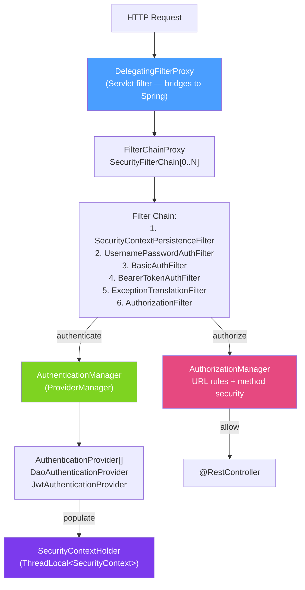

# 🏗️ Spring Security Architecture

> [!abstract] TL;DR
> Spring Security intercepts every HTTP request through a chain of `Filter` objects (`SecurityFilterChain`) registered via `DelegatingFilterProxy`. Authentication extracts credentials → `AuthenticationManager` → `AuthenticationProvider` → populates `SecurityContext`. Authorization checks permissions via `AuthorizationManager`. The `SecurityContextHolder` stores the current user — thread-local by default.

## Intuition — analogy FIRST
Think of Spring Security as a hotel's security system. Every guest (HTTP request) entering the building passes through multiple checkpoints (filter chain). The first checkpoint checks if they're wearing a badge (authentication filter — does the request have credentials?). If not, they get redirected to the front desk (login page). If yes, their badge is scanned (AuthenticationManager verifies the token), their identity is stored in a wristband (SecurityContext), and they proceed. At every door inside (authorization), a bouncer (AuthorizationManager) checks the wristband to decide if they're allowed in.

---

## How It Works



## Key Concepts / Details

### Security Configuration

```java
@Configuration
@EnableWebSecurity
@EnableMethodSecurity       // activates @PreAuthorize, @PostAuthorize, @Secured
public class SecurityConfig {

    @Bean
    public SecurityFilterChain securityFilterChain(HttpSecurity http) throws Exception {
        http
            // Disable CSRF for stateless REST APIs (JWT-based)
            .csrf(csrf -> csrf.disable())

            // Session management: STATELESS for JWT APIs
            .sessionManagement(session ->
                session.sessionCreationPolicy(SessionCreationPolicy.STATELESS))

            // Authorization rules (order matters — first match wins)
            .authorizeHttpRequests(auth -> auth
                .requestMatchers("/api/auth/**").permitAll()    // public endpoints
                .requestMatchers("/api/admin/**").hasRole("ADMIN")
                .requestMatchers(HttpMethod.GET, "/api/products/**").permitAll()
                .anyRequest().authenticated())                  // everything else requires auth

            // Add JWT filter before the standard auth filter
            .addFilterBefore(jwtAuthFilter, UsernamePasswordAuthenticationFilter.class)

            // Custom 401/403 handlers
            .exceptionHandling(ex -> ex
                .authenticationEntryPoint(customAuthEntryPoint)    // 401
                .accessDeniedHandler(customAccessDeniedHandler));  // 403

        return http.build();
    }

    @Bean
    public AuthenticationManager authenticationManager(
            AuthenticationConfiguration config) throws Exception {
        return config.getAuthenticationManager();
    }
}
```

### SecurityContextHolder — Current User

```java
// Get currently authenticated user
public static Authentication getCurrentUser() {
    return SecurityContextHolder.getContext().getAuthentication();
}

public static String getCurrentUsername() {
    Authentication auth = SecurityContextHolder.getContext().getAuthentication();
    if (auth == null || !auth.isAuthenticated()) return null;
    return auth.getName();   // principal's username
}

// In @RestController — Spring injects principal automatically
@GetMapping("/profile")
public ProfileResponse getProfile(@AuthenticationPrincipal UserDetails user) {
    return profileService.getProfile(user.getUsername());
}

// With custom UserDetails implementation
@GetMapping("/profile")
public ProfileResponse getProfile(@AuthenticationPrincipal AppUser user) {
    return profileService.getProfile(user.getId());  // AppUser extends UserDetails
}

// Manual injection from SecurityContext
@GetMapping("/my-orders")
public List<Order> getMyOrders() {
    String userId = ((AppUser) SecurityContextHolder.getContext()
        .getAuthentication().getPrincipal()).getId();
    return orderService.findByUserId(userId);
}
```

### AuthenticationManager and Providers

```java
// AuthenticationManager — orchestrates providers
// ProviderManager (default impl) delegates to a list of AuthenticationProvider

// DaoAuthenticationProvider — loads users from UserDetailsService
@Bean
public DaoAuthenticationProvider daoAuthProvider(
        UserDetailsService uds, PasswordEncoder pe) {
    DaoAuthenticationProvider provider = new DaoAuthenticationProvider();
    provider.setUserDetailsService(uds);
    provider.setPasswordEncoder(pe);
    return provider;
}

// Custom AuthenticationProvider — e.g., LDAP, API key, hardware token
@Component
public class ApiKeyAuthenticationProvider implements AuthenticationProvider {

    @Override
    public Authentication authenticate(Authentication authentication) throws AuthenticationException {
        String apiKey = authentication.getCredentials().toString();
        User user = apiKeyRepo.findByKey(apiKey)
            .orElseThrow(() -> new BadCredentialsException("Invalid API key"));
        return new UsernamePasswordAuthenticationToken(
            user, null, user.getAuthorities());
    }

    @Override
    public boolean supports(Class<?> authType) {
        return ApiKeyAuthenticationToken.class.isAssignableFrom(authType);
    }
}
```

### Key Filters in the Chain

| Filter | Purpose |
|--------|---------|
| `SecurityContextPersistenceFilter` | Restores `SecurityContext` from session (stateful) |
| `UsernamePasswordAuthenticationFilter` | Processes form login (`POST /login`) |
| `BasicAuthenticationFilter` | Processes `Authorization: Basic base64(user:pass)` |
| `BearerTokenAuthenticationFilter` | Processes `Authorization: Bearer token` (OAuth2 RS) |
| `ExceptionTranslationFilter` | Converts `AuthenticationException` → 401, `AccessDeniedException` → 403 |
| `AuthorizationFilter` | Enforces URL-level access rules (replaces old `FilterSecurityInterceptor`) |

### ExceptionTranslationFilter — 401 vs 403

```java
// 401 Unauthorized — not authenticated (no valid credentials)
// → ExceptionTranslationFilter catches AuthenticationException
// → Calls AuthenticationEntryPoint.commence()
@Component
public class CustomAuthEntryPoint implements AuthenticationEntryPoint {
    @Override
    public void commence(HttpServletRequest req, HttpServletResponse res,
            AuthenticationException ex) throws IOException {
        res.setStatus(HttpServletResponse.SC_UNAUTHORIZED);
        res.setContentType("application/json");
        res.getWriter().write("{\"error\": \"Authentication required\"}");
    }
}

// 403 Forbidden — authenticated but insufficient permissions
// → ExceptionTranslationFilter catches AccessDeniedException
// → Calls AccessDeniedHandler.handle()
@Component
public class CustomAccessDeniedHandler implements AccessDeniedHandler {
    @Override
    public void handle(HttpServletRequest req, HttpServletResponse res,
            AccessDeniedException ex) throws IOException {
        res.setStatus(HttpServletResponse.SC_FORBIDDEN);
        res.setContentType("application/json");
        res.getWriter().write("{\"error\": \"Access denied\"}");
    }
}
```

---

## Real-World Notes

- **Filter chain order is important**: `addFilterBefore(jwtFilter, UsernamePasswordAuthenticationFilter.class)` ensures the JWT filter authenticates the user before the default auth filter runs. Order mistakes cause 401s even with valid tokens.
- **`SecurityContextHolder` strategy**: defaults to `MODE_THREADLOCAL` — each request thread has its own SecurityContext. For reactive applications (WebFlux), use `ReactiveSecurityContextHolder`.
- **Multiple `SecurityFilterChain` beans**: you can have multiple security configurations with different `requestMatcher` criteria — e.g., one for API endpoints (stateless JWT) and one for admin panel (form login with sessions).
- **CSRF and stateless APIs**: CSRF attacks require browser cookie-based sessions. JWT APIs (where credentials are in `Authorization` header) are not vulnerable to CSRF. Always disable CSRF for REST APIs that don't use session cookies.

---

## Common Pitfalls

- **Missing `@EnableWebSecurity`**: Spring Boot auto-configures security, but custom `SecurityFilterChain` beans need `@EnableWebSecurity` or they may not take effect.
- **URL matcher order**: `anyRequest().authenticated()` must be last. If placed first, it matches everything and subsequent rules are ignored.
- **`@ControllerAdvice` for security exceptions**: Spring Security exceptions (`AuthenticationException`, `AccessDeniedException`) are thrown in filters, BEFORE reaching controllers — `@RestControllerAdvice` doesn't catch them. Use `AuthenticationEntryPoint` and `AccessDeniedHandler`.
- **Circular dependency with `UserDetailsService`**: injecting `AuthenticationManager` into the same class that defines `UserDetailsService` causes circular dependencies. Separate them or use `@Lazy` injection.

---

## Related Concepts

- [[Authentication_Spring]] — Who handles credential verification inside this architecture
- [[Authorization_Spring]] — How URL rules and method security enforce access control
- [[Spring_AOP]] — Method security (@PreAuthorize) works via AOP proxies

---

## Review Questions

1. What is the role of `DelegatingFilterProxy` in Spring Security?
2. How does the `SecurityContextHolder` store the current user's authentication?
3. What is the difference between `AuthenticationException` (401) and `AccessDeniedException` (403)?
4. Why is CSRF protection not needed for stateless JWT REST APIs?
5. How do you add multiple `SecurityFilterChain` beans for different security configurations?

---

## Sources

- Spring Security Reference Documentation: https://docs.spring.io/spring-security/reference/
- Spring Security Architecture Guide: https://spring.io/guides/topicals/spring-security-architecture

#java #spring #spring-security #filter-chain #securitycontext #authenticationmanager #architecture
