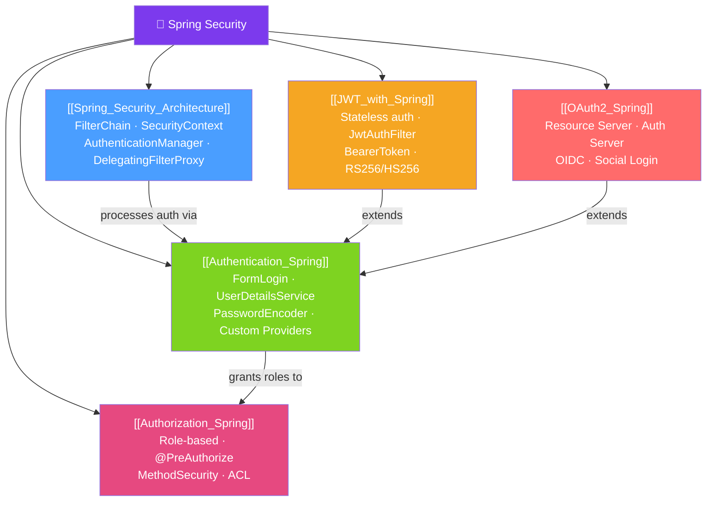

# 🔐 Spring Security — Map of Content

> [!abstract] What This Section Covers
> Spring Security is the de-facto standard for securing Java applications. This section covers the filter chain architecture that underpins all security processing, authentication mechanisms (form login, HTTP Basic, custom providers), authorization (role-based and method-level), stateless JWT-based authentication, and OAuth2/OIDC for federated identity.

## Concept Map

## Learning Path
1. [[Spring_Security_Architecture]] — Understand the filter chain, SecurityContext, and how all pieces fit together. Essential foundation.
2. [[Authentication_Spring]] — Configure authentication: who can log in and how their identity is verified.
3. [[Authorization_Spring]] — Configure what authenticated users can access: URL patterns and method-level security.
4. [[JWT_with_Spring]] — Stateless REST API authentication: issue and validate JWT tokens without server sessions.
5. [[OAuth2_Spring]] — Delegate authentication to external providers (Google, GitHub) or build your own Auth Server.

## All Notes at a Glance
| Note | Difficulty | What You'll Learn |
|------|------------|-------------------|
| [[Spring_Security_Architecture]] | Intermediate | Filter chain, SecurityContext, AuthenticationManager, AccessDecisionManager |
| [[Authentication_Spring]] | Intermediate | UserDetailsService, PasswordEncoder, custom AuthenticationProvider |
| [[Authorization_Spring]] | Intermediate | HttpSecurity URL rules, @PreAuthorize, @Secured, method security |
| [[JWT_with_Spring]] | Advanced | Stateless JWT filter, token validation, RS256 vs HS256 |
| [[OAuth2_Spring]] | Advanced | Resource Server config, OAuth2 Login (social), Authorization Server |

## Key Questions This Section Answers
- How does Spring Security's filter chain intercept every HTTP request?
- What is the difference between Authentication and Authorization?
- How do you implement stateless JWT authentication for a REST API?
- How do you secure individual methods with `@PreAuthorize`?
- What is the difference between OAuth2 Resource Server and Authorization Server?

## Related Sections
- [[_MOC_Java_Master|↑ Java Master MOC]]
- [[_MOC_Spring_MVC_REST|← Spring MVC REST]] — Exception handling for 401/403 responses
- [[_MOC_Microservices_Java|→ Microservices]] — API Gateway security, service-to-service auth
- [[_MOC_Spring_Data|← Spring Data]] — Method-level security on repository operations

#MOC #java #spring #spring-security
