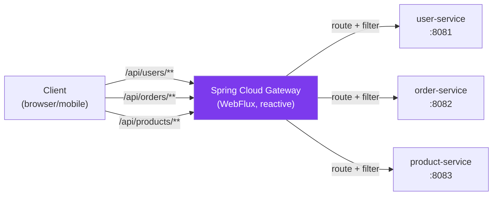

# 🚦 API Gateway with Spring Cloud Gateway

> [!abstract] TL;DR
> Spring Cloud Gateway (SCG) is a reactive API gateway built on Spring WebFlux and Project Reactor. It routes incoming requests to downstream services using **Route Predicates** (match criteria) and **Filters** (transform requests/responses). Key features: JWT authentication, rate limiting (Redis-backed), circuit breaking, request/response transformation, and CORS. SCG replaces the deprecated Netflix Zuul.

## Intuition — analogy FIRST
An API Gateway is like an airport terminal. All passengers (requests) enter through one gate regardless of their final destination. The terminal checks IDs (authentication), stamps boarding passes (JWT validation), checks luggage (request validation), and routes passengers to the right gate (downstream service). Security (auth), customs (rate limiting), and flight routing (path matching) all happen in one place — passengers never see the internal airport operations.

---

## How It Works



## Key Concepts / Details

### Setup

```xml
<!-- Spring Cloud Gateway (reactive — do NOT mix with spring-boot-starter-web!) -->
<dependency>
    <groupId>org.springframework.cloud</groupId>
    <artifactId>spring-cloud-starter-gateway</artifactId>
</dependency>
<!-- For Eureka integration: -->
<dependency>
    <groupId>org.springframework.cloud</groupId>
    <artifactId>spring-cloud-starter-netflix-eureka-client</artifactId>
</dependency>
```

### Route Configuration — YAML

```yaml
spring:
  cloud:
    gateway:
      # Default filters applied to ALL routes
      default-filters:
        - AddResponseHeader=X-Gateway, Spring-Cloud-Gateway
        - DedupeResponseHeader=Access-Control-Allow-Credentials Access-Control-Allow-Origin

      routes:
        # Route 1: User Service
        - id: user-service-route
          uri: lb://user-service         # lb:// = load balanced via Eureka
          predicates:
            - Path=/api/users/**         # match path prefix
            - Method=GET,POST,PUT,DELETE
          filters:
            - StripPrefix=1              # strip /api prefix before forwarding

        # Route 2: Order Service — with auth filter
        - id: order-service-route
          uri: lb://order-service
          predicates:
            - Path=/api/orders/**
            - Header=X-API-Key, \w+     # requires X-API-Key header (regex match)
          filters:
            - AuthFilter                 # custom filter (must be registered as @Bean)
            - RewritePath=/api/(?<segment>.*), /${segment}  # regex rewrite

        # Route 3: Static URL (no Eureka)
        - id: external-payment
          uri: https://payment-provider.com
          predicates:
            - Path=/api/payments/**
          filters:
            - RequestRateLimiter(redis-rate-limiter.replenishRate=10, redis-rate-limiter.burstCapacity=20)

      # Automatic routing via Eureka service names
      discovery:
        locator:
          enabled: true         # /USER-SERVICE/** → user-service automatically
          lower-case-service-id: true  # /user-service/** (lowercase)
```

### Route Configuration — Java API

```java
@Configuration
public class GatewayConfig {

    @Bean
    public RouteLocator customRoutes(RouteLocatorBuilder builder,
                                      AuthFilter authFilter) {
        return builder.routes()
            // Route with multiple predicates and filters
            .route("user-route", r -> r
                .path("/api/users/**")
                .and().method("GET", "POST")
                .filters(f -> f
                    .filter(authFilter.apply(new AuthFilter.Config()))
                    .addRequestHeader("X-Gateway-Service", "user")
                    .circuitBreaker(cb -> cb
                        .setName("user-cb")
                        .setFallbackUri("forward:/fallback/user"))
                    .retry(retry -> retry
                        .setRetries(3)
                        .setStatuses(HttpStatus.SERVICE_UNAVAILABLE)))
                .uri("lb://user-service"))

            // Public route — no auth
            .route("public-products", r -> r
                .path("/api/products")
                .and().method("GET")
                .uri("lb://product-service"))
            .build();
    }

    // Fallback controller
    @RestController
    public static class FallbackController {
        @GetMapping("/fallback/user")
        public ResponseEntity<Map<String, String>> userFallback() {
            return ResponseEntity.status(HttpStatus.SERVICE_UNAVAILABLE)
                .body(Map.of("error", "User service is temporarily unavailable"));
        }
    }
}
```

### Custom Gateway Filter — JWT Authentication

```java
@Component
public class AuthFilter extends AbstractGatewayFilterFactory<AuthFilter.Config> {
    private final JwtService jwtService;

    public AuthFilter(JwtService jwtService) {
        super(Config.class);
        this.jwtService = jwtService;
    }

    @Override
    public GatewayFilter apply(Config config) {
        return (exchange, chain) -> {
            ServerHttpRequest request = exchange.getRequest();

            // Check for Authorization header
            String authHeader = request.getHeaders().getFirst(HttpHeaders.AUTHORIZATION);
            if (authHeader == null || !authHeader.startsWith("Bearer ")) {
                exchange.getResponse().setStatusCode(HttpStatus.UNAUTHORIZED);
                return exchange.getResponse().setComplete();
            }

            String token = authHeader.substring(7);
            try {
                Claims claims = jwtService.validateAndExtractClaims(token);

                // Forward user info to downstream service as headers
                ServerHttpRequest modifiedRequest = request.mutate()
                    .header("X-User-Id", claims.getSubject())
                    .header("X-User-Roles", String.join(",", (List<String>) claims.get("roles")))
                    .build();
                return chain.filter(exchange.mutate().request(modifiedRequest).build());

            } catch (JwtException e) {
                exchange.getResponse().setStatusCode(HttpStatus.UNAUTHORIZED);
                return exchange.getResponse().setComplete();
            }
        };
    }

    public static class Config { /* filter config fields */ }
}
```

### Rate Limiting with Redis

```xml
<dependency>
    <groupId>org.springframework.boot</groupId>
    <artifactId>spring-boot-starter-data-redis-reactive</artifactId>
</dependency>
```

```java
@Configuration
public class RateLimiterConfig {

    // Key resolver: rate limit per user (extracted from JWT)
    @Bean
    public KeyResolver userKeyResolver() {
        return exchange -> Mono.justOrEmpty(exchange.getRequest()
            .getHeaders().getFirst("X-User-Id"))
            .defaultIfEmpty("anonymous");
    }

    // Redis rate limiter configuration
    @Bean
    public RedisRateLimiter redisRateLimiter() {
        return new RedisRateLimiter(
            10,   // replenishRate: tokens added per second
            20,   // burstCapacity: max tokens bucket can hold
            1     // requestedTokens: tokens consumed per request
        );
    }
}
```

```yaml
spring:
  cloud:
    gateway:
      routes:
        - id: limited-route
          uri: lb://api-service
          predicates:
            - Path=/api/**
          filters:
            - name: RequestRateLimiter
              args:
                redis-rate-limiter.replenishRate: 10   # 10 req/sec
                redis-rate-limiter.burstCapacity: 20   # allow burst of 20
                key-resolver: "#{@userKeyResolver}"    # SpEL ref to bean
```

### CORS Configuration

```java
@Configuration
public class CorsConfig {

    @Bean
    public CorsWebFilter corsWebFilter() {
        CorsConfiguration corsConfig = new CorsConfiguration();
        corsConfig.setAllowedOrigins(List.of("https://app.example.com", "http://localhost:3000"));
        corsConfig.setAllowedMethods(List.of("GET", "POST", "PUT", "DELETE", "OPTIONS"));
        corsConfig.setAllowedHeaders(List.of("Authorization", "Content-Type", "X-Request-ID"));
        corsConfig.setAllowCredentials(true);
        corsConfig.setMaxAge(3600L);

        UrlBasedCorsConfigurationSource source = new UrlBasedCorsConfigurationSource();
        source.registerCorsConfiguration("/**", corsConfig);
        return new CorsWebFilter(source);
    }
}
```

### Built-in Filters Reference

| Filter | Purpose |
|--------|---------|
| `AddRequestHeader=K, V` | Add header to downstream request |
| `AddResponseHeader=K, V` | Add header to response |
| `StripPrefix=1` | Remove first path segment |
| `RewritePath=/old, /new` | Regex URL rewrite |
| `RequestRateLimiter` | Redis token bucket rate limiting |
| `CircuitBreaker` | Circuit breaker with fallback URI |
| `Retry` | Retry on specified status codes |
| `SetStatus=403` | Override response status |
| `RequestSize=5MB` | Reject oversized requests |
| `SecureHeaders` | Add security headers (HSTS, X-Frame-Options) |
| `SaveSession` | Persist WebSession before forwarding |

---

## Real-World Notes

- **Gateway is NOT for business logic**: the gateway handles cross-cutting concerns (auth, routing, rate limiting). Business logic belongs in downstream services.
- **Reactive note**: SCG is built on WebFlux — never use blocking calls in filters. Use `Mono`/`Flux` or `exchange.getResponse().writeWith()`.
- **Load balancer integration**: `lb://service-name` requires Eureka on the classpath. For static URLs, use `http://` or `https://`.
- **Security at the gateway**: validate JWT at the gateway and forward user identity as headers. Downstream services trust these headers (within the private network). Add network policies so only the gateway can reach downstream services directly.

---

## Common Pitfalls

- **Mixing WebMVC and WebFlux**: SCG requires WebFlux. Adding `spring-boot-starter-web` alongside `spring-cloud-starter-gateway` causes a conflict. Use only WebFlux.
- **Filter order**: filters run in order; authentication should run before rate limiting. Use `@Order` or define filter order in route config.
- **Missing Redis for rate limiter**: `RequestRateLimiter` requires Redis. Starting without Redis throws an error. Use `spring-boot-starter-data-redis-reactive` (reactive Redis for WebFlux).
- **Forwarded headers**: when behind a proxy, ensure `X-Forwarded-*` headers are set correctly. Use `ForwardedHeadersFilter` to apply them to the request context.

---

## Related Concepts

- [[Service_Discovery_Eureka]] — `lb://` URIs resolve via Eureka
- [[JWT_with_Spring]] — JWT validation in the gateway auth filter
- [[Circuit_Breaker_Resilience4j]] — CircuitBreaker filter integrates Resilience4j

---

## Review Questions

1. What is the difference between a Route Predicate and a Gateway Filter?
2. How does `lb://user-service` know which instance to route to?
3. How does the token bucket algorithm work for rate limiting?
4. Why can't you use blocking code in a Spring Cloud Gateway filter?
5. How do you pass authenticated user identity from the gateway to downstream services?

---

## Sources

- Spring Cloud Gateway Reference: https://docs.spring.io/spring-cloud-gateway/docs/current/reference/html/
- Spring Cloud Gateway GitHub: https://github.com/spring-cloud/spring-cloud-gateway

#java #spring #microservices #api-gateway #spring-cloud-gateway #rate-limiting #routing #filters
