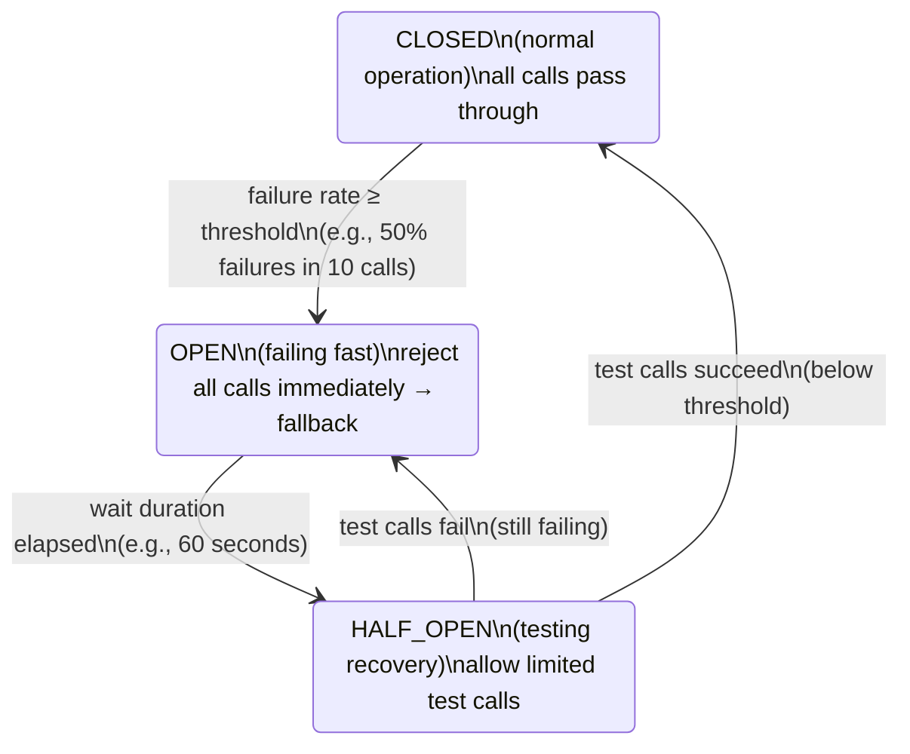

# ⚡ Circuit Breaker with Resilience4j

> [!abstract] TL;DR
> Resilience4j implements fault tolerance patterns: **Circuit Breaker** (stop calling a failing service), **Retry** (re-attempt transient failures), **Bulkhead** (limit concurrent calls), **Rate Limiter** (throttle request rate), and **Time Limiter** (timeout). These patterns prevent **cascade failures** where one slow service brings down the entire system. Use `@CircuitBreaker`, `@Retry`, `@Bulkhead` annotations with Spring Boot integration.

## Intuition — analogy FIRST
A circuit breaker works exactly like the electrical circuit breakers in your house. When too many appliances overload the circuit (too many failures), the breaker trips (opens) to prevent a house fire (cascade failure). For a while, no electricity flows (failing fast). Periodically, the breaker tries again (half-open state). If the overload is gone, it fully closes and normal operation resumes. Without circuit breakers, one overloaded service is like one outlet sparking — it eventually burns down every connected service.

---

## How It Works



## Key Concepts / Details

### Setup

```xml
<dependency>
    <groupId>org.springframework.cloud</groupId>
    <artifactId>spring-cloud-starter-circuitbreaker-resilience4j</artifactId>
</dependency>
<!-- For monitoring: -->
<dependency>
    <groupId>io.github.resilience4j</groupId>
    <artifactId>resilience4j-micrometer</artifactId>
</dependency>
```

### Circuit Breaker

```yaml
# application.yml
resilience4j:
  circuitbreaker:
    instances:
      user-service-cb:
        sliding-window-type: COUNT_BASED          # or TIME_BASED
        sliding-window-size: 10                   # last 10 calls (COUNT_BASED)
        minimum-number-of-calls: 5               # min calls before calculating failure rate
        failure-rate-threshold: 50               # % failures to trip breaker
        slow-call-rate-threshold: 80             # % slow calls to trip breaker
        slow-call-duration-threshold: 3s         # calls slower than this = slow
        wait-duration-in-open-state: 60s         # time in OPEN before trying HALF_OPEN
        permitted-number-of-calls-in-half-open-state: 3  # test calls in HALF_OPEN
        record-exceptions:                       # which exceptions trigger failure count
          - java.io.IOException
          - feign.FeignException$ServiceUnavailable
        ignore-exceptions:                       # these don't count as failures
          - com.example.BusinessException
```

```java
@Service
public class OrderService {
    private final UserServiceClient userClient;

    // Annotation-based circuit breaker
    @CircuitBreaker(name = "user-service-cb", fallbackMethod = "getUserFallback")
    public UserResponse getUser(String userId) {
        return userClient.getUser(userId);  // may fail
    }

    // Fallback method — same return type, extra Throwable param
    private UserResponse getUserFallback(String userId, Throwable ex) {
        log.warn("user-service circuit open for user {}: {}", userId, ex.getMessage());
        return UserResponse.unknown(userId);  // graceful degradation
    }

    // Programmatic usage
    private final CircuitBreakerRegistry cbRegistry;

    public UserResponse getUserProgrammatic(String userId) {
        CircuitBreaker cb = cbRegistry.circuitBreaker("user-service-cb");
        return cb.executeSupplier(() -> userClient.getUser(userId));
    }

    // Check state
    public CircuitBreaker.State getCircuitState() {
        return cbRegistry.circuitBreaker("user-service-cb").getState();
    }
}
```

### Retry

```yaml
resilience4j:
  retry:
    instances:
      user-service-retry:
        max-attempts: 3                      # total attempts (1 original + 2 retries)
        wait-duration: 500ms                 # wait between retries
        enable-exponential-backoff: true     # 500ms, 1000ms, 2000ms...
        exponential-backoff-multiplier: 2.0
        retry-exceptions:                    # only retry these
          - java.net.ConnectException
          - feign.FeignException$ServiceUnavailable
        ignore-exceptions:                   # never retry these
          - com.example.BusinessException
          - feign.FeignException$NotFound
```

```java
@Retry(name = "user-service-retry", fallbackMethod = "getUserFallback")
@CircuitBreaker(name = "user-service-cb", fallbackMethod = "getUserFallback")
public UserResponse getUser(String userId) {
    // Retry wraps circuit breaker — retry first, then trip CB if still failing
    return userClient.getUser(userId);
}
```

### Bulkhead — Limit Concurrency

```yaml
resilience4j:
  bulkhead:
    instances:
      user-service-bulk:
        max-concurrent-calls: 10       # max 10 concurrent calls to user-service
        max-wait-duration: 100ms       # wait for a slot before rejecting

  thread-pool-bulkhead:                # thread-pool based (async)
    instances:
      user-service-pool:
        max-thread-pool-size: 10
        core-thread-pool-size: 5
        queue-capacity: 100
```

```java
// Semaphore bulkhead (sync)
@Bulkhead(name = "user-service-bulk", fallbackMethod = "getUserFallback")
public UserResponse getUser(String userId) {
    return userClient.getUser(userId);
}

// Thread-pool bulkhead (async — returns CompletableFuture)
@Bulkhead(name = "user-service-pool",
          type = Bulkhead.Type.THREADPOOL,
          fallbackMethod = "getUserFallbackAsync")
public CompletableFuture<UserResponse> getUserAsync(String userId) {
    return CompletableFuture.supplyAsync(() -> userClient.getUser(userId));
}

private CompletableFuture<UserResponse> getUserFallbackAsync(String userId, Throwable ex) {
    return CompletableFuture.completedFuture(UserResponse.unknown(userId));
}
```

### Time Limiter + Rate Limiter

```yaml
resilience4j:
  timelimiter:
    instances:
      user-service-timeout:
        timeout-duration: 3s            # timeout after 3 seconds
        cancel-running-future: true     # cancel the Future on timeout

  ratelimiter:
    instances:
      user-service-rl:
        limit-for-period: 100           # 100 calls per refresh period
        limit-refresh-period: 1s        # refresh every 1 second
        timeout-duration: 100ms         # wait up to 100ms for a permit
```

### Combining All Patterns — Correct Order

```java
// Order matters! From outer to inner: CB → Bulkhead → TimeLimiter → Retry
@CircuitBreaker(name = "user-cb", fallbackMethod = "fallback")
@Bulkhead(name = "user-bulk")
@TimeLimiter(name = "user-tl")
@Retry(name = "user-retry")
public CompletableFuture<UserResponse> getUser(String userId) {
    return CompletableFuture.supplyAsync(() -> userClient.getUser(userId));
}
```

Execution order (annotations apply inside-out, but Spring evaluates outside-in based on AOP aspect ordering):

```
Request → [CircuitBreaker] → [Bulkhead] → [TimeLimiter] → [Retry] → actual call
```

### Monitoring with Actuator + Micrometer

```yaml
management:
  health:
    circuitbreakers:
      enabled: true    # /actuator/health shows CB states
  endpoints:
    web:
      exposure:
        include: health,metrics,circuitbreakers

# Exposes metrics:
# resilience4j.circuitbreaker.calls{name,kind}  — total calls, failure rate
# resilience4j.circuitbreaker.state{name}       — state (0=closed,1=open,2=half-open)
# resilience4j.retry.calls{name,kind}           — total retries
```

```java
// Listen to state transitions (for alerting)
@Component
public class CircuitBreakerEventListener {

    @EventListener
    public void onCircuitBreakerEvent(CircuitBreakerOnStateTransitionEvent event) {
        log.warn("Circuit Breaker '{}' state changed: {} → {}",
            event.getCircuitBreakerName(),
            event.getStateTransition().getFromState(),
            event.getStateTransition().getToState());
        // Send alert to PagerDuty, Slack, etc.
    }
}
```

### Resilience4j vs Hystrix

| Feature | Hystrix (deprecated) | Resilience4j |
|---------|---------------------|--------------|
| **Status** | Maintenance only | Active |
| **Concurrency** | Thread-based | Semaphore + Thread-pool |
| **Annotations** | `@HystrixCommand` | `@CircuitBreaker` etc. |
| **Configuration** | Archaius/properties | Standard application.yml |
| **Monitoring** | Hystrix Dashboard | Micrometer/Prometheus |
| **Dependencies** | Heavy (Netflix stack) | Lightweight, no deps |

---

## Real-World Notes

- **Retry + Circuit Breaker interaction**: retry and circuit breaker should be combined. Retry handles transient failures (connection glitch). If failures persist, the circuit breaker trips to fast-fail without wasting retry attempts.
- **Fallback strategy**: distinguish between degraded service (return cached/default data) and complete failure (propagate error). Don't silently return wrong data — returning `null` or stale data can cause subtle bugs.
- **Bulkhead prevents thread pool exhaustion**: without bulkhead, a slow downstream service occupies all available threads, starving other requests. Bulkhead limits threads dedicated to each downstream service.
- **Setting thresholds**: start with a large sliding window and high failure threshold. Monitor in production for weeks before tightening. Wrong thresholds cause false positives (trips when service is actually healthy).

---

## Common Pitfalls

- **Fallback method signature mismatch**: the fallback method must have the same return type and all original parameters plus a `Throwable`. Mismatch causes `NoSuchMethodException` at runtime.
- **Self-invocation bypasses resilience**: calling a `@CircuitBreaker` method from within the same class bypasses the AOP proxy. Move the call to a different bean.
- **Retrying non-idempotent operations**: retrying a `POST` that creates a resource may create duplicates. Only retry idempotent operations (`GET`, `PUT`, `DELETE`) or implement idempotency keys.
- **Circuit breaker on every call**: not every service call needs a circuit breaker. Apply to critical dependencies. Overuse makes the system hard to reason about.

---

## Related Concepts

- [[Microservices_Architecture]] — Cascade failure is a core microservices concern
- [[Spring_Cloud_Overview]] — Resilience4j fits into the Spring Cloud ecosystem
- [[CompletableFuture]] — Resilience4j async operations return CompletableFuture

---

## Review Questions

1. What are the three states of a circuit breaker and what triggers transitions between them?
2. What is the difference between a Bulkhead (semaphore) and a Thread-Pool Bulkhead?
3. How does Retry interact with Circuit Breaker when combined?
4. Why should you NOT retry non-idempotent operations without idempotency keys?
5. What metrics does Resilience4j expose and how do you monitor circuit breaker state?

---

## Sources

- Resilience4j Documentation: https://resilience4j.readme.io/
- Spring Cloud Circuit Breaker Reference: https://docs.spring.io/spring-cloud-circuitbreaker/docs/current/reference/html/
- Netflix Tech Blog: Circuit Breaker Pattern

#java #spring #microservices #resilience4j #circuit-breaker #retry #bulkhead #rate-limiter #fault-tolerance
