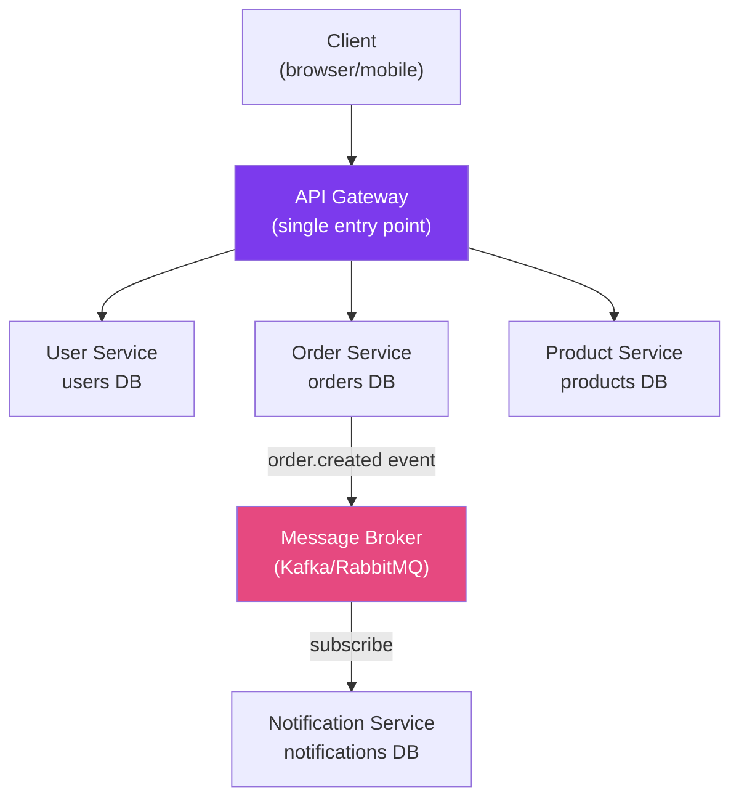

# ☁️ Microservices Architecture

> [!abstract] TL;DR
> Microservices decompose a monolith into **small, independently deployable services** each owning its data. Decompose by **DDD Bounded Contexts** (not by technical layers). Services communicate synchronously (REST/gRPC) or asynchronously (events/messaging). Each pattern involves trade-offs: distributed systems are inherently harder than monoliths — choose microservices only when scale or team independence justifies the complexity.

## Intuition — analogy FIRST
A monolith is like a Swiss Army knife — everything is connected in one tool. A microservices system is like a kitchen: a separate chef (service) for each dish — pastry chef, sous chef, grill chef. Each chef is an expert in their domain (bounded context), has their own ingredients (database per service), and communicates via orders (API calls or events). A busy kitchen is more productive than one cook doing everything — but coordinating multiple chefs is harder than working alone.

---

## How It Works



## Key Concepts / Details

### Core Principles

| Principle | Description |
|-----------|-------------|
| **Single Responsibility** | Each service owns one bounded context (not one endpoint) |
| **Independently Deployable** | Deploy Service A without touching Service B |
| **Decentralized Data** | Each service has its own database — no shared DB |
| **Failure Isolation** | A crashed service doesn't take down the whole system |
| **API-First** | Services communicate via well-defined contracts (REST/gRPC/events) |
| **Organized around business capability** | Team owns a service end-to-end: code, DB, deployment |

### Decomposition by DDD Bounded Contexts

```
E-commerce Monolith → Microservices by business capability:

User Management Service:
  - User registration, authentication, profile
  - Database: users, user_profiles, roles

Order Management Service:
  - Order lifecycle: create, pay, ship, complete
  - Database: orders, order_lines

Product Catalog Service:
  - Product search, details, inventory
  - Database: products, categories, inventory

Payment Service:
  - Payment processing, refunds
  - Database: payments, refunds

Notification Service:
  - Email, SMS, push notifications
  - Database: notification_log

❌ WRONG: Decompose by technical layer
  - "Data Service" (handles all DB ops) → massive coupling
  - "Business Logic Service" → anti-pattern
```

### Communication Patterns

```
Synchronous (request-response):
  REST/HTTP    — simple, universal; couples caller to callee's availability
  gRPC         — fast binary protocol; strong typing; harder to debug

Asynchronous (event-driven):
  Message Queue (RabbitMQ) — point-to-point, work queues
  Event Streaming (Kafka)  — pub/sub, event log, replay
  
When to use each:
  Sync  → need immediate response (get user profile, check inventory)
  Async → fire-and-forget (send email after order, update search index)
         → multiple consumers (order.created → billing + shipping + notification)
```

### Data Consistency — Saga Pattern

```
Problem: distributed transactions across multiple services (no 2PC)

Choreography Saga (events):
  OrderService.placeOrder() 
    → publishes order.placed event
  PaymentService.handleOrderPlaced() 
    → charges card → publishes payment.completed
  InventoryService.handlePaymentCompleted() 
    → reserves stock → publishes inventory.reserved
  ShippingService.handleInventoryReserved() 
    → creates shipment

Orchestration Saga (central orchestrator):
  OrderSaga coordinates: call Payment → call Inventory → call Shipping
  On failure: trigger compensating transactions (rollback payments)
```

### Microservices vs Monolith Trade-offs

| Concern | Monolith | Microservices |
|---------|----------|---------------|
| **Complexity** | Low (single codebase) | High (distributed system) |
| **Deployment** | One unit | Independent per service |
| **Scalability** | Scale all-or-nothing | Scale individual services |
| **Data consistency** | ACID transactions easy | Eventual consistency, Sagas |
| **Testing** | Easier (integration tests) | Harder (contract tests, mocks) |
| **Latency** | In-process calls (ns) | Network calls (ms) |
| **Team independence** | Coordination required | Teams own their services |
| **Operations** | Simple | Complex (K8s, service mesh) |
| **Start with** | Yes (monolith-first) | No (add when needed) |

### Inter-Service Communication with OpenFeign

```java
// Declarative HTTP client — call another service like a local method
@FeignClient(name = "user-service",   // matches the registered service name in Eureka
             fallback = UserServiceFallback.class)
public interface UserServiceClient {

    @GetMapping("/api/users/{id}")
    UserResponse getUser(@PathVariable("id") String userId);

    @PostMapping("/api/users/{id}/orders")
    void notifyOrderCreated(@PathVariable("id") String userId,
                            @RequestBody OrderNotification notification);
}

// Fallback for when the service is unavailable
@Component
public class UserServiceFallback implements UserServiceClient {
    @Override
    public UserResponse getUser(String userId) {
        return UserResponse.unknown(userId);  // graceful degradation
    }

    @Override
    public void notifyOrderCreated(String userId, OrderNotification notification) {
        // Log and skip — don't fail the order creation
        log.warn("Cannot notify user {} — user-service unavailable", userId);
    }
}
```

### Service-to-Service Security

```java
// OAuth2 client credentials — service authenticates as itself (no user context)
@FeignClient(name = "order-service")
public interface OrderServiceClient {
    @GetMapping("/api/orders/{id}")
    Order getOrder(@PathVariable String id);
}

// application.yml — automatically obtains and passes bearer tokens
spring:
  security:
    oauth2:
      client:
        registration:
          order-service:
            authorization-grant-type: client_credentials
            client-id: my-service
            client-secret: ${CLIENT_SECRET}
            scope: order.read
```

---

## Real-World Notes

- **Monolith-first**: build as a monolith until you have clear bounded contexts and scaling pain. Premature microservices add complexity without benefit.
- **Domain-Driven Design**: use DDD to identify bounded contexts before decomposing. Each microservice should align with one bounded context — don't split by technical layer.
- **Database per service is non-negotiable**: shared databases create tight coupling. If Service B's schema change breaks Service A, they're actually one service.
- **12-Factor App**: microservices should follow 12-factor principles — config via environment variables, stateless processes, port binding, disposability.

---

## Common Pitfalls

- **Distributed monolith**: services that share a database or have synchronous chains of calls (A→B→C→D) are a monolith in disguise — all the complexity of microservices without the benefits.
- **Chatty services**: 10 synchronous calls per request across services adds latency and creates cascading failure risk. Batch calls, cache aggressively, or switch to async.
- **Ignoring eventual consistency**: operations that span services won't be immediately consistent. Design UX around this — show "order processing" rather than instant confirmation.
- **Over-decomposition**: microservices the size of a single function create operational overhead without benefit. The right granularity is a service a small team can own.

---

## Related Concepts

- [[Spring_Cloud_Overview]] — Spring's libraries for microservice infrastructure
- [[API_Gateway_Spring]] — Single entry point, routing, auth for microservices
- [[Saga_Pattern]] — Distributed transactions across services

---

## Review Questions

1. What is a DDD Bounded Context and how does it relate to microservice boundaries?
2. What is the "database per service" principle and why is it important?
3. When would you choose synchronous (REST/gRPC) vs asynchronous (events) communication?
4. What is a Choreography Saga vs an Orchestration Saga?
5. Why is starting with a monolith often better than going microservices-first?

---

## Sources

- Martin Fowler, *Microservices* article: https://martinfowler.com/articles/microservices.html
- Sam Newman, *Building Microservices* (2021)
- Chris Richardson, *Microservices Patterns* (2018)

#java #spring #microservices #ddd #bounded-context #saga #service-decomposition
