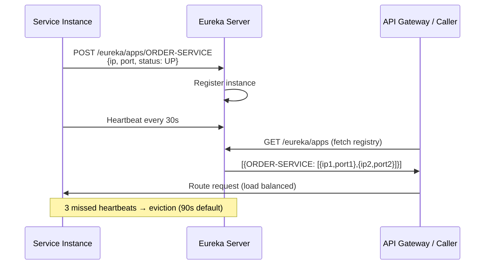

# 🔍 Service Discovery with Eureka

> [!abstract] TL;DR
> Service discovery eliminates hardcoded IP addresses in microservices. **Eureka Server** is the registry — services register on startup and send heartbeats every 30 seconds. **Eureka Client** fetches the registry and uses **Spring Cloud LoadBalancer** to pick an instance. If a service misses 3 heartbeats (90s), Eureka removes it. All this enables dynamic scaling: spin up/down instances without any config change.

## Intuition — analogy FIRST
Service discovery is like a company directory board. When a new employee (service instance) joins, they write their name, floor, and phone number on the board (self-registration). When colleagues need to reach them, they check the board rather than having memorized extensions (no hardcoded IPs). If someone is out sick for too long (missed heartbeats), their name is erased from the board. The directory updates itself — no manual intervention.

---

## How It Works



## Key Concepts / Details

### Eureka Server Setup

```xml
<dependency>
    <groupId>org.springframework.cloud</groupId>
    <artifactId>spring-cloud-starter-netflix-eureka-server</artifactId>
</dependency>
```

```java
@SpringBootApplication
@EnableEurekaServer
public class EurekaServerApplication {
    public static void main(String[] args) { SpringApplication.run(EurekaServerApplication.class, args); }
}
```

```yaml
# eureka-server application.yml
server:
  port: 8761

eureka:
  instance:
    hostname: eureka-server
  client:
    register-with-eureka: false    # server doesn't register with itself
    fetch-registry: false          # server doesn't need the registry
    service-url:
      defaultZone: http://localhost:8761/eureka/
  server:
    enable-self-preservation: false  # dev only — disable grace period on network issues
    eviction-interval-timer-in-ms: 5000  # check for dead instances every 5s
```

Eureka dashboard is available at `http://localhost:8761` — shows all registered services, their instance count, and status.

### Eureka Client — Service Registration

```xml
<dependency>
    <groupId>org.springframework.cloud</groupId>
    <artifactId>spring-cloud-starter-netflix-eureka-client</artifactId>
</dependency>
```

```yaml
# order-service application.yml
server:
  port: 8082    # or 0 for random port (multiple instances on same machine)

spring:
  application:
    name: order-service   # service name in Eureka — must be consistent

eureka:
  client:
    service-url:
      defaultZone: http://localhost:8761/eureka/
    fetch-registry: true           # fetch registry to discover other services
    register-with-eureka: true     # register self
    registry-fetch-interval-seconds: 30  # how often to refresh local registry cache
  instance:
    prefer-ip-address: true        # register with IP, not hostname
    ip-address: ${POD_IP:${spring.cloud.client.ip-address}}  # Kubernetes pod IP
    instance-id: ${spring.application.name}:${server.port}:${random.uuid}
    lease-renewal-interval-in-seconds: 10    # heartbeat interval (default 30)
    lease-expiration-duration-in-seconds: 30  # expiry after missed heartbeats (default 90)
    health-check-url-path: /actuator/health   # Eureka checks this URL
```

### Client-Side Load Balancing — DiscoveryClient + LoadBalancer

```java
// Spring Cloud LoadBalancer auto-discovers and load-balances Feign/WebClient calls

// Option 1: @LoadBalanced RestTemplate (older approach)
@Configuration
public class RestTemplateConfig {
    @Bean
    @LoadBalanced  // enables Eureka-aware load balancing
    public RestTemplate restTemplate() { return new RestTemplate(); }
}

@Service
public class OrderService {
    private final RestTemplate restTemplate;

    public UserResponse getUser(String userId) {
        // "user-service" is resolved via Eureka to actual host:port
        return restTemplate.getForObject(
            "http://user-service/api/users/" + userId, UserResponse.class);
    }
}

// Option 2: @LoadBalanced WebClient (reactive, modern approach)
@Configuration
public class WebClientConfig {
    @Bean
    @LoadBalanced
    public WebClient.Builder webClientBuilder() { return WebClient.builder(); }
}

// Option 3: DiscoveryClient — manual instance discovery
@Service
public class ServiceLocator {
    private final DiscoveryClient discoveryClient;

    public String getUserServiceUrl() {
        List<ServiceInstance> instances = discoveryClient.getInstances("user-service");
        if (instances.isEmpty()) throw new ServiceUnavailableException("user-service");
        ServiceInstance instance = instances.get(new Random().nextInt(instances.size()));
        return instance.getUri().toString();
    }
}
```

### Health Integration — Only Healthy Instances Routed

```java
// Services with /actuator/health returning DOWN are excluded from routing
// Customize health indicator
@Component
public class DatabaseHealthIndicator implements HealthIndicator {
    private final DataSource dataSource;

    @Override
    public Health health() {
        try (Connection conn = dataSource.getConnection()) {
            conn.createStatement().execute("SELECT 1");
            return Health.up().withDetail("database", "reachable").build();
        } catch (SQLException e) {
            return Health.down().withDetail("database", "unreachable").build();
        }
    }
}

// In Eureka, when health returns DOWN, Eureka marks instance OUT_OF_SERVICE
// Spring Cloud LoadBalancer skips OUT_OF_SERVICE instances
```

### High-Availability Eureka — Peer Replication

```yaml
# Production: multiple Eureka instances replicate to each other
# eureka1 application.yml
spring:
  application:
    name: eureka-server
eureka:
  instance:
    hostname: eureka1.example.com
  client:
    register-with-eureka: true   # register with peer
    fetch-registry: true
    service-url:
      defaultZone: http://eureka2.example.com:8761/eureka/,
                   http://eureka3.example.com:8761/eureka/
```

Clients should point to multiple Eureka servers:
```yaml
eureka:
  client:
    service-url:
      defaultZone: http://eureka1:8761/eureka/,http://eureka2:8761/eureka/
```

### Self-Preservation Mode

Eureka enters self-preservation when it detects network issues (many heartbeats failing simultaneously). It stops evicting instances, assuming a network partition rather than instances being down. Disable only in development:
```yaml
eureka:
  server:
    enable-self-preservation: false  # dev only
```

### Alternatives to Eureka

| Registry | Ecosystem | Notes |
|----------|-----------|-------|
| **Eureka** (Netflix) | Spring Cloud | Simple, battle-tested, maintenance mode |
| **Consul** (HashiCorp) | Polyglot | DNS-based discovery, health checks, KV store |
| **Kubernetes Service** | K8s | DNS-based discovery; built into K8s — no extra server |
| **Zookeeper** (Apache) | Legacy | Complex; mostly replaced by Consul/etcd |
| **etcd** | Cloud-native | Used by K8s internally; Consul preferred for apps |

---

## Real-World Notes

- **Kubernetes replaces Eureka**: if running on Kubernetes, use K8s Services for discovery — DNS-based, built-in. Eureka is only needed for non-Kubernetes deployments or hybrid environments.
- **Registry cache**: Eureka clients cache the registry locally. After a service registers, it takes up to 90 seconds for all clients to see it (30s heartbeat + 30s local cache TTL + 30s remote cache). Tune with `registry-fetch-interval-seconds`.
- **Prefer IP over hostname**: `prefer-ip-address: true` prevents DNS resolution issues in containerized environments where hostname resolution may not work.
- **Instance ID uniqueness**: in containers, use `${spring.application.name}:${random.uuid}` or `${spring.application.name}:${server.port}` to ensure each instance has a unique ID.

---

## Common Pitfalls

- **Service not showing in Eureka**: check that `spring.application.name` is set. Without it, the service registers as `UNKNOWN`.
- **Eureka unavailable on startup**: by default, if Eureka is down, the service still starts but logs warnings. Use `eureka.client.enabled: false` in tests to avoid startup delays.
- **Round-trip latency for discovery**: Eureka client caches the registry locally — service calls don't go through Eureka. The cache refreshes every 30s, not per request.
- **Missing `@EnableEurekaServer`**: the Eureka server won't start without this. Spring Boot auto-configuration alone is not enough.

---

## Related Concepts

- [[Spring_Cloud_Overview]] — Where Eureka fits in the Spring Cloud ecosystem
- [[API_Gateway_Spring]] — Gateway uses Eureka to resolve downstream services
- [[Circuit_Breaker_Resilience4j]] — Resilience patterns when discovered services fail

---

## Review Questions

1. What is the difference between service registration and service discovery in Eureka?
2. How long does it take for a crashed service to be removed from Eureka? What determines this?
3. What is Eureka's self-preservation mode and when does it activate?
4. How does Spring Cloud LoadBalancer decide which instance to route to?
5. What are the alternatives to Eureka in a Kubernetes environment?

---

## Sources

- Spring Cloud Netflix Documentation: https://docs.spring.io/spring-cloud-netflix/docs/current/reference/html/
- Netflix Eureka Wiki: https://github.com/Netflix/eureka/wiki

#java #spring #microservices #eureka #service-discovery #service-registry #load-balancing #spring-cloud
