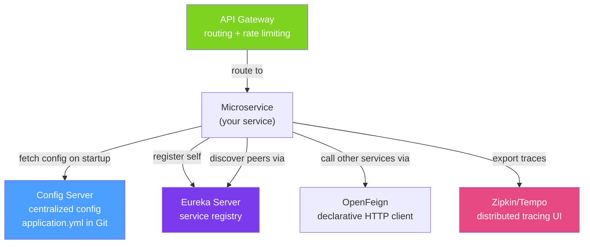

# ☁️ Spring Cloud Overview

> [!abstract] TL;DR
> Spring Cloud provides libraries that solve common distributed systems problems: **Config Server** (centralized configuration), **OpenFeign** (declarative HTTP clients), **Spring Cloud LoadBalancer** (client-side load balancing), **Spring Cloud Gateway** (API gateway), **Sleuth/Micrometer Tracing + Zipkin** (distributed tracing). Spring Cloud 2022+ dropped Netflix libraries (Ribbon, Hystrix, Zuul) — use Resilience4j and Spring Cloud Gateway instead.

## Intuition — analogy FIRST
Running microservices without Spring Cloud is like running a fleet of trucks without a dispatch system. Each driver (service) needs to know all road maps (hardcoded URLs), carry their own GPS (service discovery), and individually deal with roadblocks (no circuit breakers). Spring Cloud is the dispatch center: it tracks all trucks (Eureka), gives everyone the same instructions (Config Server), re-routes when roads close (load balancing + circuit breakers), and monitors every trip (distributed tracing).

---

## How It Works



## Key Concepts / Details

### Spring Cloud Config Server — Centralized Configuration

```xml
<!-- Config Server -->
<dependency>
    <groupId>org.springframework.cloud</groupId>
    <artifactId>spring-cloud-config-server</artifactId>
</dependency>
```

```java
@SpringBootApplication
@EnableConfigServer
public class ConfigServerApplication {
    public static void main(String[] args) { SpringApplication.run(ConfigServerApplication.class, args); }
}
```

```yaml
# config-server application.yml
server:
  port: 8888
spring:
  cloud:
    config:
      server:
        git:
          uri: https://github.com/myorg/config-repo  # Git repo with config files
          default-label: main
          search-paths: '{application}'  # look in folder named after the app
```

```yaml
# client application (bootstrap.yml or application.yml)
spring:
  application:
    name: order-service   # determines which config file to fetch (order-service.yml)
  config:
    import: "configserver:http://localhost:8888"
```

Config files in the Git repo:
- `application.yml` — shared across all services
- `order-service.yml` — order-service specific
- `order-service-prod.yml` — order-service production override

### OpenFeign — Declarative HTTP Clients

```xml
<dependency>
    <groupId>org.springframework.cloud</groupId>
    <artifactId>spring-cloud-starter-openfeign</artifactId>
</dependency>
```

```java
@SpringBootApplication
@EnableFeignClients
public class OrderServiceApplication { /* ... */ }

// Declare the client — looks like a Spring MVC controller interface
@FeignClient(
    name = "user-service",            // service name in Eureka
    url = "${services.user.url:}",    // override URL for tests (empty = use Eureka)
    configuration = FeignConfig.class // custom config (timeout, auth)
)
public interface UserServiceClient {
    @GetMapping("/api/users/{id}")
    UserResponse getUser(@PathVariable("id") String userId);

    @PostMapping("/api/users/{id}/notifications")
    void sendNotification(@PathVariable("id") String userId,
                          @RequestBody NotificationRequest notification);
}

// Custom Feign configuration
@Configuration
public class FeignConfig {
    @Bean
    public Request.Options options() {
        return new Request.Options(
            Duration.ofSeconds(2),    // connect timeout
            Duration.ofSeconds(10),   // read timeout
            true);                    // follow redirects
    }

    @Bean
    public RequestInterceptor authInterceptor(OAuth2AuthorizedClientManager manager) {
        return template -> {
            // Automatically add Bearer token to all Feign requests
            OAuth2AuthorizedClient client = manager.authorize(/* ... */);
            template.header("Authorization", "Bearer " + client.getAccessToken().getTokenValue());
        };
    }
}
```

### Spring Cloud LoadBalancer — Client-Side Load Balancing

```yaml
# Auto-configured when spring-cloud-loadbalancer is on classpath
# Replaces deprecated Netflix Ribbon

# Override per client:
user-service:
  loadbalancer:
    retry:
      enabled: true
      max-retries-on-same-service-instance: 0
      max-retries-on-next-service-instance: 2
      retryable-status-codes: 503
```

```java
// Custom LoadBalancer strategy
@Configuration
public class LoadBalancerConfig {
    @Bean
    public ReactorLoadBalancer<ServiceInstance> randomLoadBalancer(
            Environment env, LoadBalancerClientFactory factory) {
        String name = env.getProperty(LoadBalancerClientFactory.PROPERTY_NAME);
        return new RandomLoadBalancer(factory.getLazyProvider(name, ServiceInstanceListSupplier.class), name);
    }
}
```

### Distributed Tracing with Micrometer Tracing + Zipkin

```xml
<dependency>
    <groupId>io.micrometer</groupId>
    <artifactId>micrometer-tracing-bridge-brave</artifactId>
</dependency>
<dependency>
    <groupId>io.zipkin.reporter2</groupId>
    <artifactId>zipkin-reporter-brave</artifactId>
</dependency>
```

```yaml
management:
  tracing:
    sampling:
      probability: 1.0  # 100% in dev; use 0.1 (10%) in production
  zipkin:
    tracing:
      endpoint: http://localhost:9411/api/v2/spans
```

How it works:
- **Trace ID**: unique ID for the entire request chain (same across all services)
- **Span ID**: unique ID for each service hop within the trace
- Spring Cloud Gateway propagates `traceparent` header (W3C) or `X-B3-TraceId` (Zipkin B3)
- Every service in the chain logs `traceId` and sends spans to Zipkin
- Zipkin UI shows the full request waterfall across services

```java
// Inject custom spans for important operations
@Component
public class OrderProcessor {
    private final Tracer tracer;

    public void processOrder(Order order) {
        Span span = tracer.nextSpan().name("process-order").start();
        try (Tracer.SpanInScope scope = tracer.withSpan(span)) {
            span.tag("order.id", order.getId().toString());
            // ... processing logic
        } finally {
            span.end();
        }
    }
}
```

### Spring Cloud Bus — Runtime Config Refresh

```xml
<dependency>
    <groupId>org.springframework.cloud</groupId>
    <artifactId>spring-cloud-starter-bus-amqp</artifactId>  <!-- or bus-kafka -->
</dependency>
```

```bash
# Trigger config refresh across all instances without restart
POST http://localhost:8888/actuator/busrefresh
# Publishes a RefreshRemoteApplicationEvent to all services via RabbitMQ/Kafka
```

```java
// In your service — mark beans that should re-initialize on refresh
@RefreshScope
@Service
public class FeatureFlagService {
    @Value("${feature.new-checkout-flow.enabled:false}")
    private boolean newCheckoutEnabled;
}
```

### Key Spring Cloud Components Summary

| Component | Replaces | Purpose |
|-----------|----------|---------|
| Spring Cloud Config | Hardcoded/env-var configs | Centralized, Git-backed config |
| Eureka Server/Client | Hardcoded IPs | Service discovery + health tracking |
| Spring Cloud Gateway | Netflix Zuul | API gateway, routing, filters |
| Spring Cloud OpenFeign | RestTemplate | Declarative HTTP clients |
| Spring Cloud LoadBalancer | Netflix Ribbon | Client-side load balancing |
| Micrometer Tracing | Spring Cloud Sleuth | Distributed tracing (W3C standard) |
| Resilience4j | Netflix Hystrix | Circuit breaker, retry, bulkhead |

---

## Real-World Notes

- **Netflix OSS is dead**: Ribbon, Hystrix, Zuul, Feign (Netflix) are all deprecated/removed from Spring Cloud 2021+. Use Spring Cloud Gateway, Resilience4j, Spring Cloud LoadBalancer, and OpenFeign (Spring Cloud's maintained version).
- **Config Server alternatives**: HashiCorp Vault (secrets), AWS Parameter Store, Kubernetes ConfigMaps. Config Server is good for non-secret config; use Vault for credentials.
- **Service mesh vs Spring Cloud**: Istio/Linkerd handles service mesh concerns (mTLS, traffic management, tracing) at the infrastructure level — no code changes. Spring Cloud handles them in code. Prefer service mesh for Kubernetes deployments.
- **Spring Cloud BOM**: always import `spring-cloud-dependencies` BOM to align all Spring Cloud library versions.

---

## Common Pitfalls

- **Missing `@EnableFeignClients`**: FeignClient interfaces are silently ignored without this annotation on the main class. All calls return null/error.
- **Config Server single point of failure**: if Config Server is down, services can't start. Use replicas and configure retry/fallback: `spring.config.import=optional:configserver:...` for non-critical configs.
- **Tracing overhead**: 100% sampling in production generates massive data. Use 1-10% sampling with head-based sampling or tail-based sampling (Tempo/Jaeger) for production.
- **Feign connection pools**: by default Feign uses basic HttpURLConnection. Add Apache HttpClient 5 or OkHttp for connection pooling and better performance.

---

## Related Concepts

- [[Service_Discovery_Eureka]] — Eureka, the service registry component
- [[API_Gateway_Spring]] — Spring Cloud Gateway in detail
- [[Circuit_Breaker_Resilience4j]] — Resilience4j integration with Feign clients

---

## Review Questions

1. What problem does Spring Cloud Config Server solve? What is its backend storage?
2. How does OpenFeign know which instance of `user-service` to call?
3. What is a trace ID vs a span ID in distributed tracing?
4. What is `@RefreshScope` and how does it work with Spring Cloud Bus?
5. What are the Spring Cloud replacements for the deprecated Netflix OSS components?

---

## Sources

- Spring Cloud Documentation: https://spring.io/projects/spring-cloud
- Spring Cloud 2022.x Release Notes
- Micrometer Tracing: https://micrometer.io/docs/tracing

#java #spring #microservices #spring-cloud #config-server #openfeign #distributed-tracing #zipkin
