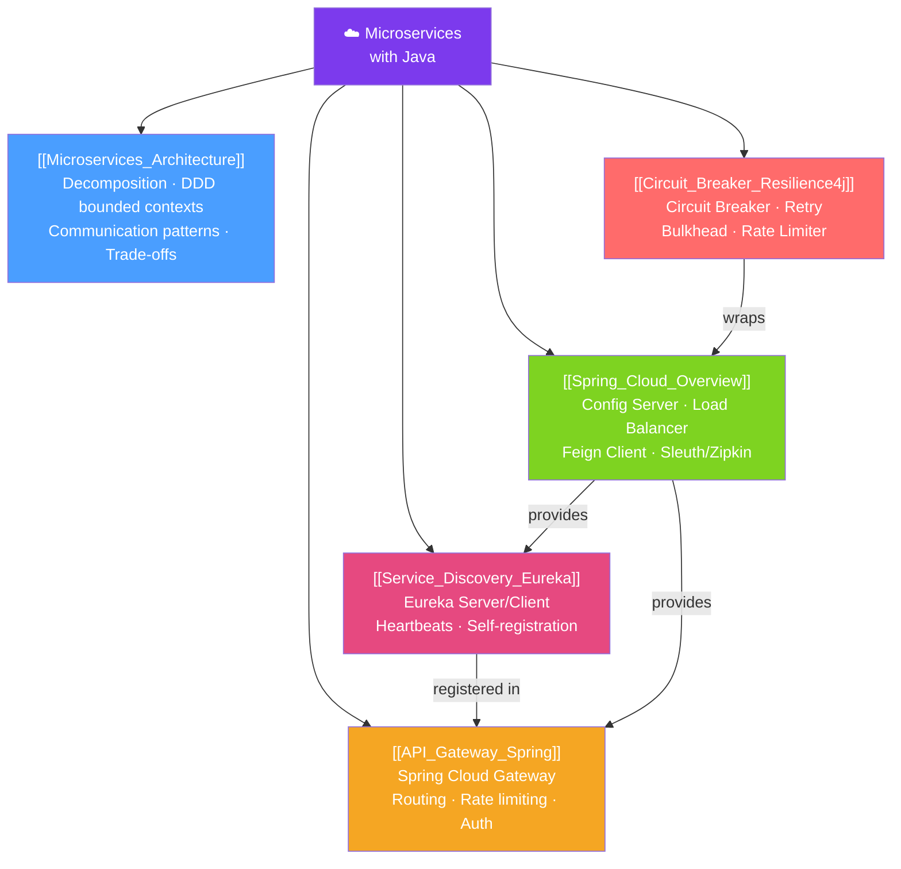

# ☁️ Microservices with Java — Map of Content

> [!abstract] What This Section Covers
> Microservices decompose large applications into small, independently deployable services. This section covers the core architectural principles, Spring Cloud's toolkit for service discovery, API gateways, load balancing, and resilience patterns (circuit breakers, retries, bulkheads) using Resilience4j.

## Concept Map

## Learning Path
1. [[Microservices_Architecture]] — Why microservices, when to use them, and the key patterns and trade-offs.
2. [[Spring_Cloud_Overview]] — Spring Cloud's library ecosystem: what each component solves.
3. [[Service_Discovery_Eureka]] — How services find each other dynamically without hardcoded URLs.
4. [[API_Gateway_Spring]] — Unified entry point for routing, auth, and rate limiting.
5. [[Circuit_Breaker_Resilience4j]] — Fault tolerance patterns to prevent cascade failures.

## All Notes at a Glance
| Note | Difficulty | What You'll Learn |
|------|------------|-------------------|
| [[Microservices_Architecture]] | Intermediate | Principles, decomposition, sync vs async comm, trade-offs |
| [[Spring_Cloud_Overview]] | Intermediate | Config Server, OpenFeign, load balancing, distributed tracing |
| [[Service_Discovery_Eureka]] | Intermediate | Eureka Server setup, client registration, ribbon replacement |
| [[API_Gateway_Spring]] | Advanced | Route predicates, filters, rate limiting, auth |
| [[Circuit_Breaker_Resilience4j]] | Advanced | State machine, fallback, retry, bulkhead, time limiter |

## Key Questions This Section Answers
- How do services find each other without hardcoded IPs?
- How does an API Gateway handle auth, rate limiting, and routing centrally?
- What is the circuit breaker pattern and how does Resilience4j implement it?
- What is the difference between service mesh and Spring Cloud?
- How do you propagate trace IDs across service calls?

## Related Sections
- [[_MOC_Java_Master|↑ Java Master MOC]]
- [[_MOC_Spring_Security|← Spring Security]] — Service-to-service OAuth2 with client_credentials
- [[_MOC_Messaging_Java|→ Messaging]] — Async communication between microservices
- [[_MOC_Reactive_Programming|→ Reactive]] — WebFlux for non-blocking service clients

#MOC #java #spring #microservices #spring-cloud
