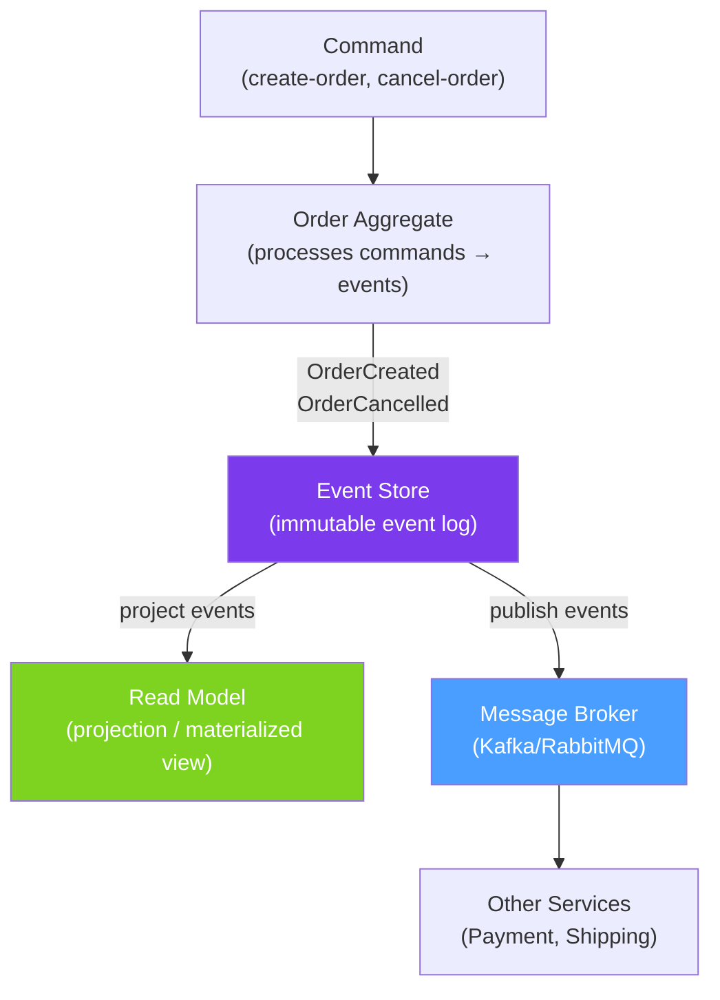

# 🌊 Event-Driven Architecture

> [!abstract] TL;DR
> In Event-Driven Architecture (EDA), services communicate by publishing and subscribing to **domain events** rather than making direct API calls. Key patterns: **Event Sourcing** (store state as a sequence of events, not current state), **CQRS** (separate read and write models), and the **Outbox Pattern** (atomically write to DB and publish events, preventing dual-write issues). Idempotency is critical — consumers must handle duplicate messages safely.

## Intuition — analogy FIRST
Event sourcing is like a bank ledger — it never says "current balance is $500"; it says "deposited $1000, withdrew $300, deposited $100, withdrew $300." The current balance is derived by replaying these events. CQRS is like having separate order-taking staff (writes) and menu boards (reads) in a restaurant — the process of taking orders is completely separate from displaying the menu. The Outbox Pattern is like a postal clerk who writes your letter details in a logbook *before* giving it to the mail carrier — if the carrier drops it, you have the logbook to resend.

---

## How It Works



## Key Concepts / Details

### Domain Events — Design

```java
// Events are immutable facts that happened in the past
public sealed interface OrderEvent permits
    OrderCreatedEvent, OrderConfirmedEvent, OrderCancelledEvent, OrderShippedEvent {

    String orderId();
    Instant occurredAt();
    String eventId();    // UUID for idempotency
}

public record OrderCreatedEvent(
    String orderId,
    String customerId,
    List<OrderLine> lines,
    BigDecimal totalAmount,
    Instant occurredAt,
    String eventId
) implements OrderEvent {
    public static OrderCreatedEvent from(Order order) {
        return new OrderCreatedEvent(
            order.getId().toString(),
            order.getCustomerId(),
            order.getLines().stream().map(OrderLine::from).toList(),
            order.getTotalAmount(),
            Instant.now(),
            UUID.randomUUID().toString());
    }
}

// Publish domain events from aggregate
@Entity
public class Order {
    // Transient — not persisted, collected and published after save
    @Transient
    private List<OrderEvent> domainEvents = new ArrayList<>();

    public void confirm() {
        if (this.status != OrderStatus.PENDING) throw new InvalidStatusException();
        this.status = OrderStatus.CONFIRMED;
        domainEvents.add(OrderConfirmedEvent.from(this));
    }

    public List<OrderEvent> pullEvents() {
        var events = List.copyOf(domainEvents);
        domainEvents.clear();
        return events;
    }
}
```

### Outbox Pattern — Atomically Write and Publish

```java
// The Dual Write Problem:
// orderRepo.save(order);          // DB transaction committed
// kafkaTemplate.send(event);      // Kafka publish fails!
// → DB has the order but no event was published → inconsistency

// Outbox Pattern Solution: write to outbox table IN THE SAME TRANSACTION
@Entity
@Table(name = "outbox_events")
public class OutboxEvent {
    @Id
    @GeneratedValue(strategy = GenerationType.UUID)
    private String id;

    private String aggregateType;   // "Order"
    private String aggregateId;     // order ID
    private String eventType;       // "OrderCreated"
    private String payload;         // JSON serialized event
    private Instant createdAt;
    private boolean published;      // mark as published after Kafka send
}

@Service
@Transactional
public class OrderCommandService {
    private final OrderRepository orderRepo;
    private final OutboxEventRepository outboxRepo;
    private final ObjectMapper objectMapper;

    public Order createOrder(CreateOrderCommand command) {
        Order order = Order.create(command);
        orderRepo.save(order);  // save to orders table

        // Save event to outbox IN THE SAME TRANSACTION
        List<OrderEvent> events = order.pullEvents();
        events.forEach(event -> {
            OutboxEvent outbox = OutboxEvent.builder()
                .aggregateType("Order")
                .aggregateId(order.getId().toString())
                .eventType(event.getClass().getSimpleName())
                .payload(objectMapper.writeValueAsString(event))
                .createdAt(Instant.now())
                .published(false)
                .build();
            outboxRepo.save(outbox);
        });
        return order;
    }
}

// Separate publisher picks up outbox events and publishes to Kafka
@Component
@Scheduled(fixedDelay = 1000)   // poll every second
public class OutboxEventPublisher {
    private final OutboxEventRepository outboxRepo;
    private final KafkaTemplate<String, String> kafkaTemplate;

    @Transactional
    public void publishPendingEvents() {
        List<OutboxEvent> pending = outboxRepo.findByPublishedFalseOrderByCreatedAtAsc();
        pending.forEach(event -> {
            kafkaTemplate.send("order-events", event.getAggregateId(), event.getPayload());
            event.setPublished(true);
            outboxRepo.save(event);
        });
    }
}
// Alternative: Debezium CDC (Change Data Capture) watches outbox table in DB and publishes to Kafka
// without polling — more efficient, no application-level scheduler needed
```

### Idempotency — Handle Duplicate Messages

```java
// Kafka/RabbitMQ may deliver the same message more than once (at-least-once guarantee)
// Your consumer must be idempotent — processing the same message twice = same result

@Service
public class OrderCreatedConsumer {
    private final ProcessedEventRepository processedEvents;
    private final OrderProjectionService projectionService;

    @KafkaListener(topics = "order-events")
    @Transactional
    public void handleOrderCreated(OrderCreatedEvent event, Acknowledgment ack) {
        // Idempotency check — skip if already processed
        if (processedEvents.existsByEventId(event.eventId())) {
            log.debug("Duplicate event {} — skipping", event.eventId());
            ack.acknowledge();
            return;
        }

        // Process the event
        projectionService.applyOrderCreated(event);

        // Mark as processed (same transaction)
        processedEvents.save(new ProcessedEvent(event.eventId(), Instant.now()));
        ack.acknowledge();
    }
}

// Alternative: make processing naturally idempotent
// Instead of: orderCount++  (not idempotent — running twice increments twice)
// Use: setOrderCount(event.orderCount)  (idempotent — setting same value twice is fine)
```

### CQRS — Command Query Responsibility Segregation

```java
// Commands mutate state — write model
@Service
public class OrderCommandService {
    private final OrderRepository orderRepo;
    private final EventPublisher eventPublisher;

    @Transactional
    public String createOrder(CreateOrderCommand cmd) {
        Order order = Order.create(cmd);
        orderRepo.save(order);
        eventPublisher.publish(OrderCreatedEvent.from(order));
        return order.getId().toString();
    }

    @Transactional
    public void cancelOrder(CancelOrderCommand cmd) {
        Order order = orderRepo.findById(cmd.orderId()).orElseThrow();
        order.cancel(cmd.reason());
        orderRepo.save(order);
        eventPublisher.publish(OrderCancelledEvent.from(order));
    }
}

// Queries read from optimized read model — no mutations
@Service
@Transactional(readOnly = true)
public class OrderQueryService {
    private final OrderSummaryRepository summaryRepo;  // denormalized read model
    private final OrderSearchRepository searchRepo;     // Elasticsearch or similar

    public Page<OrderSummary> getOrdersByCustomer(String customerId, Pageable pageable) {
        return summaryRepo.findByCustomerId(customerId, pageable);
    }

    public List<OrderSummary> searchOrders(OrderSearchFilter filter) {
        return searchRepo.search(filter);  // fast read-optimized query
    }
}

// Read model updater — subscribes to events and updates the read model
@Service
public class OrderReadModelUpdater {
    private final OrderSummaryRepository summaryRepo;

    @EventListener  // or @KafkaListener for cross-service
    public void onOrderCreated(OrderCreatedEvent event) {
        summaryRepo.save(OrderSummary.from(event));
    }

    @EventListener
    public void onOrderCancelled(OrderCancelledEvent event) {
        summaryRepo.findByOrderId(event.orderId())
            .ifPresent(summary -> {
                summary.setStatus("CANCELLED");
                summaryRepo.save(summary);
            });
    }
}
```

### Event Versioning

```java
// Events evolve — handle multiple versions
@KafkaListener(topics = "order-events")
public void handleOrderEvent(ConsumerRecord<String, String> record) {
    String eventType = record.headers().lastHeader("event-type").value().toString();
    String version = record.headers().lastHeader("event-version").value().toString();

    OrderEvent event = switch (eventType + "-" + version) {
        case "OrderCreated-1" -> objectMapper.readValue(record.value(), OrderCreatedEventV1.class);
        case "OrderCreated-2" -> objectMapper.readValue(record.value(), OrderCreatedEvent.class);
        default -> throw new UnknownEventException(eventType, version);
    };
    process(event);
}
```

---

## Real-World Notes

- **Eventual consistency**: event-driven systems are eventually consistent. Order service publishes `order.created`, notification service may process it 100ms later. Design UX around this — show "order received, confirmation email coming shortly."
- **Event schema registry**: use Confluent Schema Registry (Avro/Protobuf) for type-safe event schemas with backward/forward compatibility guarantees. Prevents breaking changes from breaking consumers.
- **Debezium for Outbox**: rather than polling the outbox table, use Debezium to capture DB changes (WAL for Postgres/MySQL binlog) and publish to Kafka. Zero-latency, no polling overhead.
- **Event store vs event bus**: event store (Axon, EventStoreDB) persists events for replay. Event bus (Kafka, RabbitMQ) delivers events to consumers. Both serve different needs — production systems often use both.

---

## Common Pitfalls

- **Dual write without outbox**: `save(order) + publish(event)` — if Kafka publish fails after DB commit, no event is published. Inconsistency that's hard to detect. Always use the Outbox Pattern.
- **Events coupled to internal domain**: publishing events that expose internal implementation details makes refactoring impossible. Design events around business facts, not technical operations.
- **Ignoring idempotency**: at-least-once delivery means duplicates are guaranteed. Not handling them causes duplicate orders, double charges, etc.
- **Event ordering dependencies**: if Consumer A must process `OrderCreated` before `OrderShipped`, both must come from the same Kafka partition (same key) — or use Sagas to coordinate ordering.

---

## Related Concepts

- [[Spring_Kafka]] — Kafka as the event store and event bus
- [[Saga_Pattern]] — Coordinating distributed transactions in EDA
- [[Spring_Data_JPA]] — Outbox table requires transactional writes

---

## Review Questions

1. What is the dual-write problem and how does the Outbox Pattern solve it?
2. What is CQRS and what problem does separating read/write models solve?
3. Why must event consumers be idempotent? How do you implement idempotency?
4. What is Event Sourcing and how does it differ from traditional state storage?
5. How do you handle schema evolution when consumers depend on event structure?

---

## Sources

- Martin Fowler: Event-Driven Architecture — https://martinfowler.com/articles/201701-event-driven.html
- Microservices.io: Event Sourcing pattern — https://microservices.io/patterns/data/event-sourcing.html
- Debezium CDC: https://debezium.io

#java #spring #messaging #event-driven #event-sourcing #cqrs #outbox-pattern #idempotency #domain-events
