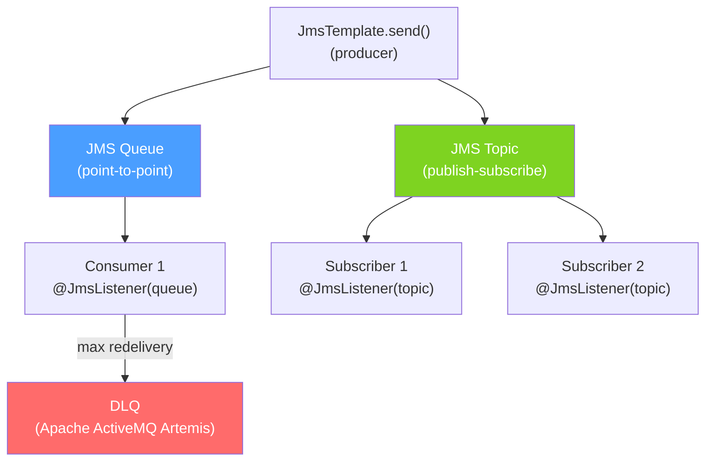

# 📬 JMS and ActiveMQ

> [!abstract] TL;DR
> **JMS (Jakarta Messaging)** is the Java standard API for messaging — broker-independent. **ActiveMQ Artemis** (the modern version) is the most common JMS implementation in the Spring ecosystem. JMS has two models: **Queue** (point-to-point — one consumer) and **Topic** (publish-subscribe — all subscribers). `JmsTemplate` sends; `@JmsListener` receives. Spring Boot auto-configures embedded ActiveMQ for testing. Use `@Transactional` on listeners for exactly-once processing.

## Intuition — analogy FIRST
JMS is like the postal service standard that works regardless of which carrier you use (FedEx, UPS, DHL = different JMS providers). A **Queue** is a regular mailbox — the first delivery person (consumer) picks up the letter, and it's gone. A **Topic** is like a magazine subscription — everyone who subscribes gets their own copy of each issue. Spring's `@JmsListener` is your automatic mail opener that processes letters as they arrive.

---

## How It Works



## Key Concepts / Details

### Setup — Embedded ActiveMQ (Testing/Dev)

```xml
<!-- Embedded ActiveMQ Artemis for testing -->
<dependency>
    <groupId>org.springframework.boot</groupId>
    <artifactId>spring-boot-starter-artemis</artifactId>
</dependency>

<!-- For traditional ActiveMQ 5.x -->
<dependency>
    <groupId>org.springframework.boot</groupId>
    <artifactId>spring-boot-starter-activemq</artifactId>
</dependency>
```

```yaml
# Embedded (in-memory) for development
spring:
  artemis:
    mode: embedded     # embedded | native
    embedded:
      enabled: true
      queues: order-queue, payment-queue
      topics: audit-topic, notification-topic

# Native (external broker) for production
spring:
  artemis:
    mode: native
    host: artemis.example.com
    port: 61616
    user: admin
    password: ${ARTEMIS_PASSWORD}
    broker-url: tcp://artemis.example.com:61616?reconnectAttempts=5
```

### JmsTemplate — Sending Messages

```java
@Service
public class OrderMessageSender {
    private final JmsTemplate jmsTemplate;

    // Send simple text message to queue
    public void sendOrderId(String orderId) {
        jmsTemplate.convertAndSend("order-queue", orderId);
    }

    // Send object (converted to JSON with Jackson converter)
    public void sendOrderEvent(OrderCreatedEvent event) {
        jmsTemplate.convertAndSend("order-queue", event);
    }

    // Send with post-processor (customize message properties)
    public void sendWithPriority(OrderCreatedEvent event, int priority) {
        jmsTemplate.convertAndSend("order-queue", event, message -> {
            message.setJMSPriority(priority);         // 0-9, 9 = highest
            message.setJMSExpiration(30000);          // 30 second TTL
            message.setStringProperty("eventType", event.getType());
            message.setStringProperty("correlationId", event.getCorrelationId());
            return message;
        });
    }

    // Send to topic (all subscribers receive a copy)
    public void broadcastAuditEvent(AuditEvent event) {
        // Use topic destination
        jmsTemplate.setPubSubDomain(true);  // switch to topic mode
        jmsTemplate.convertAndSend("audit-topic", event);
        jmsTemplate.setPubSubDomain(false); // reset to queue mode
    }
}
```

### @JmsListener — Receiving Messages

```java
@Service
public class OrderMessageConsumer {

    // Simple listener — auto-converts JSON back to object
    @JmsListener(destination = "order-queue")
    public void processOrder(OrderCreatedEvent event) {
        log.info("Processing order: {}", event.getOrderId());
        orderService.process(event);
        // No explicit ack — auto-acknowledged on method return
    }

    // Access raw JMS Message for properties
    @JmsListener(destination = "order-queue")
    public void processWithMetadata(Message message) throws JMSException {
        String eventType = message.getStringProperty("eventType");
        String correlationId = message.getStringProperty("correlationId");

        if (message instanceof TextMessage textMessage) {
            String body = textMessage.getText();
            // parse manually or convert
        } else if (message instanceof ObjectMessage objectMessage) {
            OrderCreatedEvent event = (OrderCreatedEvent) objectMessage.getObject();
            orderService.process(event);
        }
    }

    // Topic subscriber (pub-sub)
    @JmsListener(
        destination = "audit-topic",
        containerFactory = "topicListenerContainerFactory",
        subscription = "audit-subscription"  // durable subscription — survives restart
    )
    public void handleAuditEvent(AuditEvent event) {
        auditService.record(event);
    }

    // Concurrent listeners
    @JmsListener(
        destination = "order-queue",
        concurrency = "3-10"  // min 3, max 10 concurrent consumers
    )
    public void processOrderConcurrent(OrderCreatedEvent event) {
        orderService.process(event);
    }

    // Transactional listener — DB + JMS ack in same transaction
    @JmsListener(destination = "payment-queue")
    @Transactional
    public void processPayment(PaymentEvent event) {
        paymentRepo.save(Payment.from(event));  // DB write
        accountService.debit(event);            // another DB write
        // If any step throws, transaction rolls back AND JMS message is redelivered
        // This is XA-less local transaction (JMS session + DB in same transaction)
    }
}
```

### JMS Configuration

```java
@Configuration
@EnableJms
public class JmsConfig {

    // Queue listener factory (default)
    @Bean
    public DefaultJmsListenerContainerFactory jmsListenerContainerFactory(
            ConnectionFactory connectionFactory,
            MessageConverter messageConverter) {
        DefaultJmsListenerContainerFactory factory = new DefaultJmsListenerContainerFactory();
        factory.setConnectionFactory(connectionFactory);
        factory.setMessageConverter(messageConverter);
        factory.setTransactionManager(transactionManager);  // for @Transactional
        factory.setSessionAcknowledgeMode(Session.CLIENT_ACKNOWLEDGE);
        factory.setConcurrency("1-5");
        factory.setErrorHandler(t -> log.error("JMS error", t));
        return factory;
    }

    // Topic listener factory (pub-sub)
    @Bean
    public DefaultJmsListenerContainerFactory topicListenerContainerFactory(
            ConnectionFactory connectionFactory) {
        DefaultJmsListenerContainerFactory factory = new DefaultJmsListenerContainerFactory();
        factory.setConnectionFactory(connectionFactory);
        factory.setPubSubDomain(true);         // topic mode
        factory.setSubscriptionDurable(true);  // durable subscriptions
        factory.setClientId("my-service");     // unique client ID for durable subscriptions
        return factory;
    }

    // Jackson message converter
    @Bean
    public MessageConverter messageConverter(ObjectMapper objectMapper) {
        MappingJackson2MessageConverter converter = new MappingJackson2MessageConverter();
        converter.setTargetType(MessageType.TEXT);
        converter.setTypeIdPropertyName("_type");  // adds type info for deserialization
        converter.setObjectMapper(objectMapper);
        return converter;
    }
}
```

### Queue vs Topic

| Feature | Queue (P2P) | Topic (Pub-Sub) |
|---------|-------------|-----------------|
| **Consumers** | One consumer gets the message | All subscribers get the message |
| **Message retention** | Until consumed | Until delivered to all (durable) or immediately |
| **Use case** | Work distribution, task queues | Broadcast, event notification |
| **Scalability** | Add consumers to scale | Each subscriber processes all messages |
| **Ordering** | FIFO per queue | Per subscription |

---

## Real-World Notes

- **JMS vs Kafka**: JMS/ActiveMQ is transactional and simpler. Kafka is higher throughput but no standard transaction support across DB + Kafka (without the Kafka Transactions API). Choose JMS for enterprise apps where ACID guarantees matter; Kafka for streaming.
- **ActiveMQ Artemis is the modern choice**: ActiveMQ Classic (5.x) is legacy. Use Artemis (the successor) — it's faster, supports both AMQP and JMS, and has better clustering.
- **XA transactions**: for true atomic DB + JMS commit (two-phase commit), configure an XA `ConnectionFactory` and an XA `DataSource` with Atomikos or Bitronix JTA transaction manager. It's complex — prefer the outbox pattern.
- **Durable subscriptions**: for topics, use durable subscriptions with a unique `clientId` so messages are retained when the subscriber is offline. Without durability, missed messages are gone.

---

## Common Pitfalls

- **Thread safety of JmsTemplate**: `JmsTemplate` is thread-safe but creates a new connection/session per call by default. Add `CachingConnectionFactory` to cache sessions and improve performance.
- **Auto-acknowledge in non-transactional context**: `Session.AUTO_ACKNOWLEDGE` acknowledges before your method finishes. An exception after ack loses the message. Use `CLIENT_ACKNOWLEDGE` or `@Transactional`.
- **Topic without durable subscription**: if your service restarts and the topic isn't durable, you miss all messages sent while offline. Always use `setSubscriptionDurable(true)` for topics that matter.
- **Message type not registered**: using `MappingJackson2MessageConverter` requires the type ID property to be in the message. Missing it causes `ClassCastException` on deserialization.

---

## Related Concepts

- [[Spring_AMQP_RabbitMQ]] — AMQP alternative to JMS with more routing flexibility
- [[Spring_Kafka]] — Kafka for high-throughput streaming (not JMS-based)
- [[Event_Driven_Architecture]] — JMS supports event-driven patterns

---

## Review Questions

1. What is the difference between a JMS Queue (point-to-point) and a JMS Topic (pub-sub)?
2. How does `@Transactional` on a `@JmsListener` method ensure at-least-once processing?
3. What is a durable subscription in JMS and when do you need it?
4. What does `CachingConnectionFactory` improve compared to the default?
5. When would you choose JMS/ActiveMQ over Apache Kafka?

---

## Sources

- Spring JMS Reference: https://docs.spring.io/spring-framework/docs/current/reference/html/integration.html#jms
- ActiveMQ Artemis Documentation: https://activemq.apache.org/components/artemis/documentation/

#java #spring #messaging #jms #activemq #jmslistener #queue #topic #artemis
