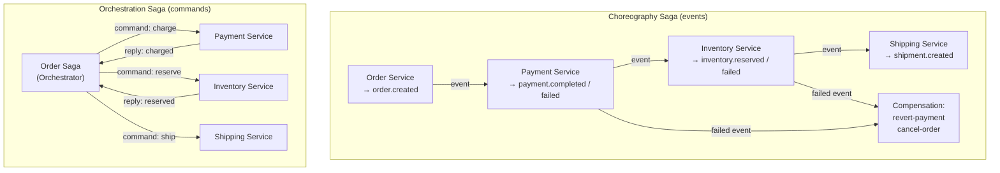

# 🔄 Saga Pattern

> [!abstract] TL;DR
> Sagas manage **distributed transactions across multiple microservices** without two-phase commit (2PC). A saga is a sequence of local transactions; if any step fails, **compensating transactions** undo prior steps. Two styles: **Choreography** (services react to each other's events — no central coordinator) and **Orchestration** (a central Saga Orchestrator drives the workflow). Orchestration is easier to reason about and debug; choreography is more decoupled but harder to track.

## Intuition — analogy FIRST
A saga is like booking a vacation package. You book a flight (local tx 1), then book a hotel (local tx 2), then rent a car (local tx 3). If the car rental fails, you cancel the hotel (compensating tx 2) and cancel the flight (compensating tx 1) — returning everything to its original state. **Choreography** is like each vendor calling the next automatically based on booking confirmations. **Orchestration** is like a travel agent who coordinates all vendors, handles failures, and calls the right cancellation service when something goes wrong.

---

## How It Works



## Key Concepts / Details

### Choreography Saga — Event-Driven

```java
// 1. Order Service creates order and publishes event
@Service
public class OrderService {
    private final OrderRepository orderRepo;
    private final KafkaTemplate<String, Object> kafka;

    @Transactional
    public Order createOrder(CreateOrderCommand cmd) {
        Order order = Order.builder()
            .customerId(cmd.customerId())
            .lines(cmd.lines())
            .status(OrderStatus.PENDING)
            .build();
        orderRepo.save(order);

        // Publish saga-starting event
        kafka.send("order-events", order.getId().toString(),
            new OrderCreatedEvent(order.getId(), order.getCustomerId(),
                                  order.getTotalAmount(), order.getLines()));
        return order;
    }

    // Compensating transaction — called if payment fails
    @KafkaListener(topics = "payment-events", groupId = "order-service")
    @Transactional
    public void handlePaymentResult(PaymentEvent event) {
        if (event instanceof PaymentFailedEvent failed) {
            Order order = orderRepo.findById(failed.orderId()).orElseThrow();
            order.cancel("Payment failed: " + failed.reason());
            orderRepo.save(order);
            kafka.send("order-events", order.getId().toString(),
                new OrderCancelledEvent(order.getId(), "Payment failed"));
        } else if (event instanceof PaymentCompletedEvent completed) {
            Order order = orderRepo.findById(completed.orderId()).orElseThrow();
            order.markPaid();
            orderRepo.save(order);
        }
    }
}

// 2. Payment Service reacts to OrderCreated
@Service
public class PaymentService {
    private final PaymentRepository paymentRepo;
    private final KafkaTemplate<String, Object> kafka;

    @KafkaListener(topics = "order-events", groupId = "payment-service")
    @Transactional
    public void handleOrderCreated(OrderCreatedEvent event) {
        try {
            Payment payment = processPayment(event.customerId(), event.totalAmount());
            paymentRepo.save(payment);
            kafka.send("payment-events", event.orderId(),
                new PaymentCompletedEvent(event.orderId(), payment.getId()));
        } catch (PaymentException e) {
            kafka.send("payment-events", event.orderId(),
                new PaymentFailedEvent(event.orderId(), e.getMessage()));
        }
    }
}
```

### Orchestration Saga — Central Coordinator

```java
// Saga state machine — the orchestrator
@Entity
public class OrderSaga {
    @Id private String orderId;
    @Enumerated(EnumType.STRING)
    private SagaStatus status;  // STARTED, PAYMENT_PENDING, INVENTORY_PENDING, COMPLETED, COMPENSATING, FAILED

    // Saga orchestrator manages the workflow
}

@Service
public class OrderSagaOrchestrator {
    private final KafkaTemplate<String, Object> kafka;
    private final OrderSagaRepository sagaRepo;

    // Start the saga
    @Transactional
    public void startSaga(Order order) {
        OrderSaga saga = new OrderSaga(order.getId(), SagaStatus.STARTED);
        sagaRepo.save(saga);
        // Send command to Payment Service
        kafka.send("payment-commands", order.getId(),
            new ChargeCustomerCommand(order.getId(), order.getCustomerId(), order.getTotalAmount()));
        saga.setStatus(SagaStatus.PAYMENT_PENDING);
        sagaRepo.save(saga);
    }

    // React to Payment Service reply
    @KafkaListener(topics = "payment-replies", groupId = "order-saga")
    @Transactional
    public void handlePaymentReply(PaymentReply reply) {
        OrderSaga saga = sagaRepo.findById(reply.orderId()).orElseThrow();

        if (reply.success()) {
            // Step 2: reserve inventory
            kafka.send("inventory-commands", reply.orderId(),
                new ReserveInventoryCommand(reply.orderId(), /* items */ null));
            saga.setStatus(SagaStatus.INVENTORY_PENDING);
        } else {
            // Payment failed — saga is done (order was PENDING, no compensation needed yet)
            saga.setStatus(SagaStatus.FAILED);
            kafka.send("order-events", reply.orderId(),
                new OrderFailedEvent(reply.orderId(), "Payment declined"));
        }
        sagaRepo.save(saga);
    }

    // React to Inventory reply
    @KafkaListener(topics = "inventory-replies", groupId = "order-saga")
    @Transactional
    public void handleInventoryReply(InventoryReply reply) {
        OrderSaga saga = sagaRepo.findById(reply.orderId()).orElseThrow();

        if (reply.success()) {
            // Step 3: create shipment
            kafka.send("shipping-commands", reply.orderId(),
                new CreateShipmentCommand(reply.orderId(), /* address */ null));
            saga.setStatus(SagaStatus.SHIPPING_PENDING);
        } else {
            // Inventory failed — compensate: refund payment
            saga.setStatus(SagaStatus.COMPENSATING);
            kafka.send("payment-commands", reply.orderId(),
                new RefundCustomerCommand(reply.orderId(), saga.getChargedAmount()));
        }
        sagaRepo.save(saga);
    }
}
```

### Using Axon Framework for Saga

```java
// Axon Framework provides first-class Saga support
@Saga
public class OrderProcessingSaga {

    @StartSaga
    @SagaEventHandler(associationProperty = "orderId")
    public void on(OrderCreatedEvent event) {
        // Associate saga with orderId
        SagaLifecycle.associateWith("paymentId", event.orderId());
        // Send command
        commandGateway.send(new ProcessPaymentCommand(event.orderId(), event.amount()));
    }

    @SagaEventHandler(associationProperty = "orderId")
    public void on(PaymentProcessedEvent event) {
        commandGateway.send(new ReserveInventoryCommand(event.orderId()));
    }

    @SagaEventHandler(associationProperty = "orderId")
    public void on(PaymentFailedEvent event) {
        commandGateway.send(new CancelOrderCommand(event.orderId(), "Payment failed"));
        SagaLifecycle.end();
    }

    @EndSaga
    @SagaEventHandler(associationProperty = "orderId")
    public void on(OrderCompletedEvent event) {
        // Saga complete — Axon persists and cleans up
    }
}
```

### Choreography vs Orchestration

| Aspect | Choreography | Orchestration |
|--------|-------------|---------------|
| **Coordination** | Services react to each other's events | Central saga orchestrator |
| **Coupling** | Services know each other's events | Services know only commands |
| **Complexity** | Easy to add new participants | Orchestrator becomes complex |
| **Visibility** | Hard to see the overall flow | Easy — orchestrator tracks state |
| **Debugging** | Trace events across all services | Check orchestrator state machine |
| **Single point of failure** | No | Orchestrator (mitigate with HA) |
| **Best for** | Simple, few steps | Complex, many steps, needs visibility |

---

## Real-World Notes

- **Saga != 2PC**: a saga guarantees **eventual consistency** via compensation, not atomicity. There is a window where the system is partially committed. Design business logic to handle this.
- **Idempotent compensating transactions**: compensating transactions must be idempotent — they might run multiple times if the network fails mid-compensation. "Refund $50" run twice should only refund $50 total.
- **Dead letters in sagas**: if a compensating transaction fails, the saga is stuck. Design a saga recovery process: monitor stuck sagas and retry or escalate to manual intervention.
- **Axon Framework**: purpose-built for CQRS + Event Sourcing + Sagas in Java. Manages saga lifecycle, persistence, and correlation automatically. Worth adopting for complex event-driven systems.

---

## Common Pitfalls

- **Long-running sagas and stale data**: a saga across 5 services might take minutes. During that time, other sagas may modify shared resources. Use pessimistic locking or counters to handle concurrent sagas.
- **Missing compensation for successful steps**: if step 3 fails, you must compensate step 2 AND step 1. Not just the last completed step — all prior completed steps in reverse order.
- **Saga timeout handling**: add a timeout to sagas. If the saga is stuck waiting for a reply for too long, trigger compensation automatically.
- **Choreography complexity with many services**: choreography across 10 services creates a web of events that's impossible to reason about. Switch to orchestration when it gets complex.

---

## Related Concepts

- [[Event_Driven_Architecture]] — Sagas are a distributed transaction pattern in EDA
- [[Spring_Kafka]] — Kafka is commonly used for saga messaging
- [[Microservices_Architecture]] — Sagas solve the cross-service transaction problem

---

## Review Questions

1. What is the difference between a local transaction and a saga?
2. Compare Choreography and Orchestration sagas — what are the trade-offs?
3. What is a compensating transaction and what properties must it have?
4. How do you handle a saga where a compensating transaction also fails?
5. Why does a saga guarantee eventual consistency rather than atomicity?

---

## Sources

- Chris Richardson, *Microservices Patterns* — Chapter 4: Sagas
- Saga Pattern: https://microservices.io/patterns/data/saga.html
- Axon Framework: https://www.axoniq.io

#java #spring #messaging #saga #distributed-transactions #choreography #orchestration #compensating-transactions
