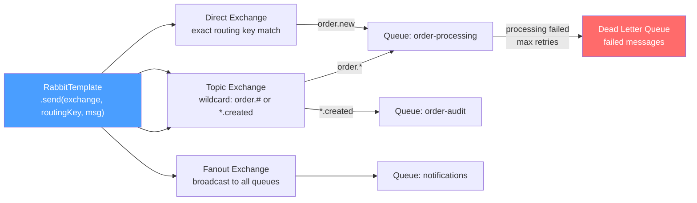

# 🐇 Spring AMQP and RabbitMQ

> [!abstract] TL;DR
> RabbitMQ is a message broker implementing AMQP. Producers send to **Exchanges** (not queues directly). Exchanges route messages to **Queues** based on **Bindings** and **Routing Keys**. `RabbitTemplate` publishes; `@RabbitListener` consumes. Always configure a **Dead Letter Queue** (DLQ) to capture messages that fail processing. Spring AMQP auto-acknowledges by default — set `acknowledge-mode: manual` for at-least-once guarantees.

## Intuition — analogy FIRST
RabbitMQ is like a post office with sorting departments (exchanges). You don't address letters directly to the recipient's desk — you send them to the sorting department with a code (routing key). The sorting department uses routing tables (bindings) to decide which mail box (queue) each letter goes to. A Direct exchange is like an exact address; Topic is like wildcard postal codes; Fanout sends copies to everyone. Dead Letter Queue is the return-to-sender department for undeliverable mail.

---

## How It Works



## Key Concepts / Details

### Setup

```xml
<dependency>
    <groupId>org.springframework.boot</groupId>
    <artifactId>spring-boot-starter-amqp</artifactId>
</dependency>
```

```yaml
spring:
  rabbitmq:
    host: localhost
    port: 5672
    username: guest
    password: guest
    virtual-host: /
    listener:
      simple:
        acknowledge-mode: auto   # auto | manual | none
        concurrency: 3           # min consumer threads
        max-concurrency: 10      # max consumer threads
        prefetch: 1              # messages prefetched per consumer (affects fairness)
        retry:
          enabled: true
          max-attempts: 3
          initial-interval: 1000ms
          multiplier: 2.0        # exponential: 1s, 2s, 4s
```

### Exchange, Queue, and Binding Configuration

```java
@Configuration
public class RabbitMQConfig {

    public static final String ORDER_EXCHANGE = "order-exchange";
    public static final String ORDER_QUEUE = "order-processing-queue";
    public static final String ORDER_ROUTING_KEY = "order.new";
    public static final String DLQ = "order-processing-dlq";
    public static final String DLX = "dead-letter-exchange";

    // Dead Letter Exchange and Queue first (referenced by main queue)
    @Bean
    public DirectExchange deadLetterExchange() {
        return new DirectExchange(DLX);
    }

    @Bean
    public Queue deadLetterQueue() {
        return QueueBuilder.durable(DLQ).build();
    }

    @Bean
    public Binding deadLetterBinding() {
        return BindingBuilder.bind(deadLetterQueue())
            .to(deadLetterExchange())
            .with("order.processing.dlq");
    }

    // Main exchange and queue
    @Bean
    public TopicExchange orderExchange() {
        return new TopicExchange(ORDER_EXCHANGE, true, false);  // durable, not auto-delete
    }

    @Bean
    public Queue orderProcessingQueue() {
        return QueueBuilder.durable(ORDER_QUEUE)
            // Messages are dead-lettered here when rejected or TTL expires
            .withArgument("x-dead-letter-exchange", DLX)
            .withArgument("x-dead-letter-routing-key", "order.processing.dlq")
            .withArgument("x-message-ttl", 60000)  // 60 second TTL
            .build();
    }

    @Bean
    public Binding orderBinding(Queue orderProcessingQueue, TopicExchange orderExchange) {
        return BindingBuilder.bind(orderProcessingQueue)
            .to(orderExchange)
            .with("order.#");  // matches order.new, order.updated, order.cancelled etc.
    }

    // Message converter — use Jackson JSON
    @Bean
    public MessageConverter messageConverter(ObjectMapper objectMapper) {
        return new Jackson2JsonMessageConverter(objectMapper);
    }

    @Bean
    public RabbitTemplate rabbitTemplate(ConnectionFactory connectionFactory,
                                          MessageConverter messageConverter) {
        RabbitTemplate template = new RabbitTemplate(connectionFactory);
        template.setMessageConverter(messageConverter);
        // Publisher confirm (ensure message reached exchange)
        template.setConfirmCallback((correlationData, ack, cause) -> {
            if (!ack) log.error("Message not acknowledged by exchange: {}", cause);
        });
        return template;
    }
}
```

### Publishing Messages

```java
@Service
public class OrderEventPublisher {
    private final RabbitTemplate rabbitTemplate;

    // Simple publish
    public void publishOrderCreated(OrderCreatedEvent event) {
        rabbitTemplate.convertAndSend(
            RabbitMQConfig.ORDER_EXCHANGE,       // exchange
            RabbitMQConfig.ORDER_ROUTING_KEY,   // routing key
            event);                              // payload (converted to JSON)
    }

    // Publish with custom message properties
    public void publishWithHeaders(OrderEvent event) {
        MessagePostProcessor postProcessor = message -> {
            MessageProperties props = message.getMessageProperties();
            props.setMessageId(UUID.randomUUID().toString());
            props.setHeader("event-type", event.getType());
            props.setHeader("source-service", "order-service");
            props.setExpiration("30000");  // 30 second TTL for this specific message
            return message;
        };
        rabbitTemplate.convertAndSend(
            RabbitMQConfig.ORDER_EXCHANGE,
            RabbitMQConfig.ORDER_ROUTING_KEY,
            event,
            postProcessor);
    }
}
```

### Consuming Messages

```java
@Service
public class OrderProcessor {

    // Simple consumer — auto-acknowledge
    @RabbitListener(queues = RabbitMQConfig.ORDER_QUEUE)
    public void processOrder(OrderCreatedEvent event) {
        orderService.process(event);
        // Auto-ack: message deleted from queue after method returns normally
        // Exception: message nacked and retried (or dead-lettered after max attempts)
    }

    // Manual acknowledge — full control
    @RabbitListener(queues = RabbitMQConfig.ORDER_QUEUE,
                    ackMode = "MANUAL")
    public void processOrderManual(OrderCreatedEvent event,
                                    Message message,
                                    Channel channel) throws IOException {
        long deliveryTag = message.getMessageProperties().getDeliveryTag();
        try {
            orderService.process(event);
            channel.basicAck(deliveryTag, false);  // ack single message
        } catch (BusinessException e) {
            // Reject and dead-letter (don't requeue)
            channel.basicNack(deliveryTag, false, false);
        } catch (TransientException e) {
            // Requeue for retry
            channel.basicNack(deliveryTag, false, true);
        }
    }

    // With message metadata
    @RabbitListener(queues = RabbitMQConfig.ORDER_QUEUE)
    public void processWithHeaders(OrderCreatedEvent event,
                                    @Header("event-type") String eventType,
                                    @Header(AmqpHeaders.RECEIVED_ROUTING_KEY) String routingKey,
                                    MessageProperties properties) {
        log.info("Processing {} event via {}", eventType, routingKey);
        orderService.process(event);
    }

    // Multiple queue consumer
    @RabbitListener(queues = {"queue-a", "queue-b", "queue-c"})
    public void processMultipleQueues(String payload) { /* ... */ }
}
```

### Exchange Types Comparison

| Exchange | Routing Logic | Use Case |
|----------|--------------|----------|
| **Direct** | Exact routing key match | Simple task routing, RPC |
| **Topic** | Wildcard (`*` = one word, `#` = zero or more) | Event routing with type hierarchy |
| **Fanout** | No routing key — broadcast to all bound queues | Notifications, cache invalidation |
| **Headers** | Match on message headers (not routing key) | Complex routing based on message attributes |
| **Default** | Routes to queue with same name as routing key | Simple default routing |

---

## Real-World Notes

- **Prefetch count = 1**: with `prefetch: 1`, each consumer gets one message at a time. This prevents one slow consumer from hoarding messages. The trade-off is more network roundtrips. For high-throughput, increase to 10-100.
- **Durable + persistent**: queues need `durable: true` AND messages need `deliveryMode: PERSISTENT` to survive broker restart. Spring AMQP sets persistent delivery mode by default.
- **RabbitMQ vs Kafka**: RabbitMQ is better for work queues, routing, and short-lived messages. Kafka is better for event streaming, replay, and high throughput. RabbitMQ deletes consumed messages; Kafka retains them for a configurable period.
- **Publisher confirms vs transactions**: publisher confirms (async) are faster but don't guarantee ordering. Transactions (synchronous) are slower but ensure the message was persisted. Use confirms for most cases.

---

## Common Pitfalls

- **Messages lost on crash without durability**: both the queue AND messages must be durable/persistent. A durable queue with non-persistent messages still loses messages on broker restart.
- **Infinite retry loop without DLQ**: if processing fails every time and there's no DLQ, the message bounces between the queue and the broker forever. Always configure DLQ.
- **Memory pressure without consumer prefetch**: without prefetch limits, a slow consumer can get all messages from the queue, buffering them in memory while they wait to be processed. Set `prefetch: 10` as a starting point.
- **Converting exceptions**: Spring AMQP wraps `RuntimeException` in `AmqpException`. Always handle specific exceptions and decide to ack, nack+requeue, or nack+DLQ.

---

## Related Concepts

- [[Spring_Kafka]] — Compare RabbitMQ work-queue model with Kafka streaming model
- [[Event_Driven_Architecture]] — Publisher/subscriber patterns and outbox pattern
- [[Saga_Pattern]] — Using RabbitMQ for choreography sagas

---

## Review Questions

1. What is the difference between a Direct, Topic, and Fanout exchange?
2. What does `prefetch: 1` do and how does it affect consumer fairness?
3. What is a Dead Letter Queue (DLQ) and when are messages routed to it?
4. What is the difference between `basicNack(tag, false, true)` and `basicNack(tag, false, false)`?
5. When would you choose RabbitMQ over Kafka?

---

## Sources

- Spring AMQP Reference: https://docs.spring.io/spring-amqp/docs/current/reference/html/
- RabbitMQ Documentation: https://www.rabbitmq.com/documentation.html

#java #spring #messaging #rabbitmq #amqp #rabbitlistener #dead-letter-queue #exchange #queue
