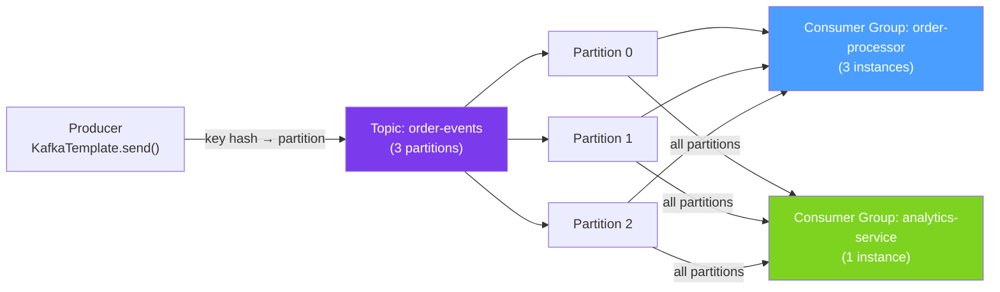

# 📊 Spring Kafka

> [!abstract] TL;DR
> Apache Kafka is a distributed event streaming platform. Messages (events) are written to **Topics** which are split into **Partitions** for parallelism. **Consumer Groups** allow multiple instances to share the load — each partition goes to exactly one consumer in the group. `KafkaTemplate` publishes; `@KafkaListener` consumes. Key guarantee: **Kafka retains messages** (configurable retention), enabling replay — unlike RabbitMQ which deletes consumed messages.

## Intuition — analogy FIRST
Kafka is like an append-only logbook (commit log) split into multiple chapters (partitions). Writers (producers) add entries to the end — no deleting or updating. Readers (consumers) keep a bookmark (offset) remembering where they've read to. Multiple readers can read the same logbook independently — one for analytics, one for billing, one for notifications. If a reader crashes, they resume from their bookmark. RabbitMQ is like a to-do list — items are crossed off when done. Kafka is like the company's immutable transaction history — nothing is ever crossed out.

---

## How It Works



## Key Concepts / Details

### Setup and Configuration

```xml
<dependency>
    <groupId>org.springframework.kafka</groupId>
    <artifactId>spring-kafka</artifactId>
</dependency>
```

```yaml
spring:
  kafka:
    bootstrap-servers: localhost:9092

    # Producer configuration
    producer:
      key-serializer: org.apache.kafka.common.serialization.StringSerializer
      value-serializer: org.springframework.kafka.support.serializer.JsonSerializer
      acks: all           # wait for ALL in-sync replicas to acknowledge (highest durability)
      retries: 3
      properties:
        enable.idempotence: true    # exactly-once producer semantics
        max.in.flight.requests.per.connection: 5

    # Consumer configuration
    consumer:
      group-id: order-processor
      key-deserializer: org.apache.kafka.common.serialization.StringDeserializer
      value-deserializer: org.springframework.kafka.support.serializer.JsonDeserializer
      auto-offset-reset: earliest   # start from beginning for new consumers (earliest|latest)
      enable-auto-commit: false     # manual offset commit for at-least-once
      properties:
        spring.json.trusted.packages: "com.example.events"

    # Listener configuration
    listener:
      ack-mode: manual_immediate    # commit offset manually
      concurrency: 3               # threads per @KafkaListener (ideally = partition count)
      poll-timeout: 3000ms
```

### Publishing Messages — KafkaTemplate

```java
@Service
public class OrderEventPublisher {
    private final KafkaTemplate<String, OrderEvent> kafkaTemplate;

    // Simple send — returns ListenableFuture (async)
    public void publishOrderCreated(Order order) {
        OrderCreatedEvent event = OrderCreatedEvent.from(order);
        kafkaTemplate.send("order-events", order.getId().toString(), event)
            // order ID as key → same order always goes to same partition
            .whenComplete((result, ex) -> {
                if (ex != null) {
                    log.error("Failed to publish order event", ex);
                } else {
                    log.debug("Published to partition {} offset {}",
                        result.getRecordMetadata().partition(),
                        result.getRecordMetadata().offset());
                }
            });
    }

    // Send with full ProducerRecord (all headers, timestamp control)
    public void publishWithHeaders(OrderEvent event) {
        ProducerRecord<String, OrderEvent> record = new ProducerRecord<>(
            "order-events",           // topic
            null,                     // partition (null = use key hash)
            System.currentTimeMillis(), // timestamp
            event.getOrderId(),       // key
            event,                    // value
            List.of(
                new RecordHeader("event-type", event.getType().getBytes()),
                new RecordHeader("source", "order-service".getBytes())
            )
        );
        kafkaTemplate.send(record);
    }

    // Transactional publishing (exactly-once with Spring @Transactional)
    @Transactional
    public void publishTransactional(OrderEvent event) {
        orderRepo.save(event.toEntity());     // DB write
        kafkaTemplate.send("order-events", event.getOrderId(), event);
        // Both DB save and Kafka publish are in the same transaction
        // (requires Kafka transactions enabled)
    }
}
```

### Consuming Messages — @KafkaListener

```java
@Service
public class OrderEventConsumer {

    // Simple consumer — batch = false (single message)
    @KafkaListener(
        topics = "order-events",
        groupId = "order-processor",
        containerFactory = "kafkaListenerContainerFactory"
    )
    public void handleOrderCreated(
            @Payload OrderCreatedEvent event,
            @Header(KafkaHeaders.RECEIVED_PARTITION) int partition,
            @Header(KafkaHeaders.OFFSET) long offset,
            Acknowledgment acknowledgment) {

        try {
            orderProcessingService.process(event);
            acknowledgment.acknowledge();       // commit offset after successful processing
        } catch (RetryableException e) {
            // Don't acknowledge — message will be redelivered
            throw e;
        } catch (NonRetryableException e) {
            acknowledgment.acknowledge();       // acknowledge to skip the message
            errorHandler.handlePoisonPill(event, e);  // send to DLT (dead letter topic)
        }
    }

    // Batch consumer — process multiple records at once
    @KafkaListener(
        topics = "order-events",
        groupId = "batch-processor",
        containerFactory = "batchKafkaListenerContainerFactory"
    )
    public void handleBatch(List<OrderEvent> events,
                             List<Acknowledgment> acks) {
        // Bulk process all events
        orderService.processBatch(events);
        acks.forEach(Acknowledgment::acknowledge);  // acknowledge all
    }

    // Consumer with ConsumerRecord for full Kafka metadata
    @KafkaListener(topics = "order-events")
    public void handleRecord(ConsumerRecord<String, OrderEvent> record) {
        log.info("Key: {}, Partition: {}, Offset: {}, Timestamp: {}",
            record.key(), record.partition(), record.offset(), record.timestamp());
        process(record.value());
    }
}
```

### Error Handling — Dead Letter Topics

```java
@Configuration
public class KafkaConfig {

    @Bean
    public ConcurrentKafkaListenerContainerFactory<String, Object>
            kafkaListenerContainerFactory(ConsumerFactory<String, Object> consumerFactory) {

        ConcurrentKafkaListenerContainerFactory<String, Object> factory =
            new ConcurrentKafkaListenerContainerFactory<>();
        factory.setConsumerFactory(consumerFactory);
        factory.getContainerProperties().setAckMode(ContainerProperties.AckMode.MANUAL_IMMEDIATE);

        // Dead Letter Publishing Recoverer — send failed messages to <topic>.DLT
        DeadLetterPublishingRecoverer recoverer = new DeadLetterPublishingRecoverer(kafkaTemplate,
            (record, exception) -> new TopicPartition(record.topic() + ".DLT", record.partition()));

        // Retry 3 times with exponential backoff, then DLT
        DefaultErrorHandler errorHandler = new DefaultErrorHandler(
            recoverer,
            new FixedBackOff(1000L, 3L));  // retry every 1s, max 3 times

        // Don't retry validation errors — straight to DLT
        errorHandler.addNotRetryableExceptions(
            IllegalArgumentException.class,
            BusinessException.class);

        factory.setCommonErrorHandler(errorHandler);
        return factory;
    }
}
```

### Offset Management and Rebalancing

```java
// Seek to beginning when partition assigned (replay from start)
@Service
public class ReplayableConsumer implements ConsumerSeekAware {
    private ConsumerSeekCallback seekCallback;

    @Override
    public void registerSeekCallback(ConsumerSeekCallback callback) {
        this.seekCallback = callback;
    }

    @Override
    public void onPartitionsAssigned(Map<TopicPartition, Long> assignments,
                                      ConsumerSeekCallback callback) {
        // Replay from beginning on assignment
        assignments.forEach((partition, offset) ->
            callback.seekToBeginning(partition.topic(), partition.partition()));
    }

    // Or seek to a specific timestamp
    public void reprocessFrom(Instant from) {
        seekCallback.seekToTimestamp("order-events", from.toEpochMilli());
    }
}
```

### Kafka vs RabbitMQ

| Feature | RabbitMQ | Kafka |
|---------|----------|-------|
| **Message deletion** | On acknowledgment | Based on retention period |
| **Replay** | No (messages deleted) | Yes (seek to offset) |
| **Ordering** | Per-queue FIFO | Per-partition ordering |
| **Throughput** | 20K-50K msg/s | 1M+ msg/s |
| **Routing** | Flexible (exchanges, headers) | Simple (topic + key) |
| **Consumers** | Competing (round-robin) | Consumer groups (parallel) |
| **Use case** | Work queues, RPC, routing | Event streaming, analytics, audit log |
| **Setup** | Simple | Complex (Zookeeper or KRaft) |

---

## Real-World Notes

- **Partition count = max parallelism**: you can't have more consumers in a group than partitions. Plan partition count at topic creation — it's hard to change later. Start with more partitions than you need.
- **Message keys determine partition**: always use a business key (order ID, user ID) so related events go to the same partition and are processed in order. `null` keys round-robin across partitions.
- **`enable.idempotence: true`**: prevents duplicate messages on producer retry. Combined with `acks=all` and `max.in.flight.requests=5`, this gives exactly-once producer semantics.
- **Consumer lag monitoring**: `kafka-consumer-groups.sh --describe` shows lag (unconsumed messages) per partition. High lag indicates consumer can't keep up with producer — scale consumers or optimize processing.

---

## Common Pitfalls

- **Auto-commit = at-most-once**: `enable-auto-commit: true` commits offsets periodically, before you know if processing succeeded. Use manual commit for at-least-once.
- **Message ordering broken by parallelism**: `concurrency: 3` creates 3 consumer threads, each pulling from different partitions. Messages in the same partition are ordered, but cross-partition is not. Don't assume global ordering.
- **Deserialization exceptions stop the consumer**: if the deserializer fails (bad message format), the consumer can get stuck retrying forever. Configure `ErrorHandlingDeserializer` to handle deserialization failures gracefully.
- **Consumer lag from blocking processing**: if each message takes 500ms to process and you have 1000 msg/s, you need 500 concurrent consumers. Use reactive Kafka or increase partitions and consumer concurrency.

---

## Related Concepts

- [[Spring_AMQP_RabbitMQ]] — Contrast Kafka streaming with RabbitMQ work queues
- [[Event_Driven_Architecture]] — Kafka is the backbone of event sourcing
- [[Reactive_Streams]] — Reactive Kafka (ReactiveKafkaConsumerTemplate) for non-blocking consumers

---

## Review Questions

1. What is the relationship between topics, partitions, and consumer groups?
2. How does Kafka ensure message ordering? Under what conditions is ordering not guaranteed?
3. What is the difference between `enable-auto-commit: true` and manual acknowledgment?
4. How does a Dead Letter Topic (DLT) differ from a Dead Letter Queue (DLQ) in RabbitMQ?
5. When would you choose Kafka over RabbitMQ and vice versa?

---

## Sources

- Spring Kafka Reference: https://docs.spring.io/spring-kafka/docs/current/reference/html/
- Apache Kafka Documentation: https://kafka.apache.org/documentation/
- Kafka: The Definitive Guide (Confluent Press)

#java #spring #messaging #kafka #kafkalistener #kafkatemplate #consumer-groups #partitions #event-streaming
