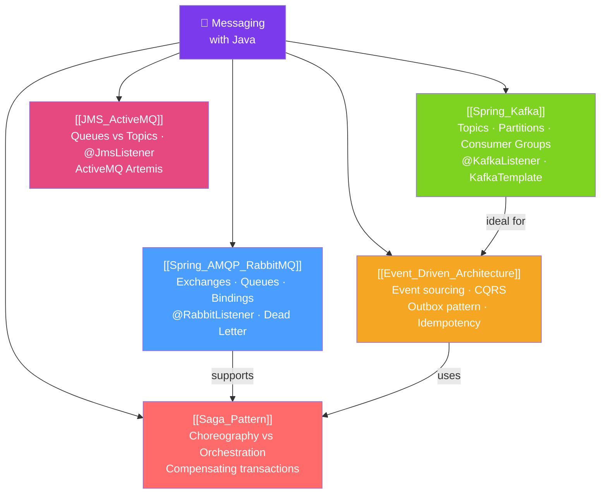

# 📨 Messaging with Java — Map of Content

> [!abstract] What This Section Covers
> Asynchronous messaging decouples producers from consumers, enabling resilient, scalable systems. This section covers Spring AMQP for RabbitMQ (work queues, exchanges, routing), Spring Kafka for event streaming (topics, partitions, consumer groups), JMS with ActiveMQ, event-driven architecture patterns, and the Saga pattern for distributed transactions.

## Concept Map

## Learning Path
1. [[Event_Driven_Architecture]] — Understand why async messaging matters and the core patterns.
2. [[Spring_AMQP_RabbitMQ]] — RabbitMQ for work queues, routing, and reliable messaging.
3. [[Spring_Kafka]] — Kafka for high-throughput event streaming with replay capability.
4. [[JMS_ActiveMQ]] — Standard JMS API and ActiveMQ for enterprise messaging.
5. [[Saga_Pattern]] — Distributed transactions via choreography and orchestration sagas.

## All Notes at a Glance
| Note | Difficulty | What You'll Learn |
|------|------------|-------------------|
| [[Spring_AMQP_RabbitMQ]] | Intermediate | AMQP model, exchanges/queues, @RabbitListener, DLQ |
| [[Spring_Kafka]] | Advanced | Topics, partitions, consumer groups, exactly-once semantics |
| [[JMS_ActiveMQ]] | Intermediate | JMS API, queues vs topics, transaction support |
| [[Event_Driven_Architecture]] | Advanced | Event sourcing, CQRS, outbox pattern, idempotency |
| [[Saga_Pattern]] | Advanced | Choreography/orchestration sagas, compensating transactions |

## Key Questions This Section Answers
- When should you use RabbitMQ vs Kafka?
- How do you guarantee message delivery exactly once?
- What is the outbox pattern and why does it prevent data loss?
- How do you implement distributed transactions without 2PC using Sagas?
- What is the difference between event-driven and request-driven architecture?

## Related Sections
- [[_MOC_Java_Master|↑ Java Master MOC]]
- [[_MOC_Microservices_Java|← Microservices]] — Messaging is the backbone of async microservice communication
- [[_MOC_Reactive_Programming|→ Reactive]] — Reactive Kafka and WebFlux for non-blocking message processing
- [[_MOC_Spring_Data|← Spring Data]] — Outbox pattern requires transactional DB writes

#MOC #java #spring #messaging #kafka #rabbitmq #event-driven
