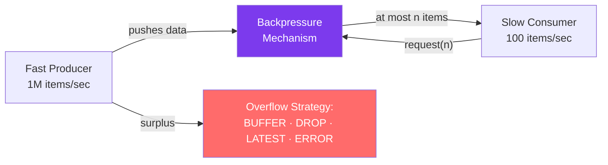

# 🛑 Backpressure in Reactive Streams

> [!abstract] TL;DR
> Backpressure is the mechanism by which a **slow consumer signals to a fast producer** how much data it can handle, preventing out-of-memory errors. In Reactive Streams, the `Subscriber` calls `Subscription.request(n)` to demand exactly `n` items. When the consumer can't keep up, overflow strategies determine what happens: **BUFFER** (store), **DROP** (discard new), **LATEST** (keep only most recent), or **ERROR** (fail fast). Most real-world issues arise when connecting reactive streams to non-backpressure-aware systems.

## Intuition — analogy FIRST
Backpressure is like a sushi conveyor belt with a traffic light system. The chef (producer) places sushi (data items) on the belt continuously. Without backpressure, the belt just keeps moving — sushi piles up at your seat until it falls on the floor (OOM error). With backpressure, you have a button that signals "ready for 3 more pieces" (`request(3)`). The chef only sends 3 pieces, then waits. When you press the button again, 3 more pieces come. The chef and diner are perfectly synchronized — no waste, no overflow.

---

## How It Works



## Key Concepts / Details

### How Backpressure Works

```java
// The protocol:
// 1. Subscriber.onSubscribe(subscription)  — publisher provides the subscription handle
// 2. Subscription.request(n)              — subscriber demands n items
// 3. Publisher.onNext(item) × n           — publisher sends exactly n items
// 4. Subscription.request(m)              — subscriber demands m more
// repeat...

// In Project Reactor, you set demand via operators — rarely manual
// Most operators handle backpressure automatically:

Flux.range(1, 1_000_000)  // fast producer
    .filter(n -> n % 2 == 0)
    .map(n -> n * 2)
    .subscribe(n -> {
        // Consumer — each call to onNext triggers one more request(1) internally
        slowProcessing(n);   // 10ms per item
    });
// Reactor's default subscriber uses request(1) after each onNext — fully synchronous
```

### Overflow Strategies — When Consumer Can't Keep Up

```java
// Used when connecting a HOT publisher (doesn't respect backpressure) to a slow consumer

// Strategy 1: BUFFER — queue items until consumer catches up
Flux.interval(Duration.ofMillis(1))           // emits every 1ms
    .onBackpressureBuffer(1000)               // buffer up to 1000 items
    .delayElements(Duration.ofMillis(100))    // consumer takes 100ms
    .subscribe(n -> process(n));
// Risk: buffer fills up → OverflowException. Use bounded buffer.

// Strategy 2: DROP — discard newest items that can't be handled
Flux.interval(Duration.ofMillis(1))
    .onBackpressureDrop(dropped -> log.warn("Dropped: {}", dropped))
    .delayElements(Duration.ofMillis(100))
    .subscribe(n -> process(n));
// Best for: real-time data where missing items is acceptable (telemetry, metrics)

// Strategy 3: LATEST — keep only the most recent item, drop rest
Flux.interval(Duration.ofMillis(1))
    .onBackpressureLatest()               // always have the latest reading
    .delayElements(Duration.ofMillis(100))
    .subscribe(n -> process(n));
// Best for: UI updates, sensor data — stale intermediate values don't matter

// Strategy 4: ERROR — fail fast when overflow occurs
Flux.interval(Duration.ofMillis(1))
    .onBackpressureError()               // throw OverflowException on first overflow
    .delayElements(Duration.ofMillis(100))
    .subscribe(
        n -> process(n),
        ex -> log.error("Overflow! {}", ex.getMessage()));
// Best for: strict data integrity — you must know about every item
```

### Backpressure with limitRate

```java
// limitRate controls how many items are prefetched
// Prevents requesting Long.MAX_VALUE from the source

Flux.range(1, 10_000)
    .limitRate(100)          // request 100 at a time (75% consumed → request next 75)
    .map(this::process)
    .subscribe();

// Low-level: custom subscriber with manual request
Flux.range(1, Integer.MAX_VALUE)
    .subscribe(new BaseSubscriber<Integer>() {
        @Override
        protected void hookOnSubscribe(Subscription subscription) {
            request(10);  // initial demand
        }

        @Override
        protected void hookOnNext(Integer value) {
            process(value);
            request(1);   // request one more after each processing
        }

        @Override
        protected void hookOnError(Throwable throwable) {
            log.error("Stream error", throwable);
        }
    });
```

### Bridging to Non-Reactive Code — Sinks

```java
// Sinks.Many — programmatically push items into a reactive stream
// with backpressure handling

// Many.unicast: one subscriber only
Sinks.Many<Integer> sink = Sinks.many().unicast().onBackpressureBuffer();

// Producer thread: push items
CompletableFuture.runAsync(() -> {
    for (int i = 0; i < 1000; i++) {
        Sinks.EmitResult result = sink.tryEmitNext(i);
        if (result == Sinks.EmitResult.FAIL_OVERFLOW) {
            log.warn("Sink overflow at item {}", i);
        }
    }
    sink.emitComplete(Sinks.EmitFailureHandler.FAIL_FAST);
});

// Consumer (reactive)
sink.asFlux()
    .delayElements(Duration.ofMillis(10))  // simulate slow consumer
    .subscribe(n -> process(n));

// Many.multicast: multiple subscribers
Sinks.Many<String> multicastSink = Sinks.many().multicast()
    .onBackpressureBuffer(256, false);  // buffer 256, don't cancel on overflow

// Many.replay: replay last N items to new subscribers
Sinks.Many<String> replaySink = Sinks.many().replay().limit(100);
```

### Backpressure in WebFlux with SSE

```java
// Server-Sent Events — server streams data to client
// The network itself provides backpressure (TCP flow control)

@GetMapping(value = "/live-orders", produces = MediaType.TEXT_EVENT_STREAM_VALUE)
public Flux<ServerSentEvent<OrderUpdate>> streamOrders() {
    return orderEventFlux
        .onBackpressureDrop()           // drop events if client is too slow
        .map(event -> ServerSentEvent.<OrderUpdate>builder()
            .id(event.getId().toString())
            .event("order-update")
            .data(event)
            .build())
        .doOnCancel(() -> log.info("Client disconnected"));
    // WebFlux/Netty handles TCP-level backpressure automatically
}
```

### Backpressure in Reactive Kafka

```java
// Reactive Kafka consumer with backpressure
ReactiveKafkaConsumerTemplate<String, OrderEvent> kafkaTemplate;

kafkaTemplate.receive()
    .limitRate(100)              // request 100 records from Kafka at a time
    .flatMap(record -> {
        return processOrder(record.value())
            .doOnSuccess(r -> record.receiverOffset().acknowledge());
    }, 10)                       // max 10 concurrent processing
    .subscribe();
```

---

## Real-World Notes

- **Operator fusion**: Reactor optimizes adjacent operators (e.g., `filter` + `map`) into a single step without intermediate allocation. Backpressure propagates through fused chains more efficiently.
- **Network = natural backpressure**: when writing to a network socket (HTTP, WebSocket, SSE), TCP's receive buffer fills up when the client reads slowly, providing natural backpressure all the way back to the Flux source.
- **`Long.MAX_VALUE` = no backpressure**: many Reactor operators request `Long.MAX_VALUE` by default — they assume they can handle unlimited items. This is fine for bounded sources but catastrophic for unbounded sources (Kafka, database cursors, intervals).
- **BlockingSink**: if you're pushing to a Sink from a non-reactive thread, use `Sinks.Many` with `tryEmitNext()` and handle the `EmitResult` — don't assume success.

---

## Common Pitfalls

- **Buffer overflow**: `onBackpressureBuffer()` without a bound grows indefinitely until OOM. Always specify a max: `onBackpressureBuffer(1000, BufferOverflowStrategy.DROP_LATEST)`.
- **flatMap with unbounded concurrency**: `flatMap(fn)` defaults to 256 concurrent subscriptions. For external HTTP calls, this floods the downstream service. Use `flatMap(fn, maxConcurrency)` to throttle.
- **Missing backpressure in hot publisher**: `Flux.interval()` emits at fixed rate regardless of consumer speed. Always add an overflow strategy when using hot publishers.
- **Ignoring `EmitResult` on Sink**: `sink.tryEmitNext(item)` returns `FAIL_OVERFLOW`, `FAIL_TERMINATED`, etc. Ignoring these means silently losing items. Handle each result appropriately.

---

## Related Concepts

- [[Reactive_Streams]] — The specification where backpressure (`request(n)`) is defined
- [[Project_Reactor]] — Reactor operators implement backpressure automatically
- [[Spring_WebFlux]] — WebFlux leverages backpressure for efficient streaming

---

## Review Questions

1. What is backpressure and what problem does it solve in reactive systems?
2. What are the four overflow strategies in Project Reactor? When would you use each?
3. How does `Subscription.request(n)` implement the backpressure demand protocol?
4. What does `limitRate(100)` do and how does it interact with backpressure?
5. When using SSE with WebFlux, where does backpressure naturally come from?

---

## Sources

- Project Reactor Reference: https://projectreactor.io/docs/core/release/reference/#reactive.backpressure
- Reactive Streams Specification: https://www.reactive-streams.org/

#java #spring #reactive #backpressure #overflow #buffer #drop #sinks #demand-signaling
