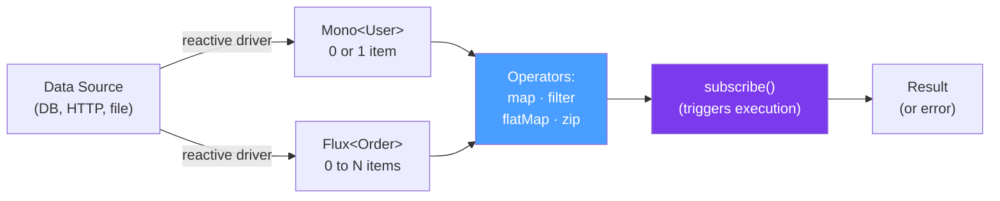

# ⚗️ Project Reactor

> [!abstract] TL;DR
> Project Reactor is Spring's reactive library implementing Reactive Streams. **`Mono<T>`** — 0 or 1 elements (like `Optional` but async). **`Flux<T>`** — 0 to N elements (like `Stream` but async). Everything is **lazy** — nothing executes until you `subscribe()`. Key operators: `map` (transform), `flatMap` (transform + unwrap), `filter`, `zip`, `merge`. Use `Schedulers.boundedElastic()` for blocking operations.

## Intuition — analogy FIRST
A `Mono` is like an Amazon delivery promise — the item will arrive (or won't, or there'll be an error) at some point in the future. A `Flux` is like a Netflix show — episodes (items) arrive one by one over time, and you can react to each one. Building a Reactor pipeline is like setting up assembly-line instructions before the factory opens — you describe what should happen to each item, but nothing actually moves until the factory starts (`subscribe()`). The factory (event loop) processes items as they arrive, never blocking the line.

---

## How It Works



## Key Concepts / Details

### Mono — 0 or 1 Items

```java
// Creating Monos
Mono<String> just = Mono.just("hello");                          // emit one item
Mono<String> empty = Mono.empty();                               // emit nothing
Mono<String> error = Mono.error(new RuntimeException("oops"));  // emit error
Mono<String> defer = Mono.defer(() -> Mono.just(computeValue())); // lazy evaluation
Mono<String> fromCallable = Mono.fromCallable(() -> blockingMethod()); // wrap blocking call

// Transforming Monos
Mono<Integer> length = Mono.just("hello")
    .map(String::length);           // synchronous transform: "hello" → 5

Mono<User> user = Mono.just("user-123")
    .flatMap(id -> userRepo.findById(id));  // async transform: id → Mono<User>

// Combining
Mono<String> combined = Mono.zip(
    userRepo.findById("u1"),        // Mono<User>
    orderRepo.findById("o1"))       // Mono<Order>
    .map(tuple -> tuple.getT1().getName() + " placed " + tuple.getT2().getId());

// Error handling
Mono<User> safe = userRepo.findById(userId)
    .switchIfEmpty(Mono.error(new UserNotFoundException(userId)))
    .onErrorReturn(DatabaseException.class, User.anonymous())
    .onErrorMap(IOException.class, e -> new ServiceException("DB unavailable", e));
```

### Flux — 0 to N Items

```java
// Creating Flux
Flux<Integer> range = Flux.range(1, 100);                   // 1, 2, 3, ..., 100
Flux<String> fromList = Flux.fromIterable(List.of("a", "b", "c"));
Flux<Long> interval = Flux.interval(Duration.ofSeconds(1)); // 0, 1, 2, 3... every second
Flux<String> fromStream = Flux.fromStream(Stream.of("x", "y"));
Flux<String> concat = Flux.concat(Flux.just("a", "b"), Flux.just("c")); // sequential
Flux<String> merge = Flux.merge(Flux.just("a", "b"), Flux.just("c"));   // concurrent

// Transforming Flux
Flux<String> upper = Flux.just("hello", "world")
    .map(String::toUpperCase);                  // "HELLO", "WORLD"

Flux<Order> orders = Flux.fromIterable(userIds)
    .flatMap(id -> orderRepo.findByUserId(id)); // for each userId, get orders (concurrent!)
    // flatMap subscribes to each inner Mono concurrently — faster than sequential

Flux<Order> sequential = Flux.fromIterable(userIds)
    .concatMap(id -> orderRepo.findByUserId(id)); // sequential — maintains order

// Filtering
Flux<Integer> even = Flux.range(1, 10)
    .filter(n -> n % 2 == 0);                  // 2, 4, 6, 8, 10

// Grouping and windowing
Flux<List<Integer>> batches = Flux.range(1, 100)
    .buffer(10);                                // emit List<Integer> of 10 items at a time

Flux<Flux<Integer>> windows = Flux.range(1, 100)
    .window(10);                                // emit Flux<Integer> window of 10

// Aggregating
Mono<List<Integer>> list = Flux.range(1, 5).collectList();                // [1,2,3,4,5]
Mono<Map<String, User>> map = userFlux.collectMap(User::getId);           // id → user
Mono<Long> count = Flux.range(1, 100).count();                            // 100
Mono<Integer> sum = Flux.range(1, 10).reduce(0, Integer::sum);            // 55
```

### Critical Operators — map vs flatMap

```java
// map — synchronous 1:1 transform (same thread, no new publisher)
Flux<String> names = userFlux.map(User::getName);  // User → String

// flatMap — async 1:1 transform, subscribes concurrently
// Each inner Publisher is subscribed CONCURRENTLY (no order guarantee)
Flux<Order> orders = userFlux.flatMap(user ->
    orderRepo.findByUserId(user.getId()));          // User → Flux<Order>, concurrent

// concatMap — async sequential (order preserved)
// Each inner Publisher subscribed AFTER previous completes
Flux<Order> orderedOrders = userFlux.concatMap(user ->
    orderRepo.findByUserId(user.getId()));          // sequential

// flatMapMany — Mono → Flux
Flux<Order> fromMono = userMono.flatMapMany(user ->
    orderRepo.findByUserId(user.getId()));

// switchMap — cancels previous inner publisher when new item arrives
// Useful for "search as you type" — only latest query matters
Flux<SearchResult> typeahead = queryFlux.switchMap(q -> searchService.search(q));
```

### Error Handling

```java
Mono<User> getUser(String userId) {
    return userRepo.findById(userId)
        .onErrorReturn(new AnonymousUser())               // return default on any error
        .onErrorReturn(DatabaseException.class, AnonymousUser.DB_ERROR)  // typed
        .onErrorResume(ex -> fallbackRepo.findById(userId)) // try another source
        .onErrorMap(IOException.class, ServiceException::new)  // wrap error
        .doOnError(ex -> log.error("Error fetching user", ex))  // side effect on error
        .retry(3)                                         // retry 3 times on error
        .retryWhen(Retry.backoff(3, Duration.ofSeconds(1)) // exponential backoff retry
            .filter(ex -> ex instanceof TransientException));
}
```

### Schedulers — Controlling Threads

```java
// Reactor operators run on the thread that called subscribe() by default

// publishOn — switches thread for DOWNSTREAM operators
Flux.range(1, 100)
    .publishOn(Schedulers.parallel())   // downstream runs on parallel scheduler
    .map(this::cpuBoundOp);

// subscribeOn — switches thread for the ENTIRE pipeline (including source)
Mono.fromCallable(() -> blockingDbCall())
    .subscribeOn(Schedulers.boundedElastic())  // run blocking call on elastic thread pool
    .map(result -> transform(result));

// Key Schedulers:
Schedulers.immediate()        // current thread (default)
Schedulers.single()           // single reusable thread
Schedulers.parallel()         // CPU-count threads, non-blocking I/O only
Schedulers.boundedElastic()   // bounded thread pool for blocking I/O (max 10*CPU threads + 100K queue)
Schedulers.fromExecutorService(myPool)  // your custom executor

// Wrapping blocking code
Mono<String> blockingResult = Mono.fromCallable(() -> {
    return blockingJdbcQuery();  // would block event loop thread if not wrapped
}).subscribeOn(Schedulers.boundedElastic());  // offload to dedicated pool
```

### Context — Thread-Local Alternative

```java
// Thread-local doesn't work in reactive (different threads process same request)
// Use Context instead:

Mono<String> withUserId = Mono.deferContextual(ctx -> {
    String userId = ctx.get("userId");
    return processForUser(userId);
});

// Set context at subscription
withUserId.contextWrite(Context.of("userId", "user-123"))
    .subscribe();

// In Spring Security + WebFlux:
ReactiveSecurityContextHolder.getContext()
    .map(SecurityContext::getAuthentication)
    .flatMap(auth -> process(auth.getName()));
```

---

## Real-World Notes

- **Lazy evaluation**: `Mono.just(value)` evaluates `value` immediately. `Mono.defer(() -> Mono.just(computeValue()))` evaluates `computeValue()` only on subscription. Use `defer` for anything that should run per-subscription.
- **`flatMap` concurrency**: `flatMap(maxConcurrency)` controls how many inner publishers subscribe simultaneously. Default is 256 (essentially unlimited). For rate-limiting downstream calls: `flatMap(fn, 10)` = max 10 concurrent calls.
- **Don't nest subscribes**: calling `.subscribe()` inside a `.map()` or `.flatMap()` creates a disconnected reactive chain — errors don't propagate. Always use `flatMap` to chain reactive operations.
- **Hot vs Cold**: `Flux.just(...)` is cold — replays for each subscriber. Use `publish().autoConnect()` or `publish().refCount()` to make a cold flux hot (shared among subscribers).

---

## Common Pitfalls

- **Blocking inside reactive pipeline**: calling a blocking JDBC method inside `flatMap` blocks the event loop thread. Wrap with `Mono.fromCallable(blockingCall).subscribeOn(Schedulers.boundedElastic())`.
- **Forgetting `subscribe()`**: Mono/Flux chains are lazy — nothing executes without subscribe. In Spring WebFlux, the framework subscribes for you. Outside of WebFlux, always add `.subscribe()` or `.block()`.
- **Using `.block()` in WebFlux**: `.block()` blocks the event loop thread, potentially causing deadlocks in WebFlux. Only use `.block()` in main() or tests. Never in production WebFlux handlers.
- **Error handling gaps**: if an operator throws and there's no `onError` handler, the exception propagates to the subscriber's `onError` — which by default just logs and drops it. Always handle errors.

---

## Related Concepts

- [[Reactive_Streams]] — The specification Mono/Flux implement
- [[Spring_WebFlux]] — Using Mono/Flux in reactive HTTP handlers
- [[Backpressure]] — How Flux respects downstream demand

---

## Review Questions

1. What is the difference between `Mono<T>` and `Flux<T>`? Give a use case for each.
2. What is the difference between `map` and `flatMap` in Project Reactor?
3. What is the difference between `subscribeOn` and `publishOn`? When would you use each?
4. Why should you never call `.block()` inside a Spring WebFlux controller?
5. How do you make a blocking JDBC call safe to use in a reactive pipeline?

---

## Sources

- Project Reactor Reference Documentation: https://projectreactor.io/docs/core/release/reference/
- Reactor Core GitHub: https://github.com/reactor/reactor-core
- "Which operator do I need?" guide: https://projectreactor.io/docs/core/release/reference/#which-operator

#java #spring #reactive #mono #flux #project-reactor #operators #schedulers #flatmap
