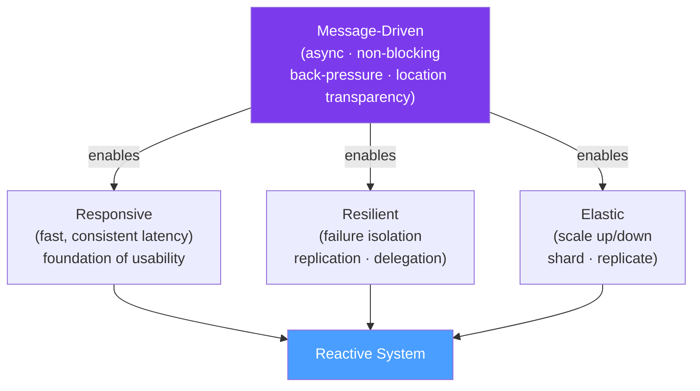

# 📜 Reactive Manifesto

> [!abstract] TL;DR
> The Reactive Manifesto (2013) defines four properties of reactive systems: **Responsive** (fast, consistent response times), **Resilient** (stays responsive despite failures), **Elastic** (scales under load), and **Message-Driven** (async, non-blocking communication between components). These properties are achieved by avoiding blocking I/O, using event loops instead of thread-per-request, and treating errors as first-class citizens.

## Intuition — analogy FIRST
A reactive system is like a modern city's emergency response network. When you call 911 (request), you always get a fast response (Responsive), even when multiple emergencies happen simultaneously. If one ambulance breaks down (failure), others cover for it (Resilient). During a disaster, more responders are called in, and fewer during quiet times (Elastic). Dispatchers coordinate via radio — non-blocking, event-driven (Message-Driven). A non-reactive system is like one responder who can only handle one emergency at a time — everyone else waits.

---

## How It Works



## Key Concepts / Details

### The Four Properties

**1. Responsive**
- System responds in timely, consistent manner
- Fast, reliable response time is the foundation of usability
- Not just average response time — tail latency (p99) matters
- Achieved by: non-blocking I/O, async processing, backpressure

**2. Resilient**
- System stays responsive despite failures
- Failures are **isolated** — one service's failure doesn't cascade
- Recovery is **delegated** — supervisors monitor and restart failed components
- **Replication** prevents single points of failure
- Achieved by: circuit breakers, bulkheads, supervision trees (Akka)

**3. Elastic**
- System stays responsive under varying load
- Scales **up** (add resources) and **down** (release resources)
- No contention points — shared state avoided
- Achieved by: stateless services, auto-scaling, partitioned data

**4. Message-Driven**
- Components communicate via **async, non-blocking messages**
- **Loose coupling** — sender doesn't block waiting for receiver
- **Backpressure** — receivers signal demand to control flow
- **Location transparency** — components can be local or remote
- Achieved by: event loops, reactive streams, message queues

### Traditional vs Reactive Architecture

```
Traditional (Thread-per-Request):
  Request → Thread 1 (blocked on DB)
  Request → Thread 2 (blocked on HTTP call)
  Request → Thread 3 (blocked on file I/O)
  1000 requests → 1000 blocked threads → out of memory
  Default thread pool: 200 threads → max ~200 concurrent requests

Reactive (Event Loop):
  Request → Event Loop → registers callback → thread free
  DB response → Event Loop → callback processes result → thread free
  HTTP response → Event Loop → callback processes result → thread free
  1000 requests → ~10 threads handling callbacks → much more efficient
  Best for: I/O-bound workloads with high concurrency
```

### When to Use Reactive

| Scenario | Reactive? | Reason |
|----------|-----------|--------|
| **High I/O, high concurrency** (API gateway, streaming) | Yes | Handles 10K+ concurrent connections with few threads |
| **CPU-bound work** (image processing, ML) | No | Reactive adds overhead without benefit |
| **Simple CRUD apps** | No | Spring MVC is simpler and sufficient |
| **Microservice with many downstream calls** | Yes | Non-blocking fan-out to multiple services |
| **Server-Sent Events / WebSocket** | Yes | Long-lived connections handled efficiently |
| **Batch processing** | No | Traditional streams or virtual threads are simpler |

### Reactive vs Virtual Threads (Project Loom)

```
Project Loom (Java 21 Virtual Threads):
  - Write blocking-style code: userRepo.findById(id)  // looks blocking, isn't
  - JVM unmounts virtual thread during I/O → OS thread is freed
  - Simpler to write and debug than reactive chains
  - Best for: replacing reactive for I/O-bound workloads

Project Reactor / WebFlux:
  - Write reactive code: userRepo.findById(id).map(...)
  - Explicit non-blocking composition with operators
  - Better for: streaming, SSE, WebSocket, true reactive pipelines
  - Not going away — reactive and virtual threads are complementary
```

---

## Real-World Notes

- **Reactive is not a silver bullet**: reactive programming adds significant complexity. Only adopt it when the concurrency/throughput benefits outweigh the mental overhead.
- **Reactive systems vs reactive programming**: a reactive *system* follows the manifesto's four properties. Reactive *programming* (Project Reactor) is a tool to build reactive systems. Don't conflate them.
- **Latency vs throughput**: reactive improves **throughput** (requests handled per second) under high concurrency. It doesn't make individual operations faster — a DB query takes the same time, but the thread isn't blocked while waiting.
- **Java 21 impact**: Project Loom virtual threads achieve similar throughput for I/O-bound workloads with simpler code. New projects should carefully evaluate whether WebFlux is necessary.

---

## Common Pitfalls

- **Blocking calls in reactive pipelines**: calling `userRepo.findById(id)` (blocking JDBC) inside a Mono/Flux chain blocks the event loop thread, defeating the purpose. Always use reactive drivers (R2DBC) or wrap blocking calls with `Schedulers.boundedElastic()`.
- **Reactive overkill**: converting a simple CRUD API to WebFlux because "reactive is modern" without meaningful concurrency requirements. The complexity isn't worth it.
- **Ignoring error handling**: reactive streams require explicit error handling (`onError`, `onErrorReturn`, etc.). Uncaught exceptions in callbacks don't propagate to the caller the same way as with try-catch.

---

## Related Concepts

- [[Reactive_Streams]] — The specification that defines the reactive programming interfaces
- [[Project_Reactor]] — Project Reactor implementation of Reactive Streams for Java
- [[Virtual_Threads_Java21]] — Alternative to reactive for I/O-bound concurrency

---

## Review Questions

1. What are the four properties of a Reactive System according to the Reactive Manifesto?
2. Why does the traditional thread-per-request model struggle with 10,000+ concurrent connections?
3. What does "Message-Driven" mean in the Reactive Manifesto and how is backpressure related?
4. When should you NOT use reactive programming?
5. How do Java 21 Virtual Threads relate to the goals of the Reactive Manifesto?

---

## Sources

- The Reactive Manifesto: https://www.reactivemanifesto.org/
- Jonas Bonér et al., "Reactive Manifesto" (2013/2014)

#java #spring #reactive #reactive-manifesto #responsive #resilient #elastic #message-driven
