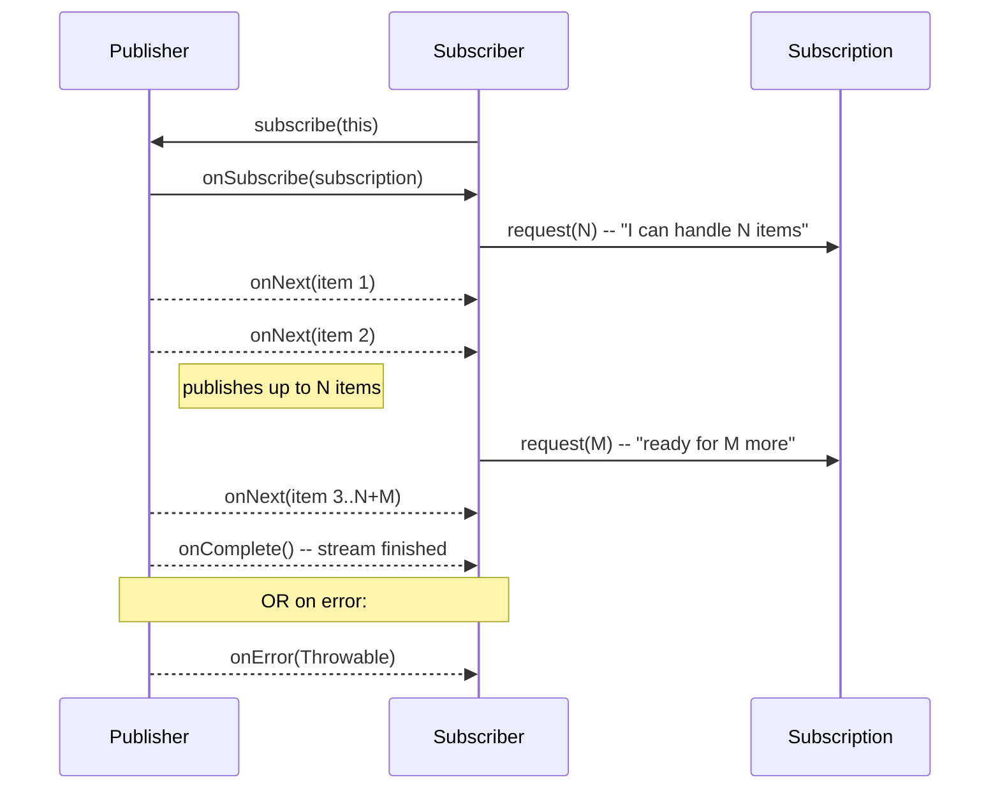

# 📡 Reactive Streams Specification

> [!abstract] TL;DR
> Reactive Streams (2013) is a specification for **non-blocking, backpressure-aware async stream processing**. Defined as 4 interfaces: `Publisher<T>` (produces), `Subscriber<T>` (consumes), `Subscription` (links them), and `Processor<T,R>` (both). Java 9+ includes these as `java.util.concurrent.Flow.*`. **Project Reactor** (Mono/Flux), **RxJava**, and **Akka Streams** all implement this spec, making them interoperable.

## Intuition — analogy FIRST
Reactive Streams is like a standardized water pipe fitting system. A faucet (Publisher) produces water. A sink (Subscriber) consumes it. The pipe fitting (Subscription) is the connector between them. Before the standard, every manufacturer used different fittings — you couldn't connect a Reactor faucet to an RxJava sink. Reactive Streams is the ANSI standard that makes all fittings compatible. `request(n)` is the drain valve — the sink tells the faucet exactly how much water it can handle at once (backpressure).

---

## How It Works



## Key Concepts / Details

### The Four Interfaces

```java
// 1. Publisher — produces data items
public interface Publisher<T> {
    void subscribe(Subscriber<? super T> subscriber);
}

// 2. Subscriber — consumes data items
public interface Subscriber<T> {
    void onSubscribe(Subscription s);  // called first — here you call s.request(n)
    void onNext(T t);                  // called for each item (up to requested count)
    void onError(Throwable t);         // called on error — no further signals after this
    void onComplete();                 // called when stream is done — no further signals
}

// 3. Subscription — link between Publisher and Subscriber
public interface Subscription {
    void request(long n);   // demand: "give me n more items" (backpressure signal)
    void cancel();          // "I don't want any more items"
}

// 4. Processor — both Publisher and Subscriber (transform in the middle)
public interface Processor<T, R> extends Subscriber<T>, Publisher<R> {}
```

### Java 9 Flow API — Same Interfaces

```java
// Java 9+ includes Reactive Streams as java.util.concurrent.Flow
// Identical interfaces, just in a different package
import java.util.concurrent.Flow;

// Flow.Publisher<T>    == Publisher<T>
// Flow.Subscriber<T>  == Subscriber<T>
// Flow.Subscription   == Subscription
// Flow.Processor<T,R> == Processor<T,R>

// Adapter from Flow to Reactive Streams:
Flow.Publisher<Integer> flowPublisher = /* ... */;
Publisher<Integer> reactorPublisher = JdkFlowAdapter.flowPublisherToFlux(flowPublisher);
```

### Manual Subscriber Implementation

```java
// Implementing Subscriber manually (for understanding — normally use Reactor operators)
public class PrintSubscriber implements Subscriber<Integer> {
    private Subscription subscription;
    private int remaining = 0;
    private static final int BATCH_SIZE = 5;

    @Override
    public void onSubscribe(Subscription s) {
        this.subscription = s;
        // Request first batch — THIS IS HOW BACKPRESSURE WORKS
        s.request(BATCH_SIZE);
        remaining = BATCH_SIZE;
    }

    @Override
    public void onNext(Integer item) {
        System.out.println("Received: " + item);
        remaining--;
        if (remaining <= 0) {
            // Request next batch only when current batch is processed
            remaining = BATCH_SIZE;
            subscription.request(BATCH_SIZE);
        }
    }

    @Override
    public void onError(Throwable t) {
        System.err.println("Error: " + t.getMessage());
    }

    @Override
    public void onComplete() {
        System.out.println("Stream complete");
    }
}
```

### Reactive Streams Rules (Key Rules)

```
Publisher rules:
- Total elements signaled via onNext MUST NOT exceed the number requested via request(n)
- onSubscribe, onNext, onError, onComplete MUST NOT be called concurrently (no concurrent signals)
- onError and onComplete are terminal — no further signals after either

Subscriber rules:
- Subscriber.onSubscribe MUST call subscription.request(n) eventually (otherwise nothing flows)
- Subscriber MUST NOT perform heavy operations in onNext (delegate to async processing)
- Subscriber MUST call subscription.cancel() if no longer interested

Subscription rules:
- request(n) MUST support Long.MAX_VALUE (means "unlimited" — turn off backpressure)
- cancel() MUST allow calling multiple times safely (idempotent)
```

### Interoperability — Reactor, RxJava, Akka

```java
// All Reactive Streams implementations are interoperable
// because they share the same Publisher/Subscriber interfaces

// Reactor Flux → RxJava Observable
Flux<Integer> reactorFlux = Flux.range(1, 10);
Flowable<Integer> rxFlowable = Flowable.fromPublisher(reactorFlux);  // Flowable implements Publisher

// RxJava → Reactor
Flowable<String> rxFlowable2 = Flowable.just("a", "b", "c");
Flux<String> flux = Flux.from(rxFlowable2);  // Flux.from(Publisher<T>)

// Reactor → Java 9 Flow
Flux<Integer> flux2 = Flux.range(1, 5);
Flow.Publisher<Integer> flowPublisher = JdkFlowAdapter.publisherToFlowPublisher(flux2);

// Common: receive a Publisher from a library → wrap in Flux for operators
Publisher<Order> externalPublisher = orderRepository.findAll();  // R2DBC returns Publisher
Flux<Order> orders = Flux.from(externalPublisher);
orders.filter(o -> o.isActive()).map(OrderResponse::from).subscribe(...);
```

### Reactive Streams vs Iterator

```java
// Pull (Iterator) — caller decides when to get next item
Iterator<Integer> iter = list.iterator();
while (iter.hasNext()) {
    process(iter.next());  // caller pulls
}

// Push (Reactive Streams) — producer decides when to emit, but respects backpressure
Flux.range(1, Integer.MAX_VALUE)  // producer pushes
    .subscribe(item -> process(item));  // subscriber receives push

// Push-Pull (Reactive Streams with backpressure)
flux.subscribe(new Subscriber<>() {
    public void onSubscribe(Subscription s) { s.request(10); }  // pull first 10
    public void onNext(Integer item) {
        process(item);
        subscription.request(1);  // pull next one after processing
    }
});
```

---

## Real-World Notes

- **`request(Long.MAX_VALUE)`**: calling `subscription.request(Long.MAX_VALUE)` effectively disables backpressure — the publisher sends as fast as it can. Project Reactor's `subscribe()` without a Subscriber argument does this by default. OK for in-memory streams; dangerous for unbounded data sources.
- **Cold vs Hot Publishers**: Cold publishers (like Flux.range or database query results) restart their data source for each subscriber. Hot publishers (like Kafka topic, mouse events) emit regardless of subscribers and share data among them.
- **TCK (Technology Compatibility Kit)**: Reactive Streams provides a test suite to verify specification compliance. Major libraries (Reactor, RxJava, Akka) all pass the TCK.
- **Flow vs Reactive Streams JAR**: use `org.reactivestreams:reactive-streams` as a dependency for library code that must interoperate with multiple reactive frameworks. Java 9+ projects can use `java.util.concurrent.Flow` directly.

---

## Common Pitfalls

- **Calling `onNext` before `onSubscribe`**: violates the spec. Publisher must call `onSubscribe` first. Implementors of custom Publishers must respect this.
- **Calling `onNext` after `onError`/`onComplete`**: spec violation. Once the terminal signal is sent, no more items. Subscribers can safely ignore signals after terminal events.
- **Forgetting `request(n)` in `onSubscribe`**: if you implement a custom Subscriber and forget to call `subscription.request(n)` in `onSubscribe`, nothing will ever flow — the stream stalls.
- **Not cancelling unused subscriptions**: if you stop caring about a stream (e.g., client disconnects), call `subscription.cancel()`. Otherwise, the publisher keeps producing items that are discarded — wasting resources.

---

## Related Concepts

- [[Project_Reactor]] — Project Reactor's Mono/Flux implement the Publisher interface
- [[Backpressure]] — The demand signaling mechanism defined by Subscription.request(n)
- [[Reactive_Manifesto]] — The architectural principles that motivated Reactive Streams

---

## Review Questions

1. What are the four interfaces in the Reactive Streams specification and what does each do?
2. What is the purpose of `Subscription.request(n)`? How does it implement backpressure?
3. What is the difference between `onError` and `onComplete`? Can either be called after the other?
4. What does `request(Long.MAX_VALUE)` do and when would you use it?
5. How does Reactor's `Flux` relate to the Reactive Streams `Publisher` interface?

---

## Sources

- Reactive Streams Specification: https://www.reactive-streams.org/
- JEP 266 — More Concurrency Updates (Java Flow API): https://openjdk.org/jeps/266
- Reactive Streams GitHub: https://github.com/reactive-streams/reactive-streams-jvm

#java #reactive #reactive-streams #publisher #subscriber #subscription #flow-api #backpressure
