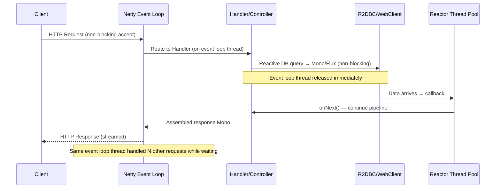

# ⚡ Spring WebFlux

> [!abstract] TL;DR
> Spring WebFlux is Spring's reactive web framework, running on a non-blocking event loop (Netty by default) instead of Servlet's one-thread-per-request model — enabling thousands of concurrent connections with a small, fixed thread pool. Controllers return `Mono<T>` (0-or-1 item) or `Flux<T>` (0-to-N items) from Project Reactor, and the pipeline stays non-blocking end-to-end only when every layer — HTTP client (`WebClient`), database (`R2DBC`), and message broker — is also reactive. Choose WebFlux for high-concurrency I/O-bound workloads or streaming; stick with Spring MVC for CPU-bound work, blocking libraries, or teams less familiar with reactive composition.

---

## Intuition

Spring MVC is a restaurant where every waiter (thread) takes one table's order, stands at the kitchen window waiting for the food, and walks it back — if 200 tables arrive, you need 200 waiters standing around waiting. WebFlux is a high-end restaurant with 8 super-fast waiters using buzzers: they take the order, hand it to the kitchen with a callback buzzer, immediately serve other tables, and return only when the buzzer rings. The math works because kitchen wait time (I/O) is the bottleneck, not the waiters (CPU threads).

---

## How It Works

### WebFlux Request Flow



---

## Key Concepts

### 1. WebFlux vs Spring MVC — When to Choose

| Dimension | Spring MVC | Spring WebFlux |
|-----------|-----------|----------------|
| Thread model | 1 thread per request (Tomcat) | Shared event loop (Netty) |
| Concurrency | ~200 concurrent (thread pool limited) | 10,000+ concurrent |
| Programming model | Blocking, imperative | Non-blocking, reactive (operators) |
| Blocking libraries (JDBC, JPA) | Full support | Must avoid — blocks event loop |
| Learning curve | Low | High (operator chains, debugging) |
| Stack traces | Readable | Cryptic (async boundaries) |
| Best for | CRUD, CPU-bound, standard REST | High-concurrency I/O, streaming, SSE |
| Database support | JPA, JDBC | R2DBC (reactive), Redis Reactive |

**Rule of thumb:** If your application has any blocking call (JDBC, `Thread.sleep`, synchronous file I/O) anywhere in the reactive chain, use MVC or wrap in `Schedulers.boundedElastic()`.

### 2. Annotated Controller Model

```java
import org.springframework.web.bind.annotation.*;
import reactor.core.publisher.Flux;
import reactor.core.publisher.Mono;
import org.springframework.http.MediaType;

@RestController
@RequestMapping("/api/users")
public class UserController {

    private final UserRepository repo;          // R2DBC reactive repository
    private final EmailService emailService;    // WebClient-based, returns Mono

    // GET single item — Mono<T>
    @GetMapping("/{id}")
    public Mono<ResponseEntity<UserDto>> getUser(@PathVariable Long id) {
        return repo.findById(id)
            .map(UserDto::from)
            .map(ResponseEntity::ok)
            .defaultIfEmpty(ResponseEntity.notFound().build());
    }

    // GET all — Flux<T> (streams rows as they arrive from DB)
    @GetMapping
    public Flux<UserDto> listUsers() {
        return repo.findAll().map(UserDto::from);
    }

    // POST — Mono<T> from request body
    @PostMapping
    @ResponseStatus(HttpStatus.CREATED)
    public Mono<UserDto> createUser(@RequestBody Mono<CreateUserRequest> request) {
        return request
            .flatMap(req -> repo.save(User.from(req)))   // flatMap for Mono→Mono
            .flatMap(user -> emailService.sendWelcome(user).thenReturn(user))
            .map(UserDto::from);
    }

    // Server-Sent Events — Flux<T> with text/event-stream content type
    @GetMapping(value = "/stream", produces = MediaType.TEXT_EVENT_STREAM_VALUE)
    public Flux<UserDto> streamUsers() {
        return repo.findAll()
            .map(UserDto::from)
            .delayElements(Duration.ofMillis(100)); // simulate real-time streaming
    }
}
```

### 3. Functional Routing DSL

```java
import org.springframework.context.annotation.Bean;
import org.springframework.web.reactive.function.server.*;
import static org.springframework.web.reactive.function.server.RouterFunctions.route;
import static org.springframework.web.reactive.function.server.RequestPredicates.*;

@Configuration
public class UserRouter {

    @Bean
    public RouterFunction<ServerResponse> userRoutes(UserHandler handler) {
        return route()
            .GET("/api/users",          handler::listAll)
            .GET("/api/users/{id}",     handler::getById)
            .POST("/api/users",         handler::create)
            .PUT("/api/users/{id}",     handler::update)
            .DELETE("/api/users/{id}",  handler::delete)
            .build();
    }
}

@Component
public class UserHandler {

    private final UserRepository repo;

    public Mono<ServerResponse> listAll(ServerRequest request) {
        Flux<UserDto> users = repo.findAll().map(UserDto::from);
        return ServerResponse.ok()
            .contentType(MediaType.APPLICATION_JSON)
            .body(users, UserDto.class);
    }

    public Mono<ServerResponse> getById(ServerRequest request) {
        Long id = Long.parseLong(request.pathVariable("id"));
        return repo.findById(id)
            .map(UserDto::from)
            .flatMap(dto -> ServerResponse.ok().bodyValue(dto))
            .switchIfEmpty(ServerResponse.notFound().build());
    }

    public Mono<ServerResponse> create(ServerRequest request) {
        return request.bodyToMono(CreateUserRequest.class)
            .flatMap(req -> repo.save(User.from(req)))
            .map(UserDto::from)
            .flatMap(dto -> ServerResponse.created(
                URI.create("/api/users/" + dto.id())).bodyValue(dto));
    }
}
```

### 4. WebClient — Reactive HTTP Client

```java
import org.springframework.web.reactive.function.client.WebClient;
import org.springframework.web.reactive.function.client.WebClientResponseException;

@Service
public class ProductService {

    // Build once as a bean — thread-safe, connection pool shared
    private final WebClient webClient = WebClient.builder()
        .baseUrl("https://api.products.example.com")
        .defaultHeader(HttpHeaders.CONTENT_TYPE, MediaType.APPLICATION_JSON_VALUE)
        .defaultHeader(HttpHeaders.ACCEPT, MediaType.APPLICATION_JSON_VALUE)
        .codecs(c -> c.defaultCodecs().maxInMemorySize(2 * 1024 * 1024)) // 2 MB buffer
        .build();

    // GET — returns Mono<T>
    public Mono<ProductDto> getProduct(Long id) {
        return webClient.get()
            .uri("/products/{id}", id)
            .retrieve()
            .onStatus(HttpStatusCode::is4xxClientError,
                resp -> resp.bodyToMono(String.class)
                    .map(body -> new ProductNotFoundException("Not found: " + body)))
            .bodyToMono(ProductDto.class);
    }

    // GET collection — Flux<T> (streaming)
    public Flux<ProductDto> getAllProducts() {
        return webClient.get()
            .uri("/products")
            .retrieve()
            .bodyToFlux(ProductDto.class);
    }

    // POST with body
    public Mono<ProductDto> createProduct(CreateProductRequest req) {
        return webClient.post()
            .uri("/products")
            .bodyValue(req)
            .retrieve()
            .bodyToMono(ProductDto.class);
    }

    // Parallel calls — zip two Monos (both fire simultaneously)
    public Mono<ProductBundle> getBundle(Long productId, Long reviewId) {
        Mono<ProductDto> product = getProduct(productId);
        Mono<ReviewDto>  review  = getReview(reviewId);

        return Mono.zip(product, review,
            (p, r) -> new ProductBundle(p, r)); // both called in parallel
    }
}
```

### 5. Error Handling

```java
// onErrorReturn — emit a fallback value on error
Mono<Product> safeGet = repo.findById(id)
    .onErrorReturn(new Product("fallback")); // always returns fallback on any error

// onErrorResume — switch to alternative Mono/Flux on error
Mono<Product> withFallback = repo.findById(id)
    .onErrorResume(NotFoundException.class, e -> cache.getProduct(id))
    .onErrorResume(e -> Mono.just(Product.empty())); // catch-all fallback

// onErrorMap — translate exception type
Mono<Product> mapped = repo.findById(id)
    .onErrorMap(DataAccessException.class,
        e -> new ServiceException("DB error: " + e.getMessage()));

// doOnError — side effect (logging) without catching
Mono<Product> logged = repo.findById(id)
    .doOnError(e -> log.error("Failed to fetch product {}: {}", id, e.getMessage()));

// timeout — fail fast if upstream is too slow
Mono<Product> withTimeout = repo.findById(id)
    .timeout(Duration.ofSeconds(2))
    .onErrorResume(TimeoutException.class, e -> Mono.just(Product.empty()));

// retry — with exponential backoff
Mono<Product> withRetry = webClient.get().uri("/products/" + id)
    .retrieve().bodyToMono(ProductDto.class)
    .retryWhen(Retry.backoff(3, Duration.ofMillis(500))
        .filter(e -> e instanceof WebClientResponseException.ServiceUnavailable));
```

### 6. R2DBC — Reactive Database Access

```java
import org.springframework.data.r2dbc.repository.R2dbcRepository;
import org.springframework.data.r2dbc.repository.Query;
import reactor.core.publisher.Flux;
import reactor.core.publisher.Mono;

// R2DBC reactive repository — all methods return Mono/Flux
public interface UserRepository extends R2dbcRepository<User, Long> {

    Flux<User> findByActiveTrue();

    @Query("SELECT * FROM users WHERE email = :email")
    Mono<User> findByEmail(String email);

    @Query("SELECT * FROM users WHERE created_at > :since ORDER BY created_at DESC LIMIT :limit")
    Flux<User> findRecentUsers(LocalDateTime since, int limit);
}

// Transactional reactive service
@Service
@Transactional  // works with R2DBC — uses reactive transaction manager
public class UserService {

    public Mono<User> transferCredit(Long fromId, Long toId, int amount) {
        return userRepo.findById(fromId)
            .zipWith(userRepo.findById(toId))
            .flatMap(tuple -> {
                User from = tuple.getT1();
                User to   = tuple.getT2();
                from.deduct(amount);
                to.credit(amount);
                return userRepo.save(from).then(userRepo.save(to));
            })
            .then(userRepo.findById(toId));
    }
}
```

### 7. Testing with WebTestClient

```java
import org.springframework.test.web.reactive.server.WebTestClient;

@SpringBootTest(webEnvironment = SpringBootTest.WebEnvironment.RANDOM_PORT)
class UserControllerTest {

    @Autowired
    WebTestClient webTestClient;

    @Test
    void getUser_shouldReturn200() {
        webTestClient.get().uri("/api/users/1")
            .exchange()
            .expectStatus().isOk()
            .expectHeader().contentType(MediaType.APPLICATION_JSON)
            .expectBody(UserDto.class)
            .value(user -> {
                assertThat(user.name()).isEqualTo("Alice");
                assertThat(user.id()).isEqualTo(1L);
            });
    }

    @Test
    void listUsers_shouldReturnFlux() {
        webTestClient.get().uri("/api/users")
            .exchange()
            .expectStatus().isOk()
            .expectBodyList(UserDto.class)
            .hasSize(3);
    }

    @Test
    void createUser_shouldReturn201() {
        var request = new CreateUserRequest("Bob", "bob@example.com");

        webTestClient.post().uri("/api/users")
            .bodyValue(request)
            .exchange()
            .expectStatus().isCreated()
            .expectBody(UserDto.class)
            .value(u -> assertThat(u.name()).isEqualTo("Bob"));
    }
}
```

---

## Real-World Notes

- **Blocking code in WebFlux**: If a library forces a blocking call (e.g., a JDBC call you cannot replace), wrap it: `Mono.fromCallable(() -> jdbcTemplate.query(...)).subscribeOn(Schedulers.boundedElastic())` — this offloads to a separate thread pool so the event loop is not blocked.
- **Context propagation**: MDC (SLF4J's thread-local context for tracing) does not work with reactive pipelines as written. Use `Hooks.enableAutomaticContextPropagation()` (Micrometer) or carry context explicitly with `contextWrite()` / `deferContextual()`.
- **WebClient vs RestTemplate**: `RestTemplate` is in maintenance mode since Spring 5. `WebClient` can be used in both blocking (`.block()`) and non-blocking mode, making it the forward-compatible choice even in Spring MVC apps.
- **Backpressure in WebFlux**: `Flux` producers respect downstream demand. When returning a `Flux` to an SSE endpoint, Netty signals demand to the producer as the network can accept more bytes — true end-to-end backpressure.

---

## Common Pitfalls

| Pitfall | Consequence | Fix |
|---------|-------------|-----|
| Calling `.block()` inside a WebFlux controller | Blocks event loop thread; throughput collapses | Return `Mono`/`Flux` — never call `.block()` on the event loop |
| Using `JPA` / JDBC with WebFlux | Blocks event loop; effectively single-threaded | Switch to R2DBC, or run blocking code on `boundedElastic()` scheduler |
| Not subscribing to returned `Mono` in `@EventListener` | Pipeline never executes — reactive types are lazy | Call `.subscribe()` or return the `Mono` from a `@TransactionalEventListener` |
| `flatMap` vs `map` confusion | `map` wraps inside a `Mono<Mono<T>>` if mapper returns Mono | Use `flatMap` when the mapping function itself returns `Mono`/`Flux` |
| Shared mutable state in operators | Race conditions — multiple threads execute operators | Keep operators stateless; use `Mono.defer()` to create per-subscription state |

---

## Related Notes

- [[_MOC_Reactive_Programming|↑ Section MOC — Reactive Programming]]
- [[Project_Reactor]] — `Mono`/`Flux` operators, `Schedulers`, hot vs cold publishers
- [[Reactive_Streams]] — the spec that Reactor and WebFlux implement
- [[Backpressure]] — how demand propagation works end-to-end in WebFlux

---

## Review Questions

1. A WebFlux controller calls a legacy `UserRepository` method that uses JDBC (a blocking driver). The application seems to work in development but deadlocks under load. Explain the mechanism of the deadlock and write the fix using Project Reactor's scheduler API.

2. A teammate proposes using `Mono.zip()` to call two external APIs and combine results versus calling them sequentially with `flatMap`. Compare the two approaches in terms of total latency and resource usage, and state when sequential is appropriate despite higher latency.

3. Explain why `WebTestClient` is preferred over Mockito-mocking the controller layer for WebFlux integration tests, and what specifically `expectBodyList(UserDto.class).hasSize(3)` actually verifies in a running application context.

---

#Java #Reactive_Programming #WebFlux #Spring #WebClient #R2DBC #Netty #Advanced
