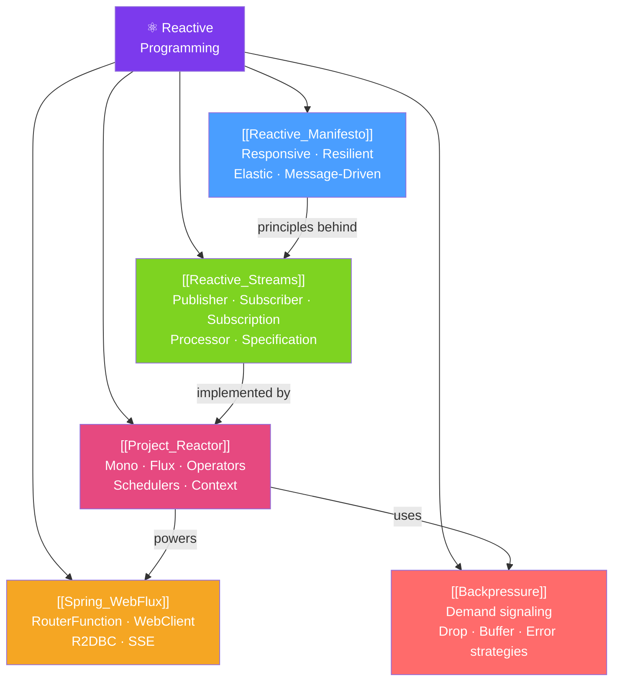

# ⚛️ Reactive Programming — Map of Content

> [!abstract] What This Section Covers
> Reactive programming is a paradigm for building non-blocking, event-driven systems that handle high concurrency with fewer threads. This section covers the Reactive Manifesto principles, Project Reactor (Mono/Flux), Spring WebFlux for reactive web APIs, the Reactive Streams specification, and backpressure — the mechanism that prevents fast producers from overwhelming slow consumers.

## Concept Map

## Learning Path
1. [[Reactive_Manifesto]] — The "why" of reactive systems: responsive, resilient, elastic, message-driven.
2. [[Reactive_Streams]] — The specification: Publisher, Subscriber, Subscription, backpressure protocol.
3. [[Project_Reactor]] — Project Reactor's Mono/Flux: the building blocks for reactive Java.
4. [[Backpressure]] — How slow consumers signal demand to fast producers; overflow strategies.
5. [[Spring_WebFlux]] — Building reactive REST APIs, using WebClient, and R2DBC for reactive DB access.

## All Notes at a Glance
| Note | Difficulty | What You'll Learn |
|------|------------|-------------------|
| [[Reactive_Manifesto]] | Beginner | Why reactive, the four properties, when to apply |
| [[Reactive_Streams]] | Intermediate | Specification interfaces, backpressure protocol, TCK |
| [[Project_Reactor]] | Intermediate | Mono/Flux, operators (map/flatMap/zip), error handling, schedulers |
| [[Backpressure]] | Advanced | Demand signaling, DROP/BUFFER/ERROR strategies, rate limiting |
| [[Spring_WebFlux]] | Advanced | Reactive controllers, WebClient, R2DBC, SSE, RouterFunction |

## Key Questions This Section Answers
- When should you use WebFlux instead of Spring MVC?
- What is the difference between `map` and `flatMap` in Project Reactor?
- How does backpressure prevent out-of-memory errors in reactive streams?
- How do you make blocking code work in a reactive pipeline?
- What is R2DBC and why do you need it for reactive database access?

## Related Sections
- [[_MOC_Java_Master|↑ Java Master MOC]]
- [[_MOC_Microservices_Java|← Microservices]] — Reactive Kafka for non-blocking message processing
- [[_MOC_Performance_Java|→ Performance]] — Reactive improves throughput for IO-bound workloads
- [[_MOC_Concurrency|← Concurrency]] — Compare threads vs reactive for concurrency

#MOC #java #spring #reactive #project-reactor #webflux
