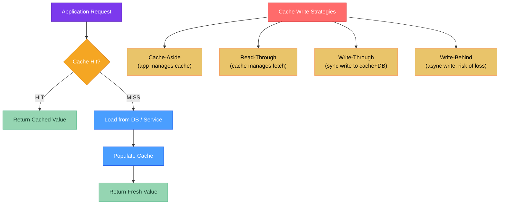

# 🗄️ Caching Strategies in Java

> [!abstract] TL;DR
> **Cache-aside** (lazy loading) is the most common pattern — the app checks the cache, misses, loads from DB, and populates the cache. **Caffeine** is the fastest in-process Java cache using W-TinyLFU (combines frequency + recency) — configure with `maximumSize` + `expireAfterWrite`. **Spring Cache** abstracts the cache backend behind `@Cacheable`, `@CacheEvict`, and `@CachePut` annotations. The **cache stampede** (dogpile) problem occurs when many requests simultaneously miss the same key after expiry — prevent with probabilistic early expiration or locking. For distributed caching, Spring Cache works with Redis via Spring Data Redis.

---

## Intuition

A cache is like a waiter's notepad: instead of walking to the kitchen (database) every time a customer asks for the specials, the waiter writes them down once. The cache-aside pattern is the waiter checking the notepad first and only going to the kitchen on a miss. The stampede problem is 50 customers simultaneously asking for the specials the moment the notepad page expires — all 50 run to the kitchen at once. The fix: one waiter runs to the kitchen, the others wait in line.

---

## How It Works



### Cache Strategy Comparison

| Strategy | Who fetches on miss | Write behavior | Consistency | Best for |
|----------|---------------------|----------------|-------------|----------|
| Cache-aside | Application | App updates cache | Eventual | Read-heavy, app controls logic |
| Read-through | Cache (delegates to loader) | App updates cache | Eventual | Transparent to app, simple |
| Write-through | App reads cache | Both updated synchronously | Strong | Write frequency matches read |
| Write-behind | App reads cache | DB written asynchronously | Weak | Write-heavy, loss acceptable |

---

## Key Concepts

### 1. Caffeine — W-TinyLFU Algorithm

Caffeine uses **Window TinyLFU (W-TinyLFU)** which maintains two regions:
- **Window cache** (~1% of capacity) — recent items get a grace period to build frequency
- **Main cache** (~99%) — protected + probationary segments using LFU with a frequency sketch

Items promoted from window → main only if their access frequency beats the victim being evicted. This handles **bursty traffic** (LRU would evict popular items on a scan) and **frequency bias** (pure LFU forgets recency).

```java
import com.github.benmanes.caffeine.cache.*;
import java.util.concurrent.TimeUnit;

// Maven: com.github.ben-manes.caffeine:caffeine:3.1.8

// ── Basic Cache (manual loading) ──────────────────────────────────────────
Cache<String, User> manualCache = Caffeine.newBuilder()
        .maximumSize(10_000)                                // evict beyond this
        .expireAfterWrite(Duration.ofMinutes(10))          // TTL after write
        .expireAfterAccess(Duration.ofMinutes(5))          // TTL if not accessed
        .recordStats()                                      // enable hit/miss stats
        .build();

// Read (null if absent)
User user = manualCache.getIfPresent("user:123");

// Read with fallback loader
User loaded = manualCache.get("user:123",
        key -> userRepository.findById(Long.parseLong(key.split(":")[1])).orElse(null));

// Write / Invalidate
manualCache.put("user:123", user);
manualCache.invalidate("user:123");
manualCache.invalidateAll();

// Stats
CacheStats stats = manualCache.stats();
System.out.printf("Hit rate: %.2f%%, evictions: %d%n",
        stats.hitRate() * 100, stats.evictionCount());


// ── Loading Cache (auto-load on miss) ─────────────────────────────────────
LoadingCache<Long, User> loadingCache = Caffeine.newBuilder()
        .maximumSize(5_000)
        .expireAfterWrite(Duration.ofMinutes(30))
        .refreshAfterWrite(Duration.ofMinutes(15))  // async refresh while serving stale
        .build(userId -> userRepository.findById(userId)
                                       .orElseThrow(() -> new RuntimeException("Not found")));

User u = loadingCache.get(42L);  // loads automatically on miss

// ── Async Loading Cache ────────────────────────────────────────────────────
AsyncLoadingCache<Long, User> asyncCache = Caffeine.newBuilder()
        .maximumSize(5_000)
        .expireAfterWrite(Duration.ofMinutes(30))
        .buildAsync(userId -> CompletableFuture.supplyAsync(
                () -> userRepository.findById(userId).orElseThrow()));

CompletableFuture<User> future = asyncCache.get(42L);
```

### 2. Spring Cache Abstraction

Spring Cache decouples your code from the underlying cache implementation — swap Caffeine for Redis without changing business logic.

```java
// ── Enable caching ─────────────────────────────────────────────────────────
@Configuration
@EnableCaching
public class CacheConfig {

    @Bean
    public CacheManager cacheManager() {
        CaffeineCacheManager manager = new CaffeineCacheManager("users", "products");
        manager.setCaffeine(Caffeine.newBuilder()
                .maximumSize(10_000)
                .expireAfterWrite(Duration.ofMinutes(10))
                .recordStats());
        return manager;
    }
}

// ── @Cacheable: cache the return value ────────────────────────────────────
@Service
public class UserService {

    // Default key = method args (user id here)
    @Cacheable(cacheNames = "users")
    public User findById(Long id) {
        return userRepository.findById(id).orElseThrow();
        // On cache hit: method body is NOT executed — cached value returned
    }

    // Custom SpEL key expression
    @Cacheable(cacheNames = "users", key = "#email.toLowerCase()")
    public User findByEmail(String email) {
        return userRepository.findByEmail(email).orElseThrow();
    }

    // Conditional caching: only cache if result is not null
    @Cacheable(cacheNames = "users", unless = "#result == null")
    public User findOptional(Long id) {
        return userRepository.findById(id).orElse(null);
    }

    // ── @CachePut: update cache without skipping method execution ─────────
    @CachePut(cacheNames = "users", key = "#user.id")
    public User updateUser(User user) {
        return userRepository.save(user);
        // Method always runs; return value updates cache
    }

    // ── @CacheEvict: remove entry ─────────────────────────────────────────
    @CacheEvict(cacheNames = "users", key = "#id")
    public void deleteUser(Long id) {
        userRepository.deleteById(id);
    }

    // Evict entire cache (use carefully)
    @CacheEvict(cacheNames = "users", allEntries = true)
    public void clearAllUsers() { }

    // ── @Caching: combine multiple cache annotations ───────────────────────
    @Caching(evict = {
        @CacheEvict(cacheNames = "users", key = "#user.id"),
        @CacheEvict(cacheNames = "users", key = "#user.email")
    })
    public void updateUserWithEmailChange(User user) {
        userRepository.save(user);
    }
}
```

### 3. Cache Stampede (Dogpile Effect) Prevention

A stampede occurs when a popular key expires and N concurrent requests all miss simultaneously, all fetching from the DB, causing an N× load spike.

```java
// ── Option 1: Caffeine refreshAfterWrite (soft expiry + async refresh) ────
// Serves stale value while refreshing in background — zero stampede
LoadingCache<Long, Product> cache = Caffeine.newBuilder()
        .expireAfterWrite(Duration.ofHours(1))
        .refreshAfterWrite(Duration.ofMinutes(45))  // refresh before hard expiry
        .build(this::loadProductFromDb);

// ── Option 2: Probabilistic Early Expiration (XFetch algorithm) ───────────
// Each request independently decides to refresh early with increasing probability
// as TTL approaches zero → stampede spread across time
public User getWithEarlyExpiry(Long id) {
    CachedEntry<User> entry = localStore.get(id);

    if (entry != null) {
        double beta = 1.0;  // tune: higher = refresh earlier
        double remainingTtlSec = entry.expiryEpoch - Instant.now().getEpochSecond();
        double delta = entry.fetchTimeSec;  // how long the last fetch took

        // XFetch: refresh if random probe < delta * beta * -ln(random)
        double probe = Math.random();
        if (probe < delta * beta * -Math.log(Math.random()) / remainingTtlSec) {
            return refreshAndStore(id);  // this thread refreshes early
        }
        return entry.value;
    }
    return refreshAndStore(id);
}

// ── Option 3: Lock-based (mutex / singleflight) ───────────────────────────
private final Map<Long, CompletableFuture<User>> inflightRequests = new ConcurrentHashMap<>();

public User getWithSingleFlight(Long id) {
    User cached = cache.getIfPresent(id);
    if (cached != null) return cached;

    CompletableFuture<User> inflight = inflightRequests.computeIfAbsent(id, k -> {
        CompletableFuture<User> future = CompletableFuture.supplyAsync(() -> {
            User u = userRepository.findById(id).orElseThrow();
            cache.put(id, u);
            return u;
        });
        future.whenComplete((v, ex) -> inflightRequests.remove(id));
        return future;
    });

    return inflight.join();  // all waiters share one DB call
}
```

### 4. Distributed Cache with Redis + Spring Cache

```java
// pom.xml: spring-boot-starter-data-redis

@Configuration
@EnableCaching
public class RedisCacheConfig {

    @Bean
    public RedisCacheManager cacheManager(RedisConnectionFactory factory) {
        RedisCacheConfiguration defaultConfig = RedisCacheConfiguration.defaultCacheConfig()
                .entryTtl(Duration.ofMinutes(30))
                .disableCachingNullValues()
                .serializeValuesWith(
                    RedisSerializationContext.SerializationPair.fromSerializer(
                        new GenericJackson2JsonRedisSerializer()));

        return RedisCacheManager.builder(factory)
                .cacheDefaults(defaultConfig)
                .withCacheConfiguration("users",
                    defaultConfig.entryTtl(Duration.ofHours(1)))   // per-cache TTL
                .withCacheConfiguration("sessions",
                    defaultConfig.entryTtl(Duration.ofMinutes(15)))
                .build();
    }
}
// No changes needed to @Cacheable/@CacheEvict service methods — they work identically
```

### 5. Cache Key Design

```java
// ✓ Good: deterministic, unique, readable
@Cacheable(cacheNames = "users", key = "'user:' + #id")

// ✓ Good: composite key
@Cacheable(cacheNames = "search", key = "#query + ':' + #page + ':' + #size")

// ✓ Good: custom KeyGenerator bean
@Cacheable(cacheNames = "reports", keyGenerator = "reportKeyGenerator")

// ❌ Bad: using mutable object as key (hashCode changes if object mutated)
@Cacheable(cacheNames = "results", key = "#request")  // request object key = bad

// ❌ Bad: key that includes timestamp or random data (cache never hits)
@Cacheable(cacheNames = "data", key = "#id + ':' + T(System).currentTimeMillis()")
```

---

## Real-World Notes

- **Two-level caching**: Caffeine (L1, in-process, nanoseconds) in front of Redis (L2, distributed, milliseconds). L1 absorbs the hottest items; L2 serves items missing from L1 and ensures consistency across pods.
- **Cache warming**: pre-populate cache at startup for must-have data (reference data, config) to avoid cold-start latency spikes after deployment.
- **Versioned cache keys**: `"user:v2:" + id` — when the cached object's schema changes, increment the version prefix to instantly invalidate all stale entries without a full cache flush.

---

## Common Pitfalls

| Pitfall | Consequence | Fix |
|---------|-------------|-----|
| Caching null results without `unless` | All "not found" responses are cached → valid creates not visible | Add `unless = "#result == null"` |
| No TTL on cache entries | Memory grows unbounded → OOM | Always set `expireAfterWrite` or `maximumSize` |
| `@Cacheable` on private methods | Spring AOP proxy bypassed → cache never used | Only put `@Cacheable` on public methods called via proxy |
| `@Cacheable` in the same bean (self-call) | Proxy bypassed → direct call → no caching | Inject self via `@Lazy @Autowired` or restructure |
| Using complex mutable objects as cache values | Mutations after caching update cached copy (shared ref in Caffeine) | Store immutable DTOs or defensive copies |

---

## Related Concepts

- [[_MOC_Performance_Java|↑ Section MOC — Java Performance]]
- [[Database_Performance_Java]] — Caching reduces DB load; connection pooling manages remaining DB calls
- [[Memory_Management]] — Caffeine cache lives on-heap; size it relative to your `-Xmx`
- [[Java_Profiling]] — Profile cache hit rates and DB call frequency to validate cache effectiveness

---

## Review Questions

1. You have a `@Cacheable` method but notice that calling it from another method in the same Spring bean never reads from the cache. Why does this happen and what are two ways to fix it?

2. A product catalog cache expires every hour. When expiry hits during peak traffic, the DB receives 500 simultaneous queries for the same product. Name two mechanisms to prevent this stampede and explain the trade-off of each.

3. Your team is debating Caffeine vs Redis for caching user profile data. The service runs with 20 pods. Make the case for using both together (two-level cache) rather than choosing one.

---

## Sources
- [Caffeine GitHub](https://github.com/ben-manes/caffeine)
- [Spring Cache Abstraction](https://docs.spring.io/spring-framework/docs/current/reference/html/integration.html#cache)
- Gil Einziger et al., *TinyLFU: A Highly Efficient Cache Admission Policy* (2017)
- Clément Nussbaumer, *Probabilistic early expiration for cache stampede prevention*

#java #performance #caching #Caffeine #Spring-Cache #Redis #Intermediate
