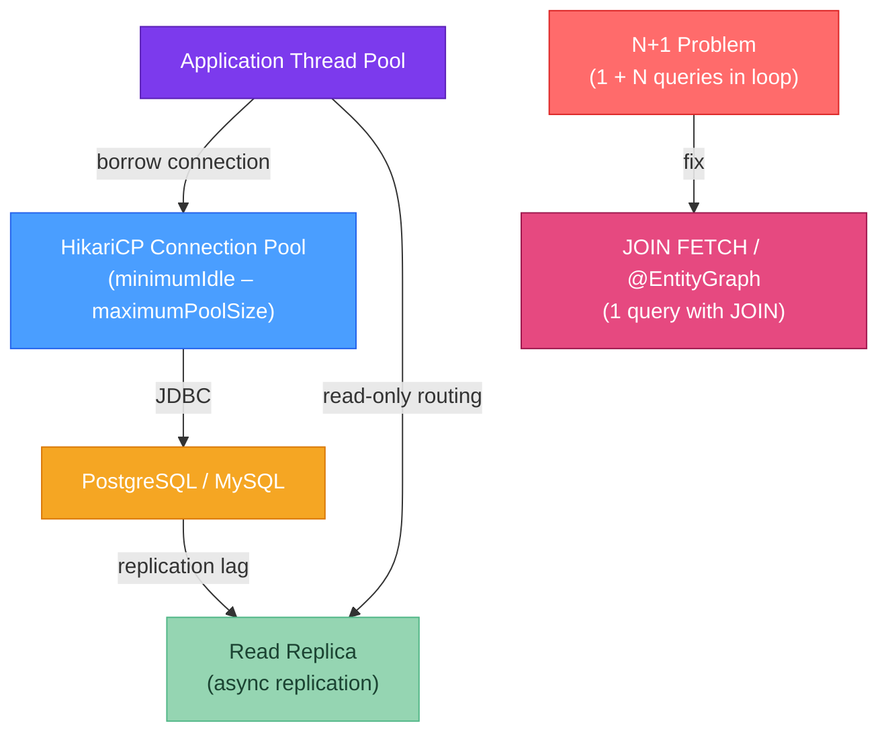

# 🗃️ Database Performance in Java

> [!abstract] TL;DR
> The four biggest database performance killers in Java applications are: (1) **wrong connection pool size** (too few = queuing, too many = DB overload), (2) **N+1 query problem** from JPA lazy loading in loops — fix with `JOIN FETCH` or `@EntityGraph`, (3) **missing batch inserts** — JPA inserts one row per `save()` by default, (4) **unindexed queries** found via `EXPLAIN ANALYZE`. HikariCP's sizing formula is `connections = (core_count × 2) + effective_spindle_count`. Read replicas via `AbstractRoutingDataSource` can scale reads without touching your service layer.

---

## Intuition

A database connection is like a cashier lane at a supermarket. Too few lanes (connections): customers (threads) queue up and wait — latency spikes. Too many lanes: you're paying cashier salaries without benefit (DB overhead, context switching). The optimal number is determined by how fast customers are actually being served (CPU/disk speed). N+1 is like asking the cashier to check the price of each item by calling the warehouse individually — instead, give them a list and call once.

---

## How It Works



---

## Key Concepts

### 1. HikariCP Connection Pool Sizing

HikariCP is the default connection pool in Spring Boot (since 2.0). Getting the pool size wrong is the single most impactful configuration mistake.

**The formula (from HikariCP's "Pool Sizing" guide):**
```
connections = (core_count × 2) + effective_spindle_count
```
- `core_count` = CPU cores of the DB server (not the app server)
- `effective_spindle_count` = number of hard disks (SSDs count as 1; HDDs count as actual spindles)
- For a 4-core DB with SSD: connections = (4 × 2) + 1 = **9** (not 50, not 200)

```yaml
# application.properties / application.yml
spring:
  datasource:
    url: jdbc:postgresql://localhost:5432/mydb
    username: app_user
    password: secret
    hikari:
      # Maximum connections in the pool (key setting)
      maximum-pool-size: 10
      # Minimum idle connections to maintain
      minimum-idle: 5
      # Max time (ms) to wait for a connection before throwing exception
      connection-timeout: 30000
      # Max time (ms) a connection can be idle before being closed
      idle-timeout: 600000
      # Max lifetime (ms) of a connection (recycle to avoid DB-side timeout)
      max-lifetime: 1800000
      # Validate connections on borrow (slight overhead, catches stale connections)
      connection-test-query: SELECT 1
      # Pool name (appears in logs and JMX)
      pool-name: MyAppPool
```

```java
// Monitoring HikariCP via JMX or metrics
// With Micrometer (Spring Boot Actuator):
// hikaricp.connections.active
// hikaricp.connections.idle
// hikaricp.connections.pending (waiting threads — if > 0 persistently, pool is too small)
// hikaricp.connections.timeout.total (connections that waited too long → exception)
```

### 2. The N+1 Query Problem

N+1 is the most common JPA performance bug. It happens when lazy-loaded associations are accessed inside a loop.

```java
// ── Entity setup ──────────────────────────────────────────────────────────
@Entity
public class Order {
    @Id Long id;
    String status;

    @OneToMany(mappedBy = "order", fetch = FetchType.LAZY)  // default = LAZY
    List<OrderItem> items;
}

@Entity
public class OrderItem {
    @Id Long id;
    String product;
    int quantity;

    @ManyToOne Order order;
}

// ── The N+1 problem ───────────────────────────────────────────────────────
@Service
public class OrderService {

    public void processOrders() {
        List<Order> orders = orderRepository.findAll();   // Query 1: SELECT * FROM orders
        // → returns 100 orders

        for (Order order : orders) {
            // Each access to order.getItems() triggers a SEPARATE query!
            // Query 2: SELECT * FROM order_items WHERE order_id = 1
            // Query 3: SELECT * FROM order_items WHERE order_id = 2
            // ... Query 101: SELECT * FROM order_items WHERE order_id = 100
            // Total: 1 + 100 = 101 queries → N+1!
            int total = order.getItems().stream()
                    .mapToInt(OrderItem::getQuantity).sum();
        }
    }

    // ── FIX 1: JOIN FETCH in JPQL ─────────────────────────────────────────
    @Query("SELECT o FROM Order o JOIN FETCH o.items WHERE o.status = :status")
    List<Order> findAllWithItems(@Param("status") String status);
    // → 1 query: SELECT o.*, i.* FROM orders o JOIN order_items i ON i.order_id = o.id

    // ── FIX 2: @EntityGraph (no JPQL needed) ──────────────────────────────
    @EntityGraph(attributePaths = {"items"})
    List<Order> findByStatus(String status);
    // Generates the same JOIN but declaratively — works with derived query methods

    // ── FIX 3: Batch fetching (N+1 → N/batch_size + 1 queries) ───────────
    // Add to entity: @BatchSize(size = 50)
    // → loads items in batches of 50 orders per query (good for existing code)
}
```

### 3. Batch Inserts

JPA's `save()` issues one INSERT per entity by default. For bulk operations this is orders of magnitude slower than batching.

```java
// ── Enable batch inserts in application.properties ────────────────────────
// spring.jpa.properties.hibernate.jdbc.batch_size=50
// spring.jpa.properties.hibernate.order_inserts=true     # group same-type inserts
// spring.jpa.properties.hibernate.order_updates=true

// ── IMPORTANT: IDENTITY generation strategy disables batching! ─────────────
// @GeneratedValue(strategy = GenerationType.IDENTITY)
// ← AVOID for bulk inserts: DB must return ID after each row → can't batch

// Use SEQUENCE strategy instead:
@Entity
public class Product {
    @Id
    @GeneratedValue(strategy = GenerationType.SEQUENCE,
                    generator = "product_seq")
    @SequenceGenerator(name = "product_seq",
                       sequenceName = "product_id_seq",
                       allocationSize = 50)   // fetch 50 IDs at once from sequence
    private Long id;

    private String name;
    private BigDecimal price;
}

// ── Batch save implementation ──────────────────────────────────────────────
@Service
@Transactional
public class ProductBulkService {

    @PersistenceContext
    private EntityManager em;

    public void saveInBatches(List<Product> products) {
        int batchSize = 50;

        for (int i = 0; i < products.size(); i++) {
            em.persist(products.get(i));

            if (i % batchSize == 0 && i > 0) {
                em.flush();    // write batch to DB
                em.clear();    // detach all entities → free memory
            }
        }
        em.flush();  // flush remaining
    }
}

// With Spring Data JPA's saveAll() + batch config → also works:
// productRepository.saveAll(products);  // batches if hibernate.jdbc.batch_size is set
```

### 4. Query Optimization with EXPLAIN ANALYZE

```sql
-- Run in your DB client to see query execution plan
EXPLAIN ANALYZE
SELECT o.id, o.status, COUNT(i.id) AS item_count
FROM orders o
LEFT JOIN order_items i ON i.order_id = o.id
WHERE o.created_at > '2025-01-01'
GROUP BY o.id, o.status;

-- Key metrics to look for:
-- "Seq Scan" → no index, scanning all rows → add index
-- "cost=..." → planner's estimate (ignore for correctness; matters for comparison)
-- "actual time=... rows=..." → actual execution time and row count
-- "Nested Loop" with high actual rows → potential N+1 in SQL itself
-- "Hash Join" or "Merge Join" → good for large dataset joins
```

```java
// Accessing EXPLAIN output programmatically (for slow query logging):
@Repository
public class OrderAnalyticsRepository {

    @PersistenceContext EntityManager em;

    // Log slow queries: set in application.properties:
    // spring.jpa.properties.hibernate.session.events.log.LOG_QUERIES_SLOWER_THAN_MS=100
    // logging.level.org.hibernate.SQL=DEBUG
    // logging.level.org.hibernate.type.descriptor.sql.BasicBinder=TRACE
}
```

### 5. Read Replica Routing

```java
// ── DataSource configuration with primary + replica ────────────────────────
@Configuration
public class DataSourceConfig {

    @Bean
    @ConfigurationProperties("spring.datasource.primary")
    public DataSource primaryDataSource() {
        return DataSourceBuilder.create().build();
    }

    @Bean
    @ConfigurationProperties("spring.datasource.replica")
    public DataSource replicaDataSource() {
        return DataSourceBuilder.create().build();
    }

    @Bean
    public DataSource routingDataSource(DataSource primary, DataSource replica) {
        Map<Object, Object> targets = new HashMap<>();
        targets.put("primary", primary);
        targets.put("replica", replica);

        AbstractRoutingDataSource routing = new AbstractRoutingDataSource() {
            @Override
            protected Object determineCurrentLookupKey() {
                // Route to replica if current transaction is read-only
                return TransactionSynchronizationManager.isCurrentTransactionReadOnly()
                        ? "replica" : "primary";
            }
        };
        routing.setTargetDataSources(targets);
        routing.setDefaultTargetDataSource(primary);
        routing.afterPropertiesSet();
        return routing;
    }
}

// ── Service layer: just annotate read-only methods ─────────────────────────
@Service
public class ProductQueryService {

    @Transactional(readOnly = true)   // → routes to replica automatically
    public List<Product> findAll() {
        return productRepository.findAll();
    }

    @Transactional   // → routes to primary
    public Product save(Product product) {
        return productRepository.save(product);
    }
}
```

---

## Real-World Notes

- **Replication lag**: read replicas have a lag (typically 10ms-1s). For critical reads immediately after a write (e.g., show the user their just-created order), use the primary. Route only genuinely stale-ok reads to replicas.
- **Connection pool per datasource**: when using multiple DataSources, each has its own HikariCP pool. Don't forget to tune both pools independently — the replica pool may need fewer connections since reads are cheaper.
- **Slow query log in Spring**: set `spring.jpa.properties.hibernate.session.events.log.LOG_QUERIES_SLOWER_THAN_MS=200` to automatically log any JPQL query taking over 200ms — great for catching N+1 in production without a profiler attached.

---

## Common Pitfalls

| Pitfall | Consequence | Fix |
|---------|-------------|-----|
| `IDENTITY` generation + batch insert | Batching silently disabled by Hibernate | Switch to `SEQUENCE` with `allocationSize` ≥ batch size |
| Pool `maximumPoolSize=200` on a 4-core DB | DB overwhelmed, context switching, slower than pool of 9 | Use the formula: (cores × 2) + spindles |
| N+1 with `@OneToMany(fetch=EAGER)` | Every `findAll()` joins — worse for lists | Use LAZY + explicit JOIN FETCH where needed |
| `em.flush()` without `em.clear()` in bulk save | All entities remain in first-level cache → OOM | Always `flush()` then `clear()` together |
| Forgetting `@Transactional(readOnly=true)` | Read queries go to primary, wasting primary capacity | Annotate all read-only service methods |

---

## Related Concepts

- [[_MOC_Performance_Java|↑ Section MOC — Java Performance]]
- [[Caching_Strategies]] — Reduce DB calls by caching query results in Caffeine/Redis
- [[Java_Profiling]] — JFR I/O events and async-profiler wall-clock mode reveal DB latency
- [[Executor_Framework]] — Async DB calls with CompletableFuture and dedicated DB thread pool

---

## Review Questions

1. A team sets `maximum-pool-size=100` for a microservice hitting a 2-core PostgreSQL database with an SSD. Using HikariCP's sizing formula, what is the correct pool size, and explain why the larger pool might actually make performance worse?

2. A JPA service method fetches 200 `Customer` entities and then loops through each to access `.getOrders()` (lazy loaded). This generates 201 queries. Write the JPQL `@Query` that fixes this with a single query, and explain the `@EntityGraph` alternative.

3. Your team needs to insert 50,000 `Product` records as fast as possible via Spring Data JPA. The entity uses `@GeneratedValue(strategy = GenerationType.IDENTITY)`. You've set `hibernate.jdbc.batch_size=50` but batching isn't happening. What is the root cause and how do you fix it?

---

## Sources
- [HikariCP "Pool Sizing" documentation](https://github.com/brettwooldridge/HikariCP/wiki/About-Pool-Sizing)
- Vlad Mihalcea, *High-Performance Java Persistence* (2016)
- [Hibernate Batching](https://docs.jboss.org/hibernate/orm/6.4/userguide/html_single/Hibernate_User_Guide.html#batch)
- PostgreSQL documentation: EXPLAIN ANALYZE

#java #performance #database #HikariCP #JPA #N+1 #batch-inserts #Advanced
