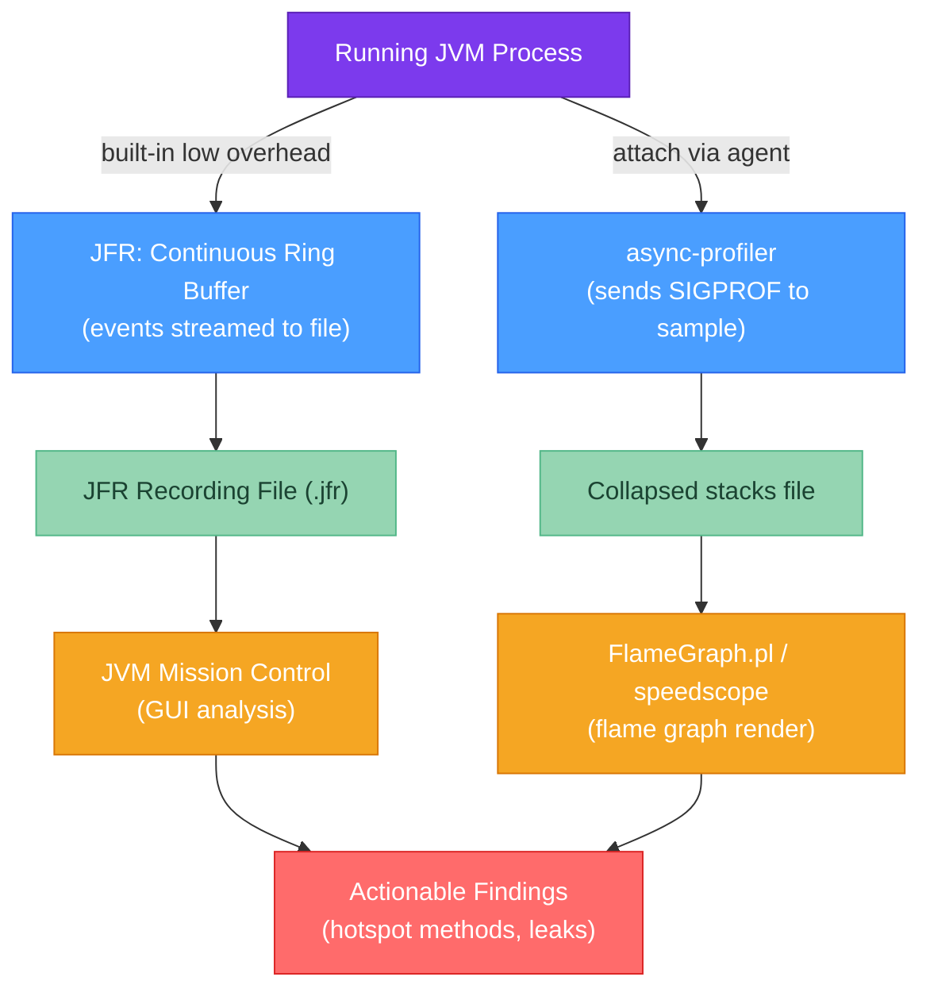

# 🔥 Java Profiling

> [!abstract] TL;DR
> **Java Flight Recorder (JFR)** is the gold-standard production profiler built into the JVM — it has under 1% overhead and captures CPU, allocation, GC, and I/O events. Use `jcmd <pid> JFR.start` to begin recording and `JFR.dump` to snapshot a running app. **async-profiler** is a sampling profiler that supports CPU, allocation, and wall-clock modes without the safepoint bias of JFR. Both tools output data for **flame graphs**: read them by looking for wide plateaus at the top (the hot code), not the base. **JVM Mission Control (JMC)** is the GUI front-end for JFR recordings.

---

## Intuition

Profiling is like finding a traffic jam on a highway by counting cars at every exit ramp. A **sampling profiler** takes snapshots of what every thread is doing every few milliseconds. After thousands of samples, the methods that appear most often are your hotspots — they consume the most CPU time. A flame graph is just a stacked bar chart of those samples, sorted and merged, so wide blocks immediately reveal where time is being spent.

---

## How It Works



### JFR Event Types

| Category | Events Captured |
|----------|----------------|
| CPU | Method samples, thread CPU time |
| Memory | Allocation in new TLAB, allocation outside TLAB, object count |
| GC | GC pause start/end, heap summary, reference statistics |
| I/O | Socket reads/writes, file reads/writes |
| JIT | Compilation events, code cache stats |
| Monitor | Java monitor enter/wait (contention) |

---

## Key Concepts

### 1. Java Flight Recorder (JFR)

JFR is built into OpenJDK 11+ and is production-safe. It uses a ring buffer in off-heap memory and only flushes to disk on demand.

```java
// Starting JFR programmatically (Java 14+ JFR API)
import jdk.jfr.Recording;
import jdk.jfr.consumer.RecordingFile;

public class JFRDemo {
    public static void startRecording() throws Exception {
        Recording recording = new Recording();

        // Enable CPU sampling every 10ms
        recording.enable("jdk.ExecutionSample").withPeriod(Duration.ofMillis(10));

        // Enable allocation profiling
        recording.enable("jdk.ObjectAllocationInNewTLAB");
        recording.enable("jdk.ObjectAllocationOutsideTLAB");

        // Enable GC events
        recording.enable("jdk.GCHeapSummary");
        recording.enable("jdk.GarbageCollection");

        recording.setMaxAge(Duration.ofMinutes(5));   // rolling window
        recording.setMaxSize(100 * 1024 * 1024);       // 100 MB cap
        recording.setToDisk(true);
        recording.start();

        // ... application runs ...

        // Dump a snapshot without stopping the recording
        recording.dump(Path.of("profile_snapshot.jfr"));

        // Stop and save
        recording.stop();
        recording.close();
    }
}
```

**`jcmd` command-line usage (most common in production):**
```bash
# List running JVMs and their PIDs
jcmd

# Start a 60-second JFR recording
jcmd <pid> JFR.start duration=60s filename=/tmp/app.jfr name=MyRecording

# Check recording status
jcmd <pid> JFR.check

# Dump what's been recorded so far (recording continues)
jcmd <pid> JFR.dump name=MyRecording filename=/tmp/snapshot.jfr

# Stop recording
jcmd <pid> JFR.stop name=MyRecording
```

**JVM flags to enable JFR at startup (Java 8u262+ or 11+):**
```bash
java -XX:StartFlightRecording=duration=300s,filename=app.jfr,settings=profile MyApp
```

### 2. async-profiler

async-profiler uses OS signals (`SIGPROF`) and `AsyncGetCallTrace` to sample threads at arbitrary points — not just safepoints. This eliminates **safepoint bias**, where traditional JVMTI profilers only sample when the JVM is at a safepoint (often skewing results toward code that reaches safepoints often).

```bash
# Download async-profiler and attach to running JVM

# CPU profiling for 30 seconds → flame graph HTML
./asprof -d 30 -f flamegraph.html <pid>

# Allocation profiling (which call sites allocate the most)
./asprof -e alloc -d 30 -f alloc.html <pid>

# Wall-clock profiling (includes threads blocked on I/O — great for latency diagnosis)
./asprof -e wall -d 30 -f wall.html <pid>

# As a Java agent (attach at startup)
java -agentpath:/path/to/libasyncProfiler.so=start,event=cpu,file=profile.html MyApp
```

### 3. Reading Flame Graphs

Flame graphs plot **call stacks** where:
- **Y-axis** = call depth (bottom = entry point, top = leaf frame)
- **X-axis** = percentage of samples (wider = more time spent)
- **Colors** = arbitrary (code type, package, etc.)

**Reading strategy:**
1. Look for **wide plateaus near the top** — these are leaf frames consuming most CPU
2. Tall thin towers = deep call stacks but fast leaf frames (less worrying)
3. A wide base frame that fans out into many thin children = good parallelism
4. Flat top that spans the entire width = a bottleneck all call paths funnel through

```
         ┌──────────────────────────────────────────┐
         │         processOrder() — 45% samples     │  ← HOTSPOT: investigate
         ├──────────────┬──────────────┬────────────┤
         │serialize()   │validateInput()│ queryDB() │
         ├──────┬───────┤    (thin)    ├────────────┤
         │JSON  │Base64 │              │ JDBC parse │
         └──────┴───────┴──────────────┴────────────┘
  ← entry points (main, thread pools, framework glue) at bottom
```

### 4. JVM Mission Control (JMC)

JMC is a GUI that loads `.jfr` files and provides:
- **Automated Rule Analysis** — flags anomalies (high allocation rate, GC pressure, monitor contention)
- **Method Profiling** tab — tree view of hot methods with self/total time
- **Memory** tab — allocation by class and call site
- **Thread** tab — thread state timeline (running, blocked, parked)

Download separately from [jdk.java.net/jmc](https://jdk.java.net/jmc/) (not bundled since Java 11+).

### 5. Profiling Checklist

```
□ Profile on production-representative load (not idle / synthetic micro-load)
□ Warm up the JVM first (let JIT compile hot paths) — usually 2-5 minutes
□ Record for at least 1-2 minutes to smooth out noise
□ Use async-profiler when safepoint bias might skew JFR results
□ Compare flame graphs before and after an optimization (don't guess, measure)
□ Profile allocation to find hidden GC pressure before tuning GC flags
□ Look at wall-clock profiles for latency, CPU profiles for throughput
□ Check I/O events in JFR before blaming CPU — I/O stalls look like CPU if you only sample CPU
```

---

## Real-World Notes

- **Continuous profiling in production**: tools like Pyroscope and Grafana Pyroscope embed async-profiler as an agent, continuously stream flame graphs to a backend, and let you query "what was slow during last Tuesday's incident?" without a pre-planned recording.
- **JFR streaming API (Java 14+)**: `RecordingStream` lets you consume JFR events in real-time without writing to disk — useful for embedding profiling metrics in your own monitoring dashboards.
- **Profile, don't assume**: the two most common wrong assumptions are (1) the JSON serialization is the bottleneck (it rarely is at scale — usually it's DB or I/O), and (2) more threads will make it faster (they won't if the bottleneck is a lock or DB connection pool).

---

## Common Pitfalls

| Pitfall | Consequence | Fix |
|---------|-------------|-----|
| Profiling a cold JVM | JIT hasn't compiled hotpaths → misleading results | Warm up for 2-5 min under load before capturing |
| Only CPU profiling | I/O-blocked threads show 0% CPU but are the bottleneck | Use wall-clock mode or check I/O events in JFR |
| JFR with safepoint bias | Methods that rarely reach safepoints look artificially cheap | Switch to async-profiler for CPU sampling |
| Too short a recording | Not enough samples for statistical significance | Record at least 30-60 seconds under representative load |

---

## Related Concepts

- [[_MOC_Performance_Java|↑ Section MOC — Java Performance]]
- [[Memory_Management]] — Understand allocation events you see in profiling
- [[Performance_Benchmarking]] — JMH for controlled micro-benchmarks vs profiling production
- [[Threads_and_Runnable]] — Thread states (BLOCKED, WAITING) visible in JMC thread timeline

---

## Review Questions

1. A flame graph shows `serialize()` consuming 40% of CPU. Before optimizing the serializer, what two profiling checks should you do to confirm this is the real bottleneck and not an artifact?

2. What is safepoint bias and why does it make traditional JVMTI profilers give inaccurate results for some code patterns?

3. You need to profile a microservice in production for 2 minutes during peak load. List the exact `jcmd` commands you would run, assuming you know the PID.

---

## Sources
- [JEP 328: Flight Recorder](https://openjdk.org/jeps/328)
- [async-profiler GitHub](https://github.com/async-profiler/async-profiler)
- Brendan Gregg, *The Flame Graph* (ACM Queue 2016)
- [JMC download](https://jdk.java.net/jmc/)

#java #performance #profiling #JFR #flame-graphs #Intermediate
