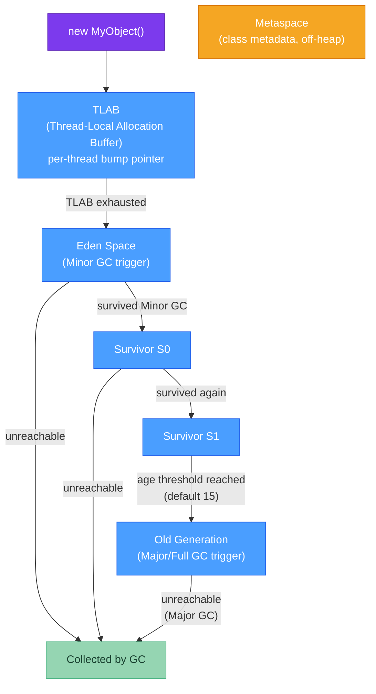

# 🧠 Java Memory Management

> [!abstract] TL;DR
> Objects in the JVM follow a generational allocation path: **TLAB → Eden → Survivor spaces → Old Gen**. Most objects die young and never leave Eden (generational hypothesis). Memory leaks in Java are not dangling pointers — they are **objects the GC cannot collect because a live reference keeps them reachable**. The most common leak patterns are: static collections growing unbounded, listeners not deregistered, `ThreadLocal` not removed in thread-pool threads, inner classes holding outer references, and interned strings. Diagnose with heap dumps (`jcmd VM.heap_dump`), analyze with Eclipse MAT's dominator tree.

---

## Intuition

Think of the Java heap like a hotel:
- **Eden** is the lobby — new guests (objects) arrive here constantly. Most check out (die) after a few minutes.
- **Survivor spaces** are holding rooms — guests who stayed through checkout time move here for observation.
- **Old Gen** is long-term rooms — guests who survive multiple rounds get permanent rooms. It takes a bigger cleaning crew (Major GC) to evict them.
- A **memory leak** is a guest who has checked out conceptually but their room key is still in a manager's drawer — the hotel can't reassign the room.

---

## How It Works



### Heap Regions Explained

| Region | Size | Contents | GC Type |
|--------|------|----------|---------|
| Eden | ~80% of Young Gen | Newly allocated objects | Minor GC (stop-the-world, fast) |
| Survivor (×2) | ~10% each | Objects that survived at least one Minor GC | Minor GC |
| Old Gen | Configurable | Long-lived objects | Major / Full GC (slow) |
| Metaspace | Off-heap (unlimited by default) | Class metadata, interned strings (Java 8+) | Class unloading |

**TLAB (Thread-Local Allocation Buffer):** Each thread gets a small slice of Eden. Allocations within TLAB are just a bump of a pointer — no synchronization needed, making object creation extremely cheap in single-threaded terms. When TLAB fills, the thread gets a new one (or falls back to slow-path synchronized allocation).

---

## Key Concepts

### 1. Object Lifecycle

```java
// Every `new` goes to TLAB in Eden — almost free
Object obj = new Object();  // ~1-3 ns

// If obj is not reachable after the current GC cycle, it's collected
// No finalizer → immediate reclamation
// With finalizer (avoid!) → goes to finalization queue first (unpredictable delay)

// Object age increments on each Minor GC it survives
// -XX:MaxTenuringThreshold=15 (default) → promoted to Old Gen after 15 GC cycles
```

### 2. Common Memory Leak Patterns

**Pattern 1: Static collections growing unbounded**
```java
// LEAK: cache never evicted
public class UserCache {
    private static final Map<Long, User> CACHE = new HashMap<>();

    public static void addUser(User u) {
        CACHE.put(u.getId(), u);  // never removed → grows forever
    }
}

// FIX: use a bounded cache like Caffeine
private static final Cache<Long, User> CACHE = Caffeine.newBuilder()
        .maximumSize(10_000)
        .expireAfterWrite(Duration.ofHours(1))
        .build();
```

**Pattern 2: Event listeners not deregistered**
```java
// LEAK: listener holds reference to outer object; outer can't be GC'd
public class EventBusExample {
    private final EventBus bus;
    private final Listener listener;

    public EventBusExample(EventBus bus) {
        this.bus = bus;
        this.listener = event -> handleEvent(event);
        bus.register(listener);   // bus → listener → this (EventBusExample)
        // If EventBusExample is "done" but bus is still alive,
        // the listener reference prevents GC
    }

    public void shutdown() {
        bus.unregister(listener);  // REQUIRED: release the reference chain
    }
}
```

**Pattern 3: ThreadLocal not removed in thread-pool threads**
```java
// LEAK: thread pool threads are reused; ThreadLocal values persist across requests
private static final ThreadLocal<UserContext> CONTEXT = new ThreadLocal<>();

// In a Servlet or Spring MVC filter:
public void doFilter(Request req, Response res, FilterChain chain) {
    try {
        CONTEXT.set(new UserContext(req));
        chain.doFilter(req, res);
    } finally {
        CONTEXT.remove();  // CRITICAL: remove to avoid cross-request contamination
                           // and to let UserContext be GC'd
    }
}
```

**Pattern 4: Inner class holding outer reference**
```java
// LEAK: anonymous Runnable captures 'this' (the enclosing Service instance)
public class OrderService {
    private final List<Order> pendingOrders = new ArrayList<>(10_000);

    public void scheduleProcessing(ScheduledExecutorService scheduler) {
        // Anonymous class holds implicit ref to OrderService.this
        scheduler.scheduleAtFixedRate(new Runnable() {
            @Override public void run() {
                processOrders(pendingOrders);  // captures outer 'pendingOrders'
            }
        }, 0, 1, TimeUnit.MINUTES);
        // If scheduler outlives OrderService, OrderService can never be GC'd
    }
    // FIX: pass only the data needed, not 'this'; use static inner class or
    //      capture a WeakReference<OrderService>
}
```

**Pattern 5: Interned strings (Java 7 and earlier)**
```java
// Pre-Java 7: String.intern() put strings in PermGen (fixed size → OOM)
// Java 8+: intern goes to heap via Metaspace; less dangerous but still leaks
//           if you intern arbitrary user-supplied strings
String userInput = request.getParameter("key");
String interned = userInput.intern();  // AVOID: could fill interned string pool
```

### 3. Detecting Memory Leaks

```bash
# Take a heap dump of a running process (safest method)
jcmd <pid> VM.heap_dump /tmp/heap.hprof

# Alternative: trigger dump on OOM via JVM flag
# java -XX:+HeapDumpOnOutOfMemoryError -XX:HeapDumpPath=/tmp/heapdump.hprof MyApp

# Quick histogram of live objects (no dump file needed)
jmap -histo:live <pid> | head -30

# Watch heap usage over time (basic)
jstat -gcutil <pid> 5000   # print GC stats every 5 seconds
```

**Eclipse MAT (Memory Analyzer Tool) analysis steps:**
1. Open `.hprof` file
2. Run **Leak Suspects Report** (automated — good starting point)
3. Check **Dominator Tree** — shows the biggest retained heaps; the root that retains the most memory is usually the leak
4. Use **OQL (Object Query Language)**: `SELECT * FROM java.util.HashMap WHERE size > 10000`
5. Check **Incoming References** on a suspicious object to find who's holding it

### 4. Off-Heap Memory with ByteBuffer

```java
import java.nio.ByteBuffer;

public class OffHeapExample {
    // Off-heap: not managed by GC — manual lifecycle management required
    ByteBuffer offHeap = ByteBuffer.allocateDirect(100 * 1024 * 1024); // 100 MB

    // On-heap: GC managed, easier but adds GC pressure for large allocations
    ByteBuffer onHeap  = ByteBuffer.allocate(100 * 1024 * 1024);

    // Off-heap use cases:
    // - Large memory caches (avoid GC pauses on big heaps)
    // - Zero-copy I/O with NIO (OS can DMA directly from direct buffer)
    // - Native library integration

    // IMPORTANT: direct buffers are freed by a Cleaner (finalizer-like mechanism)
    // when the ByteBuffer is GC'd — but you can force release for predictability:
    public static void forceRelease(ByteBuffer buffer) {
        if (buffer.isDirect()) {
            sun.misc.Cleaner cleaner = ((sun.nio.ch.DirectBuffer) buffer).cleaner();
            if (cleaner != null) cleaner.clean();
        }
        // Prefer: use java.lang.ref.Cleaner (public API since Java 9)
    }

    // Monitor off-heap with:
    // jcmd <pid> VM.native_memory detail
    // -XX:NativeMemoryTracking=detail flag required
}
```

---

## Real-World Notes

- **G1GC (default since Java 9)** dynamically adjusts region sizes. Old Gen isn't a contiguous block anymore — it's a set of heap regions. GC log analysis changes accordingly.
- **Kubernetes OOM kills**: a JVM with `-Xmx4g` can still be OOM-killed if off-heap (direct buffers, Metaspace, code cache, stack) causes total RSS to exceed the container's memory limit. Set `-XX:MaxMetaspaceSize`, `-XX:ReservedCodeCacheSize`, and monitor native memory with NMT.
- **Heap dump privacy**: heap dumps contain everything in memory — session tokens, passwords, PII. Treat them as sensitive files; don't store unencrypted in shared paths.

---

## Common Pitfalls

| Pitfall | Consequence | Fix |
|---------|-------------|-----|
| `ThreadLocal` without `remove()` in thread pool | Previous request's data bleeds into next request | Always `remove()` in a finally block |
| Anonymous/inner class in long-lived context | Outer instance pinned in memory | Use static nested class or WeakReference |
| `String.intern()` on user input | Heap / Metaspace exhaustion | Use a dedicated bounded map instead |
| Direct buffer not freed | Off-heap OOM, container OOM kill | Use `Cleaner` or ensure ByteBuffer is GC'd promptly |
| Setting `-Xmx` == container limit | No room for off-heap → OOM kill | Set `-Xmx` to ~75% of container limit |

---

## Related Concepts

- [[_MOC_Performance_Java|↑ Section MOC — Java Performance]]
- [[Java_Profiling]] — Use JFR allocation events to find which call sites produce the most garbage
- [[Performance_Benchmarking]] — JMH `@State` controls object lifecycle in benchmarks
- [[Caching_Strategies]] — Caffeine as a bounded, GC-friendly in-process cache

---

## Review Questions

1. A service's heap grows steadily over 48 hours until it hits OOM. The team restarts it every day as a workaround. Describe the steps you'd take to diagnose whether this is a leak, what tool captures a heap dump, and what you look at in Eclipse MAT to find the culprit.

2. Why does not calling `ThreadLocal.remove()` in a servlet thread pool cause a memory leak, and what secondary bug can it introduce beyond memory waste?

3. A new microservice is OOM-killed by Kubernetes even though its heap (`-Xmx`) is well under the container memory limit. Name three non-heap memory consumers that could be pushing the process RSS over the limit.

---

## Sources
- [JEP 122: Remove the Permanent Generation](https://openjdk.org/jeps/122)
- Eclipse Memory Analyzer documentation
- Shipilev, *Java Memory Model Pragmatics*
- OpenJDK wiki: GC Tuning Guide

#java #performance #memory #heap #GC #memory-leaks #Intermediate
