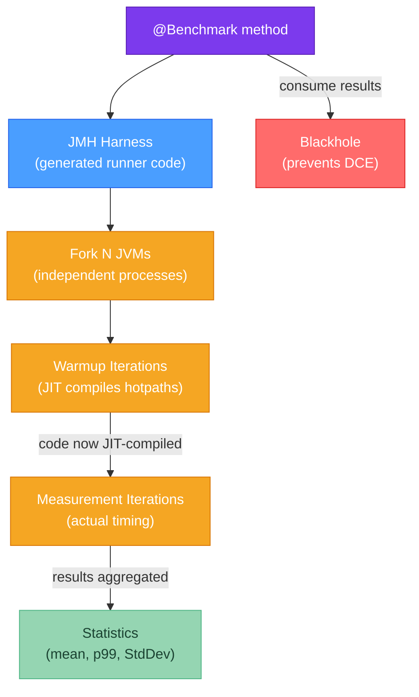

# 📊 Java Performance Benchmarking

> [!abstract] TL;DR
> Naive timing with `System.currentTimeMillis()` is wrong for Java micro-benchmarks because the JIT hasn't compiled the code yet, dead-code elimination removes your computation, and the JVM hasn't warmed up caches. **JMH (Java Microbenchmark Harness)** is the only trustworthy way to measure sub-millisecond Java performance — it handles warmup iterations, multiple forks, statistical reporting, and provides `Blackhole` to prevent dead-code elimination. Annotate with `@Benchmark`, `@BenchmarkMode`, `@Warmup`, `@Measurement`, and `@Fork`, then run with `java -jar benchmarks.jar`.

---

## Intuition

Measuring Java code performance is like timing a race car that needs 3 laps to warm up its tires, uses fuel-saving algorithms that work differently in short runs vs long runs, and has a mechanic (JIT compiler) who actively rewrites the engine mid-race. If you just time the first lap, you're measuring cold start, not peak performance. JMH is the professional timing system that handles all these JVM quirks so your results mean something.

---

## How It Works



---

## Key Concepts

### 1. Why Naive Timing Fails

```java
// ❌ WRONG: naive timing — multiple problems
public class BadBenchmark {
    public static void main(String[] args) {
        String input = "hello world test string";

        long start = System.currentTimeMillis();  // ms resolution (not ns)
        for (int i = 0; i < 1_000_000; i++) {
            input.toUpperCase();                   // PROBLEM 1: result unused
                                                   // → JIT eliminates entire call!
        }
        long end = System.currentTimeMillis();
        System.out.println("Time: " + (end - start) + "ms");
        // PROBLEM 2: first iterations are interpreted, not JIT-compiled
        // PROBLEM 3: JIT may inline, unroll, or vectorize differently in benchmarks
        // PROBLEM 4: single run — no statistical reliability
    }
}
```

**Problems with naive timing:**
1. **No warmup** — JIT compiler hasn't compiled the method; measuring interpreter overhead
2. **Dead Code Elimination (DCE)** — JIT removes computations whose results are provably unused
3. **Constant Folding** — JIT computes compile-time-known values at compile time, not runtime
4. **Single fork** — JVM startup state and memory layout vary; one run is not statistically meaningful
5. **Resolution** — `System.currentTimeMillis()` has ~10ms resolution; `System.nanoTime()` is better but still insufficient for sub-microsecond measurements without JMH

### 2. JMH Setup

```xml
<!-- pom.xml -->
<dependency>
    <groupId>org.openjdk.jmh</groupId>
    <artifactId>jmh-core</artifactId>
    <version>1.37</version>
</dependency>
<dependency>
    <groupId>org.openjdk.jmh</groupId>
    <artifactId>jmh-generator-annprocess</artifactId>
    <version>1.37</version>
    <scope>provided</scope>
</dependency>

<!-- Build as executable fat JAR -->
<plugin>
    <groupId>org.apache.maven.plugins</groupId>
    <artifactId>maven-shade-plugin</artifactId>
    <configuration>
        <finalName>benchmarks</finalName>
        <transformers>
            <transformer implementation=
                "org.apache.maven.plugins.shade.resource.ManifestResourceTransformer">
                <mainClass>org.openjdk.jmh.Main</mainClass>
            </transformer>
        </transformers>
    </configuration>
</plugin>
```

### 3. Complete JMH Benchmark Class

```java
package com.example.bench;

import org.openjdk.jmh.annotations.*;
import org.openjdk.jmh.infra.Blackhole;
import org.openjdk.jmh.runner.Runner;
import org.openjdk.jmh.runner.options.OptionsBuilder;

import java.util.concurrent.TimeUnit;

// ── Warmup: 5 iterations × 1 second each (JIT compiles the hotpath)
@Warmup(iterations = 5, time = 1, timeUnit = TimeUnit.SECONDS)

// ── Measurement: 10 iterations × 1 second each (actual timing)
@Measurement(iterations = 10, time = 1, timeUnit = TimeUnit.SECONDS)

// ── Fork: 2 separate JVM processes (eliminates JVM startup state bias)
@Fork(2)

// ── Mode: measure operations per second (also: AverageTime, SampleTime, SingleShotTime)
@BenchmarkMode(Mode.Throughput)
@OutputTimeUnit(TimeUnit.SECONDS)

// ── State scope: Thread = each thread gets its own instance (no sharing)
@State(Scope.Thread)
public class StringBenchmark {

    private String input;

    // ── Setup: runs once per @State instance creation (before warmup)
    @Setup(Level.Trial)
    public void setup() {
        input = "Hello World Performance Test String";
    }

    // ── Benchmark 1: regex replace
    @Benchmark
    public String regexReplace() {
        return input.replaceAll("[aeiou]", "*");
        // Returning result is the simplest DCE prevention for non-void returns
    }

    // ── Benchmark 2: manual char scan — using Blackhole for DCE prevention
    @Benchmark
    public void manualReplace(Blackhole bh) {
        StringBuilder sb = new StringBuilder(input.length());
        for (char c : input.toCharArray()) {
            sb.append("aeiouAEIOU".indexOf(c) >= 0 ? '*' : c);
        }
        bh.consume(sb.toString());  // Blackhole: JIT can't prove result is unused
    }

    // ── Benchmark 3: AverageTime mode override on specific method
    @Benchmark
    @BenchmarkMode(Mode.AverageTime)
    @OutputTimeUnit(TimeUnit.MICROSECONDS)
    public int simpleCalc() {
        return input.length() * 2 + input.hashCode();
        // Returning the result prevents constant folding
    }

    // ── State with Benchmark scope: shared across all threads in same fork
    @State(Scope.Benchmark)
    public static class SharedState {
        volatile int counter = 0;  // volatile: prevent register caching across threads
    }

    @Benchmark
    public void withSharedState(SharedState shared, Blackhole bh) {
        bh.consume(shared.counter++);
    }

    // ── Run programmatically (alternative to JAR approach)
    public static void main(String[] args) throws Exception {
        new Runner(new OptionsBuilder()
                .include(StringBenchmark.class.getSimpleName())
                .forks(2)
                .warmupIterations(5)
                .measurementIterations(10)
                .build())
                .run();
    }
}
```

### 4. Running JMH

```bash
# Build
mvn clean package -DskipTests

# Run all benchmarks in the JAR
java -jar target/benchmarks.jar

# Run only benchmarks matching a regex
java -jar target/benchmarks.jar ".*StringBenchmark.*"

# Override fork count, warmup, measurement
java -jar target/benchmarks.jar -f 1 -wi 3 -i 5

# Output results as JSON for further analysis
java -jar target/benchmarks.jar -rf json -rff results.json

# List available benchmarks without running
java -jar target/benchmarks.jar -l
```

**Sample output:**
```
Benchmark                         Mode  Cnt        Score        Error  Units
StringBenchmark.manualReplace    thrpt   20  4_235_891 ±  62_341  ops/s
StringBenchmark.regexReplace     thrpt   20    892_445 ±  14_203  ops/s
StringBenchmark.simpleCalc       avgt   20        0.08 ±    0.001  us/op
```

### 5. Benchmark Modes Reference

| Mode | Annotation | Measures | Best For |
|------|-----------|----------|----------|
| `Throughput` | `Mode.Throughput` | ops/time (higher = better) | Maximizing throughput |
| `AverageTime` | `Mode.AverageTime` | time/op (lower = better) | Average latency |
| `SampleTime` | `Mode.SampleTime` | percentile latencies (p50, p99) | Tail latency |
| `SingleShotTime` | `Mode.SingleShotTime` | cold-start single run | Startup cost |
| `All` | `Mode.All` | all of the above | Comprehensive analysis |

### 6. Common Pitfalls and Fixes

**Constant folding:**
```java
// ❌ JIT computes result at compile time — benchmark measures nothing
@Benchmark
public int constantFolding() {
    int x = 10;
    int y = 20;
    return x + y;  // JIT: this is always 30, replace with constant
}

// ✓ FIX: make inputs non-constant (come from @State fields)
@State(Scope.Thread)
public static class Inputs {
    int x = 10;
    int y = 20;
}

@Benchmark
public int fixed(Inputs inputs) {
    return inputs.x + inputs.y;  // JIT cannot fold — values could change
}
```

**Loop unrolling / vectorization:**
```java
// ❌ JIT may vectorize the inner loop, making your benchmark measure
//    SIMD throughput, not what you think you're measuring
@Benchmark
public long sumArray() {
    long sum = 0;
    for (int i : data) { sum += i; }
    return sum;
}
// Consider: is vectorized performance what you want to measure?
// If not, restructure to a single-element benchmark
```

---

## Real-World Notes

- **JMH ≠ production profiling**: JMH measures a micro-operation in isolation. Production performance depends on cache pressure, OS scheduling, other threads, and I/O — factors JMH deliberately removes. Always validate JMH findings with profiling under realistic load.
- **The 3% rule**: if two benchmark results are within 3%, they are statistically indistinguishable given typical JVM variance. Don't optimize for differences smaller than 5-10%.
- **Benchmark CI**: some teams include JMH benchmarks in CI and fail the build if regression exceeds a threshold (`jmh-compare` tool or custom scripts comparing JSON output).

---

## Common Pitfalls

| Pitfall | What Happens | Fix |
|---------|-------------|-----|
| Not returning or consuming result | JIT eliminates computation → benchmark measures nothing | Return result or pass to `Blackhole` |
| No `@Fork` (fork=0 or in same JVM) | JIT profile contaminated by other tests | Always use `@Fork(2)` minimum |
| Too few warmup iterations | JIT still interpreting hotpath | Use `@Warmup(iterations=5)` at minimum |
| Comparing different modes | Throughput vs AverageTime are incompatible | Use same mode for comparison |
| `@State` with shared mutable state, no volatile | Stale reads — threads see cached registers | Declare shared mutable fields `volatile` |

---

## Related Concepts

- [[_MOC_Performance_Java|↑ Section MOC — Java Performance]]
- [[Java_Profiling]] — Profile production first; benchmark specific hypothesis second
- [[Memory_Management]] — Use JMH allocation profiling (`-prof gc`) to measure GC impact

---

## Review Questions

1. A colleague benchmarks two JSON parsing libraries and finds Library A is 10% faster. They ran one iteration with no warmup in the same JVM as their unit tests. Name three specific JMH features they should use to get a trustworthy result.

2. Your `@Benchmark` method computes a checksum but returns nothing. You notice the benchmark reports 10 billion ops/sec — suspiciously fast. What JVM optimization is likely happening and how do you fix it?

3. Explain why `@Fork(1)` is better than `@Fork(0)` for benchmark isolation, and what `@Fork(0)` is actually useful for.

---

## Sources
- [JMH GitHub](https://github.com/openjdk/jmh)
- [JMH Samples](https://github.com/openjdk/jmh/tree/master/jmh-samples)
- Shipilev, *Nanotrusting the Nanotime* (blog)
- Aleksey Shipilev, JMH documentation

#java #performance #benchmarking #JMH #microbenchmark #Intermediate
