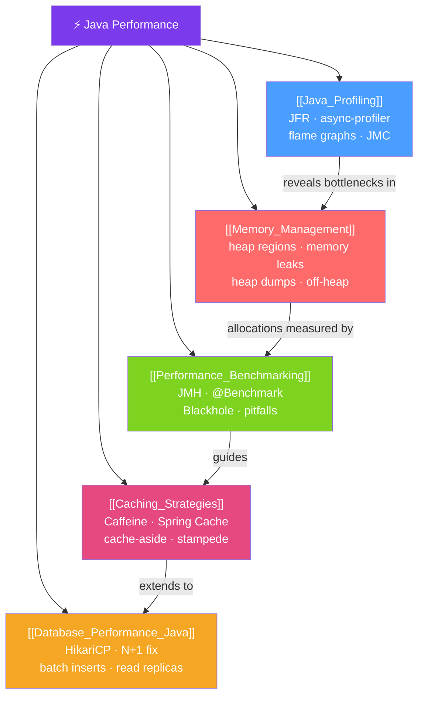

# ⚡ Java Performance — Map of Content

> [!abstract] What This Section Covers
> Java performance engineering covers the full stack from profiling hotspots in production to understanding memory allocation, benchmarking code correctly, caching expensive results, and tuning database access patterns. This section teaches you to measure before optimizing, reason about the JVM's runtime behavior, and apply the right tool at each layer of the stack.

## Concept Map

## Learning Path
1. [[Java_Profiling]] — Start by learning how to find where time is actually being spent: JFR, async-profiler, and reading flame graphs.
2. [[Memory_Management]] — Understand the heap allocation path, object lifecycle, and how to detect and fix memory leaks.
3. [[Performance_Benchmarking]] — Learn why naive timing is wrong and how JMH gives you trustworthy micro-benchmark numbers.
4. [[Caching_Strategies]] — Reduce repeated computation and I/O with Caffeine and Spring's Cache abstraction.
5. [[Database_Performance_Java]] — Fix the most common production performance killers: connection pool sizing, N+1 queries, and missing batch inserts.

## All Notes at a Glance
| Note | Difficulty | What You'll Learn |
|------|------------|-------------------|
| [[Java_Profiling]] | Intermediate | Java Flight Recorder, async-profiler, flame graphs, JMC, profiling workflow |
| [[Memory_Management]] | Intermediate | Heap regions, TLAB, memory leak patterns, heap dumps, Eclipse MAT, off-heap |
| [[Performance_Benchmarking]] | Intermediate | JMH setup, @Benchmark, Blackhole, warmup, common microbenchmark pitfalls |
| [[Caching_Strategies]] | Intermediate | Cache-aside, read-through, Caffeine W-TinyLFU, Spring @Cacheable, stampede prevention |
| [[Database_Performance_Java]] | Advanced | HikariCP sizing, N+1 fix with JOIN FETCH, batch inserts, EXPLAIN ANALYZE, read replicas |

## Key Questions This Section Answers
- How do you profile a Java application in production without significant overhead?
- What are the most common memory leak patterns in Java server applications?
- Why is `System.currentTimeMillis()` timing incorrect for benchmarks?
- How does Caffeine's W-TinyLFU algorithm decide what to evict?
- What is the N+1 query problem and what are two ways to fix it with JPA?
- How do you size a HikariCP connection pool correctly?

## Related Sections
- [[_MOC_Java_Master|↑ Java Master MOC]]
- [[_MOC_JVM_Memory|→ JVM Memory]] — GC algorithms and heap tuning flags
- [[_MOC_Spring_Data|→ Spring Data]] — JPA repositories and query optimization
- [[_MOC_Concurrency|→ Concurrency]] — Thread pool sizing and async processing

#MOC #java #performance
