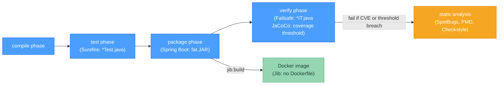

# 🔌 Java Build Plugins

> [!abstract] TL;DR
> The essential Maven plugins for production-quality Java projects: **Surefire** runs unit tests (`*Test.java` pattern) during the `test` phase; **Failsafe** runs integration tests (`*IT.java` pattern) during the `verify` phase (after packaging); **JaCoCo** measures code coverage and can fail the build below a threshold; **SpotBugs** and **PMD** catch bug patterns and code quality issues statically; **Jib** builds optimized Docker images without a Dockerfile or Docker daemon; **Spring Boot Maven Plugin** creates executable fat JARs and supports layered JARs for efficient Docker layer caching.

---

## Intuition

Build plugins are power tools attached to the assembly line. Surefire is the quality inspector who checks every widget with a quick unit test. Failsafe is the integration tester who assembles the full product and verifies it works end-to-end. JaCoCo is the auditor who counts which lines got tested. SpotBugs is the safety inspector who catches known-dangerous patterns before they reach customers. Jib is the auto-packager who boxes everything for shipping (Docker) without you needing to operate the box machine yourself.

---

## How It Works



---

## Key Concepts

### 1. Maven Surefire (Unit Tests)

Surefire runs tests during the `test` phase. By default it picks up classes matching `**/*Test.java`, `**/*Tests.java`, `**/*TestCase.java`.

```xml
<plugin>
    <groupId>org.apache.maven.plugins</groupId>
    <artifactId>maven-surefire-plugin</artifactId>
    <version>3.2.5</version>
    <configuration>
        <!-- Run tests in parallel (JUnit 5 supports this) -->
        <parallel>classes</parallel>
        <threadCount>4</threadCount>

        <!-- Exclude specific patterns -->
        <excludes>
            <exclude>**/*SlowTest.java</exclude>
        </excludes>

        <!-- Pass system properties to tests -->
        <systemPropertyVariables>
            <spring.profiles.active>test</spring.profiles.active>
        </systemPropertyVariables>

        <!-- Show test output on failure -->
        <redirectTestOutputToFile>true</redirectTestOutputToFile>

        <!-- Rerun flaky tests (Surefire 2.21+) -->
        <rerunFailingTestsCount>2</rerunFailingTestsCount>
    </configuration>
</plugin>
```

```bash
# Run all unit tests
mvn test

# Run a specific test
mvn test -Dtest=UserServiceTest

# Run tests matching a pattern
mvn test -Dtest="*Service*"

# Skip surefire (compile tests but don't run)
mvn package -DskipTests

# Run tests in a specific module
mvn test -pl core
```

### 2. Maven Failsafe (Integration Tests)

Failsafe is designed for integration tests that require a packaged, running application. It runs during `pre-integration-test` → `integration-test` → `post-integration-test` → `verify`. This ensures the app is packaged first, then tested, then the test environment is torn down even on failure (unlike running integration tests in the `test` phase where a failure would skip teardown).

```xml
<plugin>
    <groupId>org.apache.maven.plugins</groupId>
    <artifactId>maven-failsafe-plugin</artifactId>
    <version>3.2.5</version>
    <configuration>
        <!-- Default patterns: **/*IT.java, **/*ITCase.java, **/*Integration*.java -->
        <includes>
            <include>**/*IT.java</include>
            <include>**/*IntegrationTest.java</include>
        </includes>

        <systemPropertyVariables>
            <spring.profiles.active>integration-test</spring.profiles.active>
            <server.port>8081</server.port>
        </systemPropertyVariables>
    </configuration>
    <executions>
        <execution>
            <goals>
                <!-- integration-test: runs the IT tests -->
                <!-- verify: checks if tests passed (separate from running) -->
                <goal>integration-test</goal>
                <goal>verify</goal>
            </goals>
        </execution>
    </executions>
</plugin>
```

```bash
# Run both unit AND integration tests
mvn verify

# Skip integration tests but keep unit tests
mvn verify -DskipITs

# Skip all tests
mvn verify -DskipTests
```

### 3. JaCoCo — Code Coverage

JaCoCo instruments bytecode to track which lines and branches are executed during tests. It can fail the build if coverage drops below a threshold.

```xml
<plugin>
    <groupId>org.jacoco</groupId>
    <artifactId>jacoco-maven-plugin</artifactId>
    <version>0.8.12</version>
    <executions>
        <!-- Prepare instrumentation agent before Surefire runs -->
        <execution>
            <id>prepare-agent</id>
            <goals><goal>prepare-agent</goal></goals>
        </execution>

        <!-- Generate report after tests complete -->
        <execution>
            <id>report</id>
            <phase>test</phase>
            <goals><goal>report</goal></goals>
            <!-- Output: target/site/jacoco/index.html -->
        </execution>

        <!-- Enforce coverage thresholds during 'verify' -->
        <execution>
            <id>check</id>
            <goals><goal>check</goal></goals>
            <configuration>
                <rules>
                    <rule>
                        <element>BUNDLE</element>  <!-- BUNDLE | CLASS | METHOD | PACKAGE -->
                        <limits>
                            <limit>
                                <counter>LINE</counter>     <!-- LINE | BRANCH | METHOD | CLASS -->
                                <value>COVEREDRATIO</value> <!-- COVEREDRATIO | COVEREDCOUNT | MISSEDCOUNT -->
                                <minimum>0.80</minimum>     <!-- 80% line coverage required -->
                            </limit>
                            <limit>
                                <counter>BRANCH</counter>
                                <minimum>0.70</minimum>     <!-- 70% branch coverage required -->
                            </limit>
                        </limits>
                    </rule>
                </rules>
                <!-- Exclude generated code, DTOs from coverage -->
                <excludes>
                    <exclude>com/example/generated/**</exclude>
                    <exclude>com/example/**/*DTO.class</exclude>
                    <exclude>com/example/**/*Config.class</exclude>
                </excludes>
            </configuration>
        </execution>
    </executions>
</plugin>
```

```bash
# Generate coverage report
mvn verify

# View report: target/site/jacoco/index.html
# CI: fail build if threshold not met (JaCoCo check goal)
```

### 4. SpotBugs, PMD, and Checkstyle

**SpotBugs** detects bug patterns (null pointer dereferences, infinite loops, SQL injection risks):

```xml
<plugin>
    <groupId>com.github.spotbugs</groupId>
    <artifactId>spotbugs-maven-plugin</artifactId>
    <version>4.8.4.0</version>
    <configuration>
        <effort>Max</effort>         <!-- Min | Default | Max -->
        <threshold>High</threshold>  <!-- Low | Medium | High (what to report) -->
        <failOnError>true</failOnError>
        <!-- Exclude false positives -->
        <excludeFilterFile>spotbugs-exclude.xml</excludeFilterFile>
    </configuration>
    <executions>
        <execution>
            <phase>verify</phase>
            <goals><goal>check</goal></goals>
        </execution>
    </executions>
</plugin>
```

**PMD** detects code quality issues (unused variables, over-complex methods, copy-paste):

```xml
<plugin>
    <groupId>org.apache.maven.plugins</groupId>
    <artifactId>maven-pmd-plugin</artifactId>
    <version>3.23.0</version>
    <configuration>
        <rulesets>
            <ruleset>/rulesets/java/quickstart.xml</ruleset>
        </rulesets>
        <failOnViolation>true</failOnViolation>
        <printFailingErrors>true</printFailingErrors>
        <targetJdk>21</targetJdk>
    </configuration>
    <executions>
        <execution>
            <phase>verify</phase>
            <goals><goal>check</goal></goals>
        </execution>
    </executions>
</plugin>
```

### 5. Jib — Docker Images Without a Dockerfile

Jib builds container images directly from your Maven/Gradle project without:
- Requiring Docker daemon to be running
- Writing a Dockerfile
- Managing multi-stage builds manually

Jib creates **optimized layers**: dependencies (rarely change) in one layer, resources in another, classes in a third. Only the changed layer rebuilds on the next `jib:build`.

```xml
<plugin>
    <groupId>com.google.cloud.tools</groupId>
    <artifactId>jib-maven-plugin</artifactId>
    <version>3.4.3</version>
    <configuration>
        <from>
            <!-- Distroless: no shell, no package manager → minimal attack surface -->
            <image>gcr.io/distroless/java21-debian12</image>
        </from>
        <to>
            <image>registry.company.com/my-service:${project.version}</image>
            <!-- Auth: uses ~/.docker/config.json or CI environment credentials -->
        </to>
        <container>
            <jvmFlags>
                <jvmFlag>-Xms256m</jvmFlag>
                <jvmFlag>-Xmx1g</jvmFlag>
                <jvmFlag>-XX:+UseContainerSupport</jvmFlag>
            </jvmFlags>
            <ports><port>8080</port></ports>
            <environment>
                <SPRING_PROFILES_ACTIVE>production</SPRING_PROFILES_ACTIVE>
            </environment>
            <creationTime>USE_CURRENT_TIMESTAMP</creationTime>
        </container>
    </configuration>
</plugin>
```

```bash
# Build and push to remote registry
mvn compile jib:build

# Build to local Docker daemon (requires Docker running)
mvn compile jib:dockerBuild

# Build to a local tarball (for air-gapped environments)
mvn compile jib:buildTar
# Load tar into Docker: docker load --input target/jib-image.tar
```

### 6. Spring Boot Maven Plugin

```xml
<plugin>
    <groupId>org.springframework.boot</groupId>
    <artifactId>spring-boot-maven-plugin</artifactId>
    <!-- version managed by spring-boot-starter-parent -->
    <configuration>
        <!-- Exclude test dependencies and dev tools from fat JAR -->
        <excludeDevtools>true</excludeDevtools>

        <!-- Layered JAR (Java 15+): separate layers for Docker caching -->
        <layers>
            <enabled>true</enabled>
        </layers>

        <!-- Run with specific Spring profile -->
        <profiles>
            <profile>local</profile>
        </profiles>
    </configuration>
    <executions>
        <execution>
            <goals>
                <!-- repackage: wrap the standard JAR into an executable fat JAR -->
                <goal>repackage</goal>
            </goals>
        </execution>
    </executions>
</plugin>
```

```bash
# Run the Spring Boot application
mvn spring-boot:run

# Run with arguments
mvn spring-boot:run -Dspring-boot.run.arguments="--server.port=9090"

# Build the fat JAR (executable)
mvn clean package
java -jar target/my-service-1.0.0.jar

# Layered JAR — extract layers for efficient Docker builds
java -Djarmode=layertools -jar target/my-service-1.0.0.jar extract
# Creates: dependencies/ spring-boot-loader/ snapshot-dependencies/ application/

# Dockerfile using layers (each layer cached independently)
# COPY --from=builder /app/dependencies/ ./
# COPY --from=builder /app/spring-boot-loader/ ./
# COPY --from=builder /app/snapshot-dependencies/ ./
# COPY --from=builder /app/application/ ./
# ENTRYPOINT ["java", "org.springframework.boot.loader.launch.JarLauncher"]
```

---

## Real-World Notes

- **Jib vs Spring Boot layered JARs for Docker**: Jib is simpler (no Dockerfile) and handles all layering automatically. Layered JARs require a Dockerfile but give you more control over the base image and multi-stage build. Both achieve similar Docker caching efficiency.
- **Checkstyle for code style**: enforce consistent formatting (indentation, import order, max line length) with the maven-checkstyle-plugin. Pair with IDE Checkstyle integration so developers catch violations before commit.
- **Quality gates in CI**: the typical CI quality gate runs `mvn verify` which executes: compile → unit tests → package → integration tests → JaCoCo check → SpotBugs → PMD. The build fails if any gate doesn't pass.

---

## Common Pitfalls

| Pitfall | Consequence | Fix |
|---------|-------------|-----|
| Failsafe `verify` goal missing | Integration tests run but failures don't fail the build | Always declare both `integration-test` AND `verify` goals |
| JaCoCo prepare-agent not bound before Surefire | Coverage data not collected → 0% reported | Ensure `prepare-agent` execution runs in a phase before `test` |
| Jib used without `compile` phase | Jib packages stale/missing class files | Always run `mvn compile jib:build`, not `mvn jib:build` alone |
| SpotBugs threshold=Low in CI | Hundreds of noise violations → developers ignore it | Start with `High`, gradually tighten to `Medium` |
| Fat JAR with IDENTITY sequence and H2 in tests | Tests pass but prod fails (different DB behavior) | Use `@DataJpaTest` with Testcontainers for production DB behavior |

---

## Related Concepts

- [[_MOC_Build_Tools|↑ Section MOC — Java Build Tools]]
- [[Maven_Fundamentals]] — Plugin lifecycle binding and phase execution
- [[Dependency_Management]] — JaCoCo, SpotBugs, and CycloneDX are also dependency-scanning plugins
- [[Gradle_Fundamentals]] — Equivalent Gradle plugins (JaCoCo plugin, SpotBugs Gradle plugin)

---

## Review Questions

1. What is the architectural difference between Maven Surefire and Maven Failsafe? Why is it important that Failsafe's teardown runs even when integration tests fail, and how does Failsafe guarantee this?

2. You configure JaCoCo with 80% line coverage, but the `mvn verify` passes even though your new class has 0% coverage. What two common reasons could cause JaCoCo to not measure your class, and how do you diagnose each?

3. Your CI pipeline uses `mvn clean package jib:build` to build and push a Docker image. A security audit flags that your image contains the full JDK. How does switching to `gcr.io/distroless/java21-debian12` as the Jib base image address this, and what do you lose by doing so?

---

## Sources
- [Maven Surefire](https://maven.apache.org/surefire/maven-surefire-plugin/)
- [Maven Failsafe](https://maven.apache.org/surefire/maven-failsafe-plugin/)
- [JaCoCo Maven Plugin](https://www.jacoco.org/jacoco/trunk/doc/maven.html)
- [Jib GitHub](https://github.com/GoogleContainerTools/jib)
- [SpotBugs Maven Plugin](https://spotbugs.github.io/spotbugs-maven-plugin/)

#java #build-tools #plugins #Surefire #JaCoCo #SpotBugs #Jib #Docker #Intermediate
