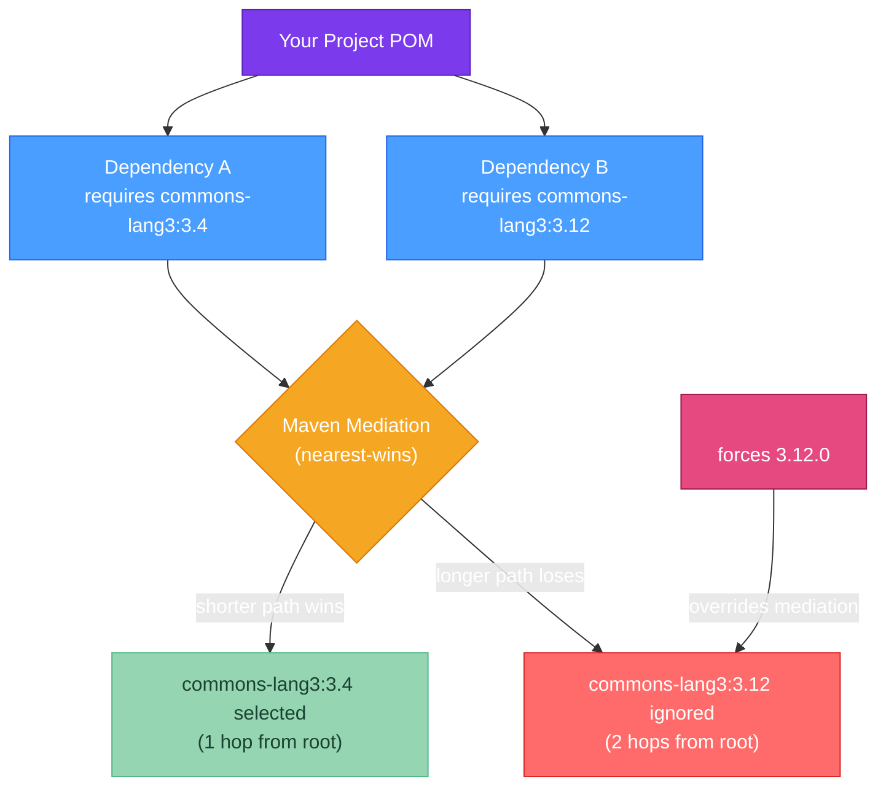

# 🔗 Dependency Management

> [!abstract] TL;DR
> **Maven's nearest-wins rule**: when two paths bring in different versions of the same library, Maven picks the version closest to your root POM — often the wrong one. Visualize with `mvn dependency:tree`; fix with `<dependencyManagement>` or explicit declarations. **BOM (Bill of Materials)**: import a BOM to align dozens of related libraries to tested-together versions (`spring-boot-dependencies` is the canonical example). **SNAPSHOT vs release**: SNAPSHOTs are mutable and re-downloaded on every build — never use them in production. **Security**: OWASP Dependency Check scans your dependency tree for known CVEs; CycloneDX generates a machine-readable SBOM (Software Bill of Materials).

---

## Intuition

Dependency management is like managing ingredients in a restaurant kitchen. When two recipes both need salt but one calls for "table salt" and another for "sea salt," the head chef (build tool) must decide which to buy. Maven always picks whatever's already on the shelf nearest to you (nearest-wins). A BOM is like the chef's master ingredient list: "for this menu, we use exactly these brands and grades" — every recipe follows that list without arguing about versions.

---

## How It Works



---

## Key Concepts

### 1. Maven Dependency Mediation (Nearest-Wins)

When multiple dependency paths pull in different versions of the same library:
- **Nearest-wins rule**: the version with the fewest hops from the root POM wins
- **Tie-breaking**: if two paths are the same length, the first declared dependency in the POM wins

```bash
# Visualize the full dependency tree
mvn dependency:tree

# Example output (truncated):
# [INFO] com.example:my-service:jar:1.0.0
# [INFO] +- org.springframework.boot:spring-boot-starter-web:jar:3.3.0 (compile)
# [INFO] |  +- com.fasterxml.jackson.core:jackson-databind:jar:2.17.0 (compile)
# [INFO] +- com.example:my-library:jar:2.0.0 (compile)
# [INFO]    +- com.fasterxml.jackson.core:jackson-databind:jar:2.15.0 (compile) [mediation: 2.17.0 wins]

# Show why a specific dependency was selected
mvn dependency:tree -Dincludes=com.fasterxml.jackson.core:jackson-databind
```

```xml
<!-- FIX: Override the version in <dependencyManagement> -->
<dependencyManagement>
    <dependencies>
        <!-- Force a specific version regardless of what transitives want -->
        <dependency>
            <groupId>com.fasterxml.jackson.core</groupId>
            <artifactId>jackson-databind</artifactId>
            <version>2.17.0</version>
        </dependency>
    </dependencies>
</dependencyManagement>

<!-- Or: exclude the unwanted transitive from a specific dependency -->
<dependency>
    <groupId>com.example</groupId>
    <artifactId>my-library</artifactId>
    <version>2.0.0</version>
    <exclusions>
        <exclusion>
            <groupId>com.fasterxml.jackson.core</groupId>
            <artifactId>jackson-databind</artifactId>
            <!-- excludes ALL versions of this artifact from this transitive path -->
        </exclusion>
    </exclusions>
</dependency>
```

### 2. BOM (Bill of Materials)

A BOM is a POM with `<packaging>pom</packaging>` that only contains `<dependencyManagement>` — it groups related libraries at tested-compatible versions.

```xml
<!-- Using spring-boot-dependencies BOM without inheriting the parent POM -->
<dependencyManagement>
    <dependencies>
        <dependency>
            <groupId>org.springframework.boot</groupId>
            <artifactId>spring-boot-dependencies</artifactId>
            <version>3.3.0</version>
            <type>pom</type>
            <scope>import</scope>
            <!-- 'import' scope: special BOM import — merges managed versions -->
        </dependency>
    </dependencies>
</dependencyManagement>

<!-- Now you can declare dependencies without versions: -->
<dependencies>
    <dependency>
        <groupId>org.springframework.boot</groupId>
        <artifactId>spring-boot-starter-web</artifactId>
        <!-- No <version>: BOM provides 3.3.0-compatible version -->
    </dependency>
    <dependency>
        <groupId>com.fasterxml.jackson.core</groupId>
        <artifactId>jackson-databind</artifactId>
        <!-- No <version>: BOM manages the Jackson version that works with Spring Boot 3.3 -->
    </dependency>
</dependencies>
```

```kotlin
// Gradle equivalent: platform() or enforcedPlatform()
dependencies {
    // platform: BOM manages versions, but you can still override individual ones
    implementation(platform("org.springframework.boot:spring-boot-dependencies:3.3.0"))

    // enforcedPlatform: BOM versions CANNOT be overridden — strict enforcement
    // implementation(enforcedPlatform("org.springframework.boot:spring-boot-dependencies:3.3.0"))

    implementation("org.springframework.boot:spring-boot-starter-web")  // no version needed
    implementation("com.fasterxml.jackson.core:jackson-databind")       // no version needed
}
```

### 3. SNAPSHOT vs Release Lifecycle

| | SNAPSHOT | Release |
|--|---------|---------|
| Version suffix | `-SNAPSHOT` (e.g., `1.0.0-SNAPSHOT`) | None (e.g., `1.0.0`) |
| Mutability | Mutable — re-published at same coordinate | Immutable — once published, never changed |
| Download policy | Re-downloaded every build (or on updatePolicy) | Cached forever once downloaded |
| Use case | Local development, pre-release testing | Production dependencies |
| Repository | Snapshot repository (separate from releases) | Release repository |

```bash
# Force Maven to update SNAPSHOT versions from remote
mvn clean install -U

# Lock all SNAPSHOT references to a specific timestamp (before releasing)
mvn versions:lock-snapshots

# Update all dependency versions to latest releases
mvn versions:display-dependency-updates   # show available updates
mvn versions:use-latest-releases          # apply them (review carefully!)

# Never deploy SNAPSHOTs to production; use CI to enforce this:
# In CI: check that no SNAPSHOT dependencies exist in the release build
mvn dependency:tree | grep SNAPSHOT && exit 1 || echo "Clean"
```

### 4. Dependency Integrity Verification

```xml
<!-- Maven 3.9+ checksum verification in settings.xml -->
<checksumPolicy>fail</checksumPolicy>  <!-- fail | warn | ignore -->

<!-- Gradle: dependency verification (gradle/verification-metadata.xml) -->
<!-- Generate: ./gradlew --write-verification-metadata sha256 help -->
<!-- Subsequent builds fail if hashes don't match downloaded artifacts -->
```

### 5. OWASP Dependency Check (CVE Scanning)

```xml
<!-- Maven plugin: scan for known CVEs in your dependency tree -->
<plugin>
    <groupId>org.owasp</groupId>
    <artifactId>dependency-check-maven</artifactId>
    <version>9.2.0</version>
    <configuration>
        <!-- Fail build if any dependency has a CVSS score >= 7.0 (high severity) -->
        <failBuildOnCVSS>7</failBuildOnCVSS>
        <!-- Format: HTML (human-readable) and JSON (CI machine-readable) -->
        <formats>HTML,JSON</formats>
        <!-- Suppress known false positives via suppression file -->
        <suppressionFiles>
            <suppressionFile>owasp-suppressions.xml</suppressionFile>
        </suppressionFiles>
    </configuration>
    <executions>
        <execution>
            <goals>
                <goal>check</goal>  <!-- binds to 'verify' phase by default -->
            </goals>
        </execution>
    </executions>
</plugin>
```

```bash
# Run vulnerability scan
mvn verify -Pdependency-check

# Update the NVD (National Vulnerability Database) cache
mvn dependency-check:update-only
```

### 6. SBOM Generation (CycloneDX)

A Software Bill of Materials (SBOM) is a machine-readable inventory of all components in your software — required for regulatory compliance (US Executive Order 14028, EU Cyber Resilience Act) and supply chain security.

```xml
<!-- Maven: CycloneDX SBOM plugin -->
<plugin>
    <groupId>org.cyclonedx</groupId>
    <artifactId>cyclonedx-maven-plugin</artifactId>
    <version>2.8.0</version>
    <configuration>
        <projectType>library</projectType>
        <outputFormat>json</outputFormat>  <!-- json | xml | all -->
        <outputName>bom</outputName>       <!-- output: target/bom.json -->
        <includeCompileScope>true</includeCompileScope>
        <includeRuntimeScope>true</includeRuntimeScope>
        <includeTestScope>false</includeTestScope>
    </configuration>
    <executions>
        <execution>
            <phase>package</phase>
            <goals><goal>makeAggregateBom</goal></goals>
        </execution>
    </executions>
</plugin>
```

```bash
# Generate SBOM during package
mvn clean package

# Output: target/bom.json — CycloneDX JSON format
# Contains: component name, version, purl (package URL), hashes, licenses

# Scan the SBOM with Grype for vulnerabilities
grype sbom:target/bom.json

# Publish SBOM to Dependency-Track (SBOM management platform)
curl -X POST https://dependencytrack.company.com/api/v1/bom \
  -H "X-Api-Key: $DT_API_KEY" \
  -F "autoCreate=true" \
  -F "projectName=my-service" \
  -F "projectVersion=1.0.0" \
  -F "bom=@target/bom.json"
```

### 7. Version Range Pitfall

```xml
<!-- ❌ AVOID version ranges in production dependencies -->
<dependency>
    <groupId>org.apache.commons</groupId>
    <artifactId>commons-lang3</artifactId>
    <version>[3.4,4.0)</version>  <!-- any 3.x version — non-deterministic! -->
</dependency>
<!-- Risk: next build picks a different version with a breaking change or CVE -->

<!-- ✓ Pin to exact versions -->
<dependency>
    <groupId>org.apache.commons</groupId>
    <artifactId>commons-lang3</artifactId>
    <version>3.14.0</version>
</dependency>
```

---

## Real-World Notes

- **Renovate / Dependabot**: automate dependency updates by opening PRs with version bumps. Configure to auto-merge patch updates (low risk) and require review for minor/major bumps. This is the preferred alternative to manually running `versions:use-latest-releases`.
- **Private Maven repositories**: in enterprise, all dependencies flow through an internal Nexus/Artifactory proxy. This (a) caches artifacts in case Maven Central is down, (b) blocks unapproved dependencies (supply chain security), and (c) allows hosting internal artifacts.
- **Dependency confusion attacks**: a supply chain attack where an attacker publishes a public artifact with the same name as your internal artifact. Mitigate by configuring Nexus to prefer internal repositories over public ones.

---

## Common Pitfalls

| Pitfall | Consequence | Fix |
|---------|-------------|-----|
| SNAPSHOT in production POM | Non-reproducible build; CI might deploy different code than tested | Pin to release versions; CI check for `-SNAPSHOT` |
| Nearest-wins selects old version | Runtime `NoSuchMethodError` / `ClassNotFoundException` | Use `<dependencyManagement>` to force the correct version |
| No OWASP scan in CI | High-severity CVE ships to production | Add dependency-check to the `verify` phase in CI |
| BOM import order matters | Two BOMs manage same library; first BOM wins | Declare BOMs in priority order; check `mvn dependency:tree` |
| Using `compile` scope for test dependencies | Test libraries packaged in production JAR (security, bloat) | Use `test` scope for JUnit, Mockito, Spring Boot Test |

---

## Related Concepts

- [[_MOC_Build_Tools|↑ Section MOC — Java Build Tools]]
- [[Maven_Fundamentals]] — `<dependencyManagement>` and scope reference
- [[Gradle_Fundamentals]] — `platform()`, `enforcedPlatform()`, `./gradlew dependencies`
- [[Build_Plugins]] — OWASP and CycloneDX are build plugins

---

## Review Questions

1. Your project depends on Library A (which requires `jackson-databind:2.15`) and Library B (which requires `jackson-databind:2.17`). Both are direct dependencies of your POM at the same depth. Which version does Maven select and why? How do you force version 2.17?

2. What is a BOM and why is importing `spring-boot-dependencies` as a BOM (rather than extending `spring-boot-starter-parent`) sometimes necessary in enterprise projects?

3. The OWASP Dependency Check fails your CI build reporting a CVE in `log4j-core:2.14.0` brought in transitively. You've already upgraded the direct dependency, but it's still showing. What are two mechanisms to resolve this (one that actually upgrades the transitive, one that suppresses the false positive)?

---

## Sources
- [Maven Dependency Mediation](https://maven.apache.org/guides/introduction/introduction-to-dependency-mechanism.html)
- [OWASP Dependency Check](https://owasp.org/www-project-dependency-check/)
- [CycloneDX SBOM Standard](https://cyclonedx.org/)
- [Renovate Bot](https://github.com/renovatebot/renovate)

#java #build-tools #dependencies #BOM #SNAPSHOT #security #SBOM #Intermediate
