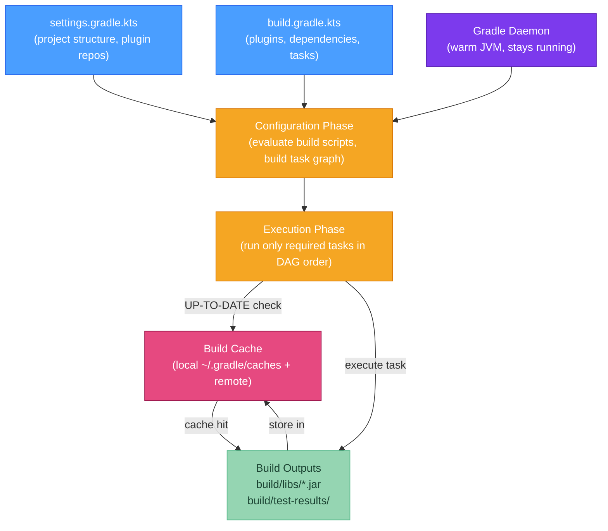

# 🐘 Gradle Fundamentals

> [!abstract] TL;DR
> Gradle models builds as a **directed acyclic graph (DAG) of tasks**. Gradle's key performance features are: **incremental builds** (tasks skipped if inputs/outputs unchanged), **build cache** (task outputs cached locally and remotely), and the **Gradle daemon** (warm JVM reused between invocations). The **Kotlin DSL** (`build.gradle.kts`) gives IDE autocompletion and type safety over the traditional Groovy DSL. Dependency configurations: `implementation` (not leaked to consumers), `api` (leaked), `runtimeOnly`, `testImplementation`, `compileOnly`. Use **Gradle Wrapper** (`gradlew`) to pin the Gradle version in source control.

---

## Intuition

If Maven is a strict cookbook with fixed steps, Gradle is a programmable kitchen robot. You define tasks (chop vegetables, boil water, serve), declare dependencies between them (can't serve before cooking), and Gradle figures out the optimal execution order. If a task's ingredients (inputs) haven't changed since last run, the robot skips that task entirely — this is incremental builds. The build cache is like a photo album of finished dishes: if you've made this exact dish before, retrieve the photo instead of cooking again.

---

## How It Works



---

## Key Concepts

### 1. Gradle Wrapper

Always use the wrapper to pin the Gradle version for reproducible builds:

```bash
# Generate wrapper files (first time)
gradle wrapper --gradle-version 8.8

# Generated files (commit these to source control):
# gradlew          (Unix/Mac shell script)
# gradlew.bat      (Windows batch script)
# gradle/wrapper/gradle-wrapper.properties  (version, URL)
# gradle/wrapper/gradle-wrapper.jar         (bootstrap downloader)

# gradle-wrapper.properties:
# distributionUrl=https\://services.gradle.org/distributions/gradle-8.8-bin.zip

# Using the wrapper (downloads correct Gradle version automatically)
./gradlew build           # Linux/Mac
gradlew.bat build         # Windows
```

### 2. Project Structure

```
my-project/
├── settings.gradle.kts       # project name + included subprojects
├── build.gradle.kts          # root build file
├── gradle.properties         # JVM args, Gradle properties
├── src/
│   ├── main/java/            # production sources
│   ├── main/resources/       # production resources
│   ├── test/java/            # test sources
│   └── test/resources/       # test resources
└── build/                    # output directory (like Maven's target/)
    ├── classes/
    ├── libs/                 # generated JARs
    └── test-results/
```

### 3. build.gradle.kts (Kotlin DSL)

```kotlin
// ── settings.gradle.kts ────────────────────────────────────────────────────
rootProject.name = "my-service"

// Include subprojects (multi-module)
// include("core", "web", "persistence")

// ── build.gradle.kts ───────────────────────────────────────────────────────
plugins {
    java
    id("org.springframework.boot") version "3.3.0"
    id("io.spring.dependency-management") version "1.1.5"
}

group = "com.example"
version = "1.0.0-SNAPSHOT"

java {
    sourceCompatibility = JavaVersion.VERSION_21
    targetCompatibility = JavaVersion.VERSION_21
    withSourcesJar()
}

// ── Repository declarations ────────────────────────────────────────────────
repositories {
    mavenCentral()
    // maven { url = uri("https://nexus.company.com/repository/maven-public/") }
}

// ── Dependencies ───────────────────────────────────────────────────────────
dependencies {
    // implementation: compile + runtime, NOT leaked to consumers' compile classpath
    implementation("org.springframework.boot:spring-boot-starter-web")
    implementation("org.springframework.boot:spring-boot-starter-data-jpa")

    // runtimeOnly: only needed at runtime, not for compilation
    runtimeOnly("org.postgresql:postgresql")

    // compileOnly: compile time only (not packaged); like Maven's 'provided'
    compileOnly("org.projectlombok:lombok")
    annotationProcessor("org.projectlombok:lombok")  // annotation processor path

    // testImplementation: test compile + runtime
    testImplementation("org.springframework.boot:spring-boot-starter-test")

    // testRuntimeOnly: only for test execution (e.g., JUnit platform launcher)
    testRuntimeOnly("org.junit.platform:junit-platform-launcher")
}

// ── Task configuration ─────────────────────────────────────────────────────
tasks.withType<Test> {
    useJUnitPlatform()  // required for JUnit 5
    // Run tests in parallel
    maxParallelForks = Runtime.getRuntime().availableProcessors() / 2 + 1
}

tasks.withType<JavaCompile> {
    options.compilerArgs.addAll(listOf("-parameters", "-Xlint:unchecked"))
    options.encoding = "UTF-8"
}

// ── Custom task ────────────────────────────────────────────────────────────
tasks.register("printVersion") {
    group = "help"
    description = "Print the project version"
    doLast {
        println("Project version: ${project.version}")
    }
}
```

### 4. Dependency Configurations Reference

| Configuration | Scope | Leaked to consumers? | Use case |
|--------------|-------|---------------------|----------|
| `implementation` | compile + runtime | No | Standard dependencies (libraries the impl uses but doesn't expose) |
| `api` | compile + runtime | Yes | Dependencies that appear in your public API signatures |
| `compileOnly` | compile only | No | Annotation processors, Lombok, `provided`-like scopes |
| `runtimeOnly` | runtime only | No | JDBC drivers, logging bindings |
| `testImplementation` | test compile + runtime | No | JUnit, Mockito, Spring Boot Test |
| `testCompileOnly` | test compile only | No | Test annotation processors |
| `testRuntimeOnly` | test runtime only | No | JUnit platform launcher |

> `api` is part of the `java-library` plugin (not the `java` plugin). Use `java-library` for library projects, `java` or Spring Boot plugin for applications.

### 5. Incremental Builds and Build Cache

```bash
# First build (everything runs)
./gradlew build
# > Task :compileJava
# > Task :processResources
# > Task :classes
# > Task :test
# > Task :jar
# BUILD SUCCESSFUL in 12s

# Second build (nothing changed)
./gradlew build
# > Task :compileJava UP-TO-DATE   ← inputs unchanged, skip
# > Task :processResources UP-TO-DATE
# > Task :classes UP-TO-DATE
# > Task :test UP-TO-DATE
# > Task :jar UP-TO-DATE
# BUILD SUCCESSFUL in 0.5s

# After changing one source file:
# > Task :compileJava
# > Task :classes
# > Task :test           ← only test re-runs (not jar if only test changed)
# > Task :jar UP-TO-DATE

# Enable local build cache in gradle.properties:
# org.gradle.caching=true

# Enable configuration cache (faster configuration phase):
# org.gradle.configuration-cache=true

# View task graph
./gradlew build --dry-run

# Force re-run all tasks (ignore UP-TO-DATE)
./gradlew build --rerun-tasks
```

### 6. Multi-Project Builds

```kotlin
// ── settings.gradle.kts (root) ────────────────────────────────────────────
rootProject.name = "my-app"
include("core", "api", "persistence", "web")

// ── build.gradle.kts (root — shared config) ───────────────────────────────
subprojects {
    apply(plugin = "java")

    repositories { mavenCentral() }

    dependencies {
        "testImplementation"("org.junit.jupiter:junit-jupiter:5.10.2")
    }

    tasks.withType<Test> { useJUnitPlatform() }
}

// ── persistence/build.gradle.kts ──────────────────────────────────────────
dependencies {
    implementation(project(":core"))  // depend on sibling subproject
    implementation("org.springframework.boot:spring-boot-starter-data-jpa")
    runtimeOnly("org.postgresql:postgresql")
}
```

### 7. Common Gradle Commands

```bash
# Build the project (compile + test + package)
./gradlew build

# Run the Spring Boot application
./gradlew bootRun

# Run tests only
./gradlew test

# Run a specific test class
./gradlew test --tests "com.example.UserServiceTest"

# Skip tests
./gradlew build -x test

# List all available tasks
./gradlew tasks

# Show task dependencies
./gradlew dependencies

# Show dependencies for a specific configuration
./gradlew dependencies --configuration compileClasspath

# Clean build outputs
./gradlew clean

# Profile the build (generates HTML report)
./gradlew build --profile

# Debug dependency resolution
./gradlew dependencyInsight --dependency commons-lang3 --configuration runtimeClasspath
```

### 8. gradle.properties — JVM and Build Settings

```properties
# gradle.properties

# JVM memory for the Gradle daemon
org.gradle.jvmargs=-Xmx2g -XX:+HeapDumpOnOutOfMemoryError

# Enable parallel project execution
org.gradle.parallel=true

# Enable build cache
org.gradle.caching=true

# Enable configuration cache (Gradle 7.4+)
org.gradle.configuration-cache=true

# Watch filesystem for changes (avoid re-parsing unchanged files)
org.gradle.vfs.watch=true

# Project properties (accessible as project.extra["key"])
myapp.version=1.0.0
```

---

## Real-World Notes

- **Kotlin DSL vs Groovy DSL**: Kotlin DSL (`.kts` extension) gives you IDE autocompletion, type checking, and refactoring support. For new projects, always prefer Kotlin DSL. Existing Groovy DSL projects can be migrated incrementally.
- **Gradle daemon**: the daemon starts automatically and stays alive for 3 hours by default. It saves ~1-2 seconds of JVM startup per build. In CI, the daemon is often disabled (`--no-daemon`) for simpler container lifecycles.
- **Remote build cache**: tools like Gradle Enterprise / Develocity allow sharing build cache across developers and CI — if your colleague built the same commit, your CI run is near-instant because it pulls cached task outputs.

---

## Common Pitfalls

| Pitfall | Consequence | Fix |
|---------|-------------|-----|
| Using `compile` configuration (removed in Gradle 7) | Build fails | Replace with `implementation` or `api` |
| `api` in a non-`java-library` project | Configuration not found error | Apply `java-library` plugin or use `implementation` |
| Mutable task inputs (e.g., reading current time) | Task never UP-TO-DATE, no incremental benefit | Make inputs deterministic (files, properties, not timestamps) |
| Not committing wrapper JAR and `.properties` | Other developers/CI can't use the correct Gradle version | Commit `gradlew`, `gradlew.bat`, `gradle/wrapper/` to git |
| Logic in configuration phase (not `doLast`/`doFirst`) | Code runs during configuration, not execution → side effects | Move side-effectful code into `doLast {}` |

---

## Related Concepts

- [[_MOC_Build_Tools|↑ Section MOC — Java Build Tools]]
- [[Maven_Fundamentals]] — Alternative build tool with lifecycle-based model
- [[Maven_vs_Gradle]] — Speed, conventions, and migration comparison
- [[Dependency_Management]] — How Gradle resolves conflicts and enforces platforms
- [[Build_Plugins]] — Configuring Surefire equivalent, JaCoCo, and Jib in Gradle

---

## Review Questions

1. Explain the difference between `implementation` and `api` dependency configurations. Give a concrete example of when you should choose `api` over `implementation` in a library project.

2. You change a single Java file in a 200-module Gradle project. Which modules does Gradle rebuild and why? What Gradle feature makes this efficient?

3. A colleague commits only the `gradlew` script but not the `gradle/wrapper/gradle-wrapper.jar` and `gradle/wrapper/gradle-wrapper.properties` files. What will happen when another developer runs `./gradlew build` and how do you fix it?

---

## Sources
- [Gradle User Manual](https://docs.gradle.org/current/userguide/userguide.html)
- [Gradle Kotlin DSL Primer](https://docs.gradle.org/current/userguide/kotlin_dsl.html)
- [Gradle Build Cache](https://docs.gradle.org/current/userguide/build_cache.html)

#java #build-tools #Gradle #Kotlin-DSL #incremental-build #Beginner
